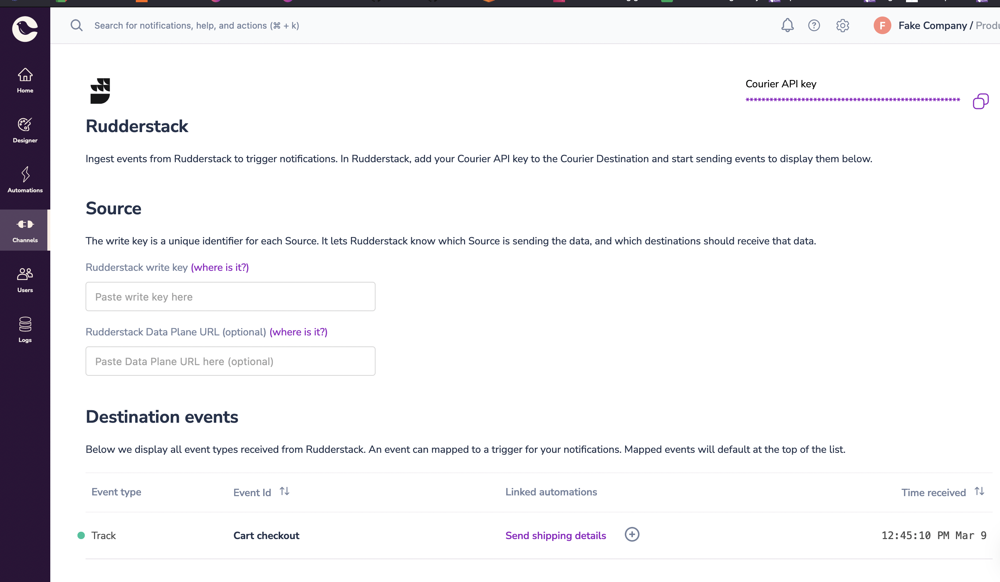

[Courier](https://www.courier.com/)

RudderStack supports Courier as a destination where you can send your event data seamlessly.

<div class='infoBlock'>
  Find the open source transformer code for this destination in the{' '}
  <a href='https://github.com/rudderlabs/rudder-transformer/tree/master/src/v0/destinations/courier'>
    GitHub repository
  </a>
  .
</div>

## Getting started

To start sending events to Courier, follow these steps:

1. From your [RudderStack dashboard](https://app.rudderstack.com/), add a source. Then, from the list of destinations, select **Courier**.
2. Assign a name to the destination and click **Continue**.

### Connection settings

To successfully configure Courier as a destination, you will need to configure the Courier API key

To get your Courier API Key, follow these steps:

1. Log into your [Courier dashboard](https://app.courier.com/).
2. Go to your app's **Settings** > **API Keys**.
3. You will find the Courier API Key, as shown:


4. Copy the key based on environment/scope you want to configure

## Events

Courier destination supports identify and track events.

### Identify

You can sync users from RudderStack to Courier using identify calls.

A sample `identify` call is as shown:

```javascript
rudderanalytics.identify('janedoe', {
  name: 'Jane Doe',
  country: 'United States',
  email: 'janedoe@example.com',
})
```

User will be synced into Courier, which should be visible on Courier <a href="https://app.courier.com/users">Users</a> page or accessible via Courier APIs

Future identify calls with the same userId will update the profile that was already created.


### Track

Track call lets you ingest events into Courier, which can be mapped to <a href="https://www.courier.com/features/automations/">Courier Automations</a>.

```javascript
rudderanalytics.track('Cart checkout', {
  product: 'shoe-123',
  // additional properties
})
```

Events will appear on Courier Studio on the <a href="https://app.courier.com/channels/rudderstack">Rudderstack</a> integration page.

For instance, below is the example of `Cart checkout` event mapped to `Send shipping details` automation.



### Additional references

<a href='https://www.courier.com/docs/external-integrations/rudderstack/'>
  Courier RudderStack docs
</a>

If you have any questions please reach out to support@courier.com
