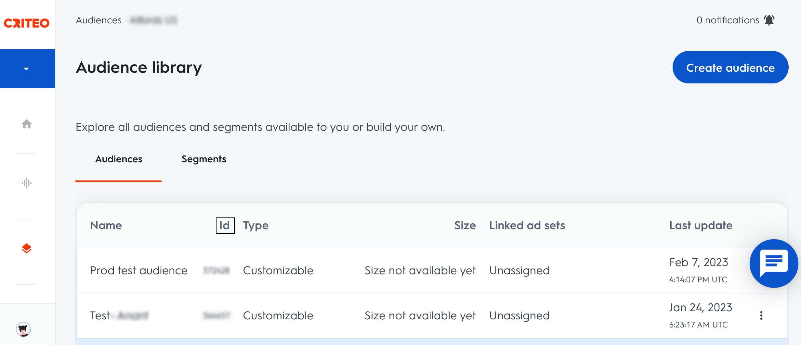

[Criteo](https://www.criteo.com/) is an online display advertising platform. Its [Audience API](https://developers.criteo.com/marketing-solutions/docs/audiences) lets you manage your contact lists by creating, deleting, and updating audience data, which you can use for your advertising campaigns.

Find the open source transformer code for this destination in the <a href="https://github.com/rudderlabs/rudder-transformer/tree/master/src/v0/destinations/Criteo Audience_audience">GitHub repository</a>.

## Getting started

RudderStack supports sending event data to Criteo Audience via the following <a href="https://rudderstack.com/docs/rudderstack-cloud/rudderstack-connection-modes/">connection modes</a>:

| Connection Mode | Web       | Mobile | Server |
| :------------------ | :------------ | :--------- | :--------- |
| **Device mode**     | - | -          | -          |
| **Cloud mode**      |  -  | -  |  **Supported**  |

Once you have confirmed that the source platform supports sending events to Criteo Audience, follow these steps:

1. From your [RudderStack dashboard](https://app.rudderstack.com/), add the source. Then, from the list of destinations, select **Criteo Audience**.
2. Assign a name to the destination and click **Continue**.

## Connection settings

To successfully configure Criteo Audience as a destination, you need to configure the following settings:

- **Create Account**: Click **Create Account** > **Connect with Criteo Audience** and enter your login credentials for Criteo Audience.
- **Audience Id**: Enter the audience ID for which you want to sync the data. Refer to the <a href="#faq">FAQ</a> section for more information on obtaining the audience ID.
- **Audience Type**: Select the audience type from the dropdown for which you want to add or remove the users. If you select `gum`, then **Gum Caller Id** is a required field. Refer to the [Criteo documentation](https://developers.criteo.com/marketing-solutions/docs/contact-list#adding-and-removing-users-in-an-audience) for more information on different audience types.

## `audienceList` event structure

RudderStack supports <a href="https://developers.criteo.com/marketing-solutions/docs/contact-list#adding-and-removing-users-in-an-audience">adding and removing users in an audience list</a>.

The following code snippet shows a sample `audienceList` call for `email` audience type:

```json
{
  "type": "audiencelist",
  "properties": {
    "listData": {
      "add": [{
          "email": 'alex@example.com'
        },
        {
          "email": 'john@example.com'
        }
      ]
    }
  }
}
```

The following code snippet shows a sample `audienceList` call for `madid` audience type:

```json
{
  "type": "audiencelist",
  "properties": {
    "listData": {
      "add": [{
          "madid": "sample_madid"
        },
        {
          "madid": "sample_madid_1"
        }
      ]
    }
  }
}
```

<div class="warningBlock">
Criteo's API implements <a href="https://developers.criteo.com/marketing-solutions/docs/rate-limits">rate limits</a> to limit the number of requests you're able to make on any API endpoint per minute.
</div>

## FAQ

### How do I obtain my Criteo audience ID?

1. Log in to your [Criteo marketing account](https://marketing.criteo.com/).
2. In the left navigation bar, go to **Assets** > **Audiences**.
3. You can find the relevant audience ID under the  **Audiences** tab, as shown:

