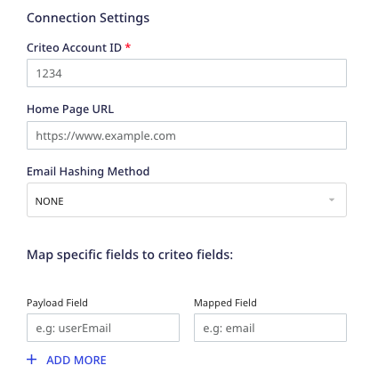
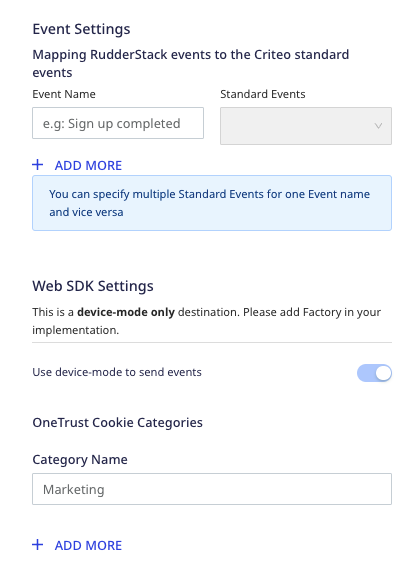

[Criteo](https://www.criteo.com/) is a popular online display advertising platform that offers various solutions to increase your website traffic, generate brand awareness, and boost sales.

RudderStack supports Criteo as a destination to which you can send your event data directly.

## Getting started

Before configuring Criteo as a destination in RudderStack, verify if the source platform is supported by Criteo by referring to the table below:

| Connection Mode | Web       | Mobile | Server |
| :------------------ | :------------ | :--------- | :--------- |
| **Device mode**     | **Supported** | -          | -          |
| **Cloud mode**      | -             | -          | -          |

<div class="infoBlock">
To know more about the difference between cloud mode and device mode in RudderStack, refer to the <Link to="/destinations/rudderstack-connection-modes/">RudderStack Connection Modes</Link> guide.
</div>

Once you have confirmed that the source platform supports sending events to Criteo, follow these steps:

1. From your [RudderStack dashboard](https://app.rudderstack.com/), add the source. Then, from the list of destinations, select **Criteo**.
2. Assign a name to the destination and click **Continue**.

## Connection settings

To successfully configure Criteo as a destination, you need to configure the following settings:





- **Criteo Account ID**: Enter your Criteo Account/Partner ID.

<div class="infoBlock">
Refer to the <Link to="#faq">FAQ</Link> section below for more information on getting your Account/Partner ID.
</div>

- **Home Page URL**: Enter the complete URL of your website’s homepage.

<div class="infoBlock">
This field is required when you need to fire the homepage tag to add visitors to your target audience, in cases where the event name of the <code class="inline-code">page</code> call is anything other than <code class="inline-code">home</code>.
</div>

- **Email Hashing Method**: Criteo lets you use the email addresses in both hashed and non-hashed formats. If you choose **MD5**, RudderStack will hash-encode the email address before sending it to Criteo.
- **Map Specific Fields to Criteo Fields:** Enter the payload fields and the corresponding mapped fields that will be used to send the event data to Criteo.

<div class="infoBlock">
Criteo allows you to send any extra data about a page or a user to add more context to the events. You can set this feature in Criteo with the assistance of your Criteo Account Manager. You can then use the <strong>Map Specific Fields to Criteo Fields</strong> field mapping feature to send extra data through RudderStack.
</div>

- **Client-side Events Filtering**: This setting lets you specify which events should be blocked or allowed to flow through to Criteo.

<div class="infoBlock">
For more information on this setting, refer to the <Link to="/sources/event-streams/sdks/event-filtering/">Client-side Events Filtering</Link> guide.
</div>

- **Mapping RudderStack events to the Criteo standard events**: Enter the **Event Name** and the corresponding [**Standard Event**](https://www.criteo.com/wp-content/uploads/2018/09/CSPOneTag_v1.1.pdf) from the dropdown. This standard event will be triggered when the mapped RudderStack event is called.

<div class="successBlock">
You can specify multiple <strong>Standard Events</strong> for one <strong>Event Name</strong> and vice versa.
</div>

- **Use device mode to send events**: As this is a <Link to="/destinations/rudderstack-connection-modes/#device-mode">device mode</Link>-only destination, this setting is enabled by default and cannot be disabled .
- **OneTrust Cookie Categories**: This setting lets you map <Link to="/sources/event-streams/sdks/rudderstack-javascript-sdk/consent-managers/onetrust/">OneTrust cookie</Link> /consent groups to RudderStack's consent purposes.

## Page

The <Link to="/event-spec/standard-events/page/">`page`</Link> call lets you track the user's home page along with its associated properties.

<div class="infoBlock">
Use this call only to track the home page and add the users to your target audience.
</div>

The home page tag will be fired in the following three scenarios:

- When the name of the `page` call is `home`.
- When the current URL of the web page is same as the **Home Page URL** specified in the RudderStack dashboard.
- When the URL mentioned in the `properties` of the `page` call is same as the **Home Page URL** specified in the RudderStack dashboard.

<div class="warningBlock">
The home page tag will <strong>not</strong> be fired in any other scenario.
</div>

A sample `page` call is as shown below:

```javascript
window.rudderanalytics.page("category", "home", {
  path: "path",
  url: "url",
  title: "title",
  search: "search",
  referrer: "referrer",
  testDimension: "true",
})
```

## Track

The <Link to="/event-spec/standard-events/track/">`track`</Link> call lets you capture different user events and the properties associated with them.

A sample `track` call is as shown:

```javascript
rudderanalytics.track("Product Viewed", {
  product_id: "Prod12345",
  quantity: 1,
  price: 19.99,
  name: "my product",
  category: "categ 1",
  sku: "p-666",
  list: "Gallery",
  testDimension: true,
  testMetric: true,
})
```

In the above example, RudderStack captures the information related to the `Product Viewed` event and the associated details such as quantity, price, category, etc.

The following table details the mapping of the <Link to="/event-spec/ecommerce-events-spec/">RudderStack e-commerce events</Link> and the [Criteo OneTag events](https://help.criteo.com/kb/guide/en/all-criteo-onetag-events-and-parameters-vZbzbEeY86/Steps/775825).

| **Rudderstack e-commerce event** | **Criteo OneTag event**               | **OneTag Event Name Used By Criteo** |
| :------------------------------- | :------------------------------------ | :----------------------------------- |
| `Product Viewed`                 | `Product tag`                         | `viewItem`                           |
| `Cart Viewed`                    | `Basket/cart tag`                     | `viewBasket`                         |
| `Order Completed`                | `Sales Tag`                           | `trackTransaction`                   |
| `Product List Viewed`            | `Category/keyword search/listing tag` | `viewList`                           |

<div class="infoBlock">
If the <code class="inline-code">Category/keyword search/listing tag</code> needs to be fired with the filters, enter it within the <code class="inline-code">filters</code> field of the event properties inside the <code class="inline-code">Product List Viewed</code> tag.
</div>

The `filters` field is an array of objects that consists of each filter category in every single object. Criteo expects `name`, `operator,` and `value` fields for every filter that needs to be passed to Criteo.

For example, a simple `Product List Viewed` event that fires a `Category/keyword search/listing Tag` is as shown:

```javascript
rudderanalytics.track("Product List Viewed", {
  email: "name@domain.com",
  zipCode: "12345",
  category: "abc",
  keywords: "key",
  page_number: 1,
  filters: [
    {
      name: "processor",
      operator: "eq",
      value: "snapdragon",
    },
  ],
  products: [
    {
      product_id: "223344ffdds3ff3",
    },
    {
      product_id: "343344ff5567ff3",
    },
  ],
})
```

## FAQ

### How do I get my Criteo Account/Partner ID?

To get your Criteo account/partner ID, follow these steps:

1. Log into your [Criteo account](https://www.criteo.com/login/).
2. In the left navigation bar, go to **Event Tracking** under **Assets**, as shown:


3. Click on **Setup**, followed by **Direct Implementation**.
4. In the resulting loader file, you can find your 5-digit partner ID in the `src` key, as shown:

