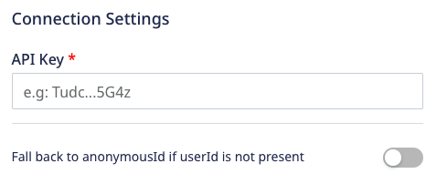

[Custify](https://www.custify.com/) is a next-generation Customer Success software for B2B SaaS companies. It helps you meet your customers' needs by reducing user churn and increasing their lifetime value. With Custify, you can get insights on product usage and all the data from your CRM, support, billing, and other systems in one place.

RudderStack supports Custify as a destination where you can seamlessly send your customer data.

<div class="infoBlock">
Find the open source transformer code for this destination in the <a href="https://github.com/rudderlabs/rudder-transformer/tree/master/v0/destinations/custify">GitHub repository</a>.
</div>

## Getting started

Before configuring Custify as a destination in RudderStack, verify if the source platform is supported by Custify by referring to the table below:

| **Connection Mode** | **Web**       | **Mobile**    | **Server**    |
| :------------------ | :------------ | :------------ | :------------ |
| **Device mode**     | -             | -             | -             |
| **Cloud mode**      | **Supported** | **Supported** | **Supported** |

<div class="infoBlock">
To know more about the difference between cloud mode and device mode in RudderStack, refer to the <Link to="/destinations/rudderstack-connection-modes/">RudderStack Connection Modes</Link> guide.
</div>

Once you have confirmed that the source platform supports sending events to Custify, follow these steps:

1. From your [RudderStack dashboard](https://app.rudderstack.com/), add the source. Then, from the list of destinations, select **Custify**.
2. Assign a name to the destination and click **Continue**.

### Connection settings

To successfully configure Custify as a destination, you need to configure the following settings:



- **API Key**: This is a mandatory field. Enter the Custify API key used to authenticate the request. 

<div class="infoBlock">
To create an API key, go to the <a href="https://app.custify.com/settings/developer/api-key">Custify API Access page</a> and click <strong>Generate API key</strong>.
</div>

- **Fall back to anonymousId if userId is not present**: If this setting is enabled, RudderStack will use `anonymousId` to identify the user if `userId` is not present in the event.

## Identify

You can use the <Link to="/event-spec/standard-events/identify/">`identify`</Link> call to create or update a user in Custify.  RudderStack uses the `userId` or `email` field in the event's `traits` to do so. Hence, it is highly recommended to include the `userId` or at least the user's `email` in the `identify` call.

You can also identify your users with `anonymousId` in case `userId` is not present in the event via the **Fall back to anonymousId if userId is not present** dashboard setting.

A sample `identify` call is shown below:

```javascript
rudderanalytics.identify("1hKOmRA4GRlm", {
  name: "Alex Keener",
  email: "alex@example.com",
  country: "USA"
});
```

### Supported mapping

RudderStack maps the following event properties to a subset of the standard Custify user attributes. It also creates a new custom field for the unmapped attributes.

| RudderStack property  | Custify property       | Presence |
| :--------------- | :---------------- | :----- |
| `userId` (or `anonymousId` if `userId` is absent) | `user_id` | Required |
| `traits.email` / `context.traits.email` | `email` | Required, if `userId` or `anonymousId` is absent. |
| `traits.phone` / `context.traits.phone` | `phone` | Optional |
| `traits.sessionCount` / `context.traits.sessionCount` | `session_count` | Optional |
| `traits.unsubscribedFromEmails` / `context.traits.unsubscribedFromEmails` | `unsubscribed_from_emails` | Optional | 
| `traits.unsubscribedFromCalls` / `context.traits.unsubscribedFromCalls` | `unsubscribed_from_calls` | Optional |
| `traits.name` / `context.traits.name` | `name` | Optional |
| `traits.signedUpAt` / `context.traits.signedUpAt` / `timestamp` / `originalTimestamp` | `signed_up_at` | Optional |
| `traits` / `context.traits` | `custom_attributes` | Optional |

### Removing users from an organization

To remove a given user from an organization, the following fields must be present in the event's `context.traits`:

- `company.id`
- `company.remove` (set to `true`)

RudderStack assumes a valid Custify `company_id` in the `company.id` field. Then, it finds the organization corresponding to that ID and dissociates the user from the organization.

A sample `identify` call is shown below:

```javascript
rudderanalytics.identify("1hKOmRA4GRlm", {
  name: "Alex Keener",
  email: "alex@example.com",
  country: "USA",
  company: {
    id: "company_123",
    remove: true
  }
});
```

The above `identify` call updates the user as well as removes them from the company having the `id` as `company_123`.

## Track

RudderStack uses the [Custify Events API](https://docs.custify.com/#tag/Event) to send the <Link to="/event-spec/standard-events/track/">`track`</Link> events generated by the users' actions.

<div class="infoBlock">
Custify expects a <code class="inline-code">userId</code> for every <code class="inline-code">track</code> call. You can set the <code class="inline-code">userId</code> by making an <code class="inline-code">identify</code> call before sending any <code class="inline-code">track</code> events.
</div>

A sample `track` call is shown below:

```javascript
rudderanalytics.track("Order Completed", {
  category: "category",
  label: "label",
  value: 120
});
```

### Supported mapping

The following table lists the supported property mappings between RudderStack and Custify for the `track` events:

| RudderStack property  | Custify property       | 
| :--------------- | :---------------- |
| `userId` / `anonymousId` | `user_id` | 
| `email` | `email` | 
| `event` | `name` | 
| `timestamp` / `originalTimestamp` | `created_at` |

## Group

You can use the <Link to="/event-spec/standard-events/group/">`group`</Link>  call to create or update a company in Custify and associate a user to it.

RudderStack assumes that an `identify` call (containing the `userId`) is made before any `group` call. It uses the `groupId` to uniquely identify a group.

A sample `group` call is shown below:

```javascript
rudderanalytics.group("group01", {
  traits: {
    "name": "Tech Group",
    "size": 150,
    "plan": "Pro"
  },
  context: {
    "traits": {
      "name": "Alex Keener",
      "email": "alex@example.com"
    }
  },
});
```

### Supported mapping

RudderStack maps the following **optional** `group` traits to a subset of the standard Custify company attributes. It also creates a new custom field for any unmapped attributes.

| RudderStack property  | Custify property   |
| :---------------| :------------- |
| `groupId`          | `company_id`         |
| `traits.name`       | `name`   |
| `traits.industry`           | `industry`      |
| `traits.size` | `size` |
| `traits.website` / `traits.url` | `website` | 
| `traits.plan` | `plan` |
| `traits.monthlyRevenue` / `traits.mrr` | `monthly_revenue` |
| `traits.churned` | `churned` |
| `traits` | `custom_attributes` |

### How RudderStack does the user-organization association

To do the user-company association, RudderStack first finds the Custify user by looking for the `userId` present in the <Link to="/event-spec/standard-events/common-fields/#contextual-fields">`context.traits`</Link> object.

- If `userId` and `groupId` are present in the event, RudderStack associates the Custify user with the organization and sends all the user-specific information.
- If `userId` and `groupId` are not present, RudderStack first creates the user and the organization in Custify and then does the association. 

The above discussion can be summarized as follows:

| `userId` present? | `groupId` present? | Description | Expected behavior |
| :---- | :----| :----| :-----|
| No | No | User and the organization do not exist in Custify. | RudderStack creates a new user and organization in Custify and associates both. |
| No | Yes | Organization exists in Custify but not the user. | RudderStack creates a new user and associates them with the organization. |
| Yes | No | User exists in Custify but not the organization. | RudderStack creates a new organization and associates the user with it. |
| Yes | Yes | Both the user and the organization exist in Custify | RudderStack does the user-organization association. |