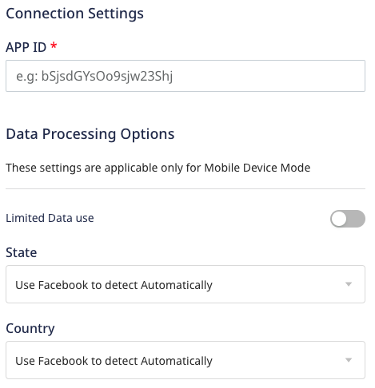
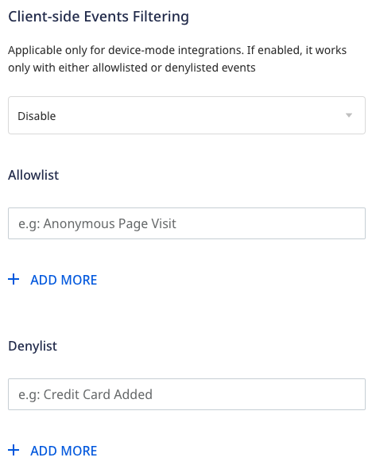
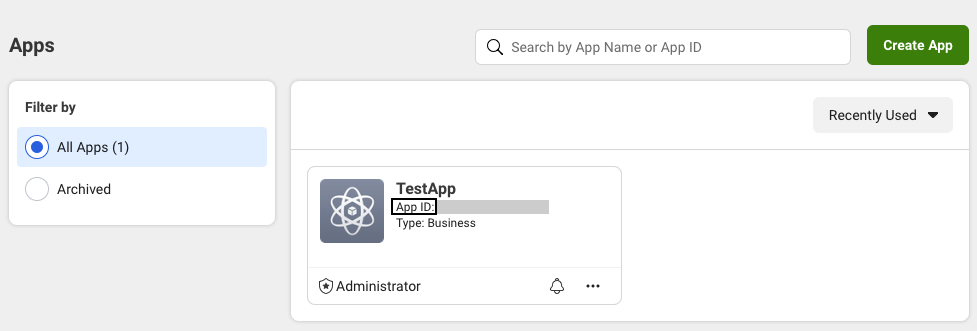
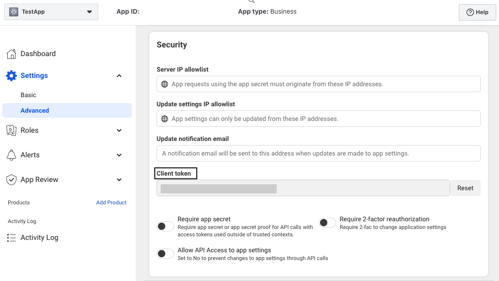

[**Facebook App Events**](https://developers.facebook.com/docs/app-events/) is Facebook's event tracking functionality which lets you track events via your app or web page, including user activities such as app installation, purchases, etc.

RudderStack supports Facebook App Events as a destination to which you can send your event data seamlessly.

<div class="infoBlock">
Find the open source transformer code for this destination in the <a href="https://github.com/rudderlabs/rudder-transformer/tree/master/v0/destinations/fb">GitHub repository</a>.
</div>

## Getting started

Before configuring App Events as a destination in RudderStack, verify if the source platform is supported by App Events by referring to the table below:

| **Connection Mode** | **Web**       | **Mobile**    | **Server** |
| :------------------ | :------------ | :------------ | :--------- |
| **Device mode**     | -             | **Supported** | -          |
| **Cloud mode**      | **Supported** | **Supported** | -          |

<div class="infoBlock">
To know more about the difference between cloud mode and device mode in RudderStack, refer to the <Link to="/destinations/rudderstack-connection-modes/">RudderStack Connection Modes</Link> guide.
</div>

Once you have confirmed that the source supports sending events to Facebook App Events, follow these steps:

1. From your [RudderStack dashboard](https://app.rudderlabs.com/), add the source. From the list of destinations, select **Facebook App Events**.
2. Assign a name to the destination and click **Continue**.

### Connection settings

To successfully configure Facebook App Events as a destination, you will need to configure the following settings:




- **APP ID**: Enter your Facebook App ID.

<div class="infoBlock">
Refer to the <Link to="#faq">FAQ</Link> section for more information on getting your Facebook App ID.
</div>

The following settings are applicable **only if** you are sending events to Facebook using the <Link to="/destinations/rudderstack-connection-modes/#device-mode">device mode</Link>:

- **Limited Data Use**: Enable this option to send the country and state of the end-user. Facebook processes the user data according to the data regulations set for that region.

<div class="successBlock">
For more information on this option, refer to the <a href="#limited-data-use">Limited Data Use</a> section below.
</div>

- **Client-side Events Filtering**: This setting lets you specify which events should be blocked or allowed to flow through to Facebook App Events.

<div class="infoBlock">
For more information on this setting, refer to the <Link to="/sources/sdks/event-filtering/">Client-side Events Filtering</Link> guide.
</div>

## Adding device mode integration

Depending on your platform of integration, follow the below steps below to integrate App Events with your app.

<Tabs>
  <TabList>
    <Tab>iOS</Tab>
    <Tab>iOS v2</Tab>
    <Tab>Android</Tab>
  </TabList>
    <TabPanels>
      <TabPanel>
        To add Facebook to your iOS project:
<ol>
<li>Add the following line to your <a href="https://cocoapods.org/">CocoaPods</a> <code class="inline-code">Podfile</code> :
<span>

```groovy
pod 'Rudder-Facebook'
```
</span>
</li>
<li>Initialize the Facebook App Events iOS SDK just before intializing the RudderStack iOS SDK as shown:
<span>

```objectivec
[[FBSDKApplicationDelegate sharedInstance] application:application
                             didFinishLaunchingWithOptions:launchOptions];
```
</span>
</li>
<li>Send the user's consent to App Events as shown below:
  <ol>
  <li>For <strong>Objective-C</strong>:
<span>

```objectivec
// Set AdvertiserTrackingEnabled to YES if a user provides consent
[FBSDKSettings setAdvertiserTrackingEnabled:YES];
// Set AdvertiserTrackingEnabled to NO if a user does not provide consent
[FBSDKSettings setAdvertiserTrackingEnabled:NO];
```
</span>
  </li>
  <li>For <strong>Swift</strong>:
<span>

```swift
// Set AdvertiserTrackingEnabled to true if a user provides consent
Settings.setAdvertiserTrackingEnabled(true)
// Set AdvertiserTrackingEnabled to false if a user does not provide consent
Settings.setAdvertiserTrackingEnabled(false)
```
</span>
  </li>
  </ol>
</li>
<li>Configure your project by adding the following lines to <code class="inline-code">(<dict>...</dict>)</code> in your <code class="inline-code">Info.plist</code> :
<span>

```markup
<key>CFBundleURLTypes</key>
<array>
  <dict>
  <key>CFBundleURLSchemes</key>
  <array>
    <string>fbAPP-ID</string>
  </array>
  </dict>
</array>
<key>FacebookAppID</key>
<string>APP-ID</string>
<key>FacebookClientToken</key>
<string>CLIENT-TOKEN</string>
<key>FacebookDisplayName</key>
<string>APP-NAME</string>
```
</span>
<div class="infoBlock">
Make sure you replace <code class="inline-code">fbAPP-ID</code> , <code class="inline-code">APP-ID</code>, <code class="inline-code">CLIENT-TOKEN</code>, <code class="inline-code">APP-NAME</code> with the app-specific details from the <a href="https://developers.facebook.com/">Facebook for Developers platform</a>.
</div>
</li>
<li>After adding the dependency, register the <code class="inline-code">RudderFacebookFactory</code> with your <code class="inline-code">RudderClient</code> initialization as a <code class="inline-code">factory</code> of <code class="inline-code">RudderConfig</code>. To do this, run the following command to import the <code class="inline-code">RudderFacebookFactory.h</code> file in your <code class="inline-code">AppDelegate.m</code> file:
<span>

```objectivec
#import <Rudder-Facebook/RudderFacebookFactory.h>
```
</span>
</li>
<li>Then, add the RudderStack iOS SDK initialization as shown:

```objectivec
RSConfigBuilder *builder = [[RSConfigBuilder alloc] init];
[builder withDataPlaneUrl:DATA_PLANE_URL];
[builder withFactory:[RudderFacebookFactory instance]];
[RSClient getInstance:WRITE_KEY config:[builder build]];
```
</li>
</ol>
      </TabPanel>
      <TabPanel>
        <div class="warningBlock">
          This device mode integration is supported for Facebook App Events 13.0.0 and above.
        </div>
        Follow these steps to add Facebook App Events to your iOS project:
<ol>
<li>Install <code class="inline-code">RudderFacebookAppEvents</code> (available through <a href="https://cocoapods.org/">CocoaPods</a>) by adding the following line to your <code class="inline-code">Podfile</code>:
<span>

```ruby
pod 'RudderFacebookAppEvents', '~> 1.0.0'
```
</span>
</li>
<li>Run the <code class="inline-code">pod install</code> command.</li>
<li>Then, import the SDK depending on your preferred platform:
<span>

```swift
import RudderFacebookAppEvents
```
</span>
<span>

```objectivec
@import RudderFacebookAppEvents;
```
</span>
</li>
<li>Next, add the imports to your <code class="inline-code">AppDelegate</code> file under the <code class="inline-code">didFinishLaunchingWithOptions</code> method, as shown:
<br /><br />
<span>

```swift
let config: RSConfig = RSConfig(writeKey: WRITE_KEY)
            .dataPlaneURL(DATA_PLANE_URL)
        
RSClient.sharedInstance().configure(with: config)
RSClient.sharedInstance().addDestination(RudderFacebookAppEventsDestination())
```
</span>
<span>

```objectivec
RSConfig *config = [[RSConfig alloc] initWithWriteKey:WRITE_KEY];
[config dataPlaneURL:DATA_PLANE_URL];

[[RSClient sharedInstance] configureWith:config];
[[RSClient sharedInstance] addDestination:[[RudderFacebookAppEventsDestination alloc] init]];
```
</span>
</li>
</ol>
    </TabPanel>
      <TabPanel>
        To add Facebook App Events to your Android project, follow these steps:
<ol>
<li>Add the repository, as shown:
<span>

```groovy
repositories {
    mavenCentral()
}
```
</span>
</li>
<li>Add the following lines to your <code class="inline-code">app/build.gradle</code> file under the <code class="inline-code">dependencies</code> section, as shown:
<span>

```groovy
implementation 'com.rudderstack.android.sdk:core:1.+'
implementation 'com.rudderstack.android.integration:facebook:1.0.0'
implementation 'com.facebook.android:facebook-android-sdk:11.1.0'
```
</span>
</li>
<li>Open your <code class="inline-code">/app/res/values/strings.xml</code> file and add the following lines. **Remember to replace <code class="inline-code">[APP_ID]</code> with your actual app ID**.
<span>

```markup
<string name="facebook_app_id">[APP_ID]</string>
<string name="fb_login_protocol_scheme">fb[APP_ID]</string>
```
</span>
</li>
<li>In the <code class="inline-code">app/manifests/AndroidManifest.xml</code>file, add a <code class="inline-code">meta-data</code> element to the <code class="inline-code">application</code> element as shown:
{/* <span>

```markup
<application android:label="@string/app_name" ...>
  ...
  <meta-data android:name="com.facebook.sdk.ApplicationId" android:value="@string/facebook_app_id"/>
  ...
</application>
```
</span> */}
</li>
<li>Finally, change the initialization of your <code class="inline-code">RudderClient</code> in your <code class="inline-code">Application</code> class, as shown:
<span>

```java
val rudderClient = RudderClient.getInstance(
    this,
    WRITE_KEY,
    RudderConfig.Builder()
        .withDataPlaneUrl(DATA_PLANE_URL)
        .withFactory(FacebookIntegrationFactory.FACTORY)
        .build()
)
```
</span>
</li>
</ol>
      </TabPanel>
    </TabPanels>
</Tabs>

## Identify

<div class="warningBlock">
For Facebook App Events, RudderStack supports the <code class="inline-code">identify</code> calls only in the mobile device mode.
</div>

You can use the <Link to="/event-spec/standard-events/identify">`identify`</Link> call to set the `userId` through the `setUserID` method from `AppEventsLogger`.

RudderStack sets the following properties \(if available\) using the `setUserData` method.

- `email`
- `firstName`
- `lastName`
- `phone`
- `birthday`
- `gender`
- `city`
- `state`
- `zip`
- `country`

A sample `identify` call for an iOS application is shown below:

```objectivec
[[RSClient sharedInstance] identify:@"developer_user_id"
                                 traits:@{@"email": @"bar@foo.com"}];
```

## Track

RudderStack logs the <Link to="/event-spec/standard-events/track">`track`</Link> call to Facebook using the `logEvent` method of the `AppEventsLogger` class. It uses the same `eventName` as you have passed in the `track` call along with all the `properties`, after converting them into the accepted format.

A sample `track` call for an iOS application is as shown:.

```objectivec
[[RSClient sharedInstance] track:@"Accepted Terms of Service"
                      properties:@{
                          @"foo": @"bar",
                          @"foo_int": @134
                      }];
```

<div class="infoBlock">
When <code class="inline-code">revenue</code> and <code class="inline-code">currency</code> are present in the event properties of any <code class="inline-code">track</code> call, RudderStack makes a <code class="inline-code">Purchase</code> call to Facebook using its <code class="inline-code">logPurchase</code> API along with the normal <code class="inline-code">track</code> call using the <code class="inline-code">logEvent</code> API.

If <code class="inline-code">currency</code> is absent in the event properties, RudderStack sets the default value to <code class="inline-code">USD</code>.
</div>

### Supported mappings for iOS v2

This section lists some `track` event and property mappings which are **applicable only** when sending events via the <Link to="/sources/event-streams/sdks/rudderstack-ios-sdk/ios-v2/">iOS v2</Link> device mode.

The following table lists the `track` event properties mappings between RudderStack and Facebook App Events:

| RudderStack property         | Facebook App Events property   | 
| :--------------------------- | :---------------------  |
| `product_id`                | ContentID                |            
| `rating`            | MaxRatingValue            |            
| `name`                 | AdType        |    
| `order_id`                | OrderID               |            
| `currency`            | Currency           |            
| `query`                 | Query          |        
| `description`                 | Description         |    

The following table lists the e-commerce events mappings between RudderStack and Facebook App Events:

| RudderStack event         | Facebook App Events event      | 
| :--------------------------- | :---------------------  |        
| Products Searched         | Search                    |
| Products Viewed         | View Content                |
| Product Added             | Add to Cart                |
| Product Added To Wishlist | Add to Wishlist            |
| Payment Info Entered          | Add Payment Info       |
| Checkout Started          | Initiate Checkout          |
| Order Completed           | Purchase                    |
| Promotion Clicked          | In-App Ad Click             |
| Promotion Viewed          | In-App Ad Impression        |
| Product Reviewed              | Rate                    |
| Spend Credits         | Spent Credits                 |

RudderStack also supports the following Lifecycle events and maps them as it is before sending them to Facebook App Events:

- Complete Registration
- Achieve Level
- Complete Tutorial
- Unlock Achievement
- Subscribe
- Start Trial

## Page

The <Link to="/event-spec/standard-events/page/">`page`</Link> method lets you record your website's page views with any additional relevant information about the viewed page. You need not pass the event name as RudderStack automatically sets it to `Viewed Page`.

A sample `page` call using the RudderStack Android SDK is as shown:

```javascript
rudderanalytics.page();
```

<div class="infoBlock">
The <code class="inline-code">page</code> call is directly passed on to Facebook as a <code class="inline-code">track</code> event via its <code class="inline-code">logEvent</code> API, with the event name as <code class="inline-code">Viewed Page</code> along with the the associated properties.
</div>


## Screen

The <Link to="/event-spec/standard-events/screen/">`screen`</Link> call lets you record whenever your user views their mobile screen, with any additional relevant information about the screen.

A sample `screen` call using the RudderStack Android SDK is as shown:

```objectivec
[[RSClient sharedInstance] screen:@"Home" properties:@{
    @"category" : @"launcher"
}];
```

In the above snippet, RudderStack captures the information related to the viewed screen, such as screen `name` and `category`.

<div class="infoBlock">
The above <code class="inline-code">screen</code> call is directly passed on to Facebook as a <code class="inline-code">track</code> event via its <code class="inline-code">logEvent</code> API, with the event name as <code class="inline-code">Viewed &#123;screen name&#125; screen</code> along with the the associated properties. The above example will be sent as a <code class="inline-code">track</code> event with name <code class="inline-code">Viewed Home screen</code> along with its properties.
</div>

## Limited Data Use

In July 2020, Facebook released a [**Limited Data Use**](https://developers.facebook.com/docs/marketing-apis/data-processing-options) feature to give businesses better control over how their data is used in their **California Consumer Privacy Act \(CCPA\)** compliance efforts.

Using this, you can send the **Limited Data Use** data processing parameters to Facebook for each event via RudderStack, so that Facebook can appropriately apply the user’s data choice.

To use this feature, enable the **Limited Data Use** setting in the RudderStack dashboard and control its behavior via the following data processing parameters:

| **Parameter**                       | **Default Value** |**Description**     |
| :------------------ | :---------------- | :---------------- |
| Data Processing Options State  | `0`          | Use Facebook’s geolocation to determine the end-user's state.   |
| Data Processing Options Country | `0`          | Use Facebook’s geolocation to determine the end-user's country. |

<div class="successBlock">
Learn more about the different <a href="https://developers.facebook.com/docs/marketing-apis/data-processing-options">data processing options</a> accepted by Facebook.
</div>

## Configuring Facebook App Events SDK Based on User Consent

This section highlights the different consent-based options for configuring the App Events SDK.

### Disable Automatically Logged Events

<Tabs>
  <TabList>
    <Tab>iOS</Tab>
    <Tab>Android</Tab>
  </TabList>
    <TabPanels>
      <TabPanel>
        <ul>
        <li>To disable automatic event logging, open the application's <code class="inline-code">.plist</code> as code in Xcode and add the following XML to the property dictionary:
<span>

```markup
<key>FacebookAutoLogAppEventsEnabled</key>
<false/>
```
</span>
</li>
<li>In some cases, you can delay the collection of automatically logged events to obtain user consent or fulfill legal obligations instead of disabling it entirely. To do so, call the <code class="inline-code">setAutoLogAppEventsEnabled</code> method of the <code class="inline-code">FBSDKSettings</code> class to re-enable auto-logging after the end-user provides the required consent.
  <ul>
  <li>In <strong>Objective-C</strong>:
<span>

```objectivec
[FBSDKSettings setAutoLogAppEventsEnabled:YES];
```
</span>
  </li>
  <li>In <strong>Swift</strong>:
<span>

```swift
FBSDKSettings.setAutoLogAppEventsEnabled(true)
```
</span>
  </li>
  </ul>
</li>
<li>To suspend event collection for any reason, set the <code class="inline-code">setAutoLogAppEventsEnabled</code> method to <code class="inline-code">NO</code> for iOS or <code class="inline-code">false</code> for Swift, as shown:
  <ul>
  <li>In <strong>Objective-C</strong>:
<span>

```objectivec
[FBSDKSettings setAutoLogAppEventsEnabled:NO];
```
</span>
  </li>
  <li>In <strong>Swift</strong>:
<span>

```swift
FBSDKSettings.setAutoLogAppEventsEnabled(false)
```
</span>
  </li>
  </ul>
  </li>
  </ul>
      </TabPanel>
      <TabPanel>
        <ul>
        <li>To disable automatically logged events, add the following to your <code class="inline-code">AndroidManifest.xml</code> file:
{/* <span>

```markup
<application>
  ...
  <meta-data android:name="com.facebook.sdk.AutoLogAppEventsEnabled"
           android:value="false"/>
  ...
</application>
```
</span> */}
</li>
<li>In some cases, you can delay the collection of automatically logged events to obtain user consent or fulfill legal obligations instead of disabling it entirely. To do so, call the <code class="inline-code">setAutoLogAppEventsEnabled()</code> method of the <code class="inline-code">FacebookSDK</code> class and set it to <code class="inline-code">true</code> . This re-enables event logging after the end-user has provided the required consent.
<span>

```java
setAutoLogAppEventsEnabled(true);
```
</span>
</li>
<li>To suspend event logging again for any reason, set the <code class="inline-code">setAutoLogAppEventsEnabled()</code> method to <code class="inline-code">false</code>, as shown:
<span>

```java
setAutoLogAppEventsEnabled(false);
```
</span>
</li>
</ul>
      </TabPanel>
    </TabPanels>
</Tabs>

### Disable Collection of Advertiser IDs

<Tabs>
  <TabList>
    <Tab>iOS</Tab>
    <Tab>Android</Tab>
  </TabList>
    <TabPanels>
      <TabPanel>
        <ul>
        <li>To disable the collection of advertiser ID, open the application's <code class="inline-code">.plist</code> as code in Xcode and add the following XML to the property dictionary:
<span>

```markup
<key>FacebookAdvertiserIDCollectionEnabled</key>
<false/>
```
</span>
</li>
<li>In some cases, you can delay the collection of <code class="inline-code">advertiser_id</code> to obtain the user consent or fulfill any legal obligations instead of disabling it entirely. To do so, call the <code class="inline-code">setAdvertiserIDCollectionEnabled</code> method of the <code class="inline-code">FBSDKSettings</code> class and set it to <code class="inline-code">YES</code> for iOS, or <code class="inline-code">true</code> for Swift after the end-user provides consent, as shown:
  <ul>
  <li>In <strong>Objective-C</strong>:
<span>

```objectivec
[FBSDKSettings setAdvertiserIDCollectionEnabled:@YES];
```
</span>
  </li>

  <li>In <strong>Swift</strong>:
<span>

```swift
FBSDKSettings.setAdvertiserIDCollectionEnabled(true);
```
</span>
  </li>
  </ul>
</li>
<li>To suspend collection for any reason, set the <code class="inline-code">setAdvertiserIDCollectionEnabled</code> method to <code class="inline-code">NO</code> for iOS or <code class="inline-code">false</code> for Swift.
  <ul>
  <li>In <strong>Objective-C</strong>:
<span>

```objectivec
[FBSDKSettings setAdvertiserIDCollectionEnabled:@NO];
```
</span>
  </li>
  <li>In <strong>Swift</strong>:
<span>

```swift
FBSDKSettings.setAdvertiserIDCollectionEnabled(false)
```
</span>
  </li>
  </ul>
</li>
</ul>
      </TabPanel>
      <TabPanel>
        <ul>
        <li>To disable collection of <code class="inline-code">advertiser-id</code>, add the following code to your <code class="inline-code">AndroidManifest.xml</code> file:
<span>

```markup
<application>
  ...
  <meta-data android:name="com.facebook.sdk.AdvertiserIDCollectionEnabled"
           android:value="false"/>
  ...
</application>
```
</span>
</li>
<li>In some cases, you can delay the collection of <code class="inline-code">advertiser_id</code> to obtain user consent or fulfill any legal obligations instead of disabling it entirely. To do so, call the <code class="inline-code">setAdvertiserIDCollectionEnabled()</code> method of the <code class="inline-code">FacebookSDK</code> class and set it to <code class="inline-code">true</code> . This re-enables the collection of <code class="inline-code">advertiser_id</code> after the end-user provides the required consent, as shown:
<span>

```java
setAdvertiserIDCollectionEnabled(true);
```
</span>
</li>
<li>To suspend collection for any reason, set the <code class="inline-code">setAdvertiserIDCollectionEnabled()</code> method to <code class="inline-code">false</code>, as shown:
<span>

```java
setAdvertiserIDCollectionEnabled(false)
```
</span>
</li>
</ul>
      </TabPanel>
    </TabPanels>
</Tabs>

### Disable Automatic SDK Initialization

<Tabs>
  <TabList>
    <Tab>Android</Tab>
  </TabList>
  <TabPanels>
    <TabPanel>
        To disable automatic SDK initialization in case of the Android SDK, add the following to your <code class="inline-code">AndroidManifest.xml</code> file:

<span>

```markup
<application>
  ...
  <meta-data androidName="com.facebook.sdk.AutoInitEnabled"
          androidValue="false"/>
  ...
</application>
```
</span>
In some cases, you can delay the SDK initialization to obtain user consent or fulfill any legal obligations instead of disabling it entirely. To do so, call the class method <code class="inline-code">setAutoInitEnabled</code> and set it to <code class="inline-code">true</code> to manually initialize the SDK after the end-user provides the required consent.
<span>

```java
FacebookSdk.setAutoInitEnabled(true)
FacebookSdk.fullyInitialize()
```
</span>
    </TabPanel>
  </TabPanels>
</Tabs>

<div class="infoBlock">
Starting from iOS version 14.5, you need to get the device consent to share data with Facebook by setting the  <code class="inline-code">isAdvertiserTrackingEnabled</code> property. Refer to Facebook's <a href="https://developers.facebook.com/docs/app-events/getting-started-app-events-ios#get-device-consent">Get device consent</a> documentation for more information.
</div>

## FAQ

### Where do I get the Facebook App ID?

You can find the **Facebook App ID** by logging into your [Facebook Developer account](https://developers.facebook.com/), and navigating to the **Home** page of your application's dashboard, as shown:



### Where do I get the Facebook Client Token?

You can find the **Facebook Client Token** by logging into your [Facebook Developer account](https://developers.facebook.com/) and navigating to **Settings** > **Advanced** > **Security** section in the application's dashboard, as shown:

