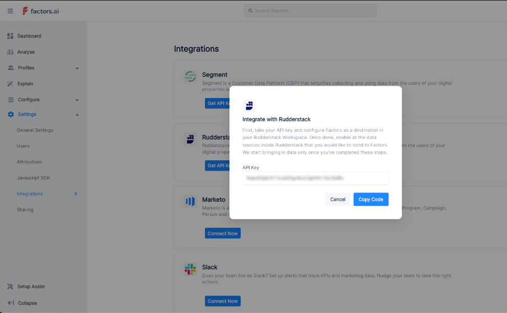

[FactorsAI](https://www.factors.ai/) is a marketing analytics and attribution platform. It collects and processes all the data across your customer journeys to help you make smart business decisions.

<div class="infoBlock">
Find the open source code for this destination in the <a href="https://github.com/rudderlabs/rudder-transformer/tree/master/v0/destinations/factorsai">GitHub repository</a>.
</div>

## Getting started

RudderStack supports sending event data to FactorsAI via the following <a href="https://rudderstack.com/docs/rudderstack-cloud/rudderstack-connection-modes/">connection modes</a>:

| **Connection Mode** | **Web**       | **Mobile**    | **Server**    |
| :------------------ | :------------ | :------------ | :------------ |
| **Device mode**     | -             | -             | -             |
| **Cloud mode**      | **Supported** | **Supported** | **Supported** |

Once you have confirmed that the source platform supports sending events to FactorsAI, follow these steps:

1. From your [RudderStack dashboard](https://app.rudderstack.com/), add the source. Then, from the list of destinations, select **Factors AI**.
2. Assign a name to your destination and click **Continue**.

## Connection settings

To successfully configure FactorsAI as a destination, you will need to configure the following settings:

- **API Key**: Enter the FactorsAI API Key. For more information on obtaining your FactorsAI API key, refer to the <Link to="#faq">FAQ</Link> section below.

## Identify

You can use the <Link to="/event-spec/standard-events/identify/">`identify`</Link> call to create or update a user in FactorsAI. RudderStack uses the <code class="inline-code">userId</code> field to perform these actions. 

A sample `identify` call is shown below:

```javascript
rudderanalytics.identify('1hKOmRA4e', {
  email: 'alex@example.com'
});
```

## Track

You can use the <Link to="/event-spec/standard-events/track">`track`</Link> call to capture user events and their associated properties, and send this information to FactorsAI.

A sample `track` call is shown below:

```javascript
rudderanalytics.track("Product Reviewed", {
  review_id: "12345",
  product_id: "123",
  rating: 4.0,
  review_body: "Good product."
})
```

## FAQ

### Where can I get the FactorsAI API key?

To get your FactorsAI API key:

1. Log in to your [FactorsAI dashboard](https://app.factors.ai/).
2. Click the menu button in the left corner and go to **Settings** > **Integrations**.
3. From the integrations list, select **RudderStack**  to generate the API key, as shown:

