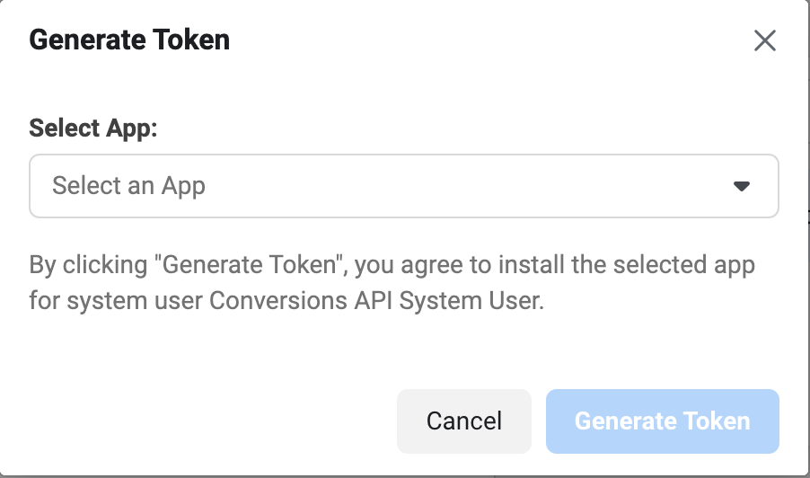
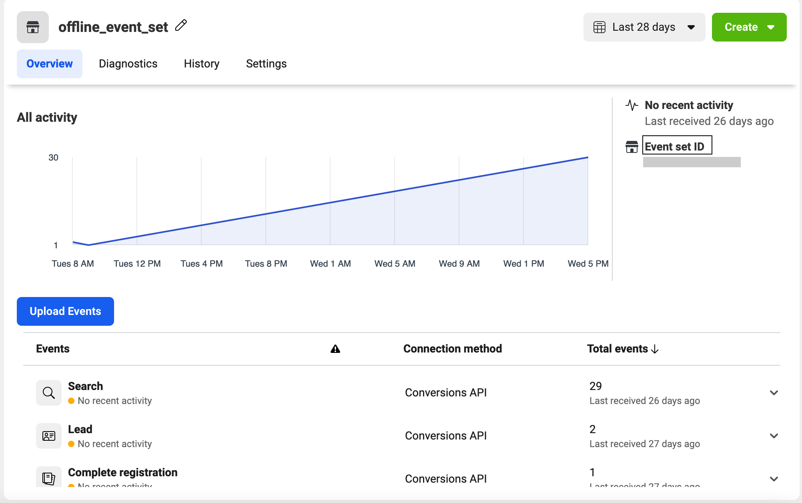

[Facebook Offline Conversions](https://www.facebook.com/business/help/1142103235885551?id=565900110447546) lets you measure your sales in the offline world, resulting through your online Facebook ads. It helps you leverage the offline events data by tracking the in-store purchases, phone orders, bookings, etc.

<div class="infoBlock">
Find the open source code for this destination in the <a href="https://github.com/rudderlabs/rudder-transformer/tree/master/src/v0/destinations/facebook_offline_conversions">GitHub repository</a>.
</div>

## Getting started

RudderStack supports sending event data to Facebook Offline Conversions via the following <a href="https://rudderstack.com/docs/rudderstack-cloud/rudderstack-connection-modes/">connection modes</a>:

| **Connection Mode** | **Web**       | **Mobile**    | **Server**    |
| :------------------ | :------------ | :------------ | :------------ |
| **Device mode**     | -             | -             | -             |
| **Cloud mode**      | -            | **Supported** | **Supported** |

Once you have confirmed that the source platform supports sending events to Facebook Offline Conversions, follow these steps:

1. From your [RudderStack dashboard](https://app.rudderstack.com/), add the source. Then, from the list of destinations, select **Facebook Offline Conversions**.
2. Assign a name to your destination and click **Continue**.

## Connection settings

To successfully configure Facebook Offline Conversions as a destination, you will need to configure the following settings:

- **System User Access Token**: Enter your system user access token from the Facebook Business account. Refer to the <Link to="#faq">FAQ</Link> section for more information on obtaining the access token.
- **Map your events with Facebook Standard Events**: Use this setting to map the standard Facebook events with custom event names. You can map one or more custom events to a standard Facebook event but **not** vice-versa.
- **Map Facebook Standard Events With Event Set IDs**: Use this setting to map the standard Facebook events (specified in the above setting) to Facebook event set ID's. You can map one or more standard Facebook events to event set ID's and vice-versa. Refer to the <Link to="#faq">FAQ</Link> section for more information on obtaining the event set ID's.

<div class="infoBlock">
If a Facebook standard event is mapped to more than one event set ID, RudderStack will send an event for every event set ID.
</div>

- **Map Categories to Facebook Content Types**: Enter the category value and the corresponding Facebook [`content_type`](https://developers.facebook.com/docs/meta-pixel/get-started/advantage-catalog-ads#content-type) which should be mapped to each other. This `content_type` is sent to Facebook every time you send the specified category value via Rudderstack. Refer to the <Link to="#sending-custom-content_type">Sending custom `content_type`</Link> section for more information on sending the customized `content_type` to Facebook.
- **Value Field Identifier**: Enter the identifier you want to assign to the `value` field in Facebook's event payload. The default value is set to `properties.value`.
- **Limited Data Usage**: Enable this setting to let RudderStack take the data processing information from the payload and send it to Facebook.
- **Enable Hashing**: This setting is enabled by default and hash encodes the user data using `SHA256`. Facebook expects the user data to be hash encoded.


## Track

You can use the <Link to="/event-spec/standard-events/track">`track`</Link> call to capture user events along with the properties associated with them.

<div class="infoBlock">
Facebook's <a href="https://developers.facebook.com/docs/marketing-api/insights#sample">conversion attribution window</a> is 28 days. Hence, it is recommended to send your server-side <code class="inline-code">track</code> conversions within 62 days of the occurrence of offline conversions.
</div>

The event name sent in the `track` call must be mapped in the **Map Facebook Standard Events With Event Set IDs** RudderStack dashboard setting otherwise, an error is thrown.

A sample `track` call is shown below:

```javascript
rudderanalytics.track({
  userId: 'user@1',
  event: 'Product Added',
  properties: {
    products: [{
      id: 1,
      category: 'Games',
      brand: 'Hasbro',
      price: 18.99,
      quantity: 1,
    }],
    order_id: 'cart1234',
    price: 18.99,
    currency: "USD"
  },
  traits: {
    email: 'alex@example.com',
    phone: '+1-202-555-0146',
    gender: 'male',
    firstName: 'Alex',
    lastName: "Keener",
    address: {
      city: 'New Orleans',
      state: 'Louisiana',
      postalCode: '90009',
      country: 'USA'
    }
  },
  context: {
    "dataProcessingOptions": [
      [
        "LDU"
      ],
      1,
      1000
    ],
  }
});
```

If your server has access to Facebook's `leadId` from their [Lead Ads](https://developers.facebook.com/docs/marketing-api/guides/lead-ads/) product, you can choose to send it using the integration specific options. The `leadId` is mapped via `externalId`, as shown:

```javascript
"externalId": [
  {
  "id": "leadId-value",
  "type": "LeadId"
  }, ]
```

### Property mappings

The following table lists the event property mappings between RudderStack and Facebook Offline Conversions:

| RudderStack property          | Facebook Offline Conversions property| Notes |
| :-------------------- | :---------------------- |:---------------------- |
| `userId` <br/>`traits.userId`<br/> `traits.id`<br/>`context.traits.userId`<br/>`context.traits.id`<br/>`anonymousId` <br/> <span style="color: #4D4DFF;font-size:12px;">Required</span>| `extern_id`           | -|
| `originalTimestamp` <br/>`timestamp`  <br/> <span style="color: #4D4DFF;font-size:12px;">Required</span>   | `event_time`            | Unix timestamp. The default value is the current timestamp. |
| `event`   <br/> <span style="color: #4D4DFF;font-size:12px;">Required</span>    | `event_name`             | -|
| `properties.currency`   <br/> <span style="color: #4D4DFF;font-size:12px;">Required</span>  | `currency`              | If not provided, the default value is set to `USD`. |
| `properties.total`<br/>`properties.price`<br/>`properties.value`<br/>`properties.revenue` <br/> <span style="color: #4D4DFF;font-size:12px;">Required</span>  | `value` (currency value)                | If not provided, the default value is set to `0`. |
| `properties.upload_tag`    | `upload_tag`      | The default value is set to `RudderStack`. |
| `properties.item_number`    | `item_number`      |-|
|`properties.order_id`<br/>`properties.orderId`|`order_id`|-|
| `properties`     | `custom_data`           |-|
| `properties.products`       | `contents`             |-|
| `traits.email`<br/>`context.traits.email` <br/>`properties.email` <br/>`context.externalId.0.id`     | `email`              |-|
| `traits.phone`<br/>`context.traits.phone`<br/>`properties.phone`   | `phone`                |-|
| `traits.gender`<br/>`context.traits.gender`    | `gen`      |-|
|`traits.birthday`<br/>`context.traits.birthday`<br/>`traits.dateOfBirth`<br/>`context.traits.dateOfBirth`<br/>`traits.dateofbirth`<br/>`context.dateofbirth`<br/>`traits.dob`<br/>`context.traits.dob`<br/>`traits.DOB`<br/>`context.traits.DOB`|`doby`| The expected format is `DD, MM, YYYY`. RudderStack extracts the year, month, and day before sending it to Facebook Offline Conversions. |
| `traits.firstName`<br/>`traits.firstname`<br/>`traits.first_name`<br/>`context.traits.firstName`<br/>`context.traits.firstname`<br/>`context.traits.first_name`    | `fn`      |-|
| `traits.lastName`<br/>`traits.lastname`<br/>`traits.last_name`<br/>`context.traits.lastName`<br/>`context.traits.lastname`<br/>`context.traits.last_name`    | `ln`      | -|
|`traits.address.city`<br/>`context.traits.address.city`|`ct`|-|
| `traits.state`<br/>`context.traits.state`     | `st`           |-|
| `traits.zip`<br/>`traits.zipcode`<br/>`traits.zip_code`<br/>`traits.zipCode`<br/>`traits.postalcode`<br/>`traits.postal_code`<br/>`traits.postalCode`<br/>`traits.address.zipcode`<br/>`traits.address.zip_code`       | `zip`             |-|
| `traits.country`<br/>`context.traits.country`     | `country`           |-|
| `context.device.advertisingId`     | `madid`           |-|
| `context.userAgent`       | `client_user_agent`             |-|
| `traits.action_source`<br/>`context.traits.action_source`<br/>`properties.action_source`       | `action_source`             |-|
| `context.page.url`<br/>`properties.url`     | `event_source_url`           |-|
| `context.fbc`     | `fbc`           |-|
| `context.fbp`       | `fbp`             |-|

Note the following important points while sending event data to Facebook Offline Conversions:

- At least one [`match_key`](https://developers.facebook.com/docs/marketing-api/offline-conversions/#:~:text=one%20API%20call.-,Match%20Keys,-match_keys%20is%20a) is required to send an event successfully. RudderStack uses SHA256 encoding to hash all the `match_keys` that include personally identifiable data in compliance with Facebook's privacy requirements.
- If you send a `products` array using the `properties` object, Rudderstack sends only the `id`, `quantity`, `brand`, `category`, and `price` properties for each product. The reason is that Facebook throws an error on encountering any property apart from these.
- If you send an event name as **Product List Viewed**, the value of [`content_type`](https://developers.facebook.com/docs/meta-pixel/get-started/advantage-catalog-ads#content-type) key is set as `product_group` otherwise, it is set as `product`.
- RudderStack sends a conversion event as long as it contains a `userId`. However, it is recommended to send as much user data through `context.traits` for better attribution results.
- You can send either the `firstName` and `lastName` separately or just the `name` property. RudderStack maps it to `fn` and `ln` on its own.

## Sending custom `content_type`

You can either send the custom [`content_type`](https://developers.facebook.com/docs/meta-pixel/get-started/advantage-catalog-ads#content-type) by specifying it in the **Map Categories to Facebook Content Types** dashboard setting or via the `integrations` object, as shown:

```javascript
"integrations": {
  "FacebookOfflineConversions": {
    "contentType": "sending dedicated content type for this particular payload"
  }
}
```

The priority order of setting the `content_type` value is as follows:

1. `content_type` provided in the `integrations` object is given the highest priority.
2. `content_type` provided in the RudderStack dashboard is given the second highest priority.
3. If none of the above is provided, the `content_type` is set to `product` by default, except in the following cases:
  - If **Product List Viewed** event is sent:
      - with `products` array, then the `content_type` is set to `product`.
      - without the `products` array, then the `content_type` is set to `product_group`.
  - If **Product Viewed** event is mapped in the RudderStack dashboard, then the `content_type` is set to `product`.
  - If **Product Viewed** event is not mapped in RudderStack dashboard (default mapping is set to **View Content** event) and is sent:
      - with `products` array, then the `content_type` is set to `product`.
      - without the `products` array, then the `content_type` is set to `product_group`.
  - If any other event is mapped to the Facebook standard event **View Content** in the RudderStack dashboard and is sent:
      - with `products` array, then the `content_type` is set to `product`.
      - without the `products` array, then the `content_type` is set to `product_group`.


## FAQ

#### Where can I find the System User Access Token?

1. Log in to the [Facebook Business](https://business.facebook.com/) account.
2. Go to **Business Settings** > **Users** > **System users**.
3. Click **Generate New Token**, select your app from the dropdown, and **ads_management** permission.
4. Click **Generate Token** as shown:



#### Where can I find the event set ID in Facebook dashboard?

1. Log in to the [Facebook Business](https://business.facebook.com/) account.
2. Go to **Business Settings** > **Data Sources** > **Offline event sets** and select **Open in Events Manager**. You can see the event set ID as shown:




#### Which permissions are required to upload the offline event data?

Refer to the [Facebook dcoumentation](https://www.facebook.com/business/help/629677790575687?id=565900110447546) to know about the detailed permissions required to upload offline event data.


