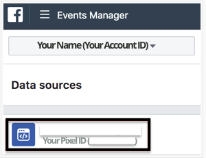
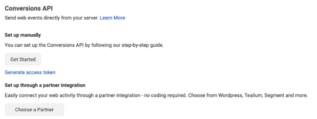

[Facebook Offline Conversions](https://www.facebook.com/business/help/1142103235885551?id=565900110447546) enables offline event tracking, so marketers can run campaigns, upload transaction data, and compare in-store transactions.

<div class="infoBlock">
RudderStack leverages the <a href="https://developers.facebook.com/docs/marketing-api/conversions-api/">Conversions API</a> for sending server-side events to this destination.
</div>

<div class="infoBlock">
Find the open source code for this destination in the <a href="https://github.com/rudderlabs/rudder-transformer/tree/master/v0/destinations/facebook_offline_conversions">GitHub repository</a>.
</div>

## Getting started

RudderStack supports sending event data to June via the following <a href="https://rudderstack.com/docs/rudderstack-cloud/rudderstack-connection-modes/">connection modes</a>:

| **Connection Mode** | **Web**       | **Mobile**    | **Server**    |
| :------------------ | :------------ | :------------ | :------------ |
| **Device mode**     | -             | -             | -             |
| **Cloud mode**      | -            | **Supported** | **Supported** |

Once you have confirmed that the source platform supports sending events to Facebook Offline Conversions, follow these steps:

1. From your [RudderStack dashboard](https://app.rudderstack.com/), add the source. Then, from the list of destinations, select **Facebook Offline Conversions**.
2. Assign a name to your destination and click on **Continue**.

### Connection settings

To successfully configure Facebook Offline Conversions as a destination, you will need to configure the following settings:

- **System User Access Token**: Enter your Facebook Offline Conversions ID. This is required for sending events via both cloud and device modes. 
- **Map your events with Facebook Standard Events**: Enter your Facebook business access token required to send the events via the cloud mode.
- **Map Facebook Standard Events With Event Set IDs**: Enter your Facebook Offline Conversions ID. This is required for sending events via both cloud and device modes. 
- **Value Field Identifier**: Enter your Facebook business access token required to send the events via the cloud mode.
- **Limited Data Usage**: Enter your Facebook Offline Conversions ID. This is required for sending events via both cloud and device modes. 
- **Enable Hashing**: Enter your Facebook business access token required to send the events via the cloud mode.

<div class="infoBlock">
For more information on obtaining your Facebook Offline Conversions ID and Business Access Token, refer to the <a href="#faq">FAQ</a> section below.
</div>

## Track

The `track` call lets you track custom events as they occur in your web application.

A sample call looks like the following code snippet:

```javascript
rudderanalytics.track({
  userId: 'user@1',
  event: 'Product Added',
  properties: {
    products: [{
      id: 1,
      category: 'Games',
      brand: 'Hasbro',
      price: 18.99,
      quantity: 1,
    }],
    order_id: 'cart1234',
    price: 18.99,
    currency: "USD"
  },
  traits: {
    email: 'test@rudderstack.com',
    phone: '4011234567',
    gender: 'm',
    firstName: 'test',
    lastName: "rudder",
    address: {
      city: 'Sitka',
      state: 'Alaska',
      postalCode: '99501',
      country: 'USA'
    }
  },
  context: {
    "dataProcessingOptions": [
      [
        "LDU"
      ],
      1,
      1000
    ],
  }
});
```

In addition to the above call, a `contentType` in the integrations options can be available. If present, it will precede the default value or dashboard settings of `contentType`.

```javascript
rudderanalytics.track(
  "Product Added",
  {
    order_ID: "123",
    category: "boots",
    product_name: "yellow_cowboy_boots",
    price: 99.95,
    currency: "EUR",
    revenue: 2000,
    value: 3000,
    checkinDate: "Thu Mar 24 2018 17:46:45 GMT+0000 (UTC)",
  },
  {
    "Facebook Offline Conversions": { contentType: "mycustomtype" },
  }
)
```

RudderStack maps the following events to the Facebook standard events:

| RudderStack Event          | Facebook Standard Event |
| :-------------------- | :---------------------- |
| `userId",
"traits.userId",
"traits.id",
"context.traits.userId",
"context.traits.id",
"anonymousId"` | `ViewContent`           |
| `Product Viewed`      | `ViewContent`           |
| `Product Added`       | `AddToCart`             |
| `Order Completed`     | `Purchase`              |
| `Products Searched`   | `Search`                |
| `Checkout Started`    | `InitiateCheckout`      |

|`userId`|`extern_id`|

## FAQ

#### Where can I find the Pixel ID?

To get your Pixel ID, go to your Facebook Ads Manager account. On the left navigation bar, select Business Tools, and click on **Events Manager** under **Manage Business**.


In the Data Sources, you should be able to see your Pixel ID underneath your site name.



#### Where can I find the Business Access Token?

In order to use the Facebook Conversions API, you need to generate an access token. We recommend using the Facebook Events Manager to do so, by following these steps:

- Choose the relevant Facebook Offline Conversions and click on the **Settings** tab.
- In the Conversions API section, click on **Generate access token** under the **Set up manually** section, as shown:



<div class="infoBlock">
For more information on how to use this access token or to generate your access token via your own app, refer to the <a href="https://developers.facebook.com/docs/marketing-api/conversions-api/get-started/#via-events-manager">Facebook documentation</a>.
</div>

#### Can I hash my user data before sending it to RudderStack?

Yes. Facebook Offline Conversions requires all user data, data coming from `context.traits`, to be hashed. This includes `email`, `phone`, `birthday`, `address`, etc. By default, RudderStack will automatically hash all of the necessary properties for you. However, if you would like to hash these traits before sending to RudderStack then you need to add this code to the event.

```javascript
rudderanalytics.track(
  "some_event_name",
  { some_properties },
  {
    integrations: {
      "Facebook Offline Conversions": {
        hashed: true,
      },
    },
  }
)
```

The `integrations` object with these key-values will tell RudderStack not to hash the traits in `context.traits` because they are already hashed. Otherwise, RudderStack will hash your data again and Facebook will not be able to match the traits. Please keep in mind that Facebook will not accept un-hashed data.


