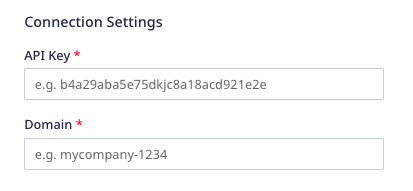
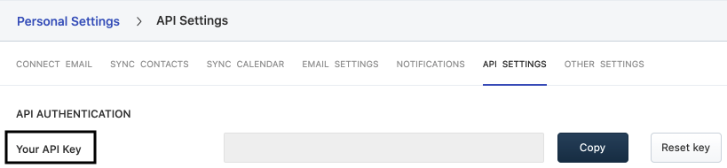

[Freshmarketer](https://www.freshworks.com/crm/marketing/) is a [Freshsales](https://www.freshworks.com/) e-commerce CRM platform. It is a marketing automation tool that offers a unified marketing, sales, and CRM platform to engage your customer base and grow your business.

RudderStack supports Freshmarketer as a destination where you can seamlessly send your event data.

## Getting started

Before configuring Freshmarketer as a destination in RudderStack, verify if the source platform is supported by Freshmarketer by referring to the table below:

| Connection Mode | Web | Mobile | Server |
| :--- | :--- | :--- | :--- |
| Device mode | - | - | - |
| Cloud mode | Supported  | Supported | Supported |

<div class="infoBlock">
To know more about the difference between cloud mode and device mode in RudderStack, refer to the <Link to="/destinations/rudderstack-connection-modes/">RudderStack Connection Modes</Link> guide.
</div>

Once you have confirmed that the source platform supports sending events to Freshmarketer, follow these steps:

1. From your [RudderStack dashboard](https://app.rudderstack.com/), add a source. Then, from the list of destinations, select **Freshmarketer**.
2. Assign a name to the destination and click **Continue**.

## Connection settings

To successfully configure Freshmarketer as a destination, you will need to configure the following settings:



- **API Key**: Enter your Freshmarketer API key.

<div class="infoBlock">
For more information on obtaining your Freshmarketer API key, refer to the <Link to="#FAQ">FAQ</Link> section below.
</div>

- **Domain**: Enter the subdomain of your Freshmarketer account. For example, if your organization URL is `testcompany.myfreshworks.com`, then the subdomain is `testcompany`.

<div class="infoBlock">
For more information on your organization URL and how to change it, refer to this <a href="https://support.freshworks.com/en/support/solutions/articles/50000002731-what-is-and-how-can-i-change-my-organization-url-">Freshmarketer support guide</a>.
</div>

- **Map your events with Freshmarketer Standard Events**: Use this setting to map the standard Freshmarketer events with the custom event names.

## Identify

You can use the <Link to="/event-spec/standard-events/identify/">`identify`</Link> call to create or update your Freshmarketer contact.

RudderStack uses the Freshmarketer [Upsert a Contact](https://developers.freshworks.com/crm/api/#upsert_a_contact) API to pass the relevant user information via the following parameters:

| Attribute | Type | Description |
| :------| :-----| :-----|
| `unique_identifier` | String | RudderStack passes the user's `email`. |
| `contact` | Hashed Object |  RudderStack passes the other relevant user details required to create or update the user in Freshmarketer. |

<div class="infoBlock">
If <code class="inline code">email</code> already exists, the contact details are updated. Otherwise, RudderStack creates a new user in Freshmarketer.
</div>

A sample `identify` call is shown below:

```javascript
rudderanalytics.identify("1hKOmRA4GRlm", {
  email: "alex@example.com",
  firstName: "Alex",
  lastName: "Keener",
  state: "Louisiana",
  country: "USA",
  postalCode: "90009",
});
```

The following table lists the mappings between the RudderStack and Freshmarketer properties:

| RudderStack property | Freshmarketer property |
| :--------------| :---------|
| `traits.email` <br/>  `context.traits.email` <br/> <span style="color: #4D4DFF;font-size:12px;">Required</span>| `emails` |
| `traits.firstname` <br/>  `traits.first_name` <br/>  `traits.firstName`<br/> <br />`context.traits.firstname`<br/>  `context.traits.first_name`<br/>  `context.traits.firstName` | `first_name` |
| `traits.lastname`<br/>  `traits.last_name`<br/>  `traits.lastName`<br/> <br />`context.traits.lastname`<br/>  `context.traits.last_name`<br/>  `context.traits.lastName` | `last_name` |
| `traits.subscriptionStatus`<br/>  `context.traits.subscriptionStatus` | `subscription_status` |
| `traits.job_title`<br/>  `traits.jobTitle`<br/>  `context.traits.job_title`<br/>  `context.traits.jobTitle` | `job_title` |
| `traits.phone`<br/>  `context.traits.phone` | `work_number` |
| `userId` | `external_id` | 
| `traits.mobileNumber`<br/>  `context.traits.mobileNumber` | `mobile_number` | 
| `traits.address`<br/>  `context.traits.address` | `address` | 
| `traits.address.city`<br/>  `traits.city`<br/>  `context.traits.address.city`<br/>  `context.traits.city` | `city` |
| `traits.address.state`<br/>  `traits.state`<br/>  `context.traits.address.state`<br/>  `context.traits.state` | `state` |
| `traits.address.postalCode`<br/>  `traits.zip`<br/>  `traits.zipcode`<br/>  `context.traits.zip`<br/>  `context.traits.zipcode`<br/>  `context.traits.address.postalCode` | `zipcode` |
| `traits.address.country`<br/>  `traits.country`<br/>  `context.traits.address.country`<br/>  `context.traits.country` | `country` |
| `traits.salesAccounts`<br/>  `context.traits.salesAccounts` | `sales_accounts` |
| `traits.territoryId`<br/>  `context.traits.territoryId` | `territory_id` |
| `traits.leadSourceId`<br/>  `context.traits.leadSourceId` | `lead_source_id` |
| `traits.ownerId`<br/>  `context.traits.ownerId` | `owner_id` |
| `traits.subscriptionTypes`<br/>  `context.traits.subscriptionTypes` | `subscription_types` |
| `traits.medium`<br/>  `context.traits.medium` | `medium` | 
| `traits.campaignId`<br/>  `traits.campaign_id`<br/>  `context.traits.campaignId`<br/>  `context.traits.campaign_id`<br/>  `context.campaign.name` | `campaign_id` | 
| `traits.keyword`<br/>  `context.traits.keyword`<br/>  `context.campaign.term` | `keyword` |
| `traits.timeZone`<br/>  `context.traits.timeZone` | `time_zone` |
| `traits.facebookUserName`<br/>  `context.traits.facebookUserName` | `facebook` |
| `traits.twitterUserName`<br/>  `context.traits.twitterUserName` | `twitter` |
| `traits.linkedinUserName`<br/>  `context.traits.linkedinUserName` | `linkedin` |
| `createdAt` | `created_at` | 
| `timestamp` | `updated_at` | 
| `traits.contactStatusId`<br/>  `context.traits.contactStatusId` | `contact_status_id` |
| `traits.salesAccountId`<br/>  `context.traits.salesAccountId` | `sales_account_id` |
| `traits.lifecycleStageId`<br/>  `context.traits.lifecycleStageId` | `lifecycle_stage_id` |

## Track
  
You can use the RudderStack <Link to="/event-spec/standard-events/track/">`track`</Link> call to track the user activities in Freshmarketer.

<div class="infoBlock">
To make a <code class="inline-code">track</code> call successfully, you must map the event to be sent in the <code class="inline-code">track</code> call in the <strong>Map your events with Freshmarketer Standard Events</strong> dashboard setting.
</div>

Rudderstack supports the following `track` events:

### Lifecycle stage

Lifecycle stage events capture the decision journey of a customer. Refer to the [Freshsales documentation](https://support.freshsales.io/en/support/solutions/articles/50000003344-how-to-manage-lifecycle-stages-and-status-for-contacts-) to create lifecycle stages in Freshmarketer.

RudderStack lets you update the status of a contact in their lifecycle stage by using either the `lifecycleStageId` or `lifecycleStageName`. 

<div class="infoBlock">
<code class="inline-code">lifecycleStageName</code> is a case-sensitive field and throws an error if not used in the intended manner.
</div>

A sample `track` call for a lifecycle stage event is shown below:

```javascript
rudderanalytics.track("eventName", {
  email: "alex@example.com",
  lifecycleStageId: 71010794467,
  phone: "+1-202-555-0146",
  owner_id: "70000090119",
});
```

The following table lists the property mappings betweeen RudderStack and Freshmarketer for lifecycle stage events:

| RudderStack property          | Freshmarketer property|
| :-------------------- | :---------------------- |
| `email` <br/> <span style="color: #4D4DFF;font-size:12px;">Required</span>| `email` |
| `lifecycleStageName` <br/> <span style="color: #4D4DFF;font-size:12px;">Required, if lifecycleStageId is absent.</span>  | `lifecycleStageName`  |
| `lifecycleStageId` <br/> <span style="color: #4D4DFF;font-size:12px;">Required, if lifecycleStageName is absent.</span>   | `lifecycle_stage_id`  |

### Sales activities

[Sales activities](https://developers.freshworks.com/crm/api/#sales-activities) events can be used to track any activity related to a contact/deal/account. Refer to the [Freshsales documentation](https://support.freshsales.io/en/support/solutions/articles/230199-how-to-configure-different-sales-activities-in-freshsales-) to create sales activities  in Freshmarketer.

RudderStack lets you create the status of a contact by using either the `salesActivityTypeId` or `salesActivityName`.

A sample `track` call for a sales activity event is shown below:

```javascript
rudderanalytics.track("eventName", {
  salesActivityTypeId: "70000663932",
  title: "new contact",
  startDate: "2021-05-04T17:00:00+05:30",
  endDate: "2022-06-04T17:30:00+05:30",targetable_type
  ownerId: "70054866612",
});
```

The following table lists the property mappings betweeen RudderStack and Freshmarketer for sales activity events:

| RudderStack property          | Freshmarketer property|
| :-------------------- | :---------------------- |
| `properties.title` <br/> <span style="color: #4D4DFF;font-size:12px;">Required</span>   | `title` |
| `properties.salesActivityName` <br/> <span style="color: #4D4DFF;font-size:12px;">Required, if properties.salesActivityTypeId is absent.</span>| `sales_activity_name` |
| `properties.salesActivityTypeId`   <br/> <span style="color: #4D4DFF;font-size:12px;">Required, if properties.salesActivityName is absent.</span> |`sales_activity_type_id` | 
| `properties.startDate` <br/> <span style="color: #4D4DFF;font-size:12px;">Required</span>  | `start_date`        |
| `properties.endDate`  <br/> <span style="color: #4D4DFF;font-size:12px;">Required</span>  | `end_date`      | 
| `context.externalId.type` <br/> <span style="color: #4D4DFF;font-size:12px;">Required</span>   | `targetable_type` |
| `properties.ownerId` <br/> <span style="color: #4D4DFF;font-size:12px;">Required</span>  | `owner_id`| 
| `salesActivityOutcomeId`  | `sales_activity_outcome_id`  |
| `properties.notes`    | `notes`      |
| `context.externalId.id`     | `targetable_id`           |
| `properties.createrId`    | `creater_id`              |
| `originalTimestamp`  | `created_at`                |
| `timestamp`   | `updated_at`      |
|`properties.location` |`location`|
| `latitude`<br/>`context.address.latitude`<br/> `context.location.latitude`   | `latitude`      |
| `longitude`<br/>`context.address.longitude`<br/>`context.location.longitude`   | `longitude`      | 
|`properties.checkedinAt`|`checkedin_at`|

<div class="infoBlock">
The <code class="inline-code">targetable_type</code> field denotes the entity for which the sales activity has been created and can take <code class="inline-code">Contact</code>/<code class="inline-code">SalesAccount</code>/<code class="inline-code">Deal</code> as its value. However, if its value is set to <code class="inline-code">contact</code>, then either the <code class="inline-code">targetable_id</code> or <code class="inline-code">email</code> is required.
</div>

## Group

The <Link to="/event-spec/standard-events/group/">`group`</Link> call lets you link an identified Freshmarketer contact with a company, organization, or an account. You can also record any custom group traits like the company name, number of employees, etc.

<div class="infoBlock">
To make a <code class="inline-code">group</code> call successfully, you must pass the <code class="inline-code">groupType</code> field with value as <code class="inline-code">accounts</code> or <code class="inline-code">marketing_lists</code>.
</div>

### Accounts

RudderStack uses the [Upsert an Account](https://developers.freshworks.com/crm/api/#upsert_an_account) API to create or update a [sales account](https://developers.freshworks.com/crm/api/#accounts) via the following parameters:

| Attribute | Type | Description |
| :------| :-----| :-----|
| `unique_identifier` | String | RudderStack passes the account `name`. |
| `sales_account` | Hashed Object |  RudderStack passes the other relevant details associated with the Freshmarketer account. |

<div class="infoBlock">
<ul>
<li>If <code class="inline-code">name</code> already exists, RudderStack updates the Freshmarketer account details. Otherwise, it creates a new account in Freshmarketer.</li>
<li>RudderStack also checks if the contact's <code class="inline-code">email</code> is present in the <code class="inline-code">context.traits</code> object. If yes, RudderStack links the contact to the Freshmarketer account.</li>
</ul>
</div>

A sample `group` call is shown below:

```javascript
rudderanalytics.group(
  "group01", {
    groupType: "accounts",
    name: "Alex Keener",
    phone: "1234567890",
    numberOfEmployees: 51,
    annualRevenue: 10000,
    zipcode: 90009,
    street: "6649 N Blue Gum Street",
    city: "New Orleans",
    state: "Louisiana",
    country: "USA"
  }, {
    context: {
      traits: {
        email: "alex@example.com"
      }
    }
  }
);
```

The following table lists the mappings between the RudderStack and Freshmarketer properties to create or update an account:

| RudderStack property | Freshmarketer property | 
| :--------------| :---------| 
| `name` <br/> <span style="color: #4D4DFF;font-size:12px;">Required</span> | `name` |
| `traits.industryTypeId`  <br/> `context.traits.industryTypeId` | `industry_type_id` | 
| `traits.businessTypeId` <br/> `context.traits.businessTypeId` <br/> `traits.business_type_id` <br/> `context.traits.business_type_id` | `business_type_id` |
| `phone` | `phone` |
| `traits.numberOfEmployees` <br/> `context.traits.numberOfEmployees` | `number_of_employees` |
| `traits.annualRevenue` <br/> `context.traits.annualRevenue` | `annual_revenue` |
| `traits.address` <br/> `context.traits.address` | `address` |
| `traits.city`<br/> `traits.address.city`<br/> `context.traits.city`<br/> `context.traits.address.city` | `city` | 
| `traits.state`<br/> `traits.address.state`<br/> `context.traits.state`<br/> `context.traits.address.state` | `state` |
| `traits.country`<br/> `traits.address.country`<br/> `context.traits.country`<br/> `context.traits.address.country` | `country` |
| `zipcode` | `zipcode` | 
| `traits.website`<br/>`context.traits.website` | `website` | 
| `traits.territoryId`<br/>`context.traits.territoryId` | `territory_id` | 
| `traits.parentSalesAccountid`<br/>`context.traits.parentSalesAccountid` | `parent_sales_account_id` | 
| `traits.ownerId`<br/>`context.traits.ownerId` | `ownerId` | 
| `traits.facebookUserName`<br/> `context.traits.facebookUserName` | `facebook` | 
| `traits.twitterUserName`<br/> `context.traits.twitterUserName` | `twitter` | 
| `traits.linkedinUserName`<br/> `context.traits.linkedinUserName` | `linkedin` | 
| `createdAt` | `created_at` | 
| `timestamp` | `updated_at` | 

### Marketing lists

[Marketing lists](https://developers.freshworks.com/crm/api/#marketing-lists) help you group contacts into lists which you can quickly invoke for marketing campaigns and bulk emailing.

RudderStack lets you add one or more contacts to a specified marketing list. To do so, you need to provide the contact's `email` and `listId`/`listName`. Also, RudderStack creates a new marketing list if the `listName` (case-sensitive) does not exist already.

A sample `group` call to add a contact to a marketing list is shown below:

```javascript
rudderanalytics.group("group01", {
  groupType: "marketing_lists",
  email: "alex@example.com",
  listName: "listIdX123",
});
```

The following table lists the property mappings between RudderStack and Freshmarketer to create marketing lists:

| RudderStack property          | Freshmarketer property|
| :-------------------- | :---------------------- |
| `email` <br/> <span style="color: #4D4DFF;font-size:12px;">Required</span>| `email` |
| `listId` <br/> <span style="color: #4D4DFF;font-size:12px;">Required, if listName is absent.</span>  | `listId`  |
| `listName` <br/> <span style="color: #4D4DFF;font-size:12px;">Required, if listId is absent.</span>   | `listName`  |


## Type conversion and invalid format error

The following event properties accept only the number data type:

- `territoryId`
- `leadSourceId`
- `ownerId`
- `campaignId`
- `contactStatusId`
- `lifecycleStageId`
- `industryTypeId`
- `businessTypeId`
- `numberOfEmployees`
- `parentSalesAccountid`

If any of the above properties are present in any `identify` or `group` call in a different format, Rudderstack will try to convert them into the number data type. If the type conversion is unsuccessful, RudderStack will give an "invalid format" error.

## FAQ

### Where can I find the Freshmarketer API key?

To obtain your Freshmarketer API key, follow these steps:

1. Log into your [Freshmarketer dashboard](https://www.freshworks.com/crm/login/).
2. Go to **Personal Settings** > **API Settings**.
3. Enable the captcha to complete the authentication process.
4. You will find your Freshmarketer API key listed under the **API Authentication** section, as shown:



<div class="infoBlock">
For more information, refer to this <a href="https://crmsupport.freshworks.com/en/support/solutions/articles/50000002503-how-to-find-my-api-key-">Freshmarketer support guide</a>.
</div>
