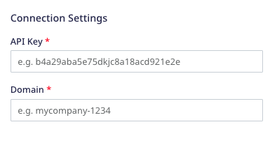
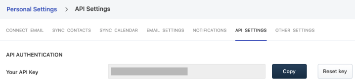

[Freshsales](https://www.freshworks.com/crm/lp/sales-crm-software/) is a CRM tool that lets you discover the best leads, drive them to closure, and nurture them to boost contextual engagement.

RudderStack supports Freshsales as a destination where you can seamlessly send your event data.

## Getting started

Before configuring Freshsales as a destination in RudderStack, verify if the source platform is supported by Freshsales by referring to the table below:

| Connection Mode | Web | Mobile | Server |
| :--- | :--- | :--- | :--- |
| Device mode | - | - | - |
| Cloud mode | Supported  | Supported | Supported |

<div class="infoBlock">
To know more about the difference between cloud mode and device mode in RudderStack, refer to the <Link to="/destinations/rudderstack-connection-modes/">RudderStack Connection Modes</Link> guide.
</div>

Once you have confirmed that the source platform supports sending events to Freshsales, follow these steps:

1. From your [RudderStack dashboard](https://app.rudderstack.com/), add a source. Then, from the list of destinations, select **Freshsales**.
2. Assign a name to the destination and click **Continue**.

## Connection settings

To successfully configure Freshsales as a destination, you will need to configure the following settings:



- **API Key**: Enter your Freshsales API key.

<div class="infoBlock">
For more information on obtaining your Freshsales API key, refer to the <Link to="#FAQ">FAQ</Link> section below.
</div>

- **Domain**: Enter the subdomain of your Freshsales account. For example, if your organization URL is is `testcompany.myfreshworks.com`, then the subdomain is `testcompany`.

<div class="infoBlock">
For more information on your organization URL and how to change it, refer to this <a href="https://support.freshworks.com/en/support/solutions/articles/50000002731-what-is-and-how-can-i-change-my-organization-url-">Freshsales support guide</a>.
</div>

## Identify

You can use the <Link to="/event-spec/standard-events/identify/">`identify`</Link> call to create or update your Freshsales contact.

RudderStack uses the Freshsales [Upsert a Contact](https://developers.freshworks.com/crm/api/#upsert_a_contact) API to pass the relevant user information via the following parameters:

| Attribute | Type | Description |
| :------| :-----| :-----|
| `unique_identifier` | String | RudderStack passes the user's `email`. |
| `contact` | Hashed Object |  RudderStack passes the other relevant user details required to create or update the user in Freshsales. |

<div class="infoBlock">
If <code class="infoBlock">email</code> already exists, the contact details are updated. Otherwise, RudderStack creates a new user in Freshsales.
</div>

A sample `identify` call is shown below:

```javascript
rudderanalytics.identify("1hKOmRA4GRlm", {
  "email": "alex@example.com",
  "firstName": "Alex",
  "lastName": "Keener",
  "address": {
    "street": "6649 N Blue Gum Street",
    "city": "New Orleans",
    "state": "Louisiana",
    "country": "USA",
    "postalCode": "90009"
  }
})
```

### Supported mappings

The following table lists the mappings between the RudderStack and Freshsales properties:

| RudderStack property | Freshsales property | Presence |
| :--------------| :---------| :--------------|
| `traits.email`, `context.traits.email` | `emails` | Required |
| `userId` | `id` | Optional |
| `traits.firstname`, `traits.first_name`, `traits.firstName`,<br />`context.traits.firstname`, `context.traits.first_name`, `context.traits.firstName` | `first_name` | Optional |
| `traits.lastname`, `traits.last_name`, `traits.lastName`,<br />`context.traits.lastname`, `context.traits.last_name`, `context.traits.lastName` | `last_name` | Optional |
| `traits.subscriptionStatus`, `context.traits.subscriptionStatus` | `subscription_status` | Optional |
| `traits.job_title`, `traits.jobTitle`, `context.traits.job_title`, `context.traits.jobTitle` | `job_title` | Optional |
| `traits.phone`, `context.traits.phone` | `work_number` | Optional |
| `externalId` | `external_id` | Optional |
| `traits.mobileNumber`, `context.traits.mobileNumber` | `mobile_number` | Optional |
| `traits.address`, `context.traits.address` | `address` | Optional |
| `traits.address.city`, `traits.city`, `context.traits.address.city`, `context.traits.city` | `city` | Optional |
| `traits.address.state`, `traits.state`, `context.traits.address.state`, `context.traits.state` | `state` | Optional |
| `traits.address.postalcode`, `traits.zip`, `traits.zipcode`, `context.traits.zip`, `context.traits.zipcode`, `context.traits.address.postalcode` | `zipcode` | Optional |
| `traits.address.country`, `traits.country`, `context.traits.address.country`, `context.traits.country` | `country` | Optional |
| `traits.salesAccounts`, `context.traits.salesAccounts` | `sales_accounts` | Optional |
| `traits.territoryId`, `context.traits.territoryId` | `territory_id` | Optional |
| `traits.LeadSourceId`, `context.traits.LeadSourceId` | `lead_source_id` | Optional |
| `traits.ownerId`, `context.traits.ownerId` | `owner_id` | Optional |
| `traits.subscriptionTypes`, `context.traits.subscriptionTypes` | `subscription_types` | Optional |
| `traits.medium`, `context.traits.medium` | `medium` | Optional |
| `traits.campaignId`, `traits.campaign_id`, `context.traits.campaignId`, `context.traits.campaign_id` | `campaign_id` | Optional |
| `traits.keyword`, `context.traits.keyword` | `keyword` | Optional |
| `traits.timeZone`, `context.traits.timeZone` | `time_zone` | Optional |
| `traits.facebook`, `context.traits.facebook` | `facebook` | Optional |
| `traits.twitter`, `context.traits.twitter` | `twitter` | Optional |
| `traits.linkedin`, `context.traits.linkedin` | `linkedin` | Optional |
| `createdDate` | `created_at` | Optional |
| `updatedDate` | `updated_at` | Optional |
| `traits.contactStatusId`, `context.traits.contactStatusId` | `contact_status_id` | Optional |
| `traits.salesAccountId`, `context.traits.salesAccountId` | `sales_account_id` | Optional |
| `traits.lifecycleStageId`, `context.traits.lifecycleStageId` | `lifecycle_stage_id` | Optional |

## Group

The <Link to="/event-spec/standard-events/group/">`group`</Link> call lets you link an identified Freshsales contact with a company, organization, or an account. You can also record any custom group traits like the company name, number of employees, etc.

RudderStack uses the [Upsert an Account](https://developers.freshworks.com/crm/api/#upsert_an_account) API to create or update a sales account via the following parameters:

| Attribute | Type | Description |
| :------| :-----| :-----|
| `unique_identifier` | String | RudderStack passes the account `name`. |
| `sales_account` | Hashed Object |  RudderStack passes the other relevant details associated with the Freshsales account. |

<div class="infoBlock">
<ul>
    <li>If <code class="inline-code">name</code> already exists, the Freshsales account details are updated. Otherwise, a new account is created.</li>
    <li>RudderStack also checks if the contact's <code class="inline-code">email</code> is present in the <code class="inline-code">context.traits</code> object. If yes, RudderStack links the contact to the Freshsales account.</li>
</ul>
</div>

A sample `group` call is shown below:

```javascript
rudderanalytics.group("group01", {
  "name": "Alex Keener",
  "phone": "1234567890",
  "numberOfEmployees": 51,
  "annualRevenue": 10000,
  "address": {
    "street": "6649 N Blue Gum Street",
    "city": "New Orleans",
    "state": "Louisiana",
    "country": "USA",
    "postalCode": 90009
  }
  context: {
    traits: {
      "email": "group01@example.com"
    },
  },
});
```
### Supported mappings

The following table lists the mappings between the RudderStack and Freshsales properties:

| RudderStack property | Freshsales property | Presence |
| :--------------| :---------| :--------------|
| `name` | `name` | Required |
| `traits.industryTypeId`, `context.traits.industryTypeId` | `industry_type_id` | Optional |
| `traits.businessTypeId`, `context.traits.businessTypeId`, `traits.business_type_id`, `context.traits.business_type_id` | `business_type_id` | Optional |
| `phone` | `phone` | Optional |
| `traits.numberOfEmployees`, `context.traits.numberOfEmployees` | `number_of_employees` | Optional |
| `traits.annualRevenue`, `context.traits.annualRevenue` | `annual_revenue` | Optional |
| `traits.address`, `context.traits.address` | `address` | Optional |
| `traits.city`, `traits.address.city`, `context.traits.city`, `context.traits.address.city` | `city` | Optional |
| `traits.state`, `traits.address.state`, `context.traits.state`, `context.traits.address.state` | `state` | Optional |
| `traits.country`, `traits.address.country`, `context.traits.country`, `context.traits.address.country` | `country` | Optional |
| `zipcode` | `zipcode` | Optional |
| `traits.website`, ``context.traits.website` | `website` | Optional |
| `traits.territoryId`, ``context.traits.territoryId` | `territory_id` | Optional |
| `traits.parentSalesAccountid`, ``context.traits.parentSalesAccountid` | `parent_sales_account_id` | Optional |
| `traits.ownerId`, ``context.traits.ownerId` | `ownerId` | Optional |
| `traits.facebookUserName`, `context.traits.facebookUserName` | `facebook` | Optional |
| `traits.twitterUserName`, `context.traits.twitterUserName` | `twitter` | Optional |
| `traits.linkedinUserName`, `context.traits.linkedinUserName` | `linkedin` | Optional |
| `createdAt` | `created_at` | Optional |
| `timestamp` | `updated_at` | Optional |

## FAQ

### Where can I find the Freshsales API key?

To obtain your Freshsales API key, follow these steps:

1. Log into your [Freshsales dashboard]().
2. Go to **Personal Settings** > **API Settings**.
3. Enable the captcha to complete the authentication process.
4. You will find your Freshsales API key listed under the **API Authentication** section, as shown:



<div class="infoBlock">
For more information, refer to this <a href="https://crmsupport.freshworks.com/en/support/solutions/articles/50000002503-how-to-find-my-api-key-">Freshsales support guide</a>.
</div>