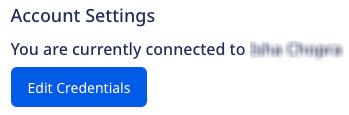
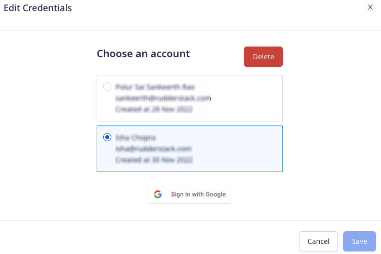
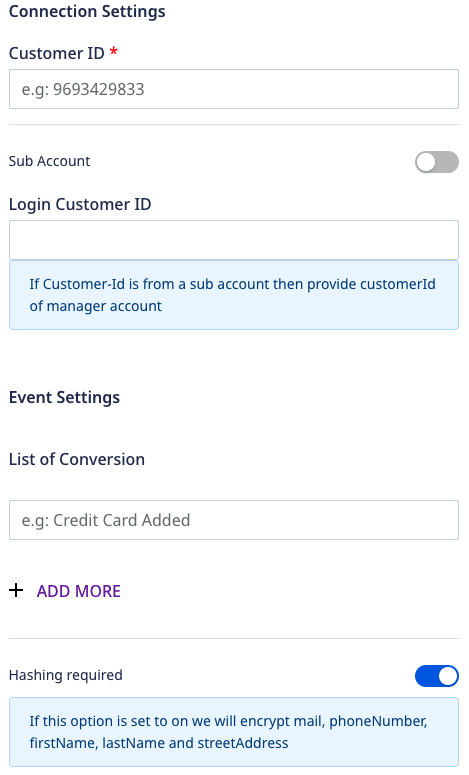
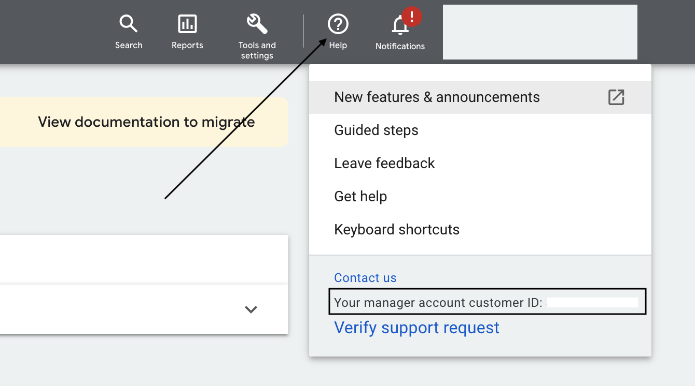
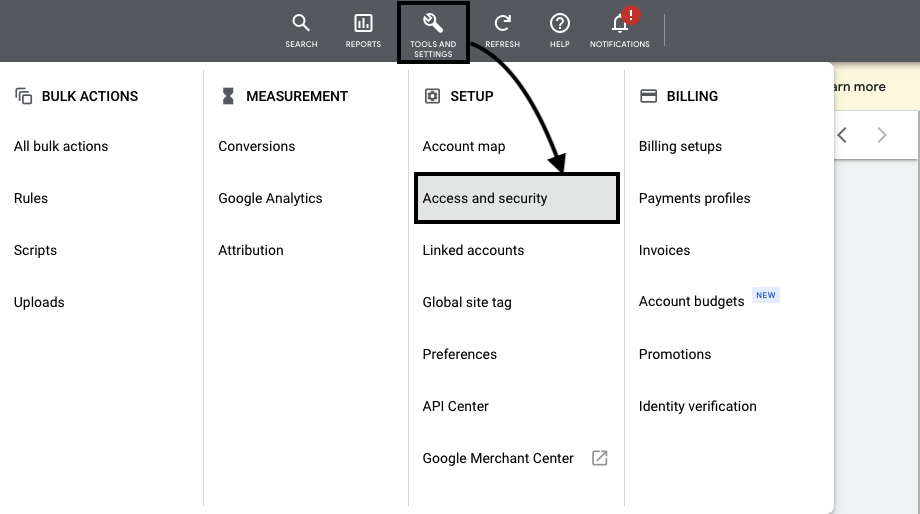
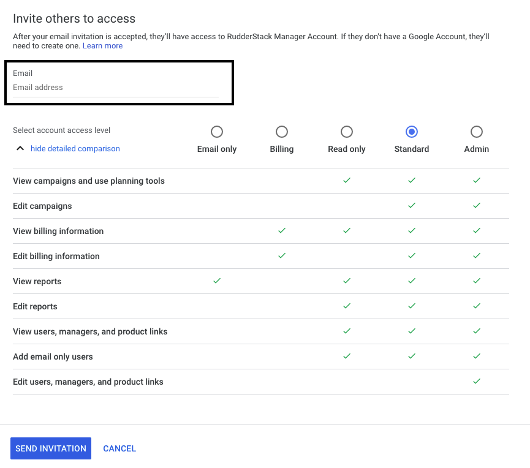

[Google Adwords Enhanced Conversions](https://developers.google.com/google-ads/api/docs/conversions/enhance-conversions) lets you improve your conversion measurement accuracy by securely sending first-party conversion data from your website to Google.

RudderStack supports Google Adwords Enhanced Conversions as a destination to which you can send your audience list.

<div class="infoBlock">
To use this destination, you must set up Enhanced Conversions with the Google Ads API. For detailed instructions, refer to the <a href="https://support.google.com/google-ads/answer/11062876" target="_blank">Google Ads support page</a>.
</div>

## Getting started

Before configuring Google AdWords Enhanced Conversions as a destination in RudderStack, verify if the source platform is supported by referring to the table below:

| **Connection Mode** | **Web**         | **Mobile**   | **Server**        |
| :-------------------| :-------------- | :----------- | :-----------------|
| **Device mode**     | -               | -            | -                 |
| **Cloud mode**      | **Supported**               | **Supported**           |  **Supported**    |

<div class="infoBlock">
To learn more about the difference between cloud mode and device mode in RudderStack, refer to the <Link to="/destinations/rudderstack-connection-modes/">RudderStack Connection Modes</Link> guide.
</div>

Once you have confirmed that the source platform supports sending events to Google AdWords Enhanced Conversions, follow these steps:

1. From your [RudderStack dashboard](https://app.rudderstack.com/), add the source. Then, from the list of destinations, select **Google AdWords Enhanced Conversions**.
2. Assign a name to your destination and click on **Next**.

### Google AdWords Permissions

Actions undertaken via your RudderStack integration rely on the authorizing Google AdWords user's [underlying permissions](https://support.google.com/google-ads/answer/9978556) and must be at least *Standard* or *Admin*.

If an integration is authorized by a user without at least *Standard* or *Admin* permissions, API calls will fail, and a "RudderStack Admin" user will disable the integration in your <Link to="/dashboard-guides/audit-logs">audit logs</Link>. If you encounter an entry in your audit logs from a `Rudder Admin/admin@rudderstack.com` user, this means that the integration was disabled by RudderStack on account of insufficient permissions by your Google AdWords user.

To avoid this, ensure that the authorizing user has at mininum, *Standard* permissions.


### Connection settings

To successfully configure Google AdWords Enhanced Conversions as a destination, first authenticate your account by following the below steps:

1. Click **Create Account** in the **Account Settings** section.
2. From the modal, click the **Sign in with Google** button.
3. Choose the required account and grant RudderStack the required permissions.
4. Click **Save** to use the specified account, as shown:



<div class="infoBlock">
In case you have authenticated multiple accounts, you can click <strong>Edit Credentials</strong> to select or delete any other authenticated account, as shown:
<br/><br/>



RudderStack <strong>gives an error</strong> if you try to delete an account used by any other connection set up for the same destination.
</div>

Next, configure the following settings:



- **Customer ID**: Enter the ID associated with your Google Ads account. You can find it by clicking on the **Help** option in your dashboard.

<div class="infoBlock">

For more information on obtaining the customer ID, refer to the <a href="https://support.google.com/google-ads/answer/1704344?hl=en">Google Ads Help Center</a> page.
</div>

- **Subaccount**: Enable this setting if you are using a Google Ads subaccount.

<div class="infoBlock">

For more information on subaccounts, refer to the <a href="https://support.google.com/campaignmanager/answer/2829448?hl=en#zippy=%2Cwhat-are-subaccounts">Google Ads Help Center</a> page.
</div>

- **Login Customer ID**: Enter the customer ID of the manager account (associated with the subaccount).

<div class="infoBlock">

This field is required only when you want to send data to a customer list of a subaccount.
</div>

### Event settings

- **List of Conversion**: Enter the list of events on which you want to perform enhanced conversions. RudderStack will discard any events that are not specified in this list.

- **Hashing Required**: Enabled by default, this setting hash encrypts the user identifiers, such as email, phone number, first name, last name and street address.

## Track

The <Link to="/event-spec/standard-events/track">`track`</Link> call lets you record and send the conversion events along with any properties associated with them. 

A sample `track` call is shown below:

```javascript
rudderanalytics.track("Order Completed", {
  checkout_id: "12345",
  orderId: "123",
  affiliation: "Apple Store",
  gclid: "abcd1234",
  conversionDateTime: "2019-01-01 12:32:45-08:00",
  adjustedValue: 100,
  currencyCode: "INR",
  adjustmentDateTime: "2019-01-01 12:32:45-08:00",
  total: 20,
  revenue: 15.0,
  shipping: 22,
  tax: 1,
  discount: 1.5,
  coupon: "SAVE45",
  currency: "USD",
  products: [
    {
      product_id: "FS247",
      sku: "G-32",
      name: "Monopoly",
      price: 14,
      quantity: 1,
      category: "Games",
      url: "https://www.estore.com/product/funskool-monopoly",
    },
  ],
})
```

<div class="infoBlock">
RudderStack uses the <code class="inline-code"><a href="https://developers.google.com/google-ads/api/reference/rpc/v12/ConversionAdjustment">ConversionAdjustment</a></code> method to send these events to Google Ads.
</div>

<div class="warningBlock">
RudderStack will discard any <code class="inline-code">track</code> call where <code class="inline-code">orderId</code> is not present. This is because <code class="inline-code">orderId</code> is a required field for enhancement.
</div>

### Supported mapping

The following table details the mapping of the fields specified in the RudderStack dashboard and Google AdWords Enhanced Conversions, along with the relevant guidelines:

| RudderStack field | Google AdWords Enhanced Conversions field | Guidelines |
| :-----| :--------| :------|
| `gclid` | `gclid` | This is the Google click ID associated with the original conversion. |
| `conversionDateTime`  | `conversionDateTime` | The datetime at which the conversion for the adjustment occurred. You must specify the timezone in the format `yyyy-mm-dd hh:mm:ss+|-hh:mm`, e.g. `2022-03-14 12:32:45-03:14`. |
| `adjustedValue` | `adjustedValue` | The value of the conversion after restatement. To change the value of a conversion from `100` to `75`, for example, you should report an adjusted value of `75`. |  
| `currencyCode` | `currencyCode` |  Use the ISO 4217 3-character currency code, e.g. `USD`/`EUR`. |
| `orderId` | `orderId` | If a conversion was reported with a specific order ID, then that order ID must be used as the identifier. |
| `adjustmentDateTime` | `adjustmentDateTime` | The datetime at which the adjustment occurred. You must specify the timezone in the format `yyyy-mm-dd hh:mm:ss+|-hh:mm`, e.g. `2022-03-14 12:32:45-03:14`. |
| `userAgent` | `userAgent` | User agent should only be specified in enhancements with the user identifiers and it should match the user agent of the request that sent the original conversion. This is so that the conversion and the enhancement both are either attributed as same or cross-device. |
| `email` | `hashedEmail` | Include a domain name for all the email addresses. Remove any spaces in between the addresses. |
| `phone` | `hashedPhone` | Format the phone number using the [E.164 format](https://en.wikipedia.org/wiki/E.164). Include the country code as well. |
| `firstName` | `hashedFirstName` | Do not include any prefixes (e.g., `Mrs.`). | 
| `lastName` | `hashedLastName` | Do not include any suffixes (e.g., `Sr.`). |
| `city` | `city` | This field accepts any string. |
| `state` | `state` | This field accepts any string. |
| `country` / `countryCode` | `countryCode` | Use the ISO two-letter/three-letter [country codes](https://developers.google.com/google-ads/api/reference/data/codes-formats#expandable-16). Include the country code even if all your users belong to the same country. |
| `postalCode` | `postalCode` | Both the US and international zip and postal codes are allowed. For the US, 5 digit codes followed by 4 digit extensions are also allowed. For the rest of the countries, do not include the postal code extensions. |

## FAQs

### According to my audit logs, a "Rudder Admin" user updated my destination. Why is this?

This is a Google AdWords permissions issue. See <Link to="#google-adwords-permissions">Google AdWords Permissions</Link> for details.

### Can I set up the Enhanced Conversions and Remarketing Lists destinations using the same Google Ads account?

Yes, you can. Both the integrations are the sub-features of Google Ads. Hence, you can use the same Google Ads account to configure both the destinations in RudderStack.

### Where can I find my Google Adwords customer ID?

To get the customer ID associated with your Google Ads account, click on the **Help** option in your Google Ads dashboard. You will find the customer ID in the resulting pop-up, as shown:



### What are the account permissions required for this integration?

For the integration to be successful, make sure the customer account used for OAuth verification adheres to Google's [Customer Match policy](https://support.google.com/google-ads/answer/6299717) and has **Standard** or higher (**Administrative**) access level permissions. For more information on the access level permissions, refer to this [Google Ads support page](https://support.google.com/google-ads/answer/9978556?visit_id=637611563637058259-4176462731&rd=1).

To set the access level, follow these steps:

1. Sign into to your Google Ads account and go to **TOOLS AND SETTINGS** > **Access and security**, as shown:



2. Enter the email address of the account and from the list of permissions, select **Standard** or **Administrative**. Then, click on **SEND INVITATION**, as shown:



The account will have the access level permissions once they accept the invitation.

### I am getting a 400 Bad Request error message. What should I do?

If you get a 400 Bad Request error while configuring the destination, make sure your customer account is allow-listed and configured to have **Standard** or **Administrative** access levels in Google Ads. Refer to the above [FAQ](#what-are-the-account-permissions-required-for-this-integration) for steps on setting the access level permissions for the account.


