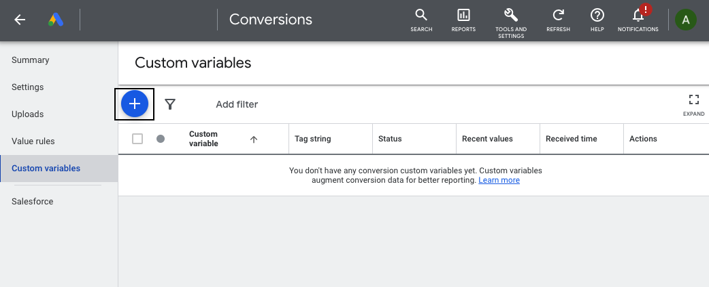
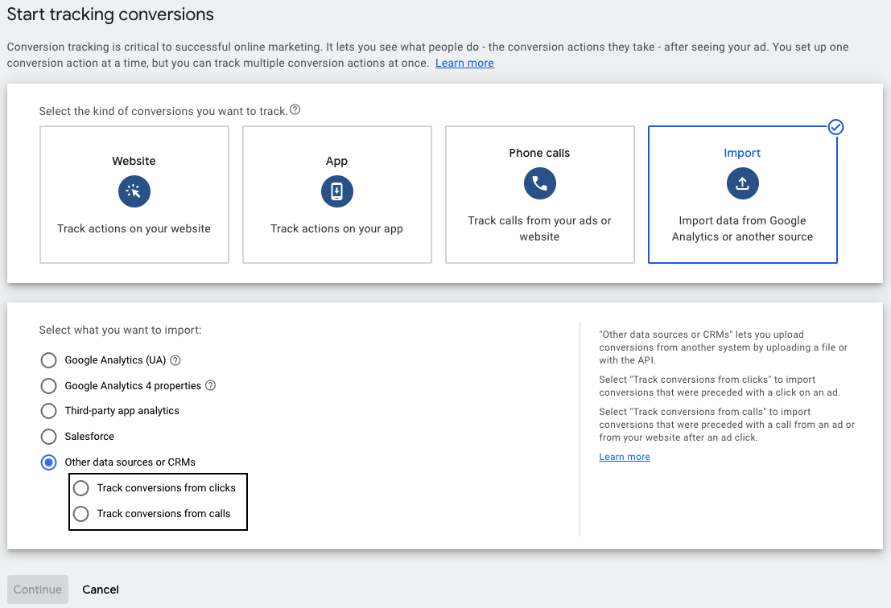
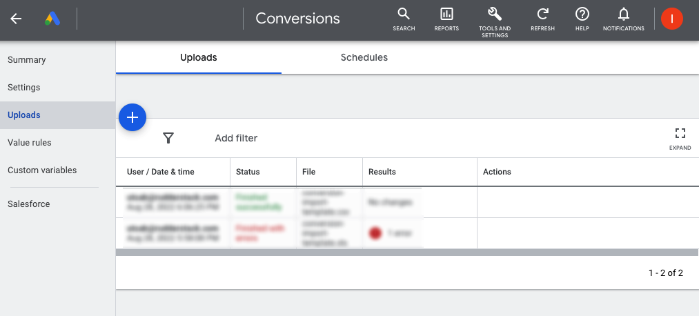

[Google Ads Offline Conversions](https://support.google.com/google-ads/answer/2998031?hl=en&ref_topic=7280668) helps you track the offline sales which occur when your ads lead to a click or call to your business. It lets you measure your sale conversions in the offline mode after a user clicks your ad online but does not directly proceed to sale in the online mode. 

<GhBadge
  label={'Stability'}
  message={'Beta'}
  color={'blueviolet'}
  logo={'github'}
/>

## Getting started

RudderStack supports sending event data to Google Ads Offline Conversions via the following <a href="https://rudderstack.com/docs/rudderstack-cloud/rudderstack-connection-modes/">connection modes</a>:

| **Connection Mode** | **Web**         | **Mobile**   | **Server**        |
| :-------------------| :-------------- | :----------- | :-----------------|
| **Device mode**     | -               | -            | -                 |
| **Cloud mode**      | **Supported**   | **Supported** |  **Supported**    |

Once you have confirmed that the source platform supports sending events to Google Ads Offline Conversions, follow these steps:

1. From your [RudderStack dashboard](https://app.rudderstack.com/), add the source. Then, from the list of destinations, select **Google Ads Offline Conversions**.
2. Assign a name to your destination and click **Continue**.

### Connection settings

To successfully configure Google Ads Offline Conversions as a destination, first authenticate your account by following the below steps:

1. Click **Create Account** in the **Account Settings** section.
2. From the modal, click the **Sign in with Google** button.
3. Choose the required account and grant RudderStack the required permissions.
4. Click **Save** to use the specified account, as shown:


<div class="infoBlock">
In case you have authenticated multiple accounts, you can click <strong>Edit Credentials</strong> to select or delete any other authenticated account, as shown:
<br/><br/>


RudderStack <strong>gives an error</strong> if you try to delete an account used by any other connection set up for the same destination.
</div>

Next, configure the following settings:

- **Customer ID**: Enter the ID associated with your Google Ads account. Refer to the <Link to="#faq">FAQ</Link> section for more information on obtaining your customer ID.
- **Subaccount**: Enable this setting if you are using a Google Ads subaccount. Refer to the <a href="https://support.google.com/campaignmanager/answer/2829448?hl=en#zippy=%2Cwhat-are-subaccounts">Google Ads</a> documentation for more information on subaccounts.
- **Map your events with Google Ads Offline Conversions**: Enter the RudderStack event name you want to map to the **Click** or **Call** conversion type in Google Ads.
- **Map your Google Ads Conversions Names**: Enter the RudderStack event name corresponding to the Google Ads Conversion name created in the Google Ads dashboard. Refer to the <Link to="#faq">FAQ</Link> section for more information on creating click and call conversions in Google Ads dashboard.
- **Map your variable names to custom Google Ads variables**: Enter the custom variable name you want to map to the Google Ads custom variable. Refer to the <Link to="#faq">FAQ</Link> section for more information on creating custom variables in Google Ads dashboard.
- **User Identifier Source**: Select the type of user identifier source from the dropdown. Refer to the [Google Ads documentation](https://developers.google.com/google-ads/api/rest/reference/rest/v11/UserIdentifier#UserIdentifierSource) for more information on the different source types.
- **Conversion Environment**: Select the conversion environment of the uploaded conversion from the dropdown. Refer to the [Google documentation](https://developers.google.com/google-ads/api/rest/reference/rest/v11/customers/uploadClickConversions#ConversionEnvironment) for more information on the different conversion environments.
- **Default user identifier for click conversions**: Select the default user identifier from `email` or `phone`. This setting will take effect only if you have specified a **User Identifier Source**. 
- **Hash User Identifying Information (SHA-256)**: This setting is enabled by default and hashes the user identifying information like `email` and `phone number` using SHA-256.
- **Validate Only**: Enable this setting to only validate the request and not execute it. Refer to the [Google Ads documentation](https://developers.google.com/google-ads/api/rest/reference/rest/v11/customers/uploadClickConversions) for more information.

## Track

RudderStack associates the <Link to="/event-spec/standard-events/track">`track`</Link> event with the event name defined in the **Map your events with Google Ads Offline Conversions** dashboard setting.

RudderStack supports the following conversion types:

### Click conversion

You can create a conversion action to [upload offline click conversions](https://developers.google.com/google-ads/api/docs/conversions/upload-clicks) into Google Ads. The [Google Ads Click Conversion API](https://developers.google.com/google-ads/api/rest/reference/rest/v11/customers/uploadClickConversions#ClickConversion) processes the given click conversions.

A sample `track` call for a click conversion is shown below:

```javascript
rudderanalytics.track('sign up completed', {
  gclid: "gclid_value",
  conversionDateTime: "2022-05-20 12:32:45-08:00"
});
```

The following table lists the property mappings between RudderStack and Google Ads Offline Conversions for the click conversion type:

| RudderStack property | Google Ads Offline Conversions property | Notes |
| :-----| :--------| :--------| 
| `properties.conversionDateTime`<br/>`originalTimestamp` <br/> <span style="color: #4D4DFF;font-size:12px;">Required</span> | `conversionDateTime` | -|
| `traits.email`<br/>`context.traits.email`| `hashedEmail` | If **User Identifier Source** is set in the dashboard, either `email` or `phone` must be passed. |
| `traits.phone`<br/>`context.traits.phone` | `hashedPhoneNumber` | If **User Identifier Source** is set in the dashboard, either `email` or `phone` must be passed. |
| `properties.gclid` | `gclid` |  -|
| `properties.gbraid` | `gbraid` |  -|
| `properties.wbraid`  | `wbraid` |  -|
| `properties.externalAttributionCredit` | `externalAttributionCredit` |  -|
| `properties.externalAttributionModel` | `externalAttributionModel` |  -|
| `properties.merchantId` | `merchantId` |  -|
| `properties.feedCountryCode` | `feedCountryCode` |  -|
| `properties.feedLanguageCode` | `feedLanguageCode` |  -|
| `properties.localTransactionCost` | `localTransactionCost` |  -|
| `properties.product_id`<br/>`properties.sku` | `productId` |  -|
| `properties.quantity` | `quantity` |  -|
| `properties.price` | `unitPrice` |  -|
| `properties.userIdentifierSource` | `userIdentifierSource` |  -|
| `properties.conversionEnvironment` | `conversionEnvironment` |  -|
| `properties.conversionValue`<br/>`properties.total`<br/>`properties.value`<br/>`properties.revenue` | `conversionValue` |  -|
| `properties.currencyCode`<br/>`properties.currency` | `currencyCode` |  -|
| `properties.orderId`<br/>`properties.order_id` | `orderId` |  -|


<div class="infoBlock">
Refer to the <a href="https://developers.google.com/google-ads/api/docs/conversions/upload-clicks#id_parameters">ID parameters</a> section for detailed guidelines on passing the combinations of <code class="inline-code">wbraid</code>, <code class="inline-code">gbraid</code>, and <code class="inline-code">gclid</code> parameters.
</div>


### Call conversion

You can create a conversion action to [upload offline call conversions](https://developers.google.com/google-ads/api/docs/conversions/upload-calls) into Google Ads. The [Google Ads Call Conversion API](https://developers.google.com/google-ads/api/rest/reference/rest/v11/customers/uploadCallConversions) processes the given call conversions.

A sample `track` call for a call conversion is shown below:

```javascript
rudderanalytics.track('login', {
  callerId: "callerId_value",
  callStartDateTime: "2022-08-12 15:01:30+05:30",
  conversionDateTime: "2022-09-24 12:32:45-08:00"
});
```

The following table lists the property mappings between RudderStack and Google Ads Offline Conversions for the call conversion type:

| RudderStack property | Google Ads Offline Conversions property |
| :-----| :--------| 
| `properties.callerId` <br/> <span style="color: #4D4DFF;font-size:12px;">Required</span> | `callerId` |
| `properties.callStartDateTime` <br/> <span style="color: #4D4DFF;font-size:12px;">Required</span> | `callStartDateTime` |
| `properties.conversionDateTime`<br/>`originalTimestamp` <br/> <span style="color: #4D4DFF;font-size:12px;">Required</span>| `conversionDateTime` | 
| `properties.conversionValue`<br/>`properties.total`<br/>`properties.value`<br/>`properties.revenue` | `conversionValue` | 
| `properties.currencyCode`<br/>`properties.currency` | `currencyCode` | 

## FAQ

### Where can I find my Google Ads customer ID?

To get the customer ID associated with your Google Ads account, click the **Help** option in your Google Ads dashboard. You will find the customer ID in the resulting pop-up, as shown:


<br />

### How do I create custom variables in Google Ads dashbard?

To create custom variables, follow these steps:
1. Login to the [Google Ads account](https://ads.google.com/intl/en_IN/home/).
2. Click **TOOLS AND SETTINGS** from the top navigation bar and select **Conversions** under **Measurement**.
3. In **Custom Variables** section, click the **+** sign to create a new conversion custom variable, as shown:



### How to create the click and call conversions in Google Ads dashbard?

To create the click and call conversions, follow these steps:
1. Login to the [Google Ads account](https://ads.google.com/intl/en_IN/home/).
2. Click **TOOLS AND SETTINGS** from the top navigation bar and select **Conversions** under **Measurement**.
3. Click **New conversion action** > **Import** > **Other data sources or CRMs**. 
4. Select **Track conversions from clicks** or **Track conversions from calls** and click **Continue** as shown:



### How to check the upload conversions in the Google Ads dashbard?

To check the upload conversions, follow these steps:
1. Login to the [Google Ads account](https://ads.google.com/intl/en_IN/home/).
2. Click **TOOLS AND SETTINGS** from the top navigation bar and select **Conversions** under **Measurement**.
3. Click **Uploads** to view the uploaded conversions, as shown:



### Why am I not seeing the enhanced conversions for my offline events?

Verify if you have accepted the customer data terms in the conversion settings page. To do so, follow these steps:

1. Click **TOOLS AND SETTINGS** from the top navigation bar and select **Conversions** under **Measurement**.
2. In the page menu on the left, click **Settings**.
3. Click **Customer data terms**.
4. Review and accept the terms, and click **Save**.

For more information, refer to the <a href="https://support.google.com/google-ads/answer/11956168?hl=en#zippy=%2Cenhanced-conversions-not-in-use">Google Ads documentation</a>.

<br />