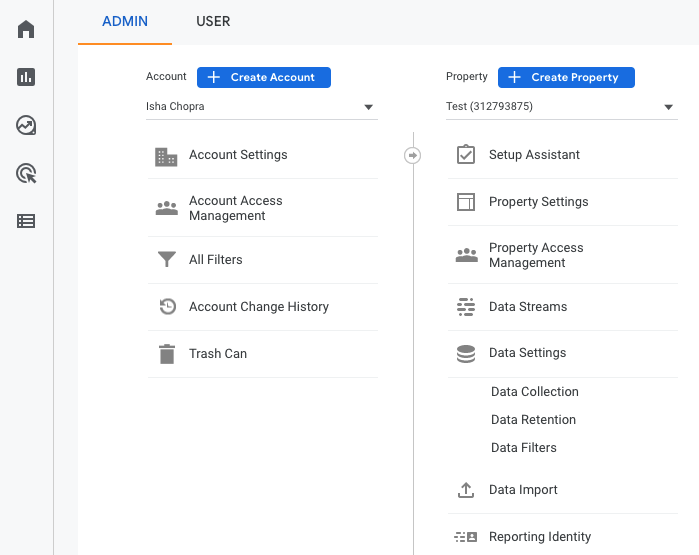
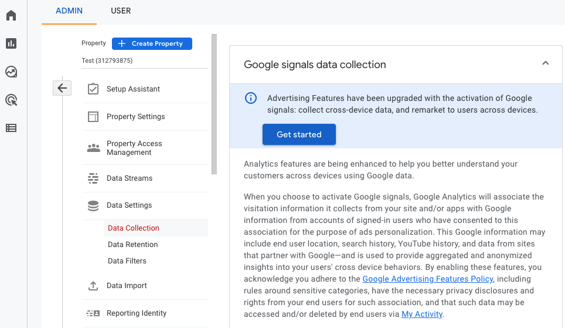
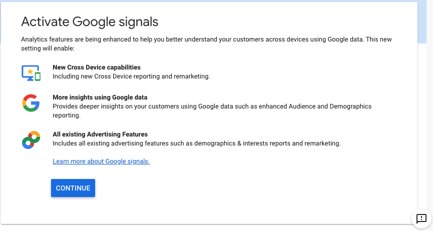
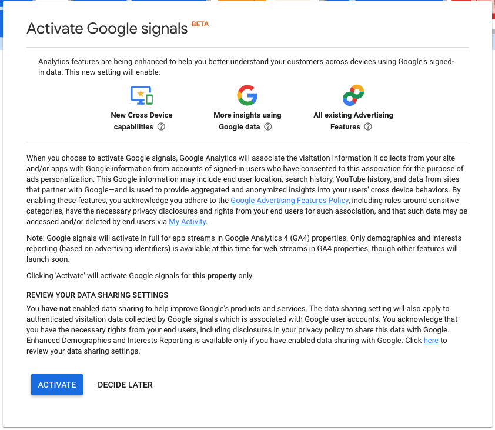

RudderStack lets you send your event data to Google Analytics 4 destination via device mode using the native web SDK. It supports the `gtag` way of tagging in websites in device mode. 

You need to select `gtag.js` as the **Client Type** and enable **Use device-mode to send events** in the RudderStack dashboard to send events via device mode. For more information on device mode settings in the RudderStack dashboard, refer to the <Link to="/destinations/streaming-destinations/google-analytics-4/setting-up-google-analytics-4-in-rudderstack/">Setting up Google Analytics 4</Link> guide.

<div class="infoBlock">
For more information on sending events via device mode, refer to the <Link to="/destinations/rudderstack-connection-modes/">RudderStack Connection Modes</Link> guide.
</div>

<div class="infoBlock">
Find the open source JavaScript SDK code for this destination in the <a href="https://github.com/rudderlabs/rudder-sdk-js/tree/production/src/integrations/GA4">GitHub repository</a>.
</div>

## Identify

The <Link to="/event-spec/standard-events/identify/">`identify`</Link> call lets you identify a visiting user and associate them to their actions. It also lets you record the traits about them like their name, email address, etc.

User-ID is an advanced feature that lets GA4 present a cross-device, cross-platform view of your customers' behavior. Google Analytics 4 uses `userId` and `deviceId` \(GA's `cid` value from Universal Analytics terminology\) to identify users.

A sample `identify` call is as shown:

```javascript
rudderanalytics.identify("1hKOmRA4el9Zt1WSfVJIVo4GRlm", {
  name: "Alex Keener",
  email: "alex@example.com",
})
```

In the above snippet, the `userId` will be set to `1hKOmRA4el9Zt1WSfVJIVo4GRlm` for Google Analytics and the name and email will be set as `user_properties`.

## Page
  
The <Link to="/event-spec/standard-events/page">`page`</Link> call lets you record your website's page views with any additional relevant information about the viewed page.

Google Analytics 4 `gtag` sends a `page_view` event to Google Analytics by default every-time it is loaded. You can also send `page_view` event to Google Analytics whenever you make an explicit `page()` call to RudderStack SDK.

RudderStack sends the following properties by default:

- `url` mapped to `page_location`
- `title` mapped to `page_title`
- `referrer` mapped to `page_referrer`

You can also make `page()` call with any custom and standard properties as shown below:

```javascript
rudderanalytics.page({
  path: "/test_browser.html",
  url: "http://example.com/test_browser.html?param1=true",
  title: "Page Load",
  search: "?param1=true",
  referrer: "referrer",
})
```

## Track

The <Link to="/event-spec/standard-events/track">`track`</Link> call lets you capture user events along with the properties associated with them.

A sample `track` call is as shown:

```javascript
rudderanalytics.track("Track me")
```

RudderStack SDK sends the track event name and any properties as custom properties to Google Analytics 4.

<div class="infoBlock">
RudderStack SDK flattens the properties that are nested and not standard Google Analytics 4 properties before sending them to Google Analytics.
</div>

<div class="infoBlock">
There are limits on the number of custom properties per event that can be sent to Google Analytics 4. The RudderStack SDK <strong>does not drop</strong> the payload based on these limits. If the events are don't show up in the debug view or in the Google Analytics dashboard reports, refer to <a href="https://support.google.com/analytics/answer/9267744?hl=en">Google support page</a> to learn more about the collection limits.
</div>

## Ecommerce events tracking

RudderStack supports ecommerce tracking for Google Analytics 4. Use the <Link to="/event-spec/ecommerce-events-spec/">Ecommerce Events Specification</Link> for sending events while instrumenting your site with the RudderStack SDK.

Below are some examples of the track event names that are passed to Google Analytics 4-specific ecommerce event name:

| RudderStack event name    | Google Analytics 4 event name |
| :------------------------ | :---------------------------- |
| Products Searched         | `search`                      |
| Product List Viewed       | `view_item_list`              |
| Promotion Viewed          | `view_promotion`              |
| Product Clicked           | `select_item`                 |
| Product Added To Wishlist | `add_to_wishlist`             |
| Product Added             | `add_to_cart`                 |
| Cart Shared               | `share`                       |
| Checkout Started          | `begin_checkout`              |
| Order Completed           | `purchase`                    |

<div class="infoBlock">
For each product in the order, there must be an <code class="inline-code">id</code> and <code class="inline-code">name</code> associated. More info on Google Analytics 4 ecommerce event and corresponding properties can be found <a href="https://developers.google.com/gtagjs/reference/ga4-events#view_item_list">here</a>.
</div>

## Hybrid mode

Hybrid mode sends your event data to Google Analytics 4 via both the native SDK (device mode) and the Google Analytics 4 Measurement Protocol (cloud mode). See <Link to="/destinations/streaming-destinations/google-analytics-4/setting-up-google-analytics-4-in-rudderstack#hybrid-mode">Hybrid mode</Link> to learn more.

## FAQ

### How can I enable Google Signals in GA4?

[Google Signals](https://support.google.com/analytics/answer/9445345?hl=en#zippy=%2Cin-this-article) helps you understand the interaction of users with your website across multiple devices and sessions. To enable Google Signals and capture user data, the following conditions must be met:
- A user must be signed in to their Google Account on the website or app.
- Ad Personalization must be enabled for their account.

<div class="infoBlock">
The Google Signals feature is available in the web <Link to="/destinations/rudderstack-connection-modes/#device-mode">device mode</Link> only.
</div>

To enable Google Signals in GA4 and reflect the collected user data in your reports, follow the steps below:

1. Log into your [Google Analytics dashboard](https://analytics.google.com/). 
2. Open the Admin panel by clicking on the gear icon at the bottom left.


3. Select the property for which you want to enable Google Signals. Then, go to **Data Settings** > **Data Collection**.
4. Click **Get Started** in the **Google signals data collection** section, as shown:


6. Click **Continue**.


7. Read the additional information and click **Activate**.


Google Signals is now enabled. You will be able to see the **Age**, **Gender**, and other relevant data in GA4 Demographics reports after 24 hours.
