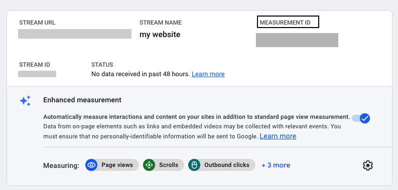
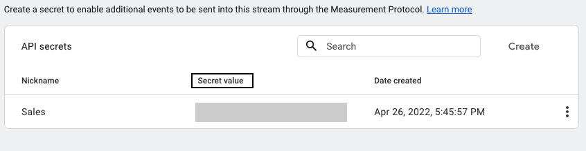
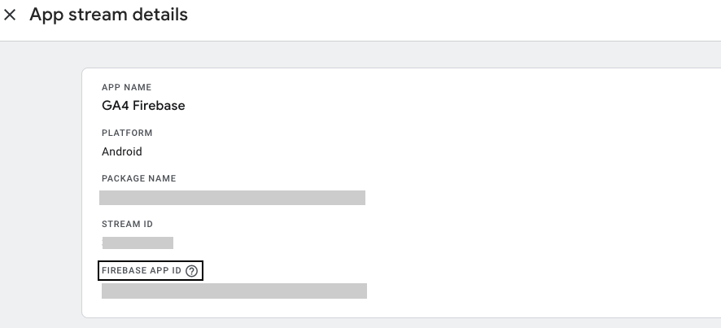

RudderStack supports sending event data to Google Analytics 4 via the following <a href="https://rudderstack.com/docs/rudderstack-cloud/rudderstack-connection-modes/">connection modes</a>:

| **Connection Mode** | **Web**           | **Mobile** | **Server** |
| :------------------ | :------------ | :----- | :----- |
| **Device Mode**     | **Supported** | **-**  | **-**  |
| **Cloud Mode**      | **Supported** | **Supported**  | **Supported**  |

In a web device mode integration, that is, using <Link to="/sources/event-streams/sdks/rudderstack-javascript-sdk">JavaScript SDK</Link> as a source, the Google Analytics 4 native SDK is loaded from <code class="inline-code">https://www.googletagmanager.com/</code> domain. Based on your website's content security policy, you might need to <Link to="/sources/event-streams/sdks/rudderstack-javascript-sdk/load-js-sdk/#allowlist-destination-domain">allowlist this domain</Link> to load the Google Analytics 4 SDK successfully.

Once you have confirmed that the source platform supports sending events to Google Analytics 4, follow these steps:

1. From your [RudderStack dashboard](https://app.rudderstack.com/), add the source. Then, from the list of destinations, select **Google Analytics 4**.
2. Assign a name to your destination and click **Continue**.

## Connection settings

To successfully configure Google Analytics 4 as a destination, configure the following settings:

- **API Secret**: This field is required only for cloud mode setup where you can enter the API Secret generated through the Google Analytics dashboard. It can be created in the Google Analytics dashboard under **Admin** > **Data Streams** > **Choose your stream** > **Measurement Protocol** > **Create**.

- **Client Type**: Select the client type as `gtag` or `Firebase` from the dropdown:
  - **`gtag`** - Supported for the cloud and device mode both. If you select `gtag`, enter the below:
    - **Measurement Id**: Enter the Measurement Id which is the identifier for a data stream. It can be found in the Google Analytics dashboard under **Admin** > **Data Streams** > **Choose your stream** > **Measurement ID**.
  - **`Firebase`** - Supported only for cloud mode. If you select `Firebase`, enter the below settings:
    - **Firebase App Id**: Enter the Firebase App ID which is the identifier for Firebase app. It can be found in the Firebase dashboard under **Project Settings** > **General**.
    

Refer to the <Link to="#faq">FAQ</Link> section for more information on how to obtain the API Secret, Measurement Id and Firebase App ID.

- **GA4 client_id Field Identifier**: This field is **only required** while <Link to="/destinations/streaming-destinations/google-analytics-4/google-analytics-4-cloud-mode/">sending events to GA4 in cloud mode</Link>. Enter the identifier which RudderStack should look for in the payload and map to the GA4 `client_id`. For more information on `client_id`, refer to the <Link to="/destinations/streaming-destinations/google-analytics-4/google-analytics-4-cloud-mode/#mapping-client_id">Mapping `client_id`</Link> section.
- **Enable debug mode**: In the device mode, enabling this setting lets you monitor the events in <a href="https://support.google.com/analytics/answer/7201382?hl=en#zippy=%2Cglobal-site-tag-websites">DebugView</a>. In the cloud mode, you can check the validation responses in the <Link to="/dashboard-guides/live-events/">Live Events</Link> tab. However, note that as per the <a href="https://developers.google.com/analytics/devguides/collection/protocol/ga4/validating-events?client_type=gtag">GA4 documentation</a>, any responses sent to the validation server will not show up in the reports.

### Identify 

The settings in this section are only applicable for the <Link to="/destinations/rudderstack-connection-modes/#cloud-mode"><strong>cloud mode</strong></Link>.

- **Enable Server Side Identify**: Enable this setting and configure the following options to make an <Link to="/event-spec/standard-events/identify/">`identify`</Link> call:
  - **Trait to differentiate between new or existing user**: Enter a trait key to determine a new or an existing user.
  - **Convert identify event to Login or Signup event**: Enable this setting to convert the `identify` event to a <Link to="https://developers.google.com/analytics/devguides/collection/ga4/reference/events#login">`login`</Link> event in case of an existing user or a <Link to="https://developers.google.com/analytics/devguides/collection/ga4/reference/events#sign_up">`sign_up`</Link> event in case of a new user.

  

  If <strong>Enable Server Side Identify</strong> is enabled in the dashboard, then this setting too <strong>must</strong> be enabled to send the <code class="inline-code">identify</code> call successfully.
  

  - **Trait key for the 'method' parameter in Login or Signup event**: Enter the trait key to pass the `method` parameter in the <Link to="https://developers.google.com/analytics/devguides/collection/ga4/reference/events#login">`login`</Link> or <Link to="https://developers.google.com/analytics/devguides/collection/ga4/reference/events#sign_up">`signup`</Link> event.
  - **Send 'generate_lead' event for 'identify' event**: Enable this setting to send a <Link to="https://developers.google.com/analytics/devguides/collection/ga4/reference/events#generate_lead">`generate_lead`</Link> event for a new user. 

  

  Note that the <code class="inline-code">generate_lead</code> event will only be fired for the new users and not for the existing ones.
  

  When enabled and it is a new user, you also need to enter the following details:
  - **Value - traits for lead generation**: Enter the value key to pass the `value` parameter for the `generate_lead` event. 
  - **Currency - traits for lead generation**: Enter the currency key to pass the `currency` parameter for the `generate_lead` event. 

  

  Refer to the <Link to="/destinations/streaming-destinations/google-analytics-4/google-analytics-4-cloud-mode/#identify"><code class="inline-code">identify</code></Link> call payload for more information on sending <code class="inline-code">identify</code> events to GA4 via cloud mode.
  

### Native SDK

The settings in this section are only applicable for the <Link to="/destinations/rudderstack-connection-modes/#device-mode"><strong>device mode</strong></Link>.

- **Block a Page View Event**: Enable this setting to disable sending `page_view` events on load. However, you can explicitly send a `page_view` event by calling the `page()` API.
- **Extend Page View Property**: Enable this setting to send the following properties along with any other custom property to the `page` call of the RudderStack SDK:
    - `url`
    - `search`
 

Google Analytics 4 has a limit on the number of unique properties per event name. The default <code class="inline-code">page_view</code> event supports the properties mentioned in the <a href="https://support.google.com/analytics/answer/9234069?hl=en&ref_topic=6317484">Automatically collected events in Google Analytics 4</a> guide.

**Send userId to GA**: This setting exhibits the following behavior:
  - If enabled, the user ID is set to the identified visitors and sent as explained in the [Cookies and user identification](https://developers.google.com/tag-platform/devguides/cookies#set_user_id) guide.
  - If disabled, `userId` is not sent and RudderStack only sends the user traits set as `user_properties` to Google Analytics. The user properties are set on the `gtag` client as explained in the [Set user properties](https://developers.google.com/analytics/devguides/collection/ga4/user-properties?technology=websites) guide.

### Client-side events filtering

This option is applicable only if you're sending events to Google Analytics 4 via web device mode. Refer to the <Link to="/sources/event-streams/sdks/event-filtering/">Client-side Event Filtering</Link> guide for more information on this feature.

### Web device mode settings

- **Use device mode to send events**: Enable this setting to send events via the <Link to="/destinations/rudderstack-connection-modes/#device-mode">device mode</Link>.
- **OneTrust Cookie Categories**: This setting lets you associate the <Link to="/sources/sdks/rudderstack-javascript-sdk/consent-managers/onetrust/">OneTrust</Link> cookie consent groups to Google Analytics 4.

## FAQ

### How do I obtain the Measurement Id?

1. Login to [Google Analytics](https://analytics.google.com/analytics/web/) dashboard.
2. Go to the **Admin** section in the left sidebar.
3. Select the relevant account and property.
4. Click **Data Streams** and select the stream to get the Measurement Id as shown:

### How do I obtain the API Secret?

1. Login to [Google Analytics](https://analytics.google.com/analytics/web/) dashboard.
2. Go to the **Admin** section in the left sidebar.
3. Select the relevant account and property.
4. Click **Data Streams** and select the stream.
5. Click **Measurement Protocol API secrets** to get the API Secret as shown:

### How do I obtain the Firebase App ID?

1. Login to [Google Analytics](https://analytics.google.com/analytics/web/) dashboard.
2. Go to the **Admin** section in the left sidebar.
3. Select the relevant account and property.
4. Click **Data Streams** and select the stream to get the **Firebase App Id** as shown:

