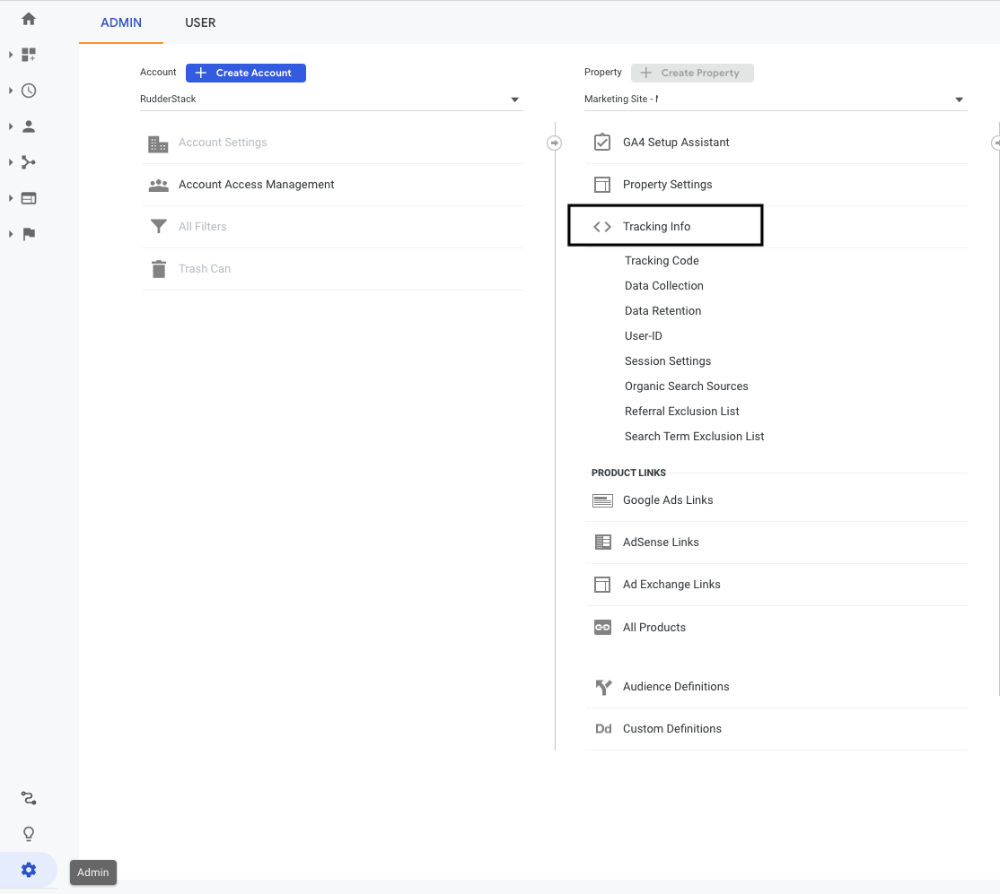

[Google Analytics](https://analytics.google.com/) is a popular analytics service that lets you track and report your website traffic across a variety of sources.

RudderStack supports Google Analytics as a destination and makes requests to its endpoints through the [Google Analytics Measurement Protocol](https://developers.google.com/analytics/devguides/collection/protocol/v1).

<div class="infoBlock">
Find the open source code for this destination in the <a href="https://github.com/rudderlabs/rudder-transformer/tree/master/v0/destinations/ga">GitHub repository</a>.
</div>

## Getting started

RudderStack supports sending event data to Google Analytics via the following <a href="https://rudderstack.com/docs/rudderstack-cloud/rudderstack-connection-modes/">connection modes</a>:

| **Connection Mode** | **Web**       | **Mobile**    | **Server**    |
| :------------------ | :------------ | :------------ | :------------ |
| **Device Mode**     | **Supported** | -             | -             |
| **Cloud Mode**      | **Supported** | **Supported** | **Supported** |

<div class="infoBlock">
In the web device mode integration, that is, using <Link to="/sources/event-streams/sdks/rudderstack-javascript-sdk">JavaScript SDK</Link> as a source, the Google Analytics native SDK is loaded from <code class="inline-code">https://www.google-analytics.com/</code> domain. Based on your website's content security policy, you might need to <Link to="/sources/event-streams/sdks/rudderstack-javascript-sdk/load-js-sdk/#allowlist-destination-domain">allowlist this domain</Link> to load the Google Analytics SDK successfully.
</div>

Once you have confirmed that the source platform supports sending events to Google Analytics, follow these steps:

1. From your [RudderStack dashboard](https://app.rudderstack.com), add the source. Then, from the list of destinations, select **Google Analytics**.
2. Assign a name to the destination and click **Continue**.

## Connection settings

To successfully set up Google Analytics as a destination, configure the following settings:

- **Tracking ID**: Enter the Google Analytics tracking ID from your Google Analytics dashboard. Refer to the <Link to="#faq">FAQ</Link> section for more information on obtaining the tracking ID.
- **Client-side Events Filtering**: This setting lets you specify which events should be blocked or allowed to flow through to Google Analytics. For more information on this setting, refer to the <Link to="/sources/sdks/event-filtering/">Client-side Events Filtering</Link> guide. 
- **Remarketing, Display Ads and Demographic Reports**: Enable this setting to tag visitors for the remarketing campaign. Refer to the [Enable Remarketing and Advertising Reporting Features](https://support.google.com/analytics/answer/2444872?hl=en#zippy=%2Cin-this-article) guide for more information. 
- **Enable Enhanced Link Attribution**: Enable this setting to retrieve the detailed report of links clicked on your website. Refer to the [Enhanced Link Attribution](https://support.google.com/analytics/answer/2444872?hl=en#zippy=%2Cin-this-article) guide for more information. 
- **Include the Querystring in Page Views**: Enable this setting to include the query string in your page views along with the URL to be sent to Google Analytics. For more information on this feature, refer to the <Link to="#site-search">Site search</Link> section. 
- **Custom Dimensions & Metrics**: Enter the event name, traits, or properties you want to map to the corresponding custom dimensions and metrics. Refer to the <Link to="#custom-dimensions">Custom dimensions</Link> section for more information. 
- **Property & Trait Mapping**: Enter the property you want to map to the Google Analytics content grouping. Refer to the <Link to="#content-groupings">Content groupings</Link> section for more information. 
- **Enable Server Side Identify**: Enable this setting to trigger the `identify` calls from the server side.
- **Server Side Identify Event Category**: Specify the event category of the `identify` call triggered from the server side. If you specify a category, it is sent as `ec`; otherwise, the default value is set to `All`.
- **Server Side Identify Event Action**: Specify the event action of the `identify` call triggered from the server side. If you specify an action, it is sent as `ea`; otherwise, the default value is set to `User Enriched`.
- **Disable Md5 encryption from Client ID**: Use this setting to determine how RudderStack should map the `client id`. For more information on this setting, refer to the <Link to="#how-rudderstack-takes-the-clientid">How RudderStack takes the `clientId`</Link> section.  
- **Anonymize IP Addresses**: Enable this setting to anonymize the IP address at the earliest possible stage of the collection network. Refer to the [IP Anonymization](https://support.google.com/analytics/answer/2763052?hl=en) guide for more information.
- **Enable Enhanced Ecommerce**: Enable this setting to derive detailed insights for e-commerce events. Refer to the <Link to="#enhanced-e-commerce">Enhanced e-commerce</Link> section for more information. 
- **Add the non-interaction flag to all events**: Enable this setting to consider all the event hits as non-interaction event hits. For more information on this feature, refer to the <Link to="#non-interaction-events">Non-Interaction events</Link> section. 
- **Send user-id to GA**: Enable this setting to set a user ID for the identified visitors before sending it to Google Analytics.
- **Use device-mode to send events**: Enable this setting to send events to Google Analytics via the web <Link to="/destinations/rudderstack-connection-modes/#device-mode">device mode</Link>.
- **Track Categorized Pages**: This setting is enabled by default and lets you track the pages having a category associated with them.
- **Track Named Pages**: This setting is enabled by default and lets you track only the pages having a name.
- **Sample Rate**: Enter the percentage of users that RudderStack should track. The default value is 100. 
- **Site Speed Sample Rate**: Enter the sample size for Site Speed data collection.  The default value is 1.
- **Reset dimensions on Page calls**: Specify the dimensions (set in the `page` call properties) that need to be reset and assigned a new value.
- **Set Custom Dimensions & Metrics to the Page**: This setting is enabled by default and passes the custom dimensions and metrics as properties for all the events on a given page. When disabled, RudderStack only passes the custom dimensions and metrics as part of the event payload with which they are explicitly associated.
- **Use Named Tracker**: Enable this setting to push events to the `rudderGATracker` Google Analytics tracker instead of the default tracker. For more information on trackers, refer to the <Link to="##named-tracker">Named tracker</Link> section. 
- **Cookie Domain Name**: Specify the domain name on which the `_ga` cookie should set on. The default value is set to `auto`. Refer to the [Cookies and User Identification](https://developers.google.com/analytics/devguides/collection/analyticsjs/domains) guide for more information.
- **Optimize Container ID**: Enter your Optimize container ID to integrate with the Google Analytics [Optimize plugin](https://support.google.com/optimize/answer/6262084#optimize-ga-plugin).

<div class="infoBlock">
If you specify the container ID and Optimize plugin is linked to your Google Analytics property, it will be enabled automatically the next time <code class="inline-code">analytics.js</code> is loaded. <strong>Note that this is applicable only if you are using Google Analytics in the web device mode</strong>.
</div>

- **Use Google AMP Client ID**: Enable this setting to uniquely identify users who engage with your content on AMP and non-AMP pages. Refer to the [Google Analytics session unification for AMP](https://support.google.com/analytics/answer/7486764?hl=en&ref_topic=7378717#zippy=%2Cin-this-article) guide for more information. 
- **OneTrust Cookie Categories**: If **Use device-mode to send events** is enabled, this setting lets you associate <Link to="/sources/sdks/rudderstack-javascript-sdk/consent-managers/onetrust/">OneTrust</Link> cookie consent groups to Google Analytics.

## Identify

Personally Identifiable Information (PII) cannot be sent to the Google Analytics reporting interface. Thus, nothing is passed to Google unless specifically directed.

Google Analytics' universal tracking allows you to set a user ID to the identified visitors if **Send User ID to GA** is enabled in the destination settings by the user. Also, the `userid` property must be enabled in Google Analytics, and user-id view needs to be created.

A sample `identify` call is as shown:

```javascript
rudderanalytics.identify("user123", {
  name: "Alex Keener",
  email: "alex@example.com"
});
```

In the above snippet, the `userid` will be set to `user123` for Google Analytics, but the name and email will not be shared with Google. Traits along with custom dimensions, metrics, and content groupings can be set in the SDK.

For server-side, Google Analytics needs a customer identifier for each call to be made. RudderStack passes an internally generated ID as the `cid` parameter for Google Analytics to understand every unique user. Traits are not mapped to custom dimensions, metrics and content grouping yet from our side in server-side.

You can call `identify` once in order to set the `userId` and `user traits`for all subsequent calls that you make from our SDK for a particular user. If `userId` is not set, RudderStack sends a generated ID \(called `anonymousId`\) from its SDKs with every call made to the RudderStack servers. This `id` is used as the `cid` in Google Analytics. And if **Send User ID to GA** setting is enabled, the user ID property will be set as `uid` and will be sent as well.

## Track

The <Link to="/event-spec/standard-events/track">`track`</Link> method lets you capture user events along with the properties associated with them.

A sample `track` call is as shown:

```javascript
rudderanalytics.track("Track me")
```

This will send the following `Event Category` and `Event Action` :

| Property       | Value      |
| :------------- | :--------- |
| Event Category | All        |
| Event Action   | `Track me` |

<div class="infoBlock">
RudderStack does not populate the <code class="inline-code">Event Category</code> field by default. To do so, you can use the <Link to="/features/transformations/">transformations</Link> feature to populate the event payload with a <code class="inline-code">category</code> property.
</div>

A more verbose `track` call is shown:

```javascript
rudderanalytics.track("Track me", {
  category: "category",
  label: "label",
  value: "value"
});
```

The following properties are sent to the Google Analytics event:

| Property       | Value      |
| :------------- | :--------- |
| Event Category | `category` |
| Event Action   | `Track me` |
| Event Label    | `label`    |
| Event Value    | `value`    |

## Page

RudderStack sends a `pageview` hit to Google Analytics whenever you make a <Link to="/event-spec/standard-events/page">`page`</Link> call using the SDK.

A sample page call is shown below:

```javascript
rudderanalytics.page({
  path: "path",
  url: "url",
  title: "title",
  search: "search",
  referrer: "referrer"
});
```

<div class="warningBlock">
It is important to send a <code class="inline-code">path</code> or <code class="inline-code">url</code> property with page call, otherwise Google Analytics will reject the event.
</div>

There are other variants of the `page()` call that you can send, which involve giving your page's `name` and `category` :

```javascript
// Passing page category and name
rudderanalytics.page("category", "name", {
  path: "path",
  url: "url",
  title: "title",
  search: "search",
  referrer: "referrer",
})

// "home" is the name of the page.
rudderanalytics.page("home", {
  path: "path",
  url: "url",
  title: "title",
  search: "search",
  referrer: "referrer",
})
```

<div class="infoBlock">
For a server-side page call, the application name is passed from RudderStack's <code class="inline-code">context.app.name</code> as <code class="inline-code">an</code>, otherwise the event will be rejected by GA.
If the <strong>Include the Querystring in Page Views</strong> setting is enabled in the RudderStack dashboard, then the entire URL with the querystring will be sent as <code class="inline-code">dp</code> (Document Path). Otherwise, the querystring will be removed from the URL.
</div>

#### Page title in device mode

Depending on the presence of `message.properties.category` and `message.name` properties, the page title is set as one of the following in the device mode: 

| `message.properties.category`  | `message.name`        | Page title|
| :--------- | :------------ | :------------ |
| Absent  | Absent     |  `pageTitle` = `message.properties.title`|
| Absent  | Present     |  `pageTitle` = `message.name`|
| Present  | Absent     |  `pageTitle` = `message.properties.category`|
| Present  | Present     |  `pageTitle` = `${rudderElement.message.properties.category} ${rudderElement.message.name}`|

#### Page title in cloud mode

The page title is set as the `properties.title` or ` context.page.title` in the cloud mode.

## E-Commerce

RudderStack supports e-commerce tracking for Google Analytics. The required steps are:

- For every order completed, `orderId` is required. For each product in the order, there must be an `id` and `name`. Other properties are optional.
- The e-commerce tracking should be enabled otherwise it will not be shown in the reports.

### Enhanced e-commerce

[Enhanced e-commerce](https://developers.google.com/analytics/devguides/collection/analyticsjs/enhanced-ecommerce) allows you to derive insights on the e-commerce events by combining impression data, product data, promotion data and action data. This is a necessity for product-scoped custom dimensions.

To use this feature, the **Enable Enhanced Ecommerce** setting must be enabled in the RudderStack dashboard, Google Analytics, and should follow RudderStack's <Link to="/event-spec/ecommerce-events-spec/">E-commerce Events Specification</Link>.

The required steps are:
- Similar to e-commerce tracking, for every order completed the `orderId` is required. For each product, `id` and `name`are required.
- The product ID or name must be passed for all the events that has the product details. `product_id` will check if `properties.product_id` is present or not. Else `properties.sku` will be picked.
- `order_id` is required for refunded orders.

#### Measuring Checkout steps

The Checkout steps feature is a key difference between the regular e-commerce and Enhanced e-commerce tracking, and a major feature of the latter.

You can configure the checkout funnel in the Google Analytics admin interface as shown below:


The checkout flow can be implemented by calling `track` with `checkout step viewed` and `checkout step completed` for the steps you have added in Google Analytics.

An example of this is as shown:

```javascript
rudderanalytics.track('checkout step viewed', {
            currency: 'CAD',
            step: 1
          });
rudderanalytics.track('checkout step completed', {
            currency: 'CAD',
            step: 1,
            //if this is the shipping step
            shippingMethod: 'FedEx',
            //if this is the payment step
            paymentMethod: 'Visa'
          });
```

#### Measuring promotions

```javascript
rudderanalytics.track('promotion viewed', {
            currency: 'CAD',
            promotion_id: 'PROMO_1234',
            name: 'Winter Sale',
            creative: 'winter_banner2',
            position: 'banner_slot1',
            testDimension: true,
            testMetric: true
          });
rudderanalytics.track('promotion clicked', {
            currency: 'CAD',
            promotion_id: 'PROMO_1234',
            name: 'winter Sale',
            creative: 'winter_banner2',
            position: 'banner_slot1',
            testDimension: true,
            testMetric: true
          });
```

#### Coupons

You can add the `coupon` property if you want to send coupon data to **`order completed`**.

```javascript
rudderanalytics.track('order completed', {
            orderId: 'abc55',
            total: 999.9,
            shipping: 23.99,
            tax: 25.99,
            currency: 'CAD',
            coupon: 'coupon',
            affiliation: 'affiliation',
            testDimension: true,
            testMetric: true,
            products: [
              {
                quantity: 1,
                price: 24.75,
                name: 'rudder product',
                category: 'cat 1',
                sku: 'p-298',
                productDimension: 'testing'
              },
              {
                quantity: 3,
                price: 24.75,
                name: 'other product',
                category: 'cat 2',
                sku: 'p-299',
                currency: 'EUR',
                productDimension: 'testing'
              }
            ]
          });
```

#### Measuring product impressions

Information related to impressions of the users who have viewed or filtered through the product can be collected through Enhanced e-commerce. The product impressions are mapped to **`product list viewed`** and **`product list filtered`** events.

```javascript
rudderanalytics.track('product list filtered', {
            category: 'cat 1',
            list_id: '1234',
            filters: [
              {
                type: 'department',
                value: 'beauty'
              },
              {
                type: 'price',
                value: 'under'
              }
            ],
            sorts: [
              {
                type: 'price',
                value: 'desc'
              }
            ],
            products: [
              {
                product_id: '507f1f77bcf86cd799439011',
                productDimension: 'My Product Dimension',
                productMetric: 'My Product Metric'
              }
            ],
            testDimension: true,
            testMetric: true
          });
rudderanalytics.track('Product List Viewed', {
            category: 'cat 1',
            list_id: '1234',
            products: [
              {
                product_id: '507f1f77bcf86cd799439011',
                productDimension: 'My Product Dimension1',
                productMetric: 'My Product Metric1',
                position: 10
              },
              {
                product_id: '507f1f77bcf86cd799439012',
                productDimension: 'My Product Dimension2',
                productMetric: 'My Product Metric2',
                position: 12
              },
              {
                product_id: '507f1f77bcf86cd799439015',
                productDimension: 'My Product Dimension3',
                productMetric: 'My Product Metric3',
                position: 8
              }
            ]
          });
```

#### Refunds

For full refunds :

```javascript
 rudderanalytics.track('order refunded', {
            order_id: 'abc55',
            testDimension: true,
            testMetric: true
          });
```

For partial refunds:

```javascript
rudderanalytics.track('order refunded', {
            order_id: 'abc55',
            products: [
              {
                quantity: 1,
                sku: 'p-1'
              },
              {
                quantity: 2,
                sku: 'p-2'
              }
            ],
            testDimension: true,
            testMetric: true
          });
```

## Additional features

There are some other important features associated with Google Analytics integration, as described in the sections below:

### Passing cookies from Universal Analytics

`clientId` (cid) is used to keep a track of the unique visitors to your website. The Google Analytics universal cookie looks like the following:

```
_ga=GA1.2.476220681.159039102;
```

The `clientId` here is `476220681.159039102`, which can be cross-checked by running the following snippet:

```
ga(function (tracker) {
    var clientId = tracker.get('clientId');
    console.log('My GA universal client ID is: ' + clientId);
});
```

For server-side calls, if `clientId` is passed manually by sending `anonymousId` and if the **Send user-id to GA** setting is enabled in the RudderStack dashboard along with `cid`, then RudderStack passes the `userId` as the `uid`.

#### How RudderStack takes the `clientId`

- If **Disable Md5 encryption from Client ID** dashboard setting is enabled, RudderStack takes the `clientId` in the following priority order:

  1. From the `integrations` object while initializing the SDK, as shown:

  ```javascript
  "integrations": {
    "All": true,
    "Google Analytics": {
      "clientId": "clientId"
    }
  },
  ```

  2. From `gaExternalId` by setting it as the `clientId`, if specified in the payload.

  ```json
   "externalId": [{
   "id": "externalClientId",
   "type": "gaExternalId"
  }]
  ```

  3. From `traits.cid`.

  4. From `anonymousId`. If `anonymousId` is not present, it is set as **undefined.**

- If **Disable Md5 encryption from Client ID** dashboard setting is disabled and the `integrations` object, `externalId`, `traits.cid`, and `anonymousId` are absent, RudderStack passes the `userId` as the `clientId` in the MD5-hashed format.


### User agent

On the server-side, `user_agent` is mapped from:
-  `message.traits.ua`: For `identify` call
-  `context.userAgent`: For `track` and `page` calls

### Visitor geo location

On the client-side tracking, the IP address of the HTTP request is sent automatically to determine the location of the visitor. However, on the server-side, the visitor's IP has to be included in the `track` call.

### UTM parameters

The UTM parameters need to be passed manually to the server.

UTM parameters are passed in the context object in `context.campaign`. `campaign.name` and `campaign.mediums` must be sent together to show up in the report. Also, `campaign.term` and `campaign.content` are optional.

For `identify` call, you can also pass the UTM parameters via `message.traits` object.

### Measurement protocol parameters

You can also send data to Google Analytics using the measurement protocol. It provides parameters which are automatically collected by the device mode Google Universal Analytics tracker. You can collect the value of the parameter as a RudderStack trait or property when sending server-side events to Universal Analytics.

RudderStack supports the following measurement protocol parameters:

| Parameters       | Mapping value    |
| :------------- | :--------- |
| [`sr`](https://developers.google.com/analytics/devguides/collection/protocol/v1/parameters#sr) | `context.screen.width x context.screen.height` |
| [`vp`](https://developers.google.com/analytics/devguides/collection/protocol/v1/parameters#vp)   | `context.screen.innerWidth x context.screen.innerHeight` |
| [`ci`](https://developers.google.com/analytics/devguides/collection/protocol/v1/parameters#ci)   | `context.campaign.campaignId`    |
| [`gclid`](https://developers.google.com/analytics/devguides/collection/protocol/v1/parameters#gclid)   | from externalID  `googleAdsId`   |
| [`dclid`](https://developers.google.com/analytics/devguides/collection/protocol/v1/parameters#dclid)    | from externalID `googleDisplayAdsId` |

The sample code below shows how to send `gclid` and `dclid` using `externalID`:

```javascript
"externalId": [{
    "type": "googleAdsId",
    "id": "gclid_value"
  },
  {
    "type": "googleDisplayAdsId",
    "id": "dclid_value"
  }
]
```

### Custom dimensions

You can configure the [custom dimensions](https://support.google.com/analytics/answer/10075209?hl=en) in the [Admin](https://support.google.com/analytics/answer/6132368?hl=en) page in Google Analytics.

There are multiple scopes for custom dimensions, such as `hits`, `session`, `user`, and `products` (if **Enhanced e-commerce** setting is enabled). Once these are set up in Google Analytics, the traits and properties can be mapped to the custom dimensions in the RudderStack dashboard.

A custom dimension should be set as `dimension{index}`. For example, `dimension1` is mapped to the `first_name` when the user sets the dimension in Google Analytics settings, as shown below. Similarly, you can set up different metrics.


An `identify` call with custom dimensions is recorded after the next `track` or `page` call.

```javascript
rudderanalytics.identify({
  Gender: 'Female'
});

rudderanalytics.track('Viewed History');
```

### Non-Interaction events

The non-interaction parameter in the events lets you specify how to determine the bounce rate for pages on your site that also include event measurement. Refer to the [Non-Interaction Events](https://support.google.com/analytics/answer/1033068#NonInteractionEvents&zippy=%2Cin-this-article) guide for more information.

If the non-interaction setting is enabled in the RudderStack dashboard, the `nonInteraction` value is set to `1`. 

```javascript
{
  "action": "track",
  "event": "Track Page",
  "properties": {
    "nonInteraction": 1
  }
}
```

In Google Analytics, some events can be tagged as non-interaction events. On the server side, it is set in `ni`.

### Named tracker

If you enable the **Named Tracker** setting in RudderStack dashboard, RudderStack pushes the events to a Google Analytics tracker named `rudderGATracker` instead of the default tracker. Refer to the [Creating Trackers](https://developers.google.com/analytics/devguides/collection/analyticsjs/creating-trackers) guide for more information on creating trackers.

If disabled, a default tracker is set with the name `t0`.

#### Multiple trackers

A second tracker can be set in the `ready` callback function of the RudderStack SDK. An example of sending events to Google Analytics with another tracking id:

```javascript
// without any tracker name
window.rudderanalytics.ready(() => {
  console.log("we are all set!!!")
  window.ga("create", "UA-XXXXXXX-1", "auto")
  window.ga("send", "pageview")
})

// with a tracker name
window.rudderanalytics.ready(() => {
  console.log("we are all set!!!")
  window.ga("create", "UA-XXXXXXX-1", "auto", { name: "newTracker" })
  window.ga("newTracker.send", "pageview")
})
```

### Cross-domain tracking

You can perform the cross-domain tracking by following any of the below:

- Tracking visitors with `userid`: If the **Send user-id to GA** dashboard setting is enabled, it will be sent to identify the user. However, this only works for the identified users. Anonymous visitor sessions are not maintained.
- Tracking Anonymous Visitors: `allowLinker` is enabled automatically by RudderStack as Google Analytics provides an auto-linking plugin that allows you to track cookies and anonymous visitors when moving from one page to the other.

### Ignored referrers

For Universal profiles, this can be edited in Google Analytics directly.

### Site search

You can enable the **Include the Querystring in page views** setting in the RudderStack dashboard to add the search term used by a user to your site's URL.

Also, you need to enable the **Site search Tracking** in your Google Analytics account and enter the query parameter. If the query is `abc.com/s=xyz`, the setting should be as follows:


### Content groupings

You can set the [content grouping](https://support.google.com/analytics/answer/2853423?hl=en) mappings in the RudderStack dashboard and Google Analytics. The below image shows the content grouping in Google Analytics:

<span class="imageTitle">Content Grouping Settings in Google Analytics</span>

When you send a `page` call with custom properties, RudderStack uses the property value as the value of the specified content grouping.

## FAQ

#### Where can I find the Google Analytics tracking ID?

To find your Google Analytics tracking ID, follow these steps:

1. In your Google Analytics dashboard, click the **Admin** tab in the bottom left corner and go to **Tracking Info**.



2. Click **Tracking Code** to get your Google Analytics tracking ID, as shown:


#### What are custom metrics and custom dimensions?

**Custom metrics** and **custom dimensions** are fields that allow you to track custom properties associated with your events using RudderStack.

Metrics is for event properties having numeric data type while dimensions is for event properties having string data type. Both are used to track custom data properties in Google Analytics.

Please refer to the [Getting Started](#getting-started) section above in this document to know how to specify these fields on the RudderStack platform.

#### My website uses HTTPS. Do I need to change any settings for accurate Google Analytics tracking?

Yes. In the **Property Setup**, please change the website URL from HTTP \(default\) to HTTPS as shown:


#### Can I view real-time reports of my event data?

Yes, you can. Please check the Real-time reports in Google Analytics. A sample dashboard is as shown:


#### How do I view the already processed events for a particular day?

Please adjust the Google Analytics' default reporting time frame from a month ago to **the required date**, in order to view the processed events of that day.


#### Why are my page views in Google Analytics different when sent from device mode as against the cloud mode?

There could be 2 reasons for this:

- There can be ad blockers enabled in the user's browser while visiting your site. This blocks the Google Analytics requests from being sent directly from the browser.
- For the cloud mode, RudderStack is not blocked by ad blockers presently. If the events are sent to Google Analytics via the cloud mode, the actual number of events intended to be sent to Google Analytics are forwarded by the RudderStack server. So, the number of requests from the native mode or device mode is expected to be lower than cloud mode.

The RudderStack JavaScript SDK provides a way of detecting how many page view requests are potentially being blocked by the ad blockers throughout your site pages. Please check the section on <Link to="/sources/event-streams/sdks/rudderstack-javascript-sdk/detecting-adblocked-pages/">Detecting Ad-blocked Pages</Link> for more information.


