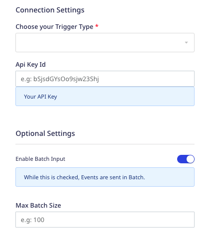

[Google Cloud Functions](https://cloud.google.com/functions) is a Functions-as-a-Service (FaaS) product that lets you run your code in the cloud without any servers or containers.

RudderStack supports Google Cloud Functions as a destination where you can send your event data seamlessly.

## Getting started

Before configuring Google Cloud Functions as a destination in RudderStack, verify if the source platform is supported by Google Cloud Functions by referring to the table below:

| **Connection Mode** | **Web**       | **Mobile**    | **Server**    |
| :------------------ | :------------ | :------------ | :------------ |
| **Device mode**     |  -             | -             | -             |
| **Cloud mode**      |  **Supported** | **Supported** |  **Supported** |

To know more about the difference between cloud mode and device mode in RudderStack, refer to the <Link to="/destinations/rudderstack-connection-modes/">RudderStack Connection Modes</Link> guide.

Once you have confirmed that the source platform supports sending events to Google Cloud Functions, follow these steps:

1. From your [RudderStack dashboard](https://app.rudderstack.com/), add the source. Then, from the list of destinations, select **Google Cloud Functions**.
2. Assign a name to the destination and click **Continue**.

## Connection settings

To successfully configure Google Cloud Functions as a destination, you need to configure the following settings:

- **Choose your Trigger Type**: From the dropdown, select **HTTP** or **HTTPS** depending on the trigger type configured for your cloud function.

You can set the trigger type while configuring your cloud function. For more information, refer to the <Link to="#faq">FAQ</Link> section below.

- **Gcloud Authorization**: If you have selected **HTTPS** as your trigger type, enter your <a href="https://cloud.google.com/functions/docs/securing/authenticating#authenticating_developer_testing">Google Cloud Authorization Token</a>.
- **URL**: Enter the URL obtained in the **Trigger** field during the cloud function setup.

For more information on obtaining the URL, refer to the <Link to="#how-do-i-create-a-google-cloud-function">FAQ</Link> below.

- **API Key ID**: Enter your API key ID. Refer to the <a href="https://cloud.google.com/docs/authentication/api-keys">Google Cloud documentation</a> for more information on creating and using the API key.

The API key ID is a string required by the cloud function to identify a request. RudderStack injects this key in the <code class="inline-code">ApiKey</code> header in case of both the <strong>HTTP</strong> and <strong>HTTPS</strong> trigger types.

- **Enable Batch Input**: Enable this setting to pass a batch input (array of events) to your cloud function.
- **Max Batch Size**: If **Enable Batch Input** setting is enabled, specify the maximum batch size in this field.

## Supported events

Google Cloud Functions accepts <Link to="/event-spec/standard-events/identify/">`identify`</Link>, <Link to="/event-spec/standard-events/track/">`track`</Link>, <Link to="/event-spec/standard-events/page/">`page`</Link>, <Link to="/event-spec/standard-events/group/">`group`</Link>, and <Link to="/event-spec/standard-events/alias/">`alias`</Link> events.

This destination accepts raw event data similar to a webhook. RudderStack sends the entire event payload to Google Cloud Functions as is, without any transformation or modification. 

## FAQ

### How do I create a Google Cloud Function?

To create a Google Cloud Function, follow these steps:

1. Log into your [Cloud Functions account](https://cloud.google.com/functions) and click **VIEW CONSOLE**.
2. Select your project.
3. Then, click **CREATE FUNCTION**.
4. Enter a **Function name** and select the **Region** from the dropdown.

Verify that your cloud function name is valid.

5. In the **Trigger** field, select **HTTP** or **HTTPS**, depending on your use-case.
6. In the **Runtime, build and connections settings**, specify the memory allocated for the cloud function in the **Memory allocated** field.
7. Configure the rest of the cloud function settings as per your requirement and click **Next**.

8. Add the function code and the language in the **Runtime** field.
9. Enter the function name as defined in your code in the **Entry point** field.
10. Click **Deploy** to save your settings and create the Cloud Function.
11. In the **TRIGGER** tab, copy the trigger URL - this is required to set up Google Cloud Functions as a destination in RudderStack.

