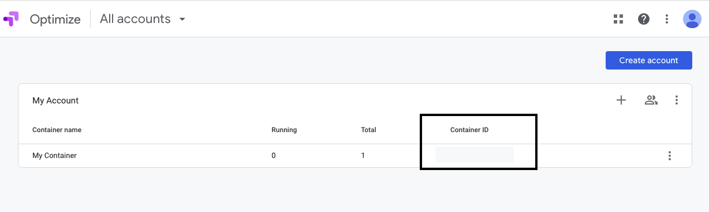
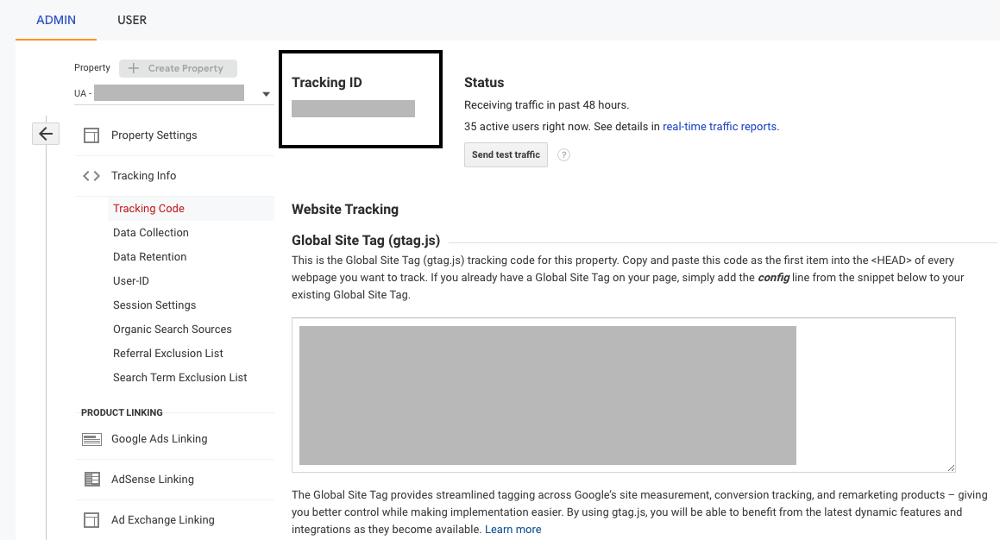

[**Google Optimize**](https://marketingplatform.google.com/about/optimize/) is Google's free website optimization tool that lets you run different website tests to tailor personalized user experiences and increase your conversion rate.

RudderStack supports Google Optimize as a destination to which you can seamlessly send your website data for efficient A/B testing.

 
Once you add Google Optimize as a destination in RudderStack, RudderStack loads the <a href="https://support.google.com/optimize/answer/7513085">Optimize snippet</a> on your website. Then, it loads the Google Analytics snippet(if not already present). This snippet natively measures all the Optimize experiments and then sends the data to Optimize for creating the reports.

## Getting started

RudderStack supports sending event data to Google Optimize via the following <a href="https://rudderstack.com/docs/rudderstack-cloud/rudderstack-connection-modes/">connection modes</a>:

| Connection Mode     | Web           | Mobile                 | Server        |
| :------------------ | :------------ | :--------------- | :-------------|
| **Device mode**     | **Supported**                        | -                      | -             |
| **Cloud mode**      | -                   | -                           | - |

In the web device mode integration, that is, using <Link to="/sources/event-streams/sdks/rudderstack-javascript-sdk">JavaScript SDK</Link> as a source, the Google Optimize native SDK is loaded from <code class="inline-code">https://www.googleoptimize.com/</code> domain. Based on your website's content security policy, you might need to <Link to="/sources/event-streams/sdks/rudderstack-javascript-sdk/load-js-sdk/#allowlist-destination-domain">allowlist this domain</Link> to load the Google Optimize SDK successfully.

Once you have confirmed that your source platform supports sending events to Google Optimize, follow these steps:

* From your [**RudderStack dashboard**](https://app.rudderstack.com/), add the source. From the list of destinations, select **Google Optimize**.
* Assign a name to the destination and click on **Next**. You should then see the following screen:

### Connection settings

The connection settings required to configure Google Optimize as a destination in RudderStack are listed below:

* **Load Google Analytics**: Enable this setting **only if** Google Analytics is not installed on your website already. 

Disable this setting if you have already configured <Link to="/destinations/streaming-destinations/google-analytics-4/">Google Analytics 4</Link> as a destination in RudderStack, or already installed the <a href="https://support.google.com/optimize/answer/9183119#zippy=%2Cexample-global-site-tag-with-google-analytics">global site tag</a> on your website.

* **Tracking ID**: If you have enabled the **Load Google Analytics** option, enter the corresponding tracking ID here.

For more information on finding the Google Analytics tracking ID, refer to the <a href="#faqs">FAQs</a> section below.

* **Container ID**: Enter your Google Optimize container ID here. 

 
You can find the Container ID by going to the <strong>User Settings</strong> option in your <a href="https://optimize.google.com/optimize/home/#/accounts">Google Optimize dashboard</a>.

* **Async mode**: Enable this setting to use the asynchronous version of Google Optimize.

 
We recommend enabling this setting if you want your pages to load faster and if your target visitors are likely to be on slow connections (3G or slower). However, for experimentation purposes, this setting should be <strong>disabled</strong>.

 
Refer to this <a href="https://support.google.com/optimize/answer/7513085?hl=en&ref_topic=6197443">Optimize support page</a> to know more about the differences between the synchronous and asynchronous versions of Google Optimize.

* **Anti-flicker snippet**: Enable this setting to install the anti-flicker snippet. 

 
Enabling this setting can impact page performance. Refer to this <a href="https://support.google.com/optimize/answer/7100284">support page</a> for more information on the anti-flicker snippet.

* As this destination supports sending events only via the web device mode, the **Use device mode to send events** option will be always enabled.

Finally, click on **Next** to complete the setup. Google Optimize will now be enabled as a destination in RudderStack.

## FAQs

### Where do I get the Google Analytics tracking ID?

To get the Google Analytics tracking ID, follow these steps:

1. Go to the **Admin** section of your [**Google Analytics account**](https://analytics.google.com/analytics/web/#/) in the bottom left corner.
2. Then, select an account in the **Account** column, followed by a property in the **Property** column.
3. Under **Property**, click on **Tracking Info** - **Tracking Code**. Your tracking ID will be displayed at the top of the resulting page.

### How do I link Google Optimize with Google Analytics?

To link your Google Optimize container to a Google Analytics property or view, refer to this [**support page**](https://support.google.com/optimize/answer/7008374?hl=en&ref_topic=7310368).

