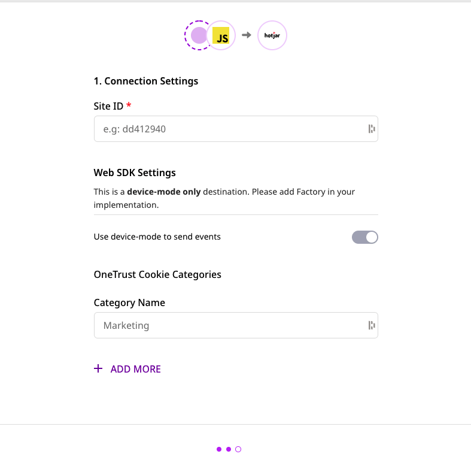

[**Hotjar**](https://www.hotjar.com/) is a popular behavior analytics platform, suitable for marketing teams and product managers to better understand and improve their product. It allows them to understand the behavior of their website's visitors through heat maps, surveys, and conversion funnels.

RudderStack helps you integrate your website with Hotjar to auto-track your user data.

## Getting started

RudderStack supports sending event data to Hotjar via the following <a href="https://rudderstack.com/docs/rudderstack-cloud/rudderstack-connection-modes/">connection modes</a>:

| **Connection Mode** | **Web**       | **Mobile** | **Server** |
| :------------------ | :------------ | :--------- | :--------- |
| **Device mode**     | **Supported** | -          | -          |
| **Cloud mode**      | -             | -          | -          |

<div class="infoBlock">
In a web device mode integration, that is, using <Link to="/sources/event-streams/sdks/rudderstack-javascript-sdk">JavaScript SDK</Link> as a source, the Hotjar native SDK is loaded from <code class="inline-code">https://static.hotjar.com/</code> domain. Based on your website's content security policy, you might need to <Link to="/sources/event-streams/sdks/rudderstack-javascript-sdk/load-js-sdk/#allowlist-destination-domain">allowlist this domain</Link> to load the Hotjar SDK successfully.
</div>

Once you have confirmed that Hotjar supports the source, perform the steps below:

- From your [**RudderStack dashboard**](https://app.rudderstack.com/), add the source. Then, select **Hotjar** from the list of destinations.
- Assign a name to your destination and click **Next**. You should see the following screen:



### Connection settings

To successfully configure Hotjar as a destination in RudderStack, enter the following connection settings:

- **Site ID**: Enter your Hotjar site ID. You can get your site ID by logging into your Hotjar account and navigating to **Settings** > **Sites & Organizations**.

Finally, click **Next** to complete the configuration. Hotjar will now be added and enabled as a destination in RudderStack.

## Track

The `track` call leverages Hotjar's [**Events API**](https://help.hotjar.com/hc/en-us/articles/4405109971095) to track specific user actions.

A sample `track` call is as shown below:

```javascript
rudderanalytics.track("custom_event");
```

<div class="infoBlock">
To use the Hotjar Events API, you must be on Hotjar's Plus, Business, or Scale plans.
</div>

## Identify

The `identify` call lets you pass your user data to Hotjar, sending them as [**User Attributes**](https://help.hotjar.com/hc/en-us/articles/4402892526487-What-are-User-Attributes-).

<div class="warningBlock">

Before you start making `identify` calls, make sure that <a href="https://insights.hotjar.com/settings/user-attributes">User Attributes</a> are enabled in your Hotjar dashboard for each site. Refer to this <a href="https://help.hotjar.com/hc/en-us/articles/360033640653-Identify-API-Reference#making_calls_to_identify">Hotjar support page</a> for more information on enabling and disabling User Attributes.
</div>

A sample `identify` call is shown below:

```javascript
rudderanalytics.identify("userId", {
  total_spend: 500
});
```


