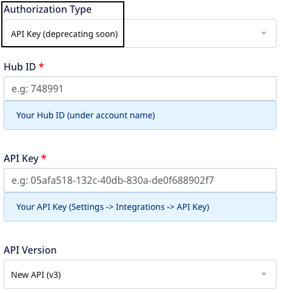

[HubSpot](https://www.hubspot.com/) is a leading marketing and sales platform that helps you track leads as well as inbound marketing and sales.

RudderStack supports HubSpot as a destination where you can seamlessly send your event data.

<div class="infoBlock">
Find the open source transformer code for this destination in the <a href="https://github.com/rudderlabs/rudder-transformer/tree/master/v0/destinations/hs">GitHub repository</a>.
</div>


## Getting started

Before configuring HubSpot as a destination in RudderStack, verify if the source platform is supported by HubSpot by referring to the table below:

| **Connection Mode** | **Web**       | **Mobile**    | **Server**    |
| :------------------ | :------------ | :------------ | :------------ |
| **Device mode**     | -             | -             | -             |
| **Cloud mode**      | **Supported** | **Supported** | **Supported** |

<div class="infoBlock">
To know more about the difference between cloud mode and device mode in RudderStack, refer to the <Link to="/destinations/rudderstack-connection-modes/">RudderStack Connection Modes</Link> guide.
</div>

Once you have confirmed that the source platform supports sending events to HubSpot, follow these steps:

1. From your [RudderStack dashboard](https://app.rudderstack.com/), add the source. Then, from the list of destinations, select **HubSpot**.
2. Assign a name to the destination and click on **Continue**.

## Connection settings

To successfully configure HubSpot as a destination using the <Link to="https://developers.hubspot.com/docs/api/overview">new API</Link>,  you can choose any of the two authorization types explained below:

#### Private Apps authorization type

The **Private Apps** authorization type enables you to use HubSpot's APIs to access specific data from your HubSpot account.


- **Access Token**: Enter your HubSpot access token from the **Private Apps** section in the HubSpot dashboard.

<div class="infoBlock">
Refer to the <Link to="#faq">FAQ</Link> section for more information on getting the HubSpot access token.
</div>

- **API Version**: Select **New API (v3)** from the dropdown.

#### API Key authorization type

The **API Key (deprecating soon)** authorization type lets you create custom applications using HubSpot's APIs.

<div class="warningBlock">
This authorization type will be deprecated soon. Refer to <Link to="https://knowledge.hubspot.com/integrations/how-do-i-get-my-hubspot-api-key">HubSpot documentation</Link> for more information.
</div>



- **Hub ID**: Enter your HubSpot Hub ID.
- **API Key**: Enter your HubSpot API key. This field is mandatory to send data to HubSpot via the RudderStack cloud mode.

<div class="infoBlock">
Refer to the <Link to="#faq">FAQ</Link> section to know where to get the Hub ID and API Key.
</div>

- **API Version**: Select **New API (v3)** from the dropdown.

### Event and property names


- **HubSpot property name to be used as lookup field**: Enter the unique HubSpot property to be used as a lookup field for <Link to="https://developers.hubspot.com/docs/api/crm/contacts">HubSpot contacts</Link>.

The below settings are only applicable for the <Link to="#private-apps-authorization-type">**Private Apps**</Link> authorization type:
- **RudderStack Event Name**: Enter the RudderStack event name you want to map to the <Link to="https://developers.hubspot.com/docs/api/analytics/events#create-an-event">custom behavioral event</Link> created in HubSpot.
- **HubSpot Event Name**: Enter the tracking ID of the HubSpot custom behavioral event you want to map to the above-mentioned RudderStack event.
- **Map your Event Property**: Although HubSpot provides some <Link to="#property-mappings-1">default properties</Link> with custom behavioral events, you can create custom properties and map them to the RudderStack properties using this field. You can also specify multiple properties for a single event.

<div class="infoBlock">
Refer to the <Link to="#custom-behavioral-events">Custom behavioral events</Link> section below for more information.
</div>


### Client-side events filtering


<div class="infoBlock">
These settings are applicable only if you're sending events to HubSpot via the web device mode. Refer to the <Link to="/sources/sdks/event-filtering/">Client-side Event Filtering</Link> guide for more information on this feature.
</div>

## Identify

RudderStack sends the <Link to="/event-spec/standard-events/identify">`identify`</Link> call to check if a contact exists, if it does, RudderStack updates the user with the new information. Otherwise, it creates a new user.

A sample `identify` call is as shown:

```javascript
rudderanalytics.identify({
  firstName: "Alex",
  city: "New Orleans",
  country: "USA",
  phone: "+1-202-555-0146",
  email: "alex@example.com",
  custom_flavor: "chocolate",
  custom_date: 1574769933368,
  custom_date1: new Date("2019-10-14T11:15:53.296Z"),
})
```

## Track

A <Link to="/event-spec/standard-events/track/">`track`</Link> call lets you record various user actions and any properties associated with them. 

To associate a `track` call with a user, you need to specify the user's `email` under `context.traits`. 

<div class="infoBlock">
RudderStack associates the <code class="inline-code">track</code> events with the same user after an <code class="inline-code">identify</code> request is successfully made. However, if you send a <code class="inline-code">track</code> call without making any <code class="inline-code">identify</code> call first, and there is no contact in HubSpot, there will be no association of events as there is no identifier.
</div>

A sample `track` event is as shown:

```javascript
rudderanalytics.track(
  "Order Completed", {
    value: 30,
  }, {
    context: {
      traits: {
        firstname: "Alex",
        city: "New Orleans",
        country: "USA",
        phone: "+1-202-555-0146",
        email: "alex@example.com",
      },
    },
  }
)
```

### Property mappings

The following table lists the **optional** property mappings between RudderStack and HubSpot for the `track` call:

| RudderStack property         | HubSpot property      | 
| :--------------------------- | :--------------------- |
| `traits.utk`/`context.traits.utk`/`properties.utk`  | `utk`     | 
| `email`        | `email`       |
| `properties.occurred_at`/`originalTimestamp`  | `occurredAt`       |         
| `traits.objectId`/`context.traits.objectId`/`properties.objectId`    | `objectId`     |            

### Custom behavioral events

<div class="warningBlock">
The custom behavorial events can be used for both the authentication types. However, they must have the <code class="inline-code">analytics.behavioral_events.send</code> permission to be used for private apps.
</div>

[Custom behavioral events](https://developers.hubspot.com/docs/api/analytics/events) are account-defined events in HubSpot that store event details in the event properties. You can create custom behavioral events and their associated properties in the RudderStack dashboard as explained in the <Link to="/destinations/streaming-destinations/hubspot-v2/#event-and-property-names">event and property names</Link> section.

The following parameters are sent in the custom behavorial events:
- **Identifier**: Either the contact ID, email, or <Link to="https://developers.hubspot.com/docs/api/events/tracking-code">utk</Link> (user token) of the contact associated with the event. The utk is the user token stored in the visitor's `hubspotutk` browser cookie.
- **Event name:** The internal name of the event which can be found in HubSpot.
- **Properties object**: When you create a custom behavioral event in HubSpot, some default properties are provided with those events, explained in the below section.

#### Property mappings

The following table lists the **optional** and default property mappings between RudderStack and HubSpot for custom behavioral events:

| RudderStack property         | HubSpot property      | 
| :--------------------------- | :--------------------- |
| `properties.assetDescription`/`properties.hsAssetDescription`  | `hs_asset_description`     | 
| `properties.assetType`/`properties.hsAssetType`               | `hs_asset_type`       
| `properties.campaignId`           | `hs_campaign_id`       |         
| `traits.address.city`/`context.traits.address.city`/`properties.address.city`           | `hs_city`            |          
| `traits.address.country`/`context.traits.address.country`/`properties.address.country` | `hs_country`       |            
| `context.device.name`            | `hs_device_name`            |          
| `properties.elementClass`/`properties.hsElementClass`               | `hs_element_class`               |             
| `properties.elementId`/`properties.hsElementId`              | `hs_element_id`              |    

## FAQ

### Where do I get the API Key and Hub ID for HubSpot?

Refer to the following HubSpot guides to get the API Key and Hub ID:

- [Obtaining the API Key](https://knowledge.hubspot.com/integrations/how-do-i-get-my-hubspot-api-key)
- [Obtaining the Hub ID](https://knowledge.hubspot.com/account/manage-multiple-hubspot-accounts#identify-the-current-account-s-hub-id)

### Where do I get the Access Token for HubSpot?

To get the Access Token:

1. Log into your [HubSpot account](https://app.hubspot.com/login/).
2. Go to **Integrations** > **Private Apps** from the left sidebar.
3. Click on your app to see the below:


