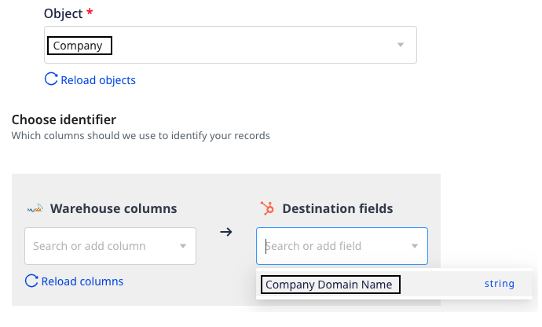
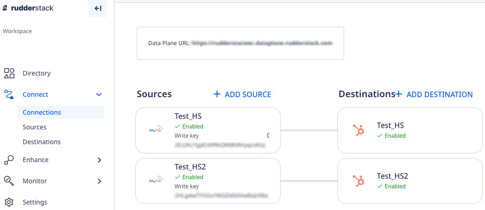
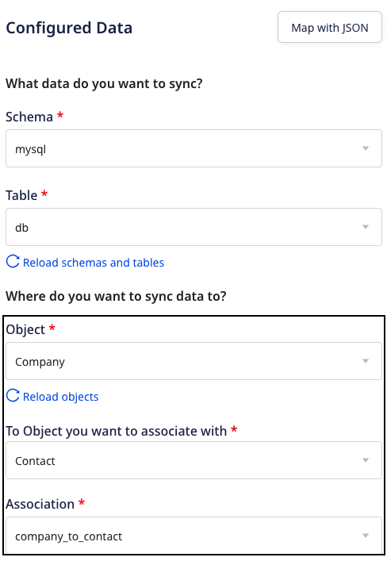
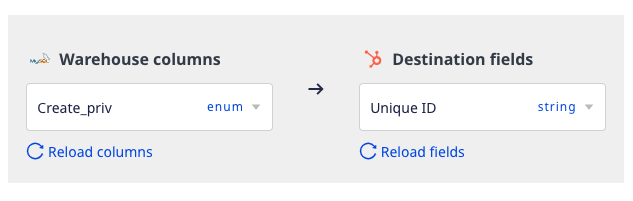
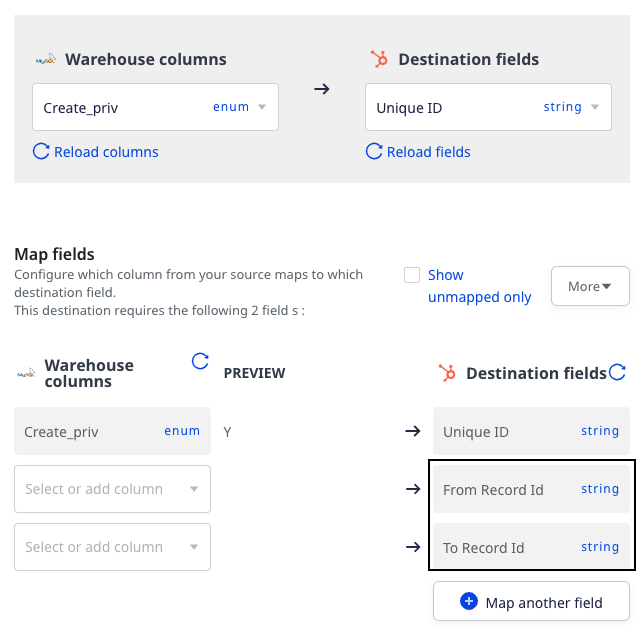

This guide takes you through the required scopes, predefined identifiers, and creating the association between the object records while connecting a Reverse ETL source to HubSpot destination.

## Required scopes

If you're connecting a <Link to="/sources/reverse-etl/">Reverse ETL</Link> source to HubSpot that uses a <a href="https://developers.hubspot.com/docs/api/intro-to-auth#private-app-access-tokens">private app access token</a> for authentication, make sure your access token has the following scopes:

```
crm.lists.read
crm.objects.contacts.read
crm.objects.contacts.write
crm.schemas.custom.read
crm.objects.custom.read
crm.objects.custom.write
crm.schemas.custom.write
crm.objects.companies.write
crm.schemas.contacts.read
crm.lists.write
crm.objects.companies.read
crm.objects.deals.read
crm.objects.deals.write
crm.schemas.companies.read
crm.schemas.companies.write
crm.schemas.contacts.write
crm.schemas.deals.read
crm.schemas.deals.write
crm.objects.owners.read
crm.objects.quotes.write
crm.objects.quotes.read
crm.schemas.quotes.read
crm.objects.line_items.read
crm.objects.line_items.write
crm.schemas.line_items.read
```

<div class="infoBlock">
For more information on adding the above scopes, refer to the <a href="https://developers.hubspot.com/docs/api/migrate-an-api-key-integration-to-a-private-app#create-a-new-private-app">HubSpot documentation</a>.
</div>

## Predefined identifiers

While connecting a <Link to="/sources/reverse-etl/">Reverse ETL</Link> source with HubSpot using the <Link to="/sources/reverse-etl/features/visual-data-mapper/">Visual Data Mapper</Link> feature, you need to select a HubSpot **Object** where you want to sync the data. Further, you can choose a warehouse column and HubSpot field to map your records in the <Link to="/sources/reverse-etl/features/visual-data-mapper/#choosing-the-identifier">Choose identifier</Link> section, as shown:



If you select a standard HubSpot **Object**, the **Destination fields** dropdown displays the predefined unique identifiers along with any other unique field of the object. These predefined unique identifiers are mentioned in the below table corresponding to the standard HubSpot objects:

| Standard HubSpot object | Predefined unique identifiers   |
| :------------------ | :------------ | 
| Company     | Company Domain Name     | 
| Contact      | Email      |
| Deal     | Deal Name     | 
| Line Item      | Name      |
| Quote     | Quote number     | 

If you select a custom HubSpot **Object**, only the unique fields of the object are displayed in the **Destination fields** dropdown.

<div class="infoBlock">
The values of unique identifiers are case-sensitive and should be sent exactly as they are present in Hubspot.
</div>

## Creating association between object records

You can create an association between the HubSpot object records while connecting your HubSpot destination to a <Link to="/sources/reverse-etl/">Reverse ETL</Link> source using the <Link to="/sources/reverse-etl/features/visual-data-mapper/">Visual Data Mapper</Link> feature.

### Prerequisites

The following pre-requisites must be met to create an association between the HubSpot object records:

- You must create two separate connections in the RudderStack dashboard using any Reverse ETL source and HubSpot destination as shown:
    

    - The first connection will push data into the HubSpot object. For example, pushing data into a company object. 
    - The second connection will create an association between the object records. For example, associating the company and contact objects. You must configure the HubSpot destination in the second connection using the <Link to="/destinations/streaming-destinations/hubspot/setting-up-hubspot-in-rudderstack/#new-api">new API</Link> and enable the **Create associations between object record** setting in the RudderStack dashboard. The detailed steps to create this connection are explained in the below section.

### Steps to create association 

Follow the below steps to create an association between the HubSpot object records:

1. Add a Reverse ETL source and add the HubSpot destination to it. For detailed steps on adding a source and destination, you can refer to the <Link to="https://www.rudderstack.com/docs/get-started/quickstart/">Quickstart</Link> section.
2. While configuring the <Link to="/destinations/streaming-destinations/hubspot/setting-up-hubspot-in-rudderstack/#new-api">HubSpot connection settings</Link> in the RudderStack dashboard, enable the **Create associations between object record** setting and click **Continue**.
3. Select the required **Schema** and **Table** whose data you want to sync to HubSpot.
4. Select the HubSpot **Object** for which you want to create the association. 
5. In the next dropdown, select the HubSpot object with which you want to associate the above-mentioned object.
6. Based on the object selections, the relevant associations (from HubSpot account) are populated in the **Association** dropdown. You can select the required one, as shown:



7. In the **Choose identifier** section,  choose a warehouse column and destination field to map your records from the source to the destination. You can choose any destination field from the dropdown which will act as a unique identifier.



8. Choose a warehouse column each for **From Record ID** and **To Record ID** fields which will act as Hubspot's unique ID to identify an object.

<div class="infoBlock">
<strong>From Record ID</strong> and <strong>To Record ID</strong> are the column names of the two objects you want to associate. For example, if you want to associate a company and a contact, the <strong>From Record ID</strong> should be a <code class="inline-code">Company Id</code> and <strong>To Record ID</strong> should be a <code class="inline-code">Contact Id</code>.
</div>




Similarly, you can create more of such associations between the object records.