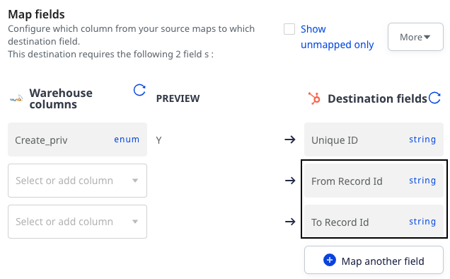

This guide takes you through some of the required configurations while connecting a reverse ETL source to HubSpot destination.


## Required scopes

If you're connecting a <Link to="/sources/reverse-etl/">Reverse ETL</Link> source to HubSpot that uses a <a href="https://developers.hubspot.com/docs/api/intro-to-auth#private-app-access-tokens">private app access token</a> for authentication, make sure your access token has the following scopes:

```
crm.lists.read
crm.objects.contacts.read
crm.objects.contacts.write
crm.schemas.custom.read
crm.objects.custom.read
crm.objects.custom.write
crm.schemas.custom.write
crm.objects.companies.write
crm.schemas.contacts.read
crm.lists.write
crm.objects.companies.read
crm.objects.deals.read
crm.objects.deals.write
crm.schemas.companies.read
crm.schemas.companies.write
crm.schemas.contacts.write
crm.schemas.deals.read
crm.schemas.deals.write
crm.objects.owners.read
crm.objects.quotes.write
crm.objects.quotes.read
crm.schemas.quotes.read
crm.objects.line_items.read
crm.objects.line_items.write
crm.schemas.line_items.read
```

<div class="infoBlock">
For more information on adding the above scopes, refer to the <a href="https://developers.hubspot.com/docs/api/migrate-an-api-key-integration-to-a-private-app#create-a-new-private-app">HubSpot documentation</a>.
</div>

## Predefined identifiers

While using <Link to="/sources/reverse-etl/features/visual-data-mapper/">Visual Data Mapper</Link> feature to connect a <Link to="/sources/reverse-etl/">Reverse ETL</Link> source with HubSpot, you need to select a HubSpot **Object** where you want to sync the data. Further, you can choose a warehouse column and HubSpot field to map your records in the <Link to="/sources/reverse-etl/features/visual-data-mapper/">choose identifier</Link> section, as shown:


If you select a standard HubSpot **Object**, the predefined unique identifiers are shown in the **Destination fields** dropdown along with any other unique field of the object:

| Standard HubSpot object | Predefined unique identifiers   |
| :------------------ | :------------ | 
| Company     | Company Domain Name     | 
| Contact      | Email      |
| Deal     | Deal Name     | 
| Line Item      | Name      |
| Quote     | Quote number     | 

If you select a custom HubSpot **Object**, only the unique fields of the object are shown in the **Destination fields** dropdown.

## Creating association between object records

This section is **applicable only** when you want to send events to HubSpot via the [new API](https://developers.hubspot.com/docs/api/overview) and have enabled the **Create associations between object record** setting in the RudderStack dashboard.

Follow the below steps to create the association between records:

The below steps assume that you are connecting your HubSpot destination to a <Link to="/sources/reverse-etl/">Reverse ETL</Link> source using <Link to="/sources/reverse-etl/features/visual-data-mapper/">Visual Data Mapper</Link> feature. Further, follow the below:

1. Configure the HubSpot connection settings in the RudderStack dashboard and click **Continue**.
2. Next, select the required Schema and Table whose data you want to sync to HubSpot.
3. Select the **Object** for which you want to create the association. 
2. Select the object with which you want to associate.
3. Based on the object selections, the relevant associations (from HubSpot account) are populated in the **Association** dropdown. You can select the required one, as shown:


4. In the **Choose Identifier** section,  choose a warehouse column and destination field to map your records from the source to the destination. You can choose any destination field from the dropdown which will act as a unique identifier.
5. Choose a warehouse column each for **From Record ID** and **To Record ID** fields which will act as the Hubspot's unique Id to identify an object.



Similarly, you can continue to create more associations between object records.