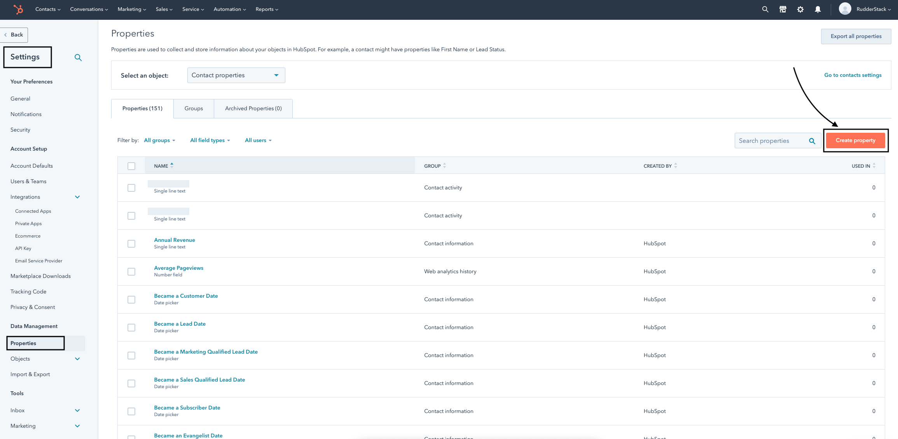

RudderStack supports the following API calls while sending data to Hubspot via <Link to="/destinations/rudderstack-connection-modes/#cloud-mode">cloud mode</Link> using the [legacy API](https://legacydocs.hubspot.com/docs/overview?_ga=2.34803302.670362313.1663315856-97001172.1658910392).

## Identify

RudderStack sends the <Link to="/event-spec/standard-events/identify">`identify`</Link> call to create or update a contact in HubSpot. The contact's email ID must be present in the `identify` call's `traits`.

A sample `identify` call is as shown:

```javascript
rudderanalytics.identify({
  firstName: "Alex",
  city: "New Orleans",
  country: "USA",
  phone: "+1-202-555-0146",
  email: "alex@example.com",
  custom_flavor: "chocolate",
  custom_date: 1574769933368,
  custom_date1: new Date("2019-10-14T11:15:53.296Z"),
})
```

### Special fields

HubSpot supports the following traits as special fields:

- `address`
- `city`
- `companyName`
- `email`
- `firstName`
- `lastName`
- `position`
- `phone`
- `zip`

### Custom properties

RudderStack supports sending custom properties to HubSpot via the `identify` call. These properties will update the `contact` property you have **already created** in HubSpot, as shown:



<div class="infoBlock">
Refer to the <a href="https://knowledge.hubspot.com/crm-setup/manage-your-properties">HubSpot Knowledge Base</a> for more information on creating custom properties.
</div>

When you provide any custom property in the event, RudderStack automatically converts the field name into the lower case and replaces any space with an underscore. This is because HubSpot does not accept properties in the upper case and spaces.

RudderStack then maps the field values present in the `traits` to the corresponding HubSpot custom property.

<div class="warningBlock">
HubSpot discards any property that does not exist and returns a <strong>400 Bad Request</strong> error.
</div>

### Dates

For sending properties of `date` type, you can send them as the epoch time or as a `date` object. RudderStack converts them to the required HubSpot format (midnight UTC).

## Track

A <Link to="/event-spec/standard-events/track/">`track`</Link> call lets you record various user actions and any properties associated with them.

To associate a `track` call with a user, you need to specify the user's `email` under `context.traits` . Additionally, RudderStack associates the `track` events with the same user after an `identify` request is successfully made.

A sample `track` event is as shown:

```javascript
rudderanalytics.track(
  "Order Completed", {
    value: 30,
  }, {
    context: {
      traits: {
        firstname: "Alex",
        city: "New Orleans",
        country: "USA",
        phone: "+1-202-555-0146",
        email: "alex@example.com",
      },
    },
  }
)
```

The `track` call also supports <Link to="https://legacydocs.hubspot.com/docs/methods/enterprise_events/http_api#:~:text=%26favorite_color%3Dorange-,External%20id,-%26id%3D%7Bvalue%7D">`externalId`</Link> as a parameter which is mapped from `externalID` `hubspotId`.

### Revenue events

For the revenue events, a `value` or `revenue` key should be included in the event properties to be recorded in HubSpot.

## Screen

The <Link to="/event-spec/standard-events/screen/">`screen`</Link> call lets you record whenever your user views their mobile screen, with any additional information about the viewed screen.

If you have enabled screen views in your <Link to="/sources/event-streams/sdks/rudderstack-android-sdk/">Android</Link> or <Link to="/sources/event-streams/sdks/rudderstack-ios-sdk/">iOS</Link> app implementation, RudderStack will send this information to HubSpot. RudderStack also forwards the `properties` you've passed along with the `screen` call without any changes.

A sample `screen` call sent via the iOS SDK is shown below:

```objectivec
[[RSClient sharedInstance] screen:@"Main"
            properties:@{@"prop_key" : @"prop_value"}];
```