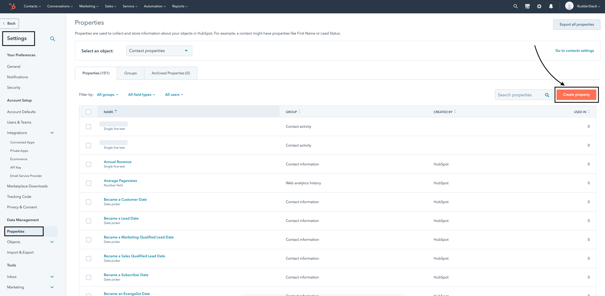

RudderStack lets you send the event data to HubSpot via web <Link to="/destinations/rudderstack-connection-modes/#device-mode">device mode</Link> using the [legacy API](https://legacydocs.hubspot.com/docs/overview?_ga=2.34803302.670362313.1663315856-97001172.1658910392).

<div class="infoBlock">
Find the open source code in the <a href="https://github.com/rudderlabs/rudder-sdk-js/tree/production/integrations/HubSpot">GitHub repository</a>.
</div>


## Identify

RudderStack sends the <Link to="/event-spec/standard-events/identify">`identify`</Link> call to create or update a contact in HubSpot. The user's email ID **must be present** in the `identify` call's `traits`.

You must call either <code class="inline-code">page</code> or <code class="inline-code">track</code> after the <code class="inline-code">identify</code> call to create a contact. The previously made <code class="inline-code">page</code> and <code class="inline-code">track</code> calls will automatically be associated with that contact once they are identified.

A sample `identify` call is as shown:

```javascript
rudderanalytics.identify({
  firstName: "Alex",
  city: "New Orleans",
  country: "USA",
  phone: "+1-202-555-0146",
  email: "alex@example.com",
  custom_flavor: "chocolate",
  custom_date: 1574769933368,
  custom_date1: new Date("2019-10-14T11:15:53.296Z"),
})
```

### Special fields

HubSpot supports the following traits as special fields:

- `address`
- `city`
- `companyName`
- `email`
- `firstName`
- `lastName`
- `position`
- `phone`
- `zip`

### Custom properties

RudderStack supports sending custom properties to HubSpot via the `identify` call. These properties will update the `contact` property you have **already created** in HubSpot, as shown:



<div class="infoBlock">
Refer to the <a href="https://knowledge.hubspot.com/crm-setup/manage-your-properties">HubSpot Knowledge Base</a> for more information on creating custom properties.
</div>

When you provide any custom property in the event, RudderStack automatically converts the field name into the lower case and replaces any space with an underscore. This is because HubSpot does not accept properties in the upper case and spaces.

RudderStack then maps the field values present in the `traits` to the corresponding HubSpot custom property.

<div class="warningBlock">
HubSpot discards any property that does not exist and returns a <strong>400 Bad Request</strong> error.
</div>

### Dates

For sending properties of type `date`, send them as the epoch time or as a `date` object. RudderStack will convert it to the required HubSpot format (midnight UTC).

## Page

You must make an initial <code class="inline-code">page</code> call to send event data to HubSpot. It lets you record your website's page views with any additional relevant information about the viewed page. 

## Track

A <Link to="/event-spec/standard-events/track/">`track`</Link> call lets you record various user actions and any properties associated with them.

To associate a `track` call with a user, you need to specify the user's `email` under `context.traits` . Additionally, RudderStack associates the `track` events with the same user after an `identify` request is successfully made.

A sample `track` event is as shown:

```javascript
rudderanalytics.track(
  "Order Completed", {
    value: 30,
  }, {
    context: {
      traits: {
        firstname: "Alex",
        city: "New Orleans",
        country: "USA",
        phone: "+1-202-555-0146",
        email: "alex@example.com",
      },
    },
  }
)
```

The `track` call also supports <Link to="https://legacydocs.hubspot.com/docs/methods/enterprise_events/http_api#:~:text=%26favorite_color%3Dorange-,External%20id,-%26id%3D%7Bvalue%7D">`externalId`</Link> as a parameter which is mapped from `externalID` `hubspotId`.

### Revenue events

For the revenue events, a `value` or `revenue` key should be included in the event properties to be recorded in HubSpot.

## FAQ

### Can I use HubSpot website analytics?

Yes - RudderStack supports sending `page` calls in device mode which can be used for HubSpot website analytics.