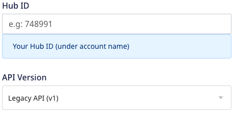

Before configuring HubSpot as a destination in RudderStack, verify if the source platform is supported by HubSpot by referring to the table below:

| **Connection Mode** | **Web**       | **Mobile**    | **Server**    |
| :------------------ | :------------ | :------------ | :------------ |
| **Device mode**     | **Supported**            | -             | -             |
| **Cloud mode**      | **Supported** | **Supported** | **Supported** |

To know more about the difference between cloud mode and device mode in RudderStack, refer to the <Link to="/destinations/rudderstack-connection-modes/">RudderStack Connection Modes</Link> guide.

Once you have confirmed that the source platform supports sending events to HubSpot, follow these steps:

1. From your [RudderStack dashboard](https://app.rudderstack.com/), add the source. Then, from the list of destinations, select **HubSpot**.
2. Assign a name to the destination and click on **Continue**.

## Connection settings

### Legacy API
To successfully configure HubSpot as a destination using the [legacy API](https://legacydocs.hubspot.com/docs/overview?_ga=2.34803302.670362313.1663315856-97001172.1658910392):

- **Hub ID**: Enter your HubSpot Hub ID.

Refer to the <Link to="#faq">FAQ</Link> section for more information on getting the Hub ID.

- **API Version**: Select **Legacy API (v1)** from the dropdown. To work with the new HubSpot API, refer to the <Link to="#new-api">New API</Link> section.

- **Authorization Type**: Choose any of the two authorization types explained below:

- **Private Apps**: Enables you to use HubSpot's APIs to access specific data from your HubSpot account.
- **Access Token**: Enter your HubSpot access token from the **Private Apps** section in the HubSpot dashboard.

Refer to the <Link to="#faq">FAQ</Link> section for more information on getting the HubSpot access token.

 

- **API Key (deprecating soon)**: Lets you create custom applications using HubSpot's APIs.
- **API Key**: Enter your HubSpot API key. This field is mandatory to send data to HubSpot via the RudderStack cloud mode.

This authorization type will be deprecated soon. Refer to <Link to="https://knowledge.hubspot.com/integrations/how-do-i-get-my-hubspot-api-key">HubSpot documentation</Link> for more information.

Refer to the <Link to="#faq">FAQ</Link> section for more information on getting the API Key.

- **Client-side Events Filtering**: This setting lets you specify which events should be blocked or allowed to flow through to HubSpot.

For more information on this setting, refer to the <Link to="/sources/sdks/event-filtering/">Client-side Events Filtering</Link> guide.

- **Use device mode to send events**: This setting **must be enabled** to send the events to HubSpot via the web device mode.
- **OneTrust Cookie Categories**: If **Use device mode to send events** is enabled, this setting lets you associate <Link to="/sources/sdks/rudderstack-javascript-sdk/consent-managers/onetrust/">OneTrust</Link> cookie consent groups to HubSpot.

### New API

To successfully configure HubSpot as a destination using the [New API](https://developers.hubspot.com/docs/api/overview), all the above-mentioned settings (<Link to="#legacy-api">Legacy API</Link>) are applicable except you need to select the **New API (v3)** in **API Version**, as shown:

Some additional settings to configure HubSpot as a destination using the **New API** are as follows:

- **HubSpot property name to be used as lookup field**: Enter the unique HubSpot property to be used as a lookup field for <Link to="https://developers.hubspot.com/docs/api/crm/contacts">HubSpot contacts</Link>.

- **Create associations between object records**: 

The below settings are only applicable for the <Link to="#private-apps-authorization-type">**Private Apps**</Link> authorization type:
- **RudderStack Event Name**: Enter the RudderStack event name you want to map to the <Link to="https://developers.hubspot.com/docs/api/analytics/events#create-an-event">custom behavioral event</Link> created in HubSpot.
- **HubSpot Event Name**: Enter the tracking ID of the HubSpot custom behavioral event you want to map to the above-mentioned RudderStack event.
- **Map your Event Property**: Although HubSpot provides some <Link to="#property-mappings-1">default properties</Link> with custom behavioral events, you can create custom properties and map them to the RudderStack properties using this field. You can also specify multiple properties for a single event.

Refer to the <Link to="#custom-behavioral-events">Custom behavioral events</Link> section below for more information.

## FAQ

### Where do I get the API Key and Hub ID for HubSpot?

Refer to the following HubSpot guides to get the API Key and Hub ID:

- [Obtaining the API Key](https://knowledge.hubspot.com/integrations/how-do-i-get-my-hubspot-api-key)
- [Obtaining the Hub ID](https://knowledge.hubspot.com/account/manage-multiple-hubspot-accounts#identify-the-current-account-s-hub-id)

### Where do I get the Access Token for HubSpot?

To get the Access Token:

1. Log into your [HubSpot account](https://app.hubspot.com/login/).
2. Go to **Integrations** > **Private Apps** from the left sidebar.
3. Click on your app to see the below:

