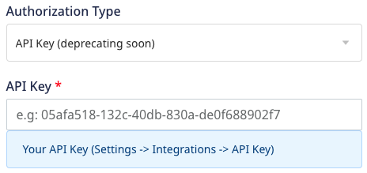

Before configuring HubSpot as a destination in RudderStack, verify if the source platform is supported by HubSpot by referring to the table below:

| **Connection Mode** | **Web**       | **Mobile**    | **Server**    |
| :------------------ | :------------ | :------------ | :------------ |
| **Device mode**     | **Supported**            | -             | -             |
| **Cloud mode**      | **Supported** | **Supported** | **Supported** |

To know more about the difference between cloud mode and device mode in RudderStack, refer to the <Link to="/destinations/rudderstack-connection-modes/">RudderStack Connection Modes</Link> guide.

Once you have confirmed that the source platform supports sending events to HubSpot, follow these steps:

1. From your [RudderStack dashboard](https://app.rudderstack.com/), add the source. Then, from the list of destinations, select **HubSpot**.
2. Assign a name to the destination and click on **Continue**.

## Connection settings

### New API

To successfully configure HubSpot as a destination using the <Link to="https://developers.hubspot.com/docs/api/overview">new API</Link>,  you can choose any of the two authorization types explained below:

- **Access Token**: Enter your HubSpot access token from the **Private Apps** section in the HubSpot dashboard.

Refer to the <Link to="#faq">FAQ</Link> section for more information on getting the HubSpot access token.

- **API Version**: Select **New API (v3)** from the dropdown.

The **Private Apps** authorization type enables you to use HubSpot's APIs to access specific data from your HubSpot account.

#### API Key authorization type

The **API Key (deprecating soon)** authorization type lets you create custom applications using HubSpot's APIs.

This authorization type will be deprecated soon. Refer to <Link to="https://knowledge.hubspot.com/integrations/how-do-i-get-my-hubspot-api-key">HubSpot documentation</Link> for more information.

- **Hub ID**: Enter your HubSpot Hub ID.
- **API Key**: Enter your HubSpot API key. This field is mandatory to send data to HubSpot via the RudderStack cloud mode.

Refer to the <Link to="#faq">FAQ</Link> section to know where to get the Hub ID and API Key.

- **API Version**: Select **New API (v3)** from the dropdown.

### Event and property names

- **HubSpot property name to be used as lookup field**: Enter the unique HubSpot property to be used as a lookup field for <Link to="https://developers.hubspot.com/docs/api/crm/contacts">HubSpot contacts</Link>.

The below settings are only applicable for the <Link to="#private-apps-authorization-type">**Private Apps**</Link> authorization type:
- **RudderStack Event Name**: Enter the RudderStack event name you want to map to the <Link to="https://developers.hubspot.com/docs/api/analytics/events#create-an-event">custom behavioral event</Link> created in HubSpot.
- **HubSpot Event Name**: Enter the tracking ID of the HubSpot custom behavioral event you want to map to the above-mentioned RudderStack event.
- **Map your Event Property**: Although HubSpot provides some <Link to="#property-mappings-1">default properties</Link> with custom behavioral events, you can create custom properties and map them to the RudderStack properties using this field. You can also specify multiple properties for a single event.

Refer to the <Link to="#custom-behavioral-events">Custom behavioral events</Link> section below for more information.

### Client-side events filtering

These settings are applicable only if you're sending events to HubSpot via the web device mode. Refer to the <Link to="/sources/event-streams/sdks/event-filtering/">Client-side Event Filtering</Link> guide for more information on this feature.

To successfully configure HubSpot as a destination using the **legacy API**, you can choose any of the two authorization types explained below:

#### Private Apps authorization type

The **Private Apps** authorization type allows you to use HubSpot's APIs to access specific data from your HubSpot account.

- **Access Token**: Enter your HubSpot access token from the **Private Apps** section in the HubSpot dashboard.

Refer to the <Link to="#faq">FAQ</Link> section to know where to get the HubSpot access token.

- **API Version**: Select **Legacy API** from the dropdown. To work with the new HubSpot API, refer to the <Link to="/destinations/streaming-destinations/hubspot-v2/">HubSpot V2</Link> guide.

#### API Key authorization type

The **API Key (deprecating soon)** authorization type allows you to create custom applications using HubSpot's APIs.

This authorization type will be deprecated soon. Refer to <Link to="https://knowledge.hubspot.com/integrations/how-do-i-get-my-hubspot-api-key">HubSpot documentation</Link> for more information.

- **Hub ID**: Enter your HubSpot Hub ID.
- **API Key**: Enter your HubSpot API key. This field is mandatory to send data to HubSpot via the RudderStack <Link to="/destinations/rudderstack-connection-modes/#cloud-mode">cloud mode</Link>.

Refer to the <Link to="#faq">FAQ</Link> section for more information on obtaining the Hub ID and API Key.

- **API Version**: Select **Legacy API** from the dropdown. To work with the new HubSpot API, refer to the <Link to="/destinations/streaming-destinations/hubspot-v2/">HubSpot V2</Link> guide.

### Client-side events filtering

These settings are applicable only if you're sending events to HubSpot via the web device mode. Refer to the <Link to="/sources/event-streams/sdks/event-filtering/">Client-side Event Filtering</Link> guide for more information on this feature.

