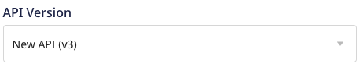
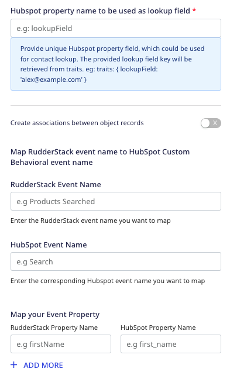

RudderStack supports sending event data to HubSpot via the following <a href="https://rudderstack.com/docs/rudderstack-cloud/rudderstack-connection-modes/">connection modes</a>:

| **Connection Mode** | **Web**       | **Mobile**    | **Server**    |
| :------------------ | :------------ | :------------ | :------------ |
| **Device mode**     | **Supported**            | -             | -    |
| **Cloud mode**      | **Supported** | **Supported** | **Supported** |

In the web device mode integration, that is, using <Link to="/sources/event-streams/sdks/rudderstack-javascript-sdk">JavaScript SDK</Link> as a source, the HubSpot native SDK is loaded from <code class="inline-code">https://js.hs-scripts.com/</code> domain. Based on your website's content security policy, you might need to <Link to="/sources/event-streams/sdks/rudderstack-javascript-sdk/load-js-sdk/#allowlist-destination-domain">allowlist this domain</Link> to load the HubSpot SDK successfully.

Once you have confirmed that the source platform supports sending events to HubSpot, follow these steps:

1. From your [RudderStack dashboard](https://app.rudderstack.com/), add the source. Then, from the list of destinations, select **HubSpot**.
2. Assign a name to the destination and click **Continue**.

## Connection settings

RudderStack supports sending data to HubSpot via the HubSpot's [legacy](https://legacydocs.hubspot.com/docs/overview?_ga=2.34803302.670362313.1663315856-97001172.1658910392) and [new](https://developers.hubspot.com/docs/api/overview) API.

As HubSpot's legacy API will be deprecated soon, it is recommended to use the new API.

### Legacy API
To successfully configure HubSpot as a destination using the [legacy API](https://legacydocs.hubspot.com/docs/overview?_ga=2.34803302.670362313.1663315856-97001172.1658910392):

- **Hub ID**: Enter your HubSpot Hub ID. Refer to the [HubSpot documentation](https://knowledge.hubspot.com/account/manage-multiple-hubspot-accounts#identify-the-current-account-s-hub-id) for more information on obtaining your Hub ID.
- **Authorization Type**: Select the authorization type from **Private Apps** or **API Key**, as explained below:
    1. **Private Apps** lets you use the HubSpot's APIs to access specific data from your HubSpot account.

    

    -  **Access Token**: Enter your HubSpot access token from the **Private Apps** section in the HubSpot dashboard. Refer to the <Link to="#faq">FAQ</Link> section for more information on getting the HubSpot access token.

    2. **API Key (deprecating soon)** lets you create custom applications using HubSpot's APIs.

    

    This authorization type will be deprecated soon. Refer to the <Link to="https://knowledge.hubspot.com/integrations/how-do-i-get-my-hubspot-api-key">HubSpot documentation</Link> for more information.
    

    

    -  **API Key**: Enter your HubSpot API key. This is a required field to send data to HubSpot via the <Link to="/destinations/rudderstack-connection-modes/#cloud-mode">cloud mode</Link>. For more information on obtaining the API key, refer to the [HubSpot documentation](https://knowledge.hubspot.com/integrations/how-do-i-get-my-hubspot-api-key).

- **API Version**: Select **Legacy API (v1)** from the dropdown. To work with the new HubSpot API, refer to the <Link to="#new-api">New API</Link> section.

The below settings are applicable **only if** you want to send events to HubSpot via the web <Link to="/destinations/rudderstack-connection-modes/#device-mode">device mode</Link>:

- **Client-side Events Filtering**: This setting lets you specify which events should be blocked or allowed to flow through to HubSpot. For more information on this setting, refer to the <Link to="/sources/sdks/event-filtering/">Client-side Events Filtering</Link> guide.
- **Use device mode to send events**: Enable this setting to send events to HubSpot via <Link to="/destinations/rudderstack-connection-modes/#device-mode">device mode</Link> using the native JavaScript SDK.
- **OneTrust Cookie Categories**: If **Use device mode to send events** is enabled, this setting lets you associate <Link to="/sources/sdks/rudderstack-javascript-sdk/consent-managers/onetrust/">OneTrust</Link> cookie consent groups to HubSpot.

### New API

To successfully configure HubSpot as a destination using the [new API](https://developers.hubspot.com/docs/api/overview), all the above-mentioned settings (for the <Link to="#legacy-api">legacy API</Link>) are applicable except you need to select the **New API (v3)** in **API Version** dropdown, as shown:

 

Additional settings to configure HubSpot using the **new API** are as follows:

- **HubSpot property name to be used as lookup field**: Enter a unique property to be used as a lookup field for the  <Link to="https://developers.hubspot.com/docs/api/crm/contacts">HubSpot contacts</Link>. The lookup field entered here **must also** be passed in the `identify` call's `traits` as its value will be used to look up the contact. Refer to the <Link to="/destinations/streaming-destinations/hubspot/hubspot-cloud-mode/hubspot-new-api-cloud#identify">`identify` call</Link> for more information.

If you are connecting the HubSpot destination to a <Link to="/sources/reverse-etl/">Reverse ETL</Link> source, you can skip setting this field and pass <code class="inline-code">N/A</code> as the value.

- **Create associations between object records**: Enable this setting to create associations between the object records while using a Reverse ETL source. Refer to the <Link to="/destinations/streaming-destinations/hubspot/connect-reverse-etl-source/#creating-association-between-object-records">Creating associations between object records</Link> section for more information.

The below settings are only applicable for the **Private Apps** authorization type:
- **RudderStack Event Name**: Enter the RudderStack event name you want to map to the <Link to="https://developers.hubspot.com/docs/api/analytics/events#create-an-event">custom behavioral event</Link> created in HubSpot.
- **HubSpot Event Name**: Enter the tracking ID of the HubSpot custom behavioral event you want to map to the above-mentioned RudderStack event.
- **Map your Event Property**: Although HubSpot provides some <Link to="/destinations/streaming-destinations/hubspot/hubspot-cloud-mode/hubspot-new-api-cloud#property-mappings-1">default properties</Link> with custom behavioral events, you can create additional custom properties and map them to the RudderStack properties using this field. You can also specify multiple properties for a single event. Refer to the <Link to="/destinations/streaming-destinations/hubspot/hubspot-cloud-mode/hubspot-new-api-cloud#custom-behavioral-events">Custom behavioral events</Link> section for more information.

## FAQ

### Where do I get the Access Token for HubSpot?

To get the HubSpot access token, follow these steps:

1. Log into your [HubSpot account](https://app.hubspot.com/login/).
2. Go to **Integrations** > **Private Apps** from the left sidebar.
3. Click your app to get the access token, as shown:

