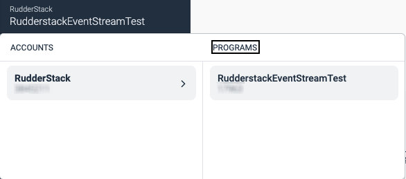

[impact.com](https://impact.com.com/) is a global partnership management platform that helps in managing and scaling different partnerships, such as affiliates, influencers, strategic business partners, mobile apps, commerce content publishers, B2B, and more.

Find the open source transformer code for this destination in the <a href="https://github.com/rudderlabs/rudder-transformer/tree/master/src/v0/destinations/impact.com_radius">GitHub repository</a>.


## Getting started

RudderStack supports sending events to impact.com via the following <a href="https://rudderstack.com/docs/rudderstack-cloud/rudderstack-connection-modes/">connection modes</a>:

| **Connection Mode** | **Web** | **Mobile** | **Server** |
| :--- | :--- | :--- | :--- |
| **Device mode** | -  | - | - |
| **Cloud mode** | **Supported**  | **Supported** | **Supported** |

Once you have confirmed that the source platform supports sending events to impact.com, follow these steps:

1. From your [RudderStack dashboard](https://app.rudderstack.com/), add a source. Then, from the list of destinations, select **Impact Radius**.
2. Assign a name to the destination and click **Continue**.

## Connection settings

To successfully configure impact.com as a destination, you will need to configure the following settings:

- **Account SID**: Enter the account SID present in the **Settings** > **API** option in the [impact.com dashboard](https://demo.impact.com/login.user).
- **API Key**: Enter the auth token present in the **Settings** > **API** option in the [impact.com dashboard](https://demo.impact.com/login.user).
- **Campaign Id**: Enter the campaign ID present under your **Account** > **Programs** in the [impact.com dashboard](https://demo.impact.com/login.user), as shown:



- **Impact App Id**: Enter the system app ID present in the **Settings** > **Mobile Apps** option in the [impact.com dashboard](https://demo.impact.com/login.user).
- **Event Type Id**: Enter the ID present in the **Settings** > **Event Type** option in the [impact.com dashboard](https://demo.impact.com/login.user).
- **Enable to hash email**: Enable this setting to hash the `email` field in SHA1 format. Keep it disabled in case it is already hashed.

<div class="warningBlock">
impact.com expects the <code class="inline-code">email</code> field in a hashed format. Otherwise, the events will fail. Hence, if you are sending the <code class="inline-code">email</code> in a plain text format, make sure the above setting is enabled.
</div>

- **Additional parameters mapping**: Enter the property mappings from RudderStack to impact.com for any additional parameters (other than the default ones mentioned in the sections below).
- **Custom mapping for Products**: Enter the custom property mappings for the `products` array.
- **Enable Identify Events**: Enable this setting to send `identify` events.
- **Enable Page Events**: Enable this setting to send `page` events.
- **Enable Screen Events**: Enable this setting to send `screen` events.
- **Action Event Names**: Enter the list of event names you want to track as actions.
- **Install Event Names**: Enter the list of event names correspond to the app install events.

## Identify

You can send an <Link to="/event-spec/standard-events/identify">`identify`</Link> call to impact.com via the [`PageLoad` endpoint](https://integrations.impact.com/impact-brand/reference/create-a-pageload). It allows impact.com to update the user identifiers for an accurate correlation.

A sample `identify` call is shown below:

```javascript
rudderanalytics.identify("1hKOmRA4el9Zt1WSfVJIVo4GRlm", {
  email: "alex@example.com",
});
```

### Property mappings

The following table lists the mappings between RudderStack and impact.com properties:

| RudderStack property | impact.com property | 
| :----------------- | :--------------- |
|`context.device.id`|`AppleIfv`|
|`context.app.name`|`AppName`|
|`context.app.build`|`AppPackage`|
|`context.app.version`|`AppVer`|
|`settings.campaignId`|`CampaignId`|
|`context.traits.email` <br/> `properties.email`|`CustomerEmail`|
|`userId`|`CustomerId`|
|`anonymousId`|`CustomProfileId`|
|`context.network.carrier`|`DeviceCarrier`|
|`context.locale`|`DeviceLocale`|
|`context.device.manufacturer`|`DeviceMfr`|
|`context.device.model`|`DeviceModel`|
|`context.device.type` <br/> `context.os.name`|`DeviceOs`|
|`context.os.version`|`DeviceOsVer`|
|`timestamp` <br/> `originalTimestamp` |`EventDate`|
|`context.device.id`|`GoogAId`|
|`context.ip`|`IpAddress`|
|`context.page.url` <br/> `properties.url` <br/> `context.page.referrer` <br/> `context.referrer.url`|`PageUrl`|
|`context.referrer.url` <br/> `context.page.referrer`|`ReferringUrl`|
|`context.userAgent`|`UserAgent`|
|`context.device.advertisingId`|`AppleIfa`|

<div class="infoBlock">
At least one of the <code class="inline-code">CustomerId</code>, <code class="inline-code">CustomProfileId</code>, <code class="inline-code">GoogAId</code>, <code class="inline-code">AndroidId</code>, <code class="inline-code">AppleIfa</code>, or <code class="inline-code">AppleIfv</code> is required to make an <code class="inline-code">identify</code> call successfully.
</div>

## Track

The <Link to="/event-spec/standard-events/track">`track`</Link> call lets you capture user events along with the properties associated with them. 

You can send a `track` call to impact.com to send the following events:
- Event names in the RudderStack's **Action Event Names** and **Install Event Names** dashboard settings are sent to the [`Conversions` endpoint](https://integrations.impact.com/impact-brand/reference/submit-a-conversion)
- Rest of the events are sent to the [`PageLoad` endpoint](https://integrations.impact.com/impact-brand/reference/create-a-pageload).

A sample `track` call is shown below:

```javascript
rudderanalytics.track("Order Completed", {
  order_id: "1234",
  shipping: 22,
  tax: 1,
  discount: 1.5,
  coupon: "ImagePro",
  currency: "USD",
  products: [{
      sku: "G-32",
      name: "Monopoly",
      price: 14,
      quantity: 1,
      category: "Games",
      brand: "top"
    },
    {
      sku: "G-34",
      name: "Monopoly",
      price: 16,
      quantity: 3,
      category: "Games",
      brand: "top"
    },
  ],
})
```

### Property mappings

The following table lists the mappings between RudderStack and impact.com properties:

| RudderStack property | impact.com property | 
| :----------------- | :--------------- |
|`properties.orderId` <br/> `properties.order_id` <br/> `properties.transactionID` <br/> `properties.checkout_id` <br/> <span style="color: #4D4DFF;font-size:12px;">Required</span>|`OrderId`|
|`timestamp` <br/> `originalTimestamp`<br/> <span style="color: #4D4DFF;font-size:12px;">Required</span> |`EventDate`|
|`event` <br/> <span style="color: #4D4DFF;font-size:12px;">Required, if settings.eventTypeId is absent.</span>|`EventTypeCode`|
|`settings.eventTypeId` <br/> <span style="color: #4D4DFF;font-size:12px;">Required, if event is absent.</span>|`EventTypeId`|
|`context.device.adTrackingEnabled`|`TrackingConsent`|
|`context.device.advertisingId`|`AppleIfa`|
|`context.device.id`|`AppleIfv`|
|`context.app.name`|`AppName`|
|`context.app.build`|`AppPackage`|
|`context.app.version`|`AppVer`|
|`settings.campaignId`|`CampaignId`|
|`context.referrer.id` <br/> ` properties.clickId`|`ClickId`|
|`properties.currency`|`CurrencyCode`|
|`context.traits.email` <br/> `properties.email`|`CustomerEmail`|
|`userId`|`CustomerId`|
|`context.traits.status`|`CustomerStatus`|
|`anonymousId`|`CustomProfileId`|
|`context.network.carrier`|`DeviceCarrier`|
|`context.locale`|`DeviceLocale`|
|`context.device.manufacturer`|`DeviceMfr`|
|`context.device.model`|`DeviceModel`|
|`context.device.type` <br/> `context.os.name`|`DeviceOs`|
|`context.os.version`|`DeviceOsVer`|
|`context.device.advertisingId`|`GoogAId`|
|`context.ip` <br/> `request_ip` |`IpAddress`|
|`properties.products[i].brand`|`ItemBrand{i}`|
|`properties.products[i].category`|`ItemCategory{i}`|
|`properties.products[i].name`|`ItemName{i}`|
|`properties.products[i].price`|`ItemPrice{i}`|
|`properties.products[i].coupon`|`ItemPromoCode{i}`|
|`properties.products[i].quantity`|`ItemQuantity{i}`|
|`properties.products[i].sku`|`ItemSku{i}`|
|`context.location.latitude`|`Latitude`|
|`context.location.longitude`|`Longitude`|
|`properties.discount`|`OrderDiscount`|
|`properties.coupon` <br/> `properties.coupon_id`|`OrderPromoCode`|
|`properties.shipping`|`OrderShipping`|
|`properties.tax`|`OrderTax`|
|`context.referrer.url` <br/> `context.page.referrer`|`ReferringUrl`|
|`context.page.url` <br/> `properties.url` <br/> `context.page.referrer` <br/> `context.referrer.url`|`PageUrl`|
|`context.userAgent`|`UserAgent`|

<div class="infoBlock">
Apart from the required properties mentioned above, at least one of the <code class="inline-code">ClickId</code>, <code class="inline-code">CustomerId</code>, <code class="inline-code">CustomProfileId</code>, <code class="inline-code">OrderPromoCode</code>, <code class="inline-code">GoogAId</code>, <code class="inline-code">AndroidId</code>, <code class="inline-code">AppleIfa</code>, or <code class="inline-code">AppleIfv</code> is required to make a <code class="inline-code">track</code> call successfully.
</div>

## Page

The <Link to="/event-spec/standard-events/page">`page`</Link> method lets you record your website's page views with any additional relevant information about the viewed page. You can send a `page` call to impact.com  via the [`PageLoad` endpoint](https://integrations.impact.com/impact-brand/reference/create-a-pageload).

A sample `page` call is as shown:

```javascript
rudderanalytics.page("category", "name", {
      path: "path",
      url: "url",
      title: "title"
    }
```

<div class="infoBlock">
The property mappings for <code class="inline-code">page</code> call are exactly the same as <code class="inline-code">identify</code> call. Refer to the <code class="inline-code">identify</code> call's <Link to="#property-mappings">property mappings</Link> for the same.
</div>

## Screen

The <Link to="/event-spec/standard-events/screen">`screen`</Link> call lets you record whenever your user views their mobile screen, with any additional relevant information about the screen. You can send a `screen` call to impact.com  via the [`PageLoad` endpoint](https://integrations.impact.com/impact-brand/reference/create-a-pageload).

A sample `screen` call is as shown:

```javascript
[
  [RSClient sharedInstance] screen: @ "Sample Screen Name"
  properties: @ {
    @ "prop_key": @ "prop_value"
  }
];
```

<div class="infoBlock">
The property mappings for <code class="inline-code">screen</code> call are exactly the same as <code class="inline-code">identify</code> call. Refer to the <code class="inline-code">identify</code> call's <Link to="#property-mappings">property mappings</Link> for the same.
</div>

## FAQ

### How can I debug impact.com errors?

Such errors may arise due to the failed pathing, invalid parameters, authentication errors, and network unavailability. Refer to the [Errors documentation](https://integrations.impact.com/impact-brand/reference/errors) for more information. Additionally, you can also refer to the [Rate Limits documentation](https://integrations.impact.com/impact-brand/reference/rate-limits) for more information on the API call limits.
