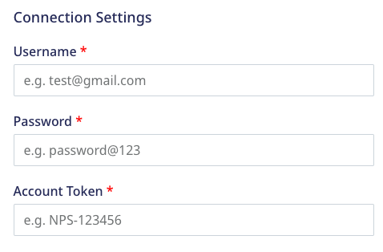

[InMoment (formerly Wootric)](https://inmoment.com/wootric/) is a cloud-based customer feedback management platform that helps product, customer success, and marketing leaders to improve the customer experience.

RudderStack supports InMoment as a destination where you can seamlessly send your event data.

## Getting started

Before configuring InMoment as a destination in RudderStack, verify if the source platform is supported by InMoment by referring to the table below:

| Connection Mode | Web | Mobile | Server |
| :--- | :--- | :--- | :--- |
| Device mode | - | - | - |
| Cloud mode | Supported  | Supported | Supported |

<div class="infoBlock">
To know more about the difference between cloud mode and device mode in RudderStack, refer to the <Link to="/destinations/rudderstack-connection-modes/">RudderStack Connection Modes</Link> guide.
</div>

Once you have confirmed that the source platform supports sending events to InMoment, follow these steps:

1. From your [RudderStack dashboard](https://app.rudderstack.com/), add a source. Then, from the list of destinations, select **Wootric**.
2. Assign a name to the destination and click **Continue**.

## Connection settings

To successfully configure InMoment as a destination, you will need to configure the following settings:



- **Username**: Enter the email you use to log in to your [InMoment](https://app.wootric.com/) account.
- **Password**: Enter the password you use to log in to InMoment.
- **Account Token**: Enter the unique account token from the InMoment dashboard by navigating to **Settings** > **Your Account**.

<div class="infoBlock">
Refer to the <Link to="#faq">FAQ</Link> section below for more information on getting the InMoment account token.
</div>

## Identify

You can use the <Link to="/event-spec/standard-events/identify/">`identify`</Link> call to create or update a user in InMoment.

RudderStack follows the below approach to look up a user and update their details:

1. If your event contains `context.externalId.0.id` (the Wootric user ID), RudderStack updates the user details against this ID. A sample snippet containing `context.externalId.0.id` is as shown:

```javascript
{
  "context": {
    "externalId": [{
      "type": "wootricEndUserId",
      "id": "12345"
    }]
  }
}
```

2. If `context.externalId.0.id` is absent, RudderStack then looks for the `external_id` (RudderStack's `userId`) field. If it exists, RudderStack updates the user against this ID.

<div class="infoBlock">
RudderStack uses InMoment's <a href="https://docs.wootric.com/api/#get-a-specific-end-user-by-id">End user lookup API</a> to retrieve user via <code class="inline-code">context.externalId.0.id</code> and the <a href="https://docs.wootric.com/api/#get-a-specific-end-user-by-external-id">External ID lookup API</a> to retrieve a user via <code class="inline-code">external_id</code>. For more information, refer to the <Link to="#property-mappings">Property mappings</Link> section below.
</div>

3. If none of `context.externalId.0.id` or `external_id` are present, RudderStack creates a new user in Wootric.

A sample `identify` call is shown below:

```javascript
rudderanalytics.identify("1hKOmRA4GRlm", {
    email: "alex@example.com",
    phone: "+12025550146",
    name: "Alex Keener",
    city: "New Orleans",
    gender: "male",
    createdAt: "2021-01-20T13:39:21.032Z",
    timestamp: "2021-01-20T13:39:21.032Z"
});
```

### Property mappings

The following tables list the mappings between RudderStack and InMoment events/properties based on the operation being performed:

- [Retrieve a user by external ID](https://docs.wootric.com/api/#get-a-specific-end-user-by-external-id)

    | RudderStack property | InMoment property | Presence | Data type | 
    |:---------------------|:-------------|:--------------|:--------------|
    | `userId`/`traits.userId`/`traits.id`/`context.traits.userId`/`context.traits.id` | `external_id` | Required | String |

- [Retrieve a user by end user ID](https://docs.wootric.com/api/#get-a-specific-end-user-by-id)

    | RudderStack property | InMoment property | Presence | Data type | 
    |:---------------------|:-------------|:--------------|:--------------|
    | `context.externalId.0.id` | `id` | Required | String |

- [Create a user](https://docs.wootric.com/api/#create-end-user)

    | RudderStack property | InMoment property | Presence | Data type | 
    |:---------------------|:-------------|:--------------|:--------------|
    | `userId`/`traits.userId`/`traits.id`/`context.traits.userId`/`context.traits.id` | `external_id` | Required | String |
    | `context.traits.email`/`traits.email`/`properties.email` | `email` | Optional, if `phone` is present. | String |
    | `context.traits.phone`/`traits.phone`/`properties.phone` | `phone_number` | Optional, if `email` is present. | String (Phone number with country code, for example, `+12025550146`) |
    | `context.traits`/`traits` | `properties` | Optional | Hash (key-value pair) |
    | `originalTimestamp`/`timestamp` | `last_surveyed` | Optional | String (UNIX timestamp) |
    | `context.traits.createdAt`/`traits.createdAt` | `external_created_at` | Optional | String (UNIX timestamp) |

<div class="warningBlock">
At least one parameter out of <code class="inline-code">email</code> and <code class="inline-code">phone</code> is required to create a user.
</div>

- [Update a user](https://docs.wootric.com/api/#update-end-user)

    | RudderStack property | InMoment property | Presence | Data type | 
    |:---------------------|:-------------|:--------------|:--------------|
    | Retrieved ID from `context.externalId.0.id` if present, else from `external_id` | `end_user_id` | Required | String |
    | `context.traits.email`/`traits.email`/`properties.email` | `email` | Optional | String |
    | `context.traits.phone`/`traits.phone`/`properties.phone` | `phone_number` | Optional | String (Phone number with country code, for example, `+12025550146`) |
    | `context.traits`/`traits` | `properties` | Optional | Hash (key-value pair) |
    | `originalTimestamp`/`timestamp` | `last_surveyed` | Optional | String (UNIX timestamp) |
    | `context.traits.createdAt`/`traits.createdAt` | `external_created_at` | Optional | String (UNIX timestamp) |

## Track

You can use the <Link to="/event-spec/standard-events/track/">`track`</Link> call to:

- Create a survey response by the end user 
- Create a survey decline by the end user

<div class="infoBlock">
RudderStack also updates the user properties if they are present in the event.
</div>

<div class="warningBlock">
You can use the <code class="inline-code">track</code> events only for the existing Wootric users.
</div>

RudderStack checks the `message.integrations.Wootric.eventType` field to determine whether to create a response or a decline.

A sample `track` call is shown below:

```javascript
rudderanalytics.track(
    "Submit", {
        feedbackScore: 9,
        feedbackText: "Great Product!",
        ip: "127.0.0.0",
        url: "https://www.google.com/",
        createdAt: "2022-01-20T13:39:21.032Z"
    }, {
        integrations: {
            Wootric: {
                eventType: "create response",
            },
        },
    }
);
```

<div class="warningBlock">
You will get an error if the <code class="inline-code">eventType</code> is set to any value other than <code class="inline-code">create response</code> or <code class="inline-code">create decline</code>.
</div>

### Property mappings

The following tables list the mappings between RudderStack and InMoment properties based on the end user's survey response/decline:

- [Create a survey response](https://docs.wootric.com/api/#create-response)

    | RudderStack property | InMoment property | Presence | Data type | 
    |:---------------------|:-------------|:--------------|:--------------|
    | Retrieved ID from `context.externalId.0.id` if present, else from `external_id` | `end_user_id` | Required | String |
    | `properties.feedbackScore`| `score` | Required | Integer |
    | `context.ip`/`request_ip` | `ip_address` | Required | Text |
    | `context.page.url`/`properties.url` | `origin_url` | Required | Text |
    | `properties.feedbackText` | `text` | Optional | Text |
    | `context.traits.createdAt`/`traits.createdAt` | `created_at` | Optional | String (UNIX timestamp) |
    | `context.traits`/`traits` | `end_user.properties` | Optional | Hash (key-value pair) |

<div class="infoBlock">
If Wootric receives a new survey response request for the same user within a 24-hour window, it updates the last response. Otherwise, it creates a new survey response for the user.
</div>

- [Create a survey decline](https://docs.wootric.com/api/#create-decline)

    | RudderStack property | InMoment property | Presence | Data type | 
    |:---------------------|:-------------|:--------------|:--------------|
    | Retrieved ID from `context.externalId.0.id` if present, else from `external_id` | `end_user_id` | Required | Integer |
    | `context.page.url`/`properties.url` | `origin_url` | Optional | String |
    | `context.traits.createdAt`/`traits.createdAt` | `created_at` | Optional | String (UNIX timestamp) |
    | `context.traits`/`traits` | `end_user.properties` | Optional | Hash (key-value pair) |

<div class="infoBlock">
If Wootric receives a new survey decline request for the same user within a 24-hour window, it updates the last decline. Otherwise, it creates a new survey decline for the user.
</div>

## FAQ

### Where can I find the InMoment account token?

To find the InMoment account token:

1. Log into your [InMoment account](https://app.wootric.com/).
2. Click on the **Settings** icon in the top navigation bar, as shown:

