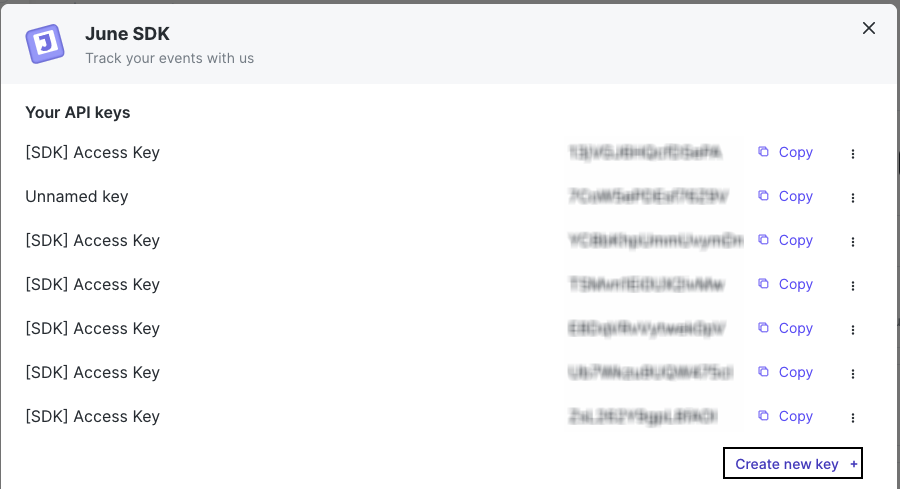

RudderStack supports sending event data to June via the following <a href="https://rudderstack.com/docs/rudderstack-cloud/rudderstack-connection-modes/">connection modes</a>:

| **Connection Mode** | **Web**           | **Mobile** | **Server** |
| :------------------ | :------------ | :----- | :----- |
| Device Mode     | Supported |- | - |
| Cloud Mode    | Supported | Supported  | Supported  |

Once you have confirmed that the source platform supports sending events to June, follow these steps:

1. From your [RudderStack dashboard](https://app.rudderstack.com/), add the source. Then, from the list of destinations, select **June**.
2. Assign a name to your destination and click **Continue**.

## Connection settings

To successfully configure June as a destination, configure the following settings:

- **API Key**: Enter the API key from the June dashboard. Refer to the <Link to="#faq">FAQ</Link> section for more information on obtaining the API key. 

- **Client-side Events Filtering**: This setting lets you specify which events should be blocked or allowed to flow through to June. For more information on this setting, refer to the <Link to="/sources/sdks/event-filtering/">Client-side Events Filtering</Link> guide.
    

## FAQ

### How do I obtain the June API key?

1. Login to the [June dashboard](https://www.june.so/).
2. Click on your workspace and select **Settings & Integrations**.
3. Under the **Integrations** section, click **June SDK** to see the API keys as shown:

You can also click **Create new key** if no API key is present.
