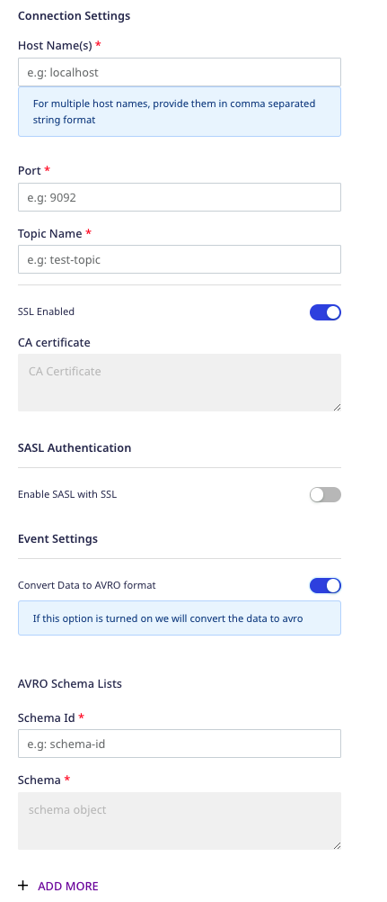

[Apache Kafka](https://kafka.apache.org/) is a popular distributed streaming platform used for building realtime data pipelines and streaming apps.

RudderStack lets you configure Apache Kafka as a destination to which you can send your event data seamlessly.

<div class="infoBlock">
Find the open source transformer code for this destination in the <a href="https://github.com/rudderlabs/rudder-transformer/tree/master/v0/destinations/kafka">GitHub repository</a>.
</div>

## Getting started

Before configuring Kafka as a destination in RudderStack, verify if the source platform is supported by Kafka, by referring to the table below:

| **Connection Mode** | **Web**       | **Mobile**    | **Server**    |
| :------------------ | :------------ | :------------ | :------------ |
| **Device mode**     | -             | -             | -             |
| **Cloud** **mode**  | **Supported** | **Supported** | **Supported** |

<div class="infoBlock">
To know more about the difference between cloud mode and device mode in RudderStack, refer to the <Link to="/destinations/rudderstack-connection-modes/">RudderStack Connection Modes</Link> guide.
</div>

Once you have confirmed that the source platform supports sending events to Kafka, follow these steps:

1. From your [RudderStack dashboard](https://app.rudderstack.com/), add the source. Then, from the list of destinations, select **Apache Kafka**.
2. Assign a name to your destination and click on **Continue**.

### Connection settings

To configure Kafka as a destination in RudderStack, you need to configure the following settings:



- **Host Name**: Enter your Kafka server broker's host name.
- **Port**: Enter the port number to connect to the broker.
- **Topic Name**: Enter the Kafka topic name to which you want to send data.
- **SSL Enabled**: Enable this option if you have enabled SSL to connect to your broker.
   - **CA Certificate**: If SSL is enabled, enter the CA certificate.
- **Enable SASL with SSL**: If you have enabled SSL, you can use SASL for client authentication by enabling this option.
   - **SASL Type**: Choose the SASL authentication type from **Plain**, **SCRAM SHA-512**, and **SCRAM SHA-256**.
   - **Username**: Enter the username configured in Kafka for authenticating clients with SASL.
   - **Password**: Enter the password configured in Kafka for authenticating clients with SASL.

<div class="warningBlock">
You need to enable SSL to use SASL authentication.
</div>

<div class="infoBlock">
For more information on the SASL authentication, refer to the <a href="https://kafka.apache.org/documentation/#security_sasl">Apache Kafka documentation</a>.
</div>

- **Convert Data to AVRO format**: Enable this setting to serialize your data using Avro and send it to the specified Kafka topic.
   - **Schema ID**: Enter the schema ID for the schema list.
   - **Schema**: Enter the schema corresponding to the above-mentioned ID.

## Serializing data using Avro

RudderStack lets you serialize your data using [Avro](https://www.ibm.com/in-en/topics/avro) and send it to a specific Kafka topic by leveraging the [goavro](https://pkg.go.dev/github.com/linkedin/goavro/v2) package.

To use this feature, you need to pass the `schemaId` in your event's `integrations` object, as shown in the below event payload:

```json
{
  "event": "Product Added",
  "messageId": "4bb69e26-b5a6-446a-a140-dbb6263369c9",
  "type": "track",
  "anonymousId": "",
  "context": {
    "traits": {
      "email": "alex@example.com"
    },
  },
  "integrations": {
    "KAFKA": {
      "schemaId": "schema001"
    }
  },
  "originalTimestamp": "2022-06-22T12:31:19.002+05:30",
  "receivedAt": "2022-06-22T12:31:15.656+05:30",
  "request_ip": "[::1]",
  "sentAt": "2022-06-22T12:31:19.002+05:30",
  "timestamp": "2022-06-22T12:31:15.655+05:30"
}
```

The corresponding schema is shown below:

```json
{"name":"RudderStackEvent","type":"record","namespace":"com.acme.avro","fields":[{"name":"anonymousId","type":"string"},{"name":"event","type":"string"},{"name":"messageId","type":"string"},{"name":"originalTimestamp","type":"string"},{"name":"receivedAt","type":"string"},{"name":"request_ip","type":"string"},{"name":"rudderId","type":"string"},{"name":"sentAt","type":"string"},{"name":"timestamp","type":"string"},{"name":"type","type":"string"},{"name":"context","type":"record","fields":[{"name":"traits","type":"record","fields":[{"name":"email","type":"string"}]},{"name":"ip","type":"string"}]},{"name":"integrations","type":"record","fields":[{"name":"KAFKA","type":"record","fields":[{"name":"schemaId","type":"string"}]}]}]}
```

## Partition key

RudderStack uses the `userId` in the event as the partition key of the message.

<div class="infoBlock">
If <code class="inline-code">userId</code> is not present in payload, then RudderStack uses <code class="inline-code">anonymousId</code> instead.
</div>

So, if you have a multi-partitioned topic, then the records of the same `userId` (or `anonymousId` in absence of `userId`) will always go to the same partition.

## FAQ

### Does my Kafka server require Client Authentication?

If you have enabled 2-way SSL, that is, your server requires client authentication, then you need to have the CA certificate and put that in the truststore of your server.

### How can I enable the 2-way SSL in Kafka and connect to RudderStack?

Follow the below steps to make use of Java's **keytool** utility to enable two-way SSL in Kafka and connect to RudderStack:

#### Step 1:  Generate the key and certificate

Run the following command:

```
keytool -keystore kafka.server.keystore.jks -alias localhost -keyalg RSA -genkey
```
#### Step 2: Create your own CA

Follow these steps to create your own CA:

1. Generate a CA that is a public-private key pair and a certificate by running the command below. **Enter the contents of this certificate in the RudderStack dashboard under the CA certificate setting**.

```
openssl req -new -x509 -keyout ca-key -out ca-cert -days {validity}
```
2. Add the generated CA to the **broker's truststore** so that the brokers can trust this CA.

   ```
   keytool -keystore kafka.server.truststore.jks -alias CARoot -importcert -file ca-cert
   ```
#### Step 3: Sign the certificate

Follow the steps below:

1. Export the certificate from the keystore, as shown:

```
keytool -keystore kafka.server.keystore.jks -alias localhost -certreq -file cert-file
```
2. Sign it with the CA, as shown:
```
openssl x509 -req -CA ca-cert -CAkey ca-key -in cert-file -out cert-signed -days {validity} -CAcreateserial -passin pass:{ca-password}
```
3. Import both the certificate of the CA and the signed certificate into the broker keystore, as shown: 

```
keytool -keystore kafka.server.keystore.jks -alias CARoot -import -file ca-cert 
```
```
keytool -keystore kafka.server.keystore.jks -alias localhost -import -file cert-signed
```

All the above commands to generate the key and certificate, create the CA, and sign the certificate are summarized below:

```
// Step 1: Generate the key and the certificate
keytool -keystore kafka.server.keystore.jks -alias localhost -keyalg RSA -validity {validity} -genkey
// Step 2: Create your own CA
openssl req -new -x509 -keyout ca-key -out ca-cert -days {validity}
keytool -keystore kafka.server.truststore.jks -alias CARoot -importcert -file ca-cert
// Step 3: Sign the certificate
keytool -keystore kafka.server.keystore.jks -alias localhost -certreq -file cert-file
openssl x509 -req -CA ca-cert -CAkey ca-key -in cert-file -out cert-signed -days {validity} -CAcreateserial -passin pass:{ca-password}
keytool -keystore kafka.server.keystore.jks -alias CARoot -import -file ca-cert
keytool -keystore kafka.server.keystore.jks -alias localhost -import -file cert-signed
```

#### Step 4: Update `server.properties`

Enter the below parameters in your `server.properties`:

```
ssl.keystore.location=<keystore location>
ssl.keystore.password=<keystore password>
ssl.key.password=<ca key password>
ssl.truststore.location=<truststore location>
ssl.truststore.password=<truststore password>
ssl.client.auth=required
ssl.enabled.protocols=TLSv1.2,TLSv1.1,TLSv1
ssl.truststore.type=JKS
ssl.keystore.type=JKS
```

#### Step 5: Save the RudderStack certificate

Save the below RudderStack certificate as `ca-cert-rudder` (or any other name of your choice) on your system:

```
-----BEGIN CERTIFICATE-----
MIIEDzCCAvegAwIBAgIUByH8aYuRqjCyz5yZZ91fcJOsW+0wDQYJKoZIhvcNAQEL
BQAwgZYxCzAJBgNVBAYTAklOMRQwEgYDVQQIDAtXZXN0IEJlbmdhbDEQMA4GA1UE
BwwHS29sa2F0YTEUMBIGA1UECgwLUnVkZGVyc3RhY2sxCzAJBgNVBAsMAklUMRQw
EgYDVQQDDAtSdWRkZXJzdGFjazEmMCQGCSqGSIb3DQEJARYXY29udGFjdEBydWRk
ZXJzdGFjay5jb20wHhcNMjAwNTE5MTA1OTEwWhcNMjEwNTE5MTA1OTEwWjCBljEL
MAkGA1UEBhMCSU4xFDASBgNVBAgMC1dlc3QgQmVuZ2FsMRAwDgYDVQQHDAdLb2xr
YXRhMRQwEgYDVQQKDAtSdWRkZXJzdGFjazELMAkGA1UECwwCSVQxFDASBgNVBAMM
C1J1ZGRlcnN0YWNrMSYwJAYJKoZIhvcNAQkBFhdjb250YWN0QHJ1ZGRlcnN0YWNr
LmNvbTCCASIwDQYJKoZIhvcNAQEBBQADggEPADCCAQoCggEBAMkLBYbfhvhm2wpJ
FZSr9AGyrJUEh2e6YaY83xLRDuOYC1cvqlmCNxltc4W+ACyyi9zqSvhrrNb2C/Yh
Ig4gvvplImAAmv5Ua4ZiB2XSrn9ZvR+baRyezPgKI1+iU5ovDciUkeZP3p7hEmLw
ktayyFrWV5IEuGnfGBN4O077tgUiCm8zq3cHC0e5JBTUtelnwj6u1Ye6zZfIx/rC
Ikf0l1LGZqV1DHZefCqPl3l9awVnA4rbllL9a+mLNe44BT2H4UG6OaZxnAEqVQ9x
lMvvDAYSzaSI334qGw/AAeBUE3mHyEbE9PtS0p+qOdRiq4b5m+usW5VbZBFSvT4A
FR2Xa2cCAwEAAaNTMFEwHQYDVR0OBBYEFF71gmg4bAdft9PF3Sj9QMrxwoFMMB8G
A1UdIwQYMBaAFF71gmg4bAdft9PF3Sj9QMrxwoFMMA8GA1UdEwEB/wQFMAMBAf8w
DQYJKoZIhvcNAQELBQADggEBAFvXp77ZQXwqB0vQZXAr4JfiNZueNP4OlpxltiLd
qt0UwLJzCZ/ik65jmGGcoxZeFQc3dF8InheH+zvanPWBq385TDSyF9/vomKbu7+R
b7ndgDtWGpJm6vCUgC6m15KRKzjlHmiWu227hed4ZNrl5EJwqqFhKzSQ62wv66uM
xHaTVaC1ThV5MmecsC7kS3mNCkhO1IVxy5KAJCftYzjni+O0U0wkcmUnZjJyN0l9
hAegB6VLwodW3FqFJ7hMlSZOxE9hYjl9/FlqDdS3KPtn8qh9uliq9V8NELK2jROh
vWJxTpadFmHwCTtKNrfnm2PgokxX3pVtkFu7xQhl26+87RQ=
-----END CERTIFICATE-----
```

#### Step 6: Add the RudderStack CA certificate to your truststore

Add the above RudderStack CA certificate to your truststore by using the certificate's location in the following command:

```
keytool -keystore kafka.server.truststore.jks -alias CARootRudder -import -file ca-cert-rudder
// here ca-cert-rudder is the RudderStack CA certificate
```

### How can I connect to RudderStack if my Kafka server is running in a Kubernetes cluster?

You will need to expose one public address to which RudderStack can connect. It is recommended to use SSL for that. 

<div class="warningBlock">
You should allow <strong>only the authenticated clients</strong> for this exposed address.
</div>

If you use `PLAINTEXT` for your internal services within your cluster, you might have the address. Open this address with SSL. You need to update `advertised.listeners` in your `server.properties`, as shown in the below example:

```
# Hostname and port the broker will advertise to producers and consumers.
# here the INTERNAL listener is your cluster kafka service host for kafka server
# and the EXTERNAL listener is the public loadbalancer for kafka server
advertised.listeners=INTERNAL://kafka-0.kafka-headless.kafka-test-1.svc.cluster.local:9092,EXTERNAL://ab7e36e84991c11ea8a930ebf847c1ef-555780507.us-east-1.elb.amazonaws.com:19092
listener.security.protocol.map=INTERNAL:PLAINTEXT,EXTERNAL:SSL
```

### Does RudderStack support `SASL_PLAINTEXT` authentication?

RudderStack does not support `SASL_PLAINTEXT` authentication. You can use `SASL_SSL` instead. The [official Kafka documentation](https://kafka.apache.org/documentation/#security_sasl) recommends using SASL with SSL in production.

### Why is the connection between Kafka and Zookeeper is failing for `SASL`?

You can try configuring your Zookeeper with `SASL_SSL` to resolve this issue.

## Contact us

For queries on any of the sections covered in this guide, you can [contact us](mailto:%20docs@rudderstack.com) or start a conversation in our [Slack](https://rudderstack.com/join-rudderstack-slack-community) community.
