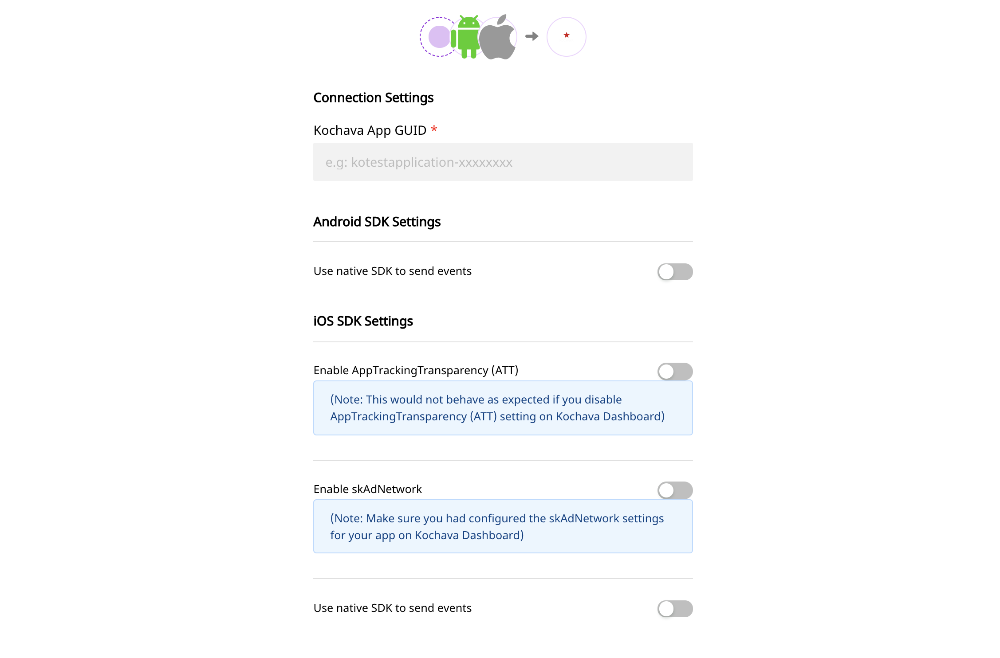

[Kochava](https://www.kochava.com/) is a leading mobile measurement and app analytics platform that offers unique dynamic deep linking, audience segmenting and data accessibility features for your business.

RudderStack allows you to send relevant events to Kochava through a S2S \(Server-to-Server\) integration with the platform.

<div class="infoBlock">
Find the open source transformer code for this destination in the <a href="https://github.com/rudderlabs/rudder-transformer/tree/master/v0/destinations/kochava">GitHub repository</a>.
</div>

## Getting started

Before configuring your source and destination on the RudderStack app, please check whether the platform you are working on is supported by Kochava. Refer the table below:

| **Connection Mode** | **Web** | **Mobile**    | **Server** |
| :------------------ | :------ | :------------ | :--------- |
| **Device mode**     | -       | **Supported** | -          |
| **Cloud mode**      | -       | **Supported** | -          |

<div class="infoBlock">
To know more about the difference between cloud mode and device mode in RudderStack, refer to the <Link to="/destinations/rudderstack-connection-modes/">RudderStack Connection Modes</Link> guide.
</div>

Once you have confirmed that the platform supports sending events to Kochava, perform the steps below:

- From your [RudderStack dashboard](https://app.rudderlabs.com/), add the source from which you want to send the event data.
- Once you have added the source, select Kochava from the list of destinations.
- In the **Connection Settings** page, please enter the relevant information in the fields shown in the following screen:

<span class="imageTitle">Destination Settings for Kochava</span>

## Kochava Configuration Settings in RudderStack

To successfully configure Kochava as a destination, you will need to configure the following settings:

- **App GUID:** Kochava generates a unique ID for your application, called the **App GUID**. You can find this ID by going to your Kochava account and navigating to **Apps & Assets** - **All Apps**. You can then select your app to the view the App GUID.

**NOTE**: The following two settings are applicable for `iOS Device
Mode` only:

- **Enable AppTrackingTransparency \(ATT\):** Enable this setting if you want to enable the `AppTrackingTransparency` feature provided by the Kochava iOS SDK.

<div class="infoBlock">

Make sure you include the key `NSUserTrackingUsageDescription` in your `info.plist` along with a string value explaining why you are requesting authorization to track.

</div>

- **Enable skAdNetwork:** Enable this setting if you want to enable the `skAdNetwork` feature provided by the Kochava iOS SDK.

## Adding Device Mode Integration

<Tabs>
  <TabList>
    <Tab>Android</Tab>
    <Tab>iOS</Tab>
    <Tab>iOS v2</Tab>
  </TabList>
    <TabPanels>
      <TabPanel>
        To add Kochava to your Android project and enable functionalities like push notifications, follow these steps :
<ul>
<li>Open your project level <code class="inline-code">build.gradle</code> file, and add the following:
<span>

```groovy
buildscript {
    repositories {
        mavenCentral()
    }
}
allprojects {
    repositories {
        mavenCentral()
    }
}
```
</span>
</li>
<li>Also, add the following under the <code class="inline-code">dependencies</code> section:
<span>

```kotlin
// ruddder core sdk
implementation 'com.rudderstack.android.sdk:core:1.+'
// rudder-kochava integration
implementation 'com.rudderstack.android.integration:kochava:1.0.0'
// Kochava native sdk
implementation 'com.kochava.base:tracker:3.10.0'
// if you don't have Gson included already
implementation 'com.google.code.gson:gson:2.8.6'
```
</span>
</li>
<li>Initialize the RudderStack SDK in the <code class="inline-code">Application</code> class' <code class="inline-code">onCreate()</code> method as shown:
<span>

```kotlin
import com.rudderstack.android.integrations.kochava.KochavaIntegrationFactory
import com.rudderstack.android.sdk.core.RudderClient
import com.rudderstack.android.sdk.core.RudderConfig

// initializing Rudder SDK
val rudderClient = RudderClient.getInstance(
    this,
    WRITE_KEY,
    RudderConfig.Builder()
        .withDataPlaneUrl(DATA_PLANE_URL)
        .withFactory(kochavaIntegration.FACTORY)
        .build()
)
```
</span>
</li>
</ul>
      </TabPanel>
      <TabPanel>
        Follow these steps to add Kochava to your iOS project:
<ul>
<li>Go your <code class="inline-code">Podfile</code> and add the <code class="inline-code">Rudder-Kochava</code> extension as shown below:
<span>

```ruby
pod 'Rudder-Kochava'
```
</span>
</li>
<li>After adding the dependency followed by <code class="inline-code">pod install</code> , you can add the imports to your <code class="inline-code">AppDelegate.m</code> file as shown:
<span>

```objectivec
#import "RudderKochavaFactory.h"
```
</span>
</li>
<li>Finally, change the initialization of your <code class="inline-code">RudderClient</code> as shown:
<span>

```objectivec
RudderConfigBuilder *builder = [[RudderConfigBuilder alloc] init];
[builder withDataPlaneUrl:DATA_PLANE_URL];
[builder withFactory:[RudderKochavaFactory instance]];
[RudderClient getInstance:WRITE_KEY config:[builder build]];
```
</span>
</li>
</ul>
      </TabPanel>
      <TabPanel>
        <div class="warningBlock">
          This device mode integration is supported for Kochava v5.1.1 and above.
        </div>
        Follow these steps to add Kochava to your iOS project:
<ol>
<li>Install <code class="inline-code">RudderKochava</code> (available through <a href="https://cocoapods.org/">CocoaPods</a>) by adding the following line to your <code class="inline-code">Podfile</code>:
<span>

```ruby
pod 'RudderKochava', '~> 1.0.0'
```
</span>
</li>
<li>Run the <code class="inline-code">pod install</code> command.</li>
<li>Then, import the SDK depending on your preferred platform:
<span>

```swift
import RudderKochava
```
</span>
<span>

```objectivec
@import RudderKochava;
```
</span>
</li>
<li>Next, add the imports to your <code class="inline-code">AppDelegate</code> file under the <code class="inline-code">didFinishLaunchingWithOptions</code> method, as shown:
<br /><br />
<span>

```swift
let config: RSConfig = RSConfig(writeKey: WRITE_KEY)
            .dataPlaneURL(DATA_PLANE_URL)

RSClient.sharedInstance().configure(with: config)
RSClient.sharedInstance().addDestination(RudderKochavaDestination())
```
</span>
<span>

```objectivec
RSConfig *config = [[RSConfig alloc] initWithWriteKey:WRITE_KEY];
[config dataPlaneURL:DATA_PLANE_URL];

[[RSClient sharedInstance] configureWith:config];
[[RSClient sharedInstance] addDestination:[[RudderKochavaDestination alloc] init]];
```
</span>
</li>
</ol>
    </TabPanel>
    </TabPanels>
</Tabs>

## Track

The `track` event captures information related to the actions performed by the user. For more information, refer to the the <Link to="/event-spec/standard-events/">RudderStack Events Specification</Link> documentation.

RudderStack transforms the following events to Kochava's Standard Events, as shown in the table below:

| RudderStack Event Name      | Kochava Standard Event |
| :-------------------------- | :--------------------- |
| `Product Added`             | `Add to Cart`          |
| `Product Added to Wishlist` | `Add to Wishlist`      |
| `Checkout Started`          | `Checkout Start`       |
| `Order Completed`           | `Purchase`             |
| `Product Reviewed`          | `Rating`               |
| `Products Searched`         | `Search`               |

<div class="infoBlock">

Rest of the events are sent to Kochava as custom events.

</div>

<div class="infoBlock">

You can send an event with the name same as that of an Kochava's standard event to get perceived as `Standard Event` in Kochava.

</div>

A sample `track` event for sending event data to Kochava looks like the following code snippet:

```objectivec
[[RudderClient sharedInstance] track:@"Product Added" properties:@{
@"price": @2.0,
@"product_id": @"product_id_a",
@"product_name": @"Product Name A"
}];
```

According to the table above, this will change the `Product Added` event to `Add to Cart` event in Kochava dashboard and pass the properties along with this.

## Screen

The `screen` method allows you to record whenever a user sees the mobile screen, along with any associated optional properties. This call is similar to the `page` call, but exclusive to your mobile device.

A sample `screen` call looks like the following code snippet:

```kotlin
MainApplication.rudderClient.screen("Sample Screen Name",
            RudderProperty()
                .putValue("prop_key","prop_value"));
```

In the above snippet, RudderStack captures all the information related to the viewed screen, along with any additional info associated with that event. In Kochava, the above `screen` call will be shown as - **"screen view `Sample Screen Name` "** along with the properties.

<div class="infoBlock">

Note that <code class="inline-code">screen</code> call will be sent to Kochava as a custom event.

</div>

## Configuring Push Notifications

Follow these steps to configure push notifications for Kochava for the platform of your choice:

<Tabs>
  <TabList>
    <Tab>Android</Tab>
    <Tab>iOS</Tab>
    <Tab>iOS v2</Tab>
  </TabList>
    <TabPanels>
      <TabPanel>
<ol>
<li>Register push notifications for your Android device in the Kochava dashboard.</li>
<li>Add the following dependency in your project level <code class="inline-code">build.gradle</code> file inside the <code class="inline-code">buildscript</code>:
<span>

```groovy
dependencies {
        classpath 'com.google.gms:google-services:4.3.5'
 }
```
</span>
</li>
<li>Next, add the following dependencies and plugin to your app level <code class="inline-code">build.gradle</code> file:

```groovy
dependencies {
// for push notifications
    implementation 'com.google.firebase:firebase-messaging:21.1.0'
}
apply plugin: 'com.google.gms.google-services'
```
</li>
<li>Place the <code class="inline-code">google-services.json</code> downloaded from the <code class="inline-code">Firebase console</code> into the root folder of your <code class="inline-code">app</code>.</li>
<li>Passing the new Push Token received from FCM to the Kochava SDK. For more information, look into the **sample-kotlin** app.
<span>

```kotlin
import com.google.firebase.messaging.FirebaseMessagingService
import com.rudderstack.android.integrations.kochava.KochavaIntegrationFactory.registeredForPushNotificationsWithFCMToken

// Extending FirebaseMessagingService class
class MyFirebaseMessagingService : FirebaseMessagingService() {

    // The onNewToken callback fires whenever a new token is generated.
    override fun onNewToken(token: String) {
        super.onNewToken(token)

        // Method to pass the push token to the Kochava native sdk
        registeredForPushNotificationsWithFCMToken(token)
    }
}
```
</span>
</li>
</ol>
      </TabPanel>
      <TabPanel>
          <ol>
        <li>Add Push Notification as a capability by navigating to <strong>Target</strong> - <strong>Signing & Capabilities</strong> of your app when opened in Xcode.</li>
<li>Enable <strong>Background Modes/Remote notifications</strong> by navigating to <strong>Targets</strong> - <strong>Your App</strong> - <strong>Capabilities</strong> - <strong>Background Modes</strong> and then check <code class="inline-code">Remote notifications</code></li>
<li>Register the push notifications for the iOS devices in your Kochava dashboard.</li>
<li>Then, add the following code in your app just after initializing RudderStack's iOS SDK to register the push notifications.
<span>

```objectivec
#import <UserNotifications/UserNotifications.h>
// register for push notifications
    UNUserNotificationCenter* center = [UNUserNotificationCenter currentNotificationCenter];
    center.delegate = self;
    [center requestAuthorizationWithOptions:(UNAuthorizationOptionAlert | UNAuthorizationOptionSound | UNAuthorizationOptionBadge)
                          completionHandler:^(BOOL granted, NSError * _Nullable error) {
        if (granted) {
            dispatch_async(dispatch_get_main_queue(), ^(void) {
                [[UIApplication sharedApplication] registerForRemoteNotifications];
            });
        }
    }];
```
</span>
</li>
<li>Finally, add the below handlers to handle the tokens and push notifications accordingly:
<span>

```objectivec
#import <RudderKochavaIntegration.h>

- (void)application:(UIApplication *)application didRegisterForRemoteNotificationsWithDeviceToken:(NSData *)deviceToken
{
    [[RudderKochavaIntegration alloc] registeredForRemoteNotificationsWithDeviceToken:deviceToken];
}

- (void)userNotificationCenter:(UNUserNotificationCenter *)center willPresentNotification:(UNNotification *)notification withCompletionHandler:(void (^)(UNNotificationPresentationOptions))completionHandler
{
    completionHandler(UNAuthorizationOptionSound | UNAuthorizationOptionAlert | UNAuthorizationOptionBadge);
}

- (void)userNotificationCenter:(UNUserNotificationCenter *)center didReceiveNotificationResponse:(UNNotificationResponse *)response withCompletionHandler:(void (^)(void))completionHandler
{
    [[RudderKochavaIntegration alloc] receivedRemoteNotification:response.notification.request.content.userInfo withActionString:response.actionIdentifier];
}
```
</span>
</li>
</ol>
      </TabPanel>
      <TabPanel>
          <ol>
        <li>Add Push Notification as a capability by navigating to <strong>Target</strong> - <strong>Signing & Capabilities</strong> of your app when opened in Xcode.</li>
<li>Enable <strong>Background Modes/Remote notifications</strong> by navigating to <strong>Targets</strong> - <strong>Your App</strong> - <strong>Capabilities</strong> - <strong>Background Modes</strong> and then check <strong>Remote notifications</strong>.</li>
<li>Register the push notifications for the iOS devices in your Kochava dashboard.</li>
<li>Then, add the following code in your app just after initializing RudderStack's iOS SDK to register the push notifications.
<span>

```objectivec
#import <UserNotifications/UserNotifications.h>
// register for push notifications
    UNUserNotificationCenter* center = [UNUserNotificationCenter currentNotificationCenter];
    center.delegate = self;
    [center requestAuthorizationWithOptions:(UNAuthorizationOptionAlert | UNAuthorizationOptionSound | UNAuthorizationOptionBadge)
                          completionHandler:^(BOOL granted, NSError * _Nullable error) {
        if (granted) {
            dispatch_async(dispatch_get_main_queue(), ^(void) {
                [[UIApplication sharedApplication] registerForRemoteNotifications];
            });
        }
    }];
```
</span>
</li>
<li>Finally, add the below handlers to handle the tokens and push notifications accordingly:
<span>

```swift
func application(_ application: UIApplication, didRegisterForRemoteNotificationsWithDeviceToken deviceToken: Data) {
    RSClient.sharedInstance().application(application, didRegisterForRemoteNotificationsWithDeviceToken: deviceToken)
}

func application(_ application: UIApplication, didReceiveRemoteNotification userInfo: [AnyHashable: Any], fetchCompletionHandler completionHandler: @escaping (UIBackgroundFetchResult) -> Void) {
    RSClient.sharedInstance().application(application, didReceiveRemoteNotification: userInfo, fetchCompletionHandler: completionHandler)
}
```
</span>
<span>

```objectivec
#import <RudderKochavaIntegration.h>

- (void)application:(UIApplication *)application didRegisterForRemoteNotificationsWithDeviceToken:(NSData *)deviceToken {
    [[RSClient sharedInstance] application:application didRegisterForRemoteNotificationsWithDeviceToken:deviceToken];
}

- (void)application:(UIApplication *)application didReceiveRemoteNotification:(NSDictionary *)userInfo fetchCompletionHandler:(void (^)(UIBackgroundFetchResult))completionHandler {
    [[RSClient sharedInstance] application:application didReceiveRemoteNotification:userInfo fetchCompletionHandler:completionHandler];
}
```
</span>
</li>
</ol>
      </TabPanel>
    </TabPanels>
</Tabs>


## FAQs

### Where do I get the Kochava App GUID?

To get your Kochava app GUID, please follow these steps:

1. [Log in to Kochava](https://go.kochava.com/session). Then, go to your account and select the application for the specific campaign.
2. Under **Apps & Assets**, select **All Apps**
3. Click on the desired app for which you want the procure the App GUID.
4. You will be able to see the App GUID under the title of your application, within the details.

For more information, please check the [Kochava support guide](https://support.kochava.com/reference-information/locating-an-app-guid/).