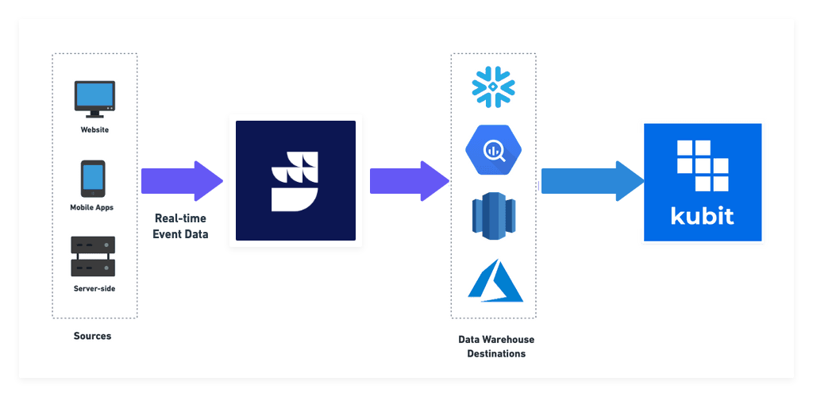

[Kubit](https://www.kubit.ai/) is a self-service product analytics platform with no-code integration that facilitates efficient data discovery. With Kubit, you can better understand your users' behavior and use the insights to drive customer retention and your product growth.

<div class="successBlock">
Kubit consumes data from your cloud data warehouse directly, so you don't have to configure it as a destination in RudderStack. For more information, refer to the <a href="https://docs.kubit.ai/docs">Kubit documentation</a>.
</div>



<div class="infoBlock">
This destination currently supports only <code class="inline-code">identify</code> and <code class="inline-code">track</code> calls.
</div>

## Identify

The <Link to="/event-spec/standard-events/identify/">`identify`</Link> call lets you identify a visiting user and associate them to their actions. It also lets you record the traits about them like their name, email address, etc.

A sample `identify` call is as shown:

```javascript
rudderanalytics.identify("1hKOmRA4GRlm", {
  name: "Alex Keener",
  email: "alex@example.com",
})
```

## Track

The <Link to="/event-spec/standard-events/track/">`track`</Link> call lets you record the user events along with any associated properties.

A sample `track` call is as shown:

```javascript
rudderanalytics.track("Order Completed", {
  orderId: "A123",
  price: "5.67",
  currency: "USD",
})
```