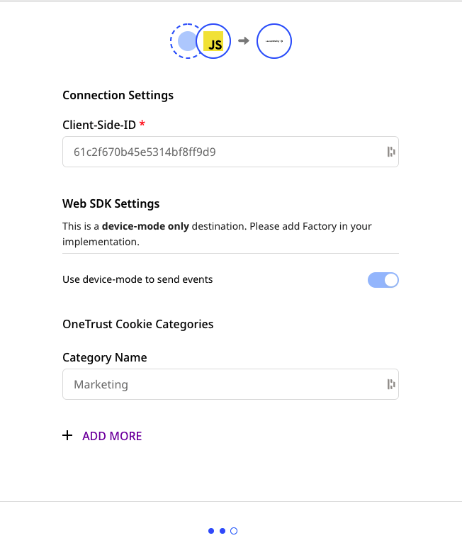
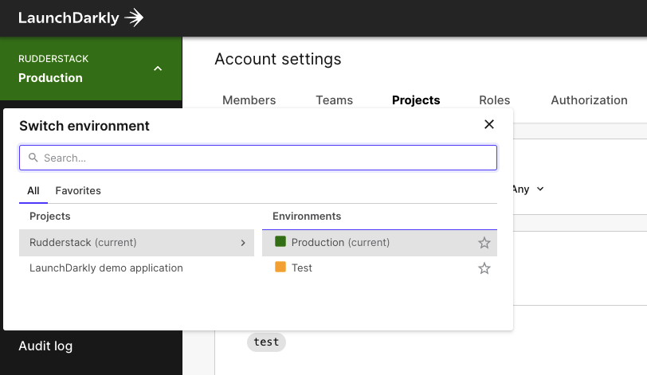
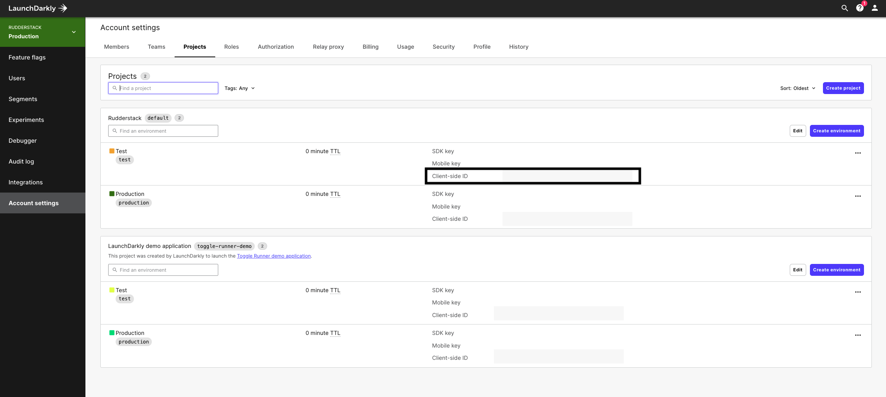

[LaunchDarkly](https://launchdarkly.com/) is a popular feature management platform that offers cutting-edge A/B testing and experimentation functionalities. It lets you efficiently automate and manage feature flags and improve overall product workflow and software quality.

RudderStack supports LaunchDarkly as a destination to which you can seamlessly send your data for flag management.

## Getting started

Before configuring LaunchDarkly as a destination in RudderStack, verify if the source platform is supported by LaunchDarkly by referring to the table below:

| Connection Mode     | Web           | Mobile                 | Server        |
| :------------------ | :------------ | :--------------------- | :-------------|
| **Device mode**     | **Supported**             | -                      | -            |
| **Cloud mode**      | - | -          | - |

<div class="infoBlock">
To know more about the difference between cloud mode and device mode in RudderStack, refer to the <Link to="/destinations/rudderstack-connection-modes/">RudderStack Connection Modes</Link> guide.
</div>

Once you have confirmed that the source platform supports sending events to LaunchDarkly, follow these steps:

1. From your [RudderStack dashboard](https://app.rudderstack.com/), add a source. Then, from the list of destinations, select **LaunchDarkly**.
2. Assign a name to the destination and click **Continue**.

### Connection settings

To successfully configure LaunchDarkly as a destination, you will need to configure the following settings:



* **Client-side ID**: Enter the client-side ID of your LaunchDarkly project.

<div class="infoBlock">
For more information on getting the LaunchDarkly client-side ID, refer to the <Link to="#faq">FAQ</Link> section below.
</div>

## Identify

The <Link to="/event-spec/standard-events/identify/">`identify`</Link> call lets you create or update a user in LaunchDarkly.

<div class="warningBlock">
You must call <code class="inline-code">identify</code> before making any <code class="inline-code">track</code> or <code class="inline-code">alias</code> calls.
</div>

A sample `identify` call is as shown below:

```javascript
rudderanalytics.identify(
  "1hKOmRA4GRlm", {
    anonymous: false,
    avatar: "https://avatarfiles.alphacoders.com/837/83744.jpg",
    country: "USA",
    custom: {
      favourite_color: "black"
    },
    email: "alex@example.com",
    firstName: "Alex",
    ip: "12.23.34.45",
    lastName: "Keener",
    name: "Alex Keener",
    privateAttributeNames: ["avatar", "country"],
    secondary: "abcd21234"
  }
);
```

### LaunchDarkly key

RudderStack assigns the `userId` to LaunchDarkly's `key` field to uniquely identify a user.

<div class="infoBlock">

<code class="inline-code">key</code> is the only required field in LaunchDarkly's <code class="inline-code">identify</code> call. If no unique identifier is provided, RudderStack will automatically assign <code class="inline-code">anonymousId</code> as <code class="inline-code">key</code>.
</div>

### Supported traits

The following table lists the supported fields for the `traits` object in the `identify` call:

| Field | Type | Presence | Description | 
|:------|:-----|:---------|:-------------|
| `anonymous`    | Boolean | Optional | Must be set to `true`.  |
| `avatar` | String | Optional | User's avatar image URL. |
| `country` | String | Optional | Country associated with the user. |
| `custom` | Object | Optional | Additional attributes associated with the user. |
| `email` | String | Optional | User's email address. |
| `firstName` | String | Optional | User's first name. |
| `ip` | String | Optional | User's IP address. |
| `lastName` | String | Optional | User's last name. |
| `name` | String | Optional | User's full name. |
| `privateAttributeNames` | String Array | Optional | List of attribute names (built-in or custom) marked as private and not sent to LaunchDarkly as analytics events. |
| `secondary` | String | Optional | User's secondary identifier. |

<div class="infoBlock">
If you have chosen to bucket the users by a specific attribute, the <code class="inline-code">secondary</code> field can be used to further distinguish the users who are otherwise identical as per that attribute. 
</div>

## Track

The <Link to="/event-spec/standard-events/track/">`track`</Link> call lets you record user events and send them to LaunchDarkly as custom conversion metrics for your experiments.

<div class="warningBlock">
As mentioned above, you must call <code class="inline-code">identify</code> before sending any <code class="inline-code">track</code> events to LaunchDarkly.
</div>

A sample `track` call is as shown:

```javascript
rudderanalytics.track("Test Event", {
  foo: "bar"
});
```

## Alias

The <Link to="/event-spec/standard-events/alias/">`alias`</Link> call lets you merge different identities of a known user. You can explicitly change the identity of a user via this call.

A sample `alias` call is shown below:

```javascript
rudderanalytics.alias("newUserId","userId");
```

## FAQ

### Where do I get the LaunchDarkly Client-side ID?

To get your LaunchDarkly client-side ID, follow these steps:

1. Log into your [LaunchDarkly dashboard](https://app.launchdarkly.com/).
2. Select your project, as shown:



3. Then, navigate to **Account settings** > **Projects**.
4. You will see the client-side ID for your project here.




