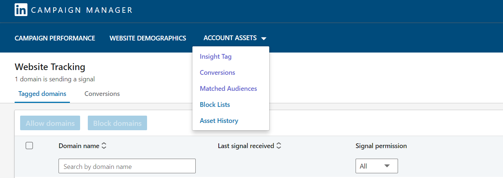
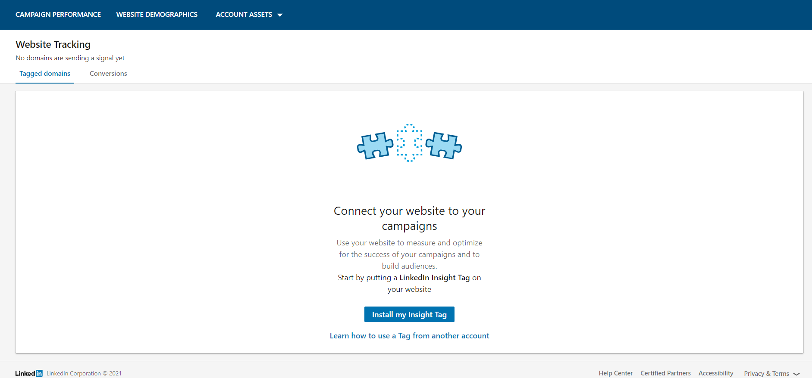
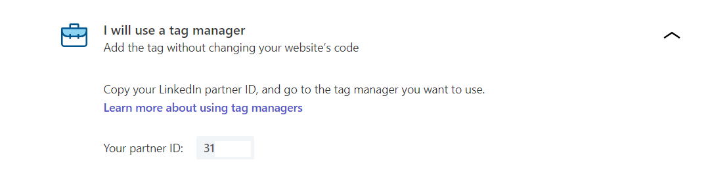
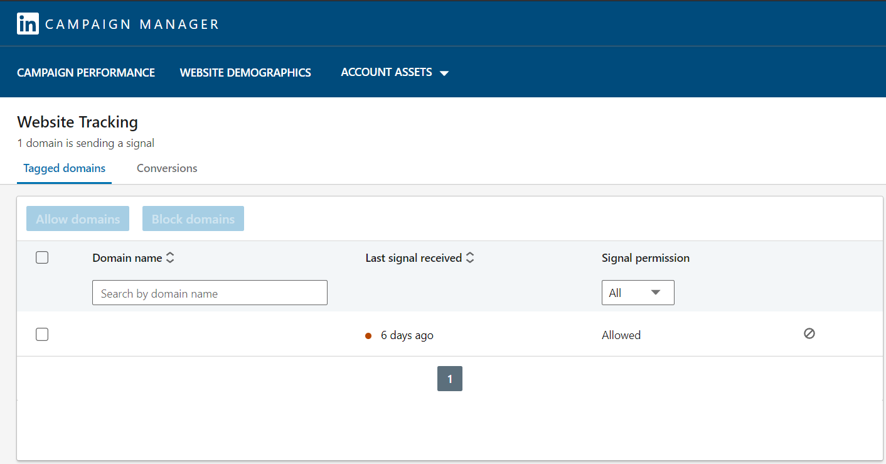

The [LinkedIn Insight Tag](https://business.linkedin.com/marketing-solutions/insight-tag) is a JavaScript code for your website that lets you track your conversions and retarget your website visitors and customers who interact with your ads. You can use the resulting insights to learn more about your customers and optimize your marketing campaigns.

RudderStack supports integration with the LinkedIn Insight Tag where you can seamlessly send your event data to LinkedIn.

Find the open source code for this destination in the <a href="https://github.com/rudderlabs/rudder-sdk-js/tree/production/integrations">GitHub repository</a>.

## Getting started

If you are already using LinkedIn Insight Tag on your website, we highly recommend you remove it.

Before configuring LinkedIn Insight Tag as a destination in RudderStack, verify if the source platform is supported by LinkedIn Insight Tag by referring to the table below:

| Connection Mode | Web | Mobile | Server |
| :--- | :--- | :--- | :--- |
| Device mode | Supported | - | - |
| Cloud mode | -  | - | - |

This integration is a device mode-only destination for the web (JavaScript) source. For more information on the RudderStack device mode, refer to the <Link to="/destinations/rudderstack-connection-modes/">RudderStack Connection Modes</Link> guide.

Once you have confirmed that the source platform supports sending events to LinkedIn Insight Tag, follow these steps:

1. From your [RudderStack dashboard](https://app.rudderstack.com/), add a source. Then, from the list of destinations, select **LinkedIn Insight Tag**.
2. Assign a name to the destination and click **Continue**.

### Connection settings

To successfully configure LinkedIn Insight Tag as a destination, you will need to configure the following settings:

- **Partner ID**: Enter your LinkedIn partner ID.

For more information on getting your LinkedIn partner ID, refer to the <Link to="#where-can-i-find-my-linkedin-partner-id">FAQ</Link> section below.

- **Event Conversion IDs**: 

- **Client-side Events Filtering**: This setting lets you specify which events should be blocked or allowed to flow through to the LinkedIn Insight Tag.

For more information on this setting, refer to the <Link to="/sources/sdks/event-filtering/">Client-side Events Filtering</Link> guide.

- **Use device mode to send events**: As this is a <Link to="https://www.rudderstack.com/docs/destinations/rudderstack-connection-modes/#device-mode">web device mode</Link>-only destination, this setting is enabled by default and cannot be disabled.
- **OneTrust Cookie Categories**: This setting lets you associate <Link to="/sources/sdks/rudderstack-javascript-sdk/consent-managers/onetrust/">OneTrust</Link> cookie consent groups to the LinkedIn Insight Tag destination.

## FAQ

### How does this integration work?

The RudderStack-LinkedIn Insight Tag integration workflow is explained below:

1. Configure **LinkedIn Insight Tag** as a destination in the [RudderStack dashboard](https://www.app.rudderstack.com/).
2. Install the <Link to="/sources/event-streams/sdks/rudderstack-javascript-sdk/quick-start-guide/#step-1-install-javascript-sdk">RudderStack JavaScript SDK</Link> on your website.
3. The JavaScript SDK automatically loads the Insight Tag tracking code.
4. The Insight Tag starts tracking the user activities on your website.

### What information can I track using the LinkedIn Insight Tag?

The LinkedIn Insight Tag lets you collect the data related to your users' website visit, including the URL, IP address, referrer, device and browser characteristics, and timestamp.

### Will this integration slow my website down?

The RudderStack SDK loads asynchronously with your website. When loading the LinkedIn Insight Tag tracking snippet, it will not slow down your website's performance at all.

### Where can I find my LinkedIn partner ID?

To get the Partner ID, open the Insight Tag and get the value corresponding to the  `_linkedin_partner_id` parameter, as shown:

Alternatively, you can follow the below steps:

1. Sign into your [LinkedIn Campaign Manager](https://www.linkedin.com/campaignmanager/login).
2. Create an ad account. Enter your account name, an optional LinkedIn page, and currency information. As of now, no payment is required.

3. Click your account name and locate the **Account Assets** dropdown menu. Then, select **Insight Tag**, as shown:

4. If you are using the LinkedIn Insight Tag for the first time, you will see the **Install my Insight Tag** option. 

5. If you have already set up your Insight Tag before, you will see the **Manage Insight Tag** option. Click it and choose **See Tag**.
6. Next, click **I will use a tag manager**. You should now be able to see your **Partner ID**.

Copy and paste this **Partner ID** in the RudderStack dashboard to set up your LinkedIn Insight Tag destination. You will also be able to see the website domains on which the Insight Tag is loaded, as shown:

Each LinkedIn Insight Tag has a unique Partner ID. If the Partner ID of the tag on your website does not match the Partner ID in your account, your conversions will be unable to collect the page loads and event-specific conversions.

