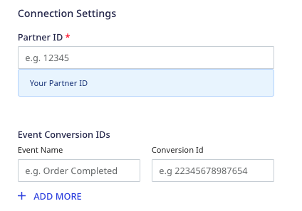
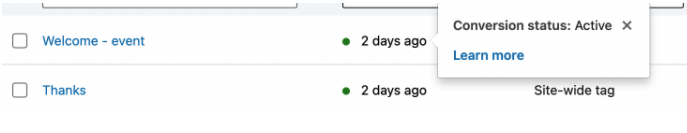
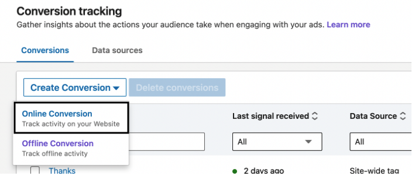
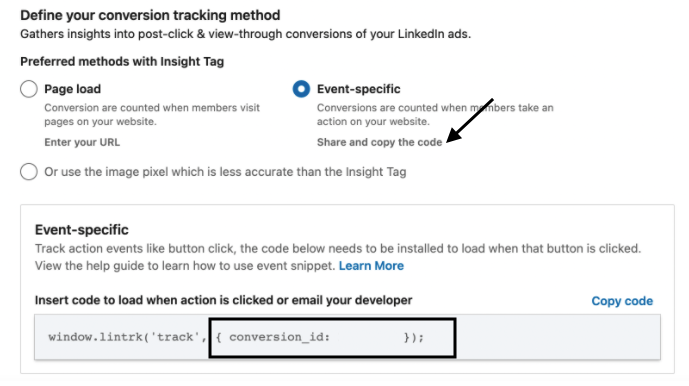
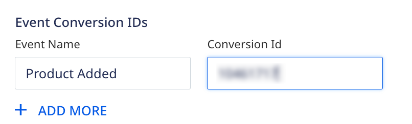
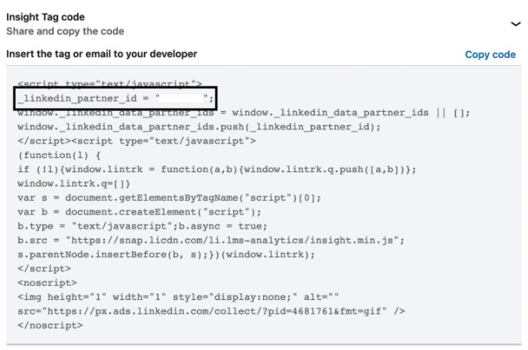
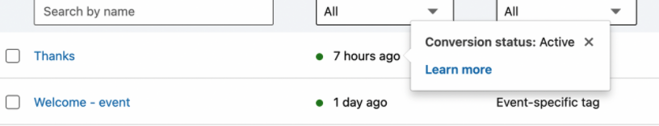

The [LinkedIn Insight Tag](https://business.linkedin.com/marketing-solutions/insight-tag) is a JavaScript code for your website that lets you track your conversions and retarget your website visitors and customers who interact with your ads. You can use the resulting insights to learn more about your customers and optimize your marketing campaigns.

RudderStack supports integration with the LinkedIn Insight Tag where you can seamlessly send your event data to LinkedIn.

<div class="infoBlock">
Find the open source code for this destination in the <a href="https://github.com/rudderlabs/rudder-sdk-js/tree/production-staging/src/integrations/LinkedInInsightTag">GitHub repository</a>.
</div>

## Getting started

<div class="warningBlock">
If you are already using LinkedIn Insight Tag on your website, removing it is highly recommended. This is because the RudderStack SDK automatically loads the Insight Tag tracking code and it may cause a conflict with the existing installation. For more information on the integration's workflow, refer to the <Link to="#faq">FAQ</Link> section below.
</div>

RudderStack supports sending event data to LinkedIn Insight Tag via the following <a href="https://rudderstack.com/docs/rudderstack-cloud/rudderstack-connection-modes/">connection modes</a>:

| Connection Mode | Web | Mobile | Server |
| :--- | :--- | :--- | :--- |
| Device mode | Supported | - | - |
| Cloud mode | -  | - | - |

<div class="infoBlock">
In a web device mode integration, that is, using <Link to="/sources/event-streams/sdks/rudderstack-javascript-sdk">JavaScript SDK</Link> as a source, the LinkedIn Insight Tag native SDK is loaded from <code class="inline-code">https://snap.licdn.com/</code> domain. Based on your website's content security policy, you might need to <Link to="/sources/event-streams/sdks/rudderstack-javascript-sdk/load-js-sdk/#allowlist-destination-domain">allowlist this domain</Link> to load the LinkedIn Insight Tag SDK successfully.
</div>

Once you have confirmed that the source platform supports sending events to LinkedIn Insight Tag, follow these steps:

1. From your [RudderStack dashboard](https://app.rudderstack.com/), add a source. Then, from the list of destinations, select **LinkedIn Insight Tag**.
2. Assign a name to the destination and click **Continue**.

### Connection settings

To successfully configure LinkedIn Insight Tag as a destination, you will need to configure the following settings:



- **Partner ID**: Enter your LinkedIn partner ID.

<div class="infoBlock">
For more information on getting your LinkedIn partner ID, refer to the <Link to="#where-can-i-find-my-linkedin-partner-id">FAQ</Link> section below.
</div>

- **Event Conversion IDs**: Enter the event name you want the Insight Tag to track and the corresponding conversion ID.

<div class="warningBlock">
The event names are case-sensitive. For example, RudderStack accepts <code class="inline-code">Order Completed</code>, <code class="inline-code">Order completed</code>, and <code class="inline-code">order completed</code> as three different events.
</div>

<div class="infoBlock">
For more information on getting the conversion ID, refer to the <Link to="#tracking-event-specific-conversions">Tracking event-specific conversions</Link> section below.
</div>

- **Client-side Events Filtering**: This setting lets you specify which events should be blocked or allowed to flow through to the LinkedIn Insight Tag.

<div class="infoBlock">
For more information on this setting, refer to the <Link to="/sources/sdks/event-filtering/">Client-side Events Filtering</Link> guide.
</div>

- **Use device mode to send events**: As this is a <Link to="https://www.rudderstack.com/docs/destinations/rudderstack-connection-modes/#device-mode">web device mode</Link>-only destination, this setting is enabled by default and cannot be disabled.
- **OneTrust Cookie Categories**: This setting lets you associate <Link to="/sources/sdks/rudderstack-javascript-sdk/consent-managers/onetrust/">OneTrust</Link> cookie consent groups to the LinkedIn Insight Tag destination.

## Tracking page loads

<div class="infoBlock">
For more information on the tracking methods supported by the Insight Tag, refer to the <a href="https://www.linkedin.com/help/lms/answer/a425606?trk=hc-articlePage-peopleAlsoViewed">LinkedIn support page</a>.
</div>

In this method, the Insight Tag automatically loads and tracks the conversions when users visit any pages on your website. Upon loading successfully, you can view the conversion status in your [Campaign Manager](https://www.linkedin.com/campaignmanager/accounts) dashboard, as shown:



## Tracking event-specific conversions

To track event-specific conversions, you need to first set up an Online Tracking conversion and define an event-specific conversion tracking. To do so, follow these steps:

1. Sign into your [LinkedIn Campaign Manager](https://www.linkedin.com/campaignmanager/accounts).
2. Click your account name and go to **Analyze** > **Conversion Tracking**.
3. Click the **Create Conversion** button and select **Online Conversion**.



4. Name your conversion and enter the relevant settings. For more information, refer to this <a href="https://www.linkedin.com/help/lms/answer/a425606/set-up-linkedin-conversion-tracking?lang=en">LinkedIn support page</a>.
5. Click **Next step** and select the campaign to track your conversion.
6. Under **Manually set up conversions**, go to **Define your conversion tracking method** and select **Event-specific**. 
7. Click **Copy code**. You will find the conversion ID listed here, as shown:



<div class="infoBlock">
You will need to install this generated code in your website that automatically loads and  tracks conversions for the specified event.
</div>

8. Finally, specify the **Event Name** for which the Insight Tag automatically loads this snippet and the corresponding conversion ID in the **Event Conversion IDs** dashboard setting.

<div class="infoBlock">
The event names are case-sensitive.
</div>

#### Use-case

Suppose you add the following event name-conversion ID mapping in the RudderStack dashboard:



When you call the `Product Added` event, the LinkedIn Insight Tag automatically loads the snippet with the mapped conversion ID and tracks the conversion event.

A sample `Product Added` event is shown below:

```javascript
rudderanalytics.track("Product Added", {
  numberOfRatings: "12",
  name: "item 1",
});
```

<div class="warningBlock">
RudderStack discards any <code class="inline-code">track</code> event that is not specified in the <strong>Event Conversion IDs</strong> dashboard setting.
</div>

## FAQ

### How does this integration work?

The RudderStack-LinkedIn Insight Tag integration workflow is explained below:

1. Configure **LinkedIn Insight Tag** as a destination in the [RudderStack dashboard](https://app.rudderstack.com/).
2. Install the <Link to="/sources/event-streams/sdks/rudderstack-javascript-sdk/quick-start-guide/#step-1-install-javascript-sdk">RudderStack JavaScript SDK</Link> on your website.
3. The JavaScript SDK automatically loads the Insight Tag tracking code.
4. The Insight Tag starts tracking the user activities on your website.

### What information can I track using the LinkedIn Insight Tag?

The LinkedIn Insight Tag lets you collect the data related to your users' website visits, including the URL, IP address, referrer, device and browser characteristics, and timestamp.

### Where can I find my LinkedIn partner ID?

To get the Partner ID, open the Insight Tag and get the value corresponding to the  `_linkedin_partner_id` parameter, as shown:



Alternatively, you can follow the steps in this <a href="https://www.linkedin.com/help/lms/answer/a417869/access-your-linkedin-partner-id?lang=en">LinkedIn support page</a> to access your LinkedIn partner ID.

<div class="warningBlock">
Each LinkedIn Insight Tag has a unique Partner ID. If the Partner ID of the tag on your website does not match the Partner ID in your account, the Insight Tag will be unable to collect the page loads and event-specific conversions.
</div>

### How can I verify if the event-specific conversions are tracked successfully?

Once you configure the **Event Conversion IDs** setting in the RudderStack dashboard, the LinkedIn Insight Tag automatically loads the code snippet and tracks the conversions for the specified events.

If the script has loaded correctly, it shows the label **Conversion status: Active** against the events in your dashboard, as shown:



In case the script has not loaded correctly, you will see the **Conversion Status** as **Unverified**, **No recent activity**, or **Inactive**.

### Will this integration slow my website down?

The RudderStack SDK loads asynchronously with your website. When loading the LinkedIn Insight Tag tracking snippet, it will not slow down your website's performance at all.