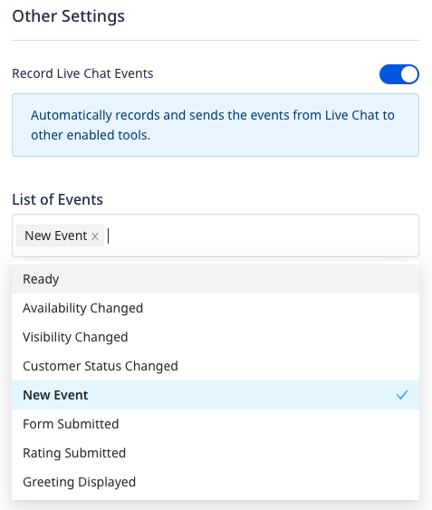

[LiveChat](https://www.livechat.com/) is a live chat software and customer service platform. It lets you manage user interactions across multiple channels and deliver more effective customer service.

RudderStack supports LiveChat as a destination where you can seamlessly send your event data.

## Getting started

RudderStack supports sending event data to LiveChat via the following <a href="https://rudderstack.com/docs/rudderstack-cloud/rudderstack-connection-modes/">connection modes</a>:

| Connection Mode | Web | Mobile | Server |
| :--- | :--- | :--- | :--- |
| Device mode | Supported | - | - |
| Cloud mode | -  | - | - |

<div class="infoBlock">
In the web device mode integration, that is, using <Link to="/sources/event-streams/sdks/rudderstack-javascript-sdk">JavaScript SDK</Link> as a source, the LiveChat native SDK is loaded from <code class="inline-code">https://cdn.livechatinc.com/</code> domain. Based on your website's content security policy, you might need to <Link to="/sources/event-streams/sdks/rudderstack-javascript-sdk/load-js-sdk/#allowlist-destination-domain">allowlist this domain</Link> to load the LiveChat SDK successfully.
</div>

Once you have confirmed that the source platform supports sending events to LiveChat, follow these steps:

1. From your [RudderStack dashboard](https://app.rudderstack.com/), add a source. Then, from the list of destinations, select **LiveChat**.
2. Assign a name to the destination and click **Continue**.

## Connection settings

To successfully configure LiveChat as a destination, you will need to configure the following settings:


- **License ID**: Enter your LiveChat license ID.

<div class="infoBlock">
For more information on obtaining your LiveChat license ID, refer to the <Link to="#faq">FAQ</Link> section below.
</div>

- **Record Live Chat Events**: Enable this setting to allow RudderStack to automatically record your LiveChat interactions as `track` events.

  

  - **List of Events**: If **Record Live Chat Events** setting is enabled, enter the list of LiveChat interactions for RudderStack to track.
  - **Update Event Name in track call**: Use this setting to map the standard LiveChat callback events with custom event names.

  

  <div class="infoBlock">
  For more information on this setting, refer to the <Link to="#mapping-events">Mapping events</Link> section below.
  </div>

- **Client-side Events Filtering**: This setting lets you specify which events should be blocked or allowed to flow through to LiveChat.


<div class="infoBlock">
For more information on this setting, refer to the <Link to="/sources/sdks/event-filtering/">Client-side Events Filtering</Link> guide.
</div>

- **Use device mode to send events**: As this is a <Link to="https://www.rudderstack.com/docs/destinations/rudderstack-connection-modes/#device-mode">web device mode</Link>-only destination, this setting is enabled by default and cannot be disabled.

## Identify

You can use the <Link to="/event-spec/standard-events/identify/">`identify`</Link> events to send all the user-related information to LiveChat.

RudderStack sends various **optional** `identify` properties by calling the following LiveChat functions:

| RudderStack property | LiveChat function |
| :----| :-----|
| `context.traits.email` | [`set_customer_email`](https://developers.livechat.com/docs/extending-chat-widget/javascript-api#set-customer-email) | 
| `message.traits` | [`set_custom_variables`](https://developers.livechat.com/docs/extending-chat-widget/javascript-api#set-session-variables) | 
| `context.traits.name` | [`set_customer_name`](https://developers.livechat.com/docs/extending-chat-widget/javascript-api#set-customer-name) | 

<div class="infoBlock">
RudderStack also leverages the <code class="inline-code">userId</code> present in the event to set a custom variable called <code class="inline-code">User ID</code>.
</div>

A sample `identify` call is shown below:

```javascript
rudderanalytics.identify("1hKOmRA4GRlm", {
  name: "Alex Keener",
  email: "alex@example.com",
  cart_value: "cart",
  "order date": "05/21/2019"
});
```

## Track

If you enable the **Record Live Chat Events** dashboard setting, RudderStack records the LiveChat interactions and sends them as <Link to="/event-spec/standard-events/track/">`track`</Link> events. You can then view and analyze these events in the other tools (connected to the same source in RudderStack).

<div class="infoBlock">
RudderStack only tracks the CTA interactions specified in the <strong>List of Events</strong> field in the dashboard settings. If this setting is not specified, RudderStack tracks all the interactions specified in the <Link to="#supported-events">Supported events</Link> section below.
</div>

### Supported events

RudderStack automatically records and sends the following <a href="https://developers.livechat.com/docs/extending-chat-widget/javascript-api#callbacks">LiveChat callbacks</a>:

| LiveChat event | `track` event name | Description |
| :---| :---|  :--- |
| [`onReady`](https://developers.livechat.com/docs/extending-chat-widget/javascript-api#on-ready) | `Ready` | When the chat widget has finished loading. |
| [`onAvailabilityChanged`](https://developers.livechat.com/docs/extending-chat-widget/javascript-api#on-availability-changed) |  `Availability Changed` | When the availability has changed for the current group. |
| [`onVisibilityChanged`](https://developers.livechat.com/docs/extending-chat-widget/javascript-api#on-visibility-changed) |  `Visibility Changed` | When the visibility of the chat widget has changed.  |
| [`onCustomerStatusChanged`](https://developers.livechat.com/docs/extending-chat-widget/javascript-api#on-customer-status-changed) |  `Customer Status Changed` |  When the customer's status has changed. |
| [`onNewEvent`](https://developers.livechat.com/docs/extending-chat-widget/javascript-api#on-new-event) |  `New Event` | Called in case of both the incoming and outgoing events. |
| [`onFormSubmitted`](https://developers.livechat.com/docs/extending-chat-widget/javascript-api#on-form-submitted) | `Form Submitted` | Called after a form is submitted in the chat. |
| [`onRatingSubmitted`](https://developers.livechat.com/docs/extending-chat-widget/javascript-api#on-rating-submitted) | `Rating Submitted` | When the customer has rated a chat or cancelled the previous rating. |
| [`onGreetingDisplayed`](https://developers.livechat.com/docs/extending-chat-widget/javascript-api#on-greeting-displayed) | `Greeting Displayed` | When the greeting is displayed to a customer. |
| [`onGreetingHidden`](https://developers.livechat.com/docs/extending-chat-widget/javascript-api#on-greeting-hidden) | `Greeting Hidden` | When the customer cancels the greeting. |
| [`onRichMessageButtonClicked`](https://developers.livechat.com/docs/extending-chat-widget/javascript-api#on-rich-message-button-clicked) | `Rich Message Button Clicked` |  When the customer clicks the rich message button. |

### Mapping events

You can also update the standard LiveChat callback events with custom event names by enabling the <strong>Update Event Name in track call</strong> setting in the RudderStack dashboard and specifying the required mapping, as shown:


Based on the mappings set in the above image, RudderStack replaces the standard event names `Ready` and `Availability Changed` with `new ready` and `new availability changed` respectively.

## FAQ

### Where can I find the LiveChat license ID?

To get your LiveChat license ID, follow these steps:

1. Log into your <a href="https://my.livechatinc.com/">LiveChat dashboard</a>.
2. In the bottom left corner, click the **Settings** icon and go to **Website**. 
3. You can find the license ID included in the installation snippet, as shown:

