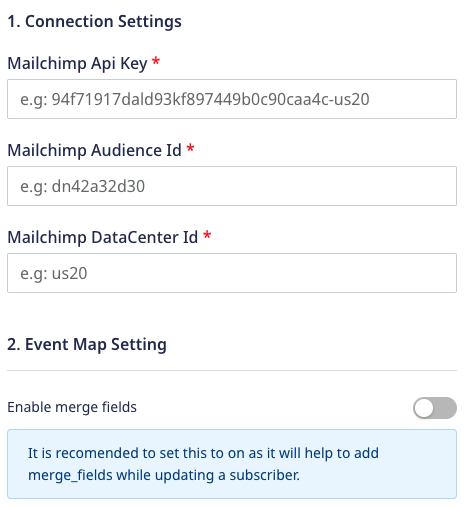

[Mailchimp](https://mailchimp.com/) is a popular email marketing automation platform used worldwide by thousands of businesses. Built specially for eCommerce and retail, Mailchimp allows you to build your audience and send them personalized campaign and marketing messages through web or mobile.

RudderStack supports Mailchimp as a destination to which you can seamlessly send your event data. Also, you can add people to your Mailchimp list via a simple `identify` call.

<div class="successBlock">
Find the open-source transformer code for this destination in our <a href="https://github.com/rudderlabs/rudder-transformer/tree/master/src/v0/destinations/mailchimp">GitHub repository</a>.
</div>

## Getting started

Before configuring Mailchimp as a destination in RudderStack, verify if the source platform is supported by Mailchimp by referring to the table below:

| **Connection Mode** | **Web**       | **Mobile**    | **Server**    |
| :------------------ | :------------ | :------------ | :------------ |
| **Device mode**     | -             | -             | -             |
| **Cloud mode**      | **Supported** | **Supported** | **Supported** |

<div class="infoBlock">
To learn more about the difference between Cloud mode and Device mode in RudderStack, read the <a href="https://rudderstack.com/docs/rudderstack-cloud/rudderstack-connection-modes/">RudderStack connection modes</a> guide.
</div>

Once you have confirmed that the source platform supports sending events to Mailchimp, follow these steps:

1. From your [RudderStack dashboard](https://app.rudderstack.com/), add a source. Then, from the list of destinations, select **Mailchimp**.
2. Assign a name to the destination and click **Continue**.

### Connection settings

To successfully configure Mailchimp as a destination, you will need to configure the following settings:



- **Mailchimp API Key**: Enter your Mailchimp API Key. 

<div class="infoBlock">
It is recommended to create a new API key for the RudderStack destination. Mailchimp restricts each API key to a maximum of 10 concurrent requests. Hence, creating a dedicated key for RudderStack ensures maximum throughput for the outgoing calls. Refer to the <a href="https://mailchimp.com/help/about-api-keys/">Mailchimp documentation</a> for more detaails.
</div>

- **Mailchimp Audience ID**: Enter your Mailchimp Audience ID.
- **Mailchimp DataCenter ID**: Enter your Mailchimp DataCenter ID. 
- **Enable Merge fields**: Enable this setting if you want to add merge fields while updating a subscriber.

<div class="infoBlock">
Refer to the <a href="#faq">FAQ</a> section for more information on how to get the above details.
</div>

## Identify

The <Link to="/event-spec/standard-events/identify">`identify`</Link> call captures the details about the visiting user along with the properties associated with that user.

### Adding or updating a user

A sample `identify` call is shown below:

```javascript
rudderanalytics.identify("1hKOmRA4el9Zt1WSfVJIVo4GRlm", {
    firstName: "Alex",
    lastName: "Keener",
    email: "alex@example.com"
});
```

Every time an `identify` call is made including an email address, RudderStack performs the following steps:

- RudderStack first checks with Mailchimp whether that specific email address exists for the `listId` provided in the destination settings.
- If the email address does not exist in the list, RudderStack subscribes the associated user to the list immediately. If the `doubleOptIn` setting is enabled, Mailchimp sends a confirmation email to that user, and that email is tagged with a `pending` subscriber status. The subscriber status automatically changes to `subscribed` once the user confirms the email.
- If the user already has a subscriber status such as `pending`, `subscribed`, `unsubscribed` or `cleaned`, RudderStack will **not** resubscribe them, but only update their associated user traits.

<div class="infoBlock">
<code class="inline-code">email</code> is a required field for the <code class="inline-code">identify</code> call. The rest of the fields must match the <strong>Merge Field</strong> tag in Mailchimp.
</div>

### Capture custom user traits

You can capture the custom user traits in the Mailchimp list dashboard by <Link to="#creating-custom-merge-fields">creating a custom merge field</Link> in Mailchimp. 

<div class="infoBlock">
Mailchimp supports merge tags only up to 10 characters. Hence, every user trait sent inside the <code class="inline-code">identify</code> call is trimmed to the first 10 characters and converted to uppercase before being sent to Mailchimp. Also, the <code class="inline-code">Merge Tags</code> is created by taking the 10 characters (excluding whitespace/special characters) of its <code class="inline-code">Field Label</code>.
<br/><br/>
For example, if you set the <code class="inline-code">Field Label</code> as <code class="inline-code">Upto 10-Char</code>, the <code class="inline-code">Merge Tag</code> will be <code class="inline-code">UPTO10CHAR</code>. The <code class="inline-code">user.trait</code> inside your <code class="inline-code">identify</code> call, which is, <code class="inline-code">Upto 10-Char</code>, will be converted to <code class="inline-code">UPTO10CHAR</code> before being sent to Mailchimp.
</div>

### Creating custom merge fields

<div class="infoBlock">
Create custom merge fields only for the traits you want to see in your list view and not for all <code class="inline-code">user.traits</code>.
</div>

To create and send custom merge fields or user traits to Mailchimp, please follow these steps:

- Create the merge field in Mailchimp for every trait you want sent to it.
- When you make the `identify` call, the keys that match the traits above will automatically appear in your Mailchimp list.

<div class="infoBlock">
The <code class="inline-code">identify</code> call will <strong>not change</strong> in this case.
</div>

### Overriding `listId`

If you have multiple lists that your users can subscribe to, you can override the default `listId` as a parameter to Mailchimp.

The following sample snippet overrides the default `listId` with `esf1rd234a` as `listId`: 

```javascript
rudderanalytics.identify(
  "1hKOmRA4el9Zt1WSfVJIVo4GRlm",
  {
    email: "alex@example.com"
  },
  {
    integrations: {
      MailChimp: {
        listId: "esf1rd234a"
      }
    }
  }
);
```

### Updating the subscription status

RudderStack provides you with the option to manually update the subscription status of a user by passing the `subscriptionStatus` parameter to Mailchimp.

An example is shown below:

```javascript
rudderanalytics.identify(
  "1hKOmRA4el9Zt1WSfVJIVo4GRlm",
  {
    email: "alex@example.com"
  },
  {
    integrations: {
      MailChimp: {
        subscriptionStatus: "unsubscribed"
      }
    }
  }
);
```

<div class="infoBlock">
This setting will <strong>NOT</strong> work for new users. For new users, the subscription status will always be set as <code class="inline-code">pending</code> or <code class="inline-code">subscribed</code>, depending on the set <code class="inline-code">doubleOptIn</code> setting.
</div>

## Track

You can use the <Link to="/event-spec/standard-events/track">`track`</Link> call to track user actions or [trigger targeted automations](https://mailchimp.com/developer/marketing/guides/track-outside-activity-events/#trigger-automations-with-events) in Mailchimp using their [Events](https://mailchimp.com/developer/marketing/api/list-member-events/) API.

A sample `track` call is shown below:

```javascript
rudderanalytics.track("registered_referral", {
  "referee_id": "1233",
  "referral_acceptance": "accepted",
  "email": "alex@example.com"
})
```

<div class="infoBlock">
<code class="inline-code">email</code> is a required field for making a <code class="inline-code">track</code> call successfully. You can pass it in either <code class="inline-code">traits.email</code> , <code class="inline-code">context.traits.email</code>, or <code class="inline-code">properties.email</code>. RudderStack hashes the <code class="inline-code">email</code> field and replaces <code class="inline-code">subscriber_hash</code> in the <a href="https://mailchimp.com/developer/marketing/api/list-member-events/">Mailchimp Events API endpoint</a>.
</div>

### Supported mappings

The following table lists the mappings between the RudderStack and Mailchimp properties:

| RudderStack property | Mailchimp property | Notes |
| :--- | :--- |:--- |
| `event`<br/> <span style="color: #4D4DFF;font-size:12px;">Required</span> | `name` | Event name must contain 2-30 characters. | 
| `properties` | `properties` | - |
| `properties.isSyncing` | `is_syncing` | RudderStack triggers the [targeted automations](https://mailchimp.com/developer/marketing/guides/track-outside-activity-events/#trigger-automations-with-events) by default. However, you can set `isSyncing` to `true` if you don't want to trigger them. |
| `originalTimestamp` | `occurred_at` |  - |

<div class="infoBlock">
RudderStack stringifies all the values received in <code class="inline-code">properties[key]</code> as Mailchimp only accepts the string values in <code class="inline-code">properties[key]</code>. 
</div>

## FAQ

### Where do I get the Mailchimp API Key?

To get the Mailchimp API Key, log in to Mailchimp, and go to **Account** > **Extras** > **API Keys**.

### Where do I get the Mailchimp Audience ID?

You can find the Mailchimp Audience ID by logging in to Mailchimp and navigating to **Audience** > **Manage Audience** > **Settings** > **Audience name and defaults**.

### Where do I get the Mailchimp DataCenter ID?

To get the DataCenter ID, please refer to your Mailchimp URL in the browser. For example, if the URL is `https://us20.admin.mailchimp.com/lists`, the DataCenter ID is `us20` in this case.


