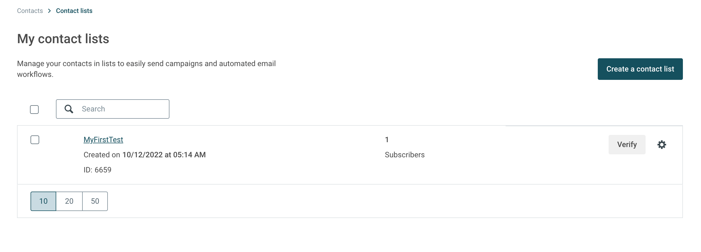

[Mailjet](https://www.mailjet.com/) is a popular email marketing and delivery platform. It lets you create and send impactful email marketing campaigns, newsletters, and automated emails to grow your business.

<div class="infoBlock">
Find the open source code for this destination in the <a href="https://github.com/rudderlabs/rudder-transformer/tree/master/src/v0/destinations/mailjet">GitHub repository</a>.
</div>

## Getting started

RudderStack supports sending events to Mailjet via the following <Link to="/destinations/rudderstack-connection-modes/">connection modes</Link>:

| **Connection Mode** | **Web**       | **Mobile**    | **Server**    |
| :------------------ | :------------ | :------------ | :------------ |
| **Device mode**     |       -        |        -       |        -       |
| **Cloud mode**      |      Supported       |     Supported    |    Supported     |

Once you have confirmed that the source platform supports sending events to Mailjet, follow these steps:

1. From your [RudderStack dashboard](https://app.rudderstack.com/), add the source. Then, from the list of destinations, select **Mailjet**.
2. Assign a name to your destination and click **Continue**.

### Connection settings 

To successfully set up Mailjet as a destination, you need to configure the following settings:

- **Mailjet API Key**: Enter your Mailjet API key.
- **Mailjet API Secret**: Enter your Mailjet secret key.
- **Mailjet Contact List ID**: Enter your Mailjet contact list ID. RudderStack will use this ID if the list ID is not provided via the `externalId` field in the event's payload.

<div class="infoBlock">
Refer to the <Link to="#faq">FAQ</Link> section for more information on obtaining the Mailjet API Key, secret key, and contact list ID.
</div>

- **Map RudderStack user attributes to Mailjet contact properties**: Use this setting to map your RudderStack event properties to specific custom properties created in the Mailjet dashboard. For more information on creating and managing contact properties, refer to the <a href="https://documentation.mailjet.com/hc/en-us/articles/360043176353-How-to-create-manage-contact-properties-">Mailjet documentation</a>.

<div class="warningBlock">
Mailjet will not create a contact for the event properties configured in the RudderStack dashboard but not created in Mailjet.
</div>


## Identify

You can use the <Link to="/event-spec/standard-events/identify/">`identify`</Link> call to add or remove a contact in Mailjet. If a contact already exists, RudderStack updates the contact details.

A sample `identify` call is shown below:

```javascript
rudderanalytics.identify('1hKOmRA4el9Z', {
      firstName: 'Alex',
      lastName: 'Keener',
      email: "alex@example.com"
    }, {
      externalId: [{
        type: "listId",
        id: "13314el9Z"
      }],
      integrations: {
        mailjet: {
          Action: "remove"
        }
      }
    );
```

When sending events to Mailjet, note the following:

- The `email` field is mandatory. Otherwise, Mailjet rejects the events.
- You can specify the Mailjet list ID either in the **Mailjet Contact List ID** setting of the RudderStack dashboard or in the `externalId` field.
- You can specify the Mailjet action (adding/removing user) in the `Action` field of the `integrations` object. If no action is specified, RudderStack sets this field to `addnoforce`, by default.

<div class="infoBlock">
For more information on the <code class="inline-code">addnoforce</code> parameter, refer to the <a href="https://dev.mailjet.com/email/reference/contacts/subscriptions/">Mailjet Subscriptions API reference</a>.
</div>

### Supported mappings

The following table lists the mappings between the RudderStack attributes and the Mailjet properties:

| RudderStack property | Mailjet property |
| :--------------| :---------|
| `traits.email` <br/> <span style="color: #4D4DFF;font-size:12px;">Required</span> | `Email` |
| `traits.name` | `Name` |
| `context.traits.IsExcludedFromCampaigns` <br/> `traits.IsExcludedFromCampaigns` | `IsExcludedFromCampaigns` |


## FAQ

### Where can I find the Mailjet API key and secret key?

To obtain your Mailjet API key and secret, follow these steps:

1. Log into your [Mailjet dashboard](https://app.mailjet.com/account).
2. From the top right section of the dashboard, click your name and go to **Account settings** > **REST API** > **API Key Management (Primary and Sub-account)**. Your primary API key and secret will listed here, as shown:


### Where can I find contact list ID in Mailjet?

To get your Mailjet contact list ID, log into your [Mailjet dashboard](https://app.mailjet.com/account) and go to **Contacts** > **Contact Lists**. You can find your contact lists and the associated IDs listed here, as shown:

