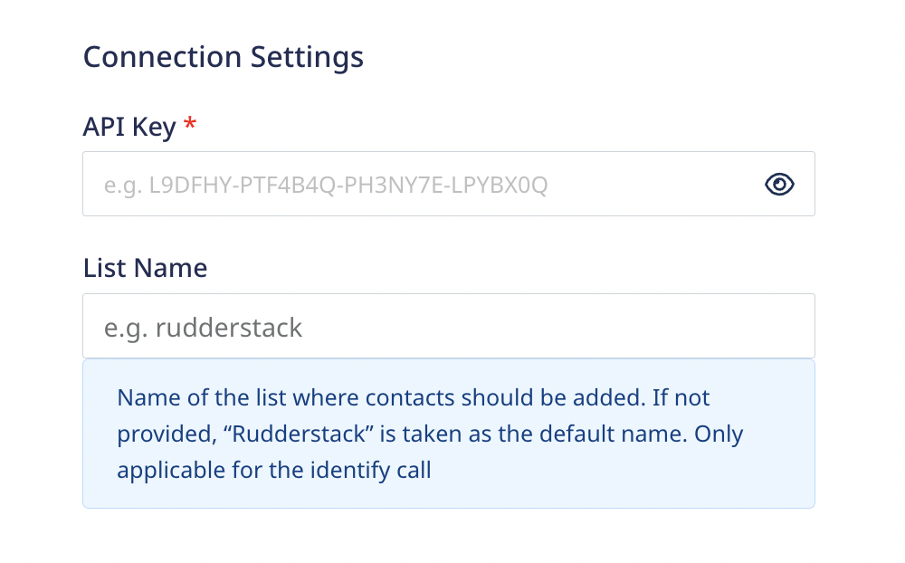
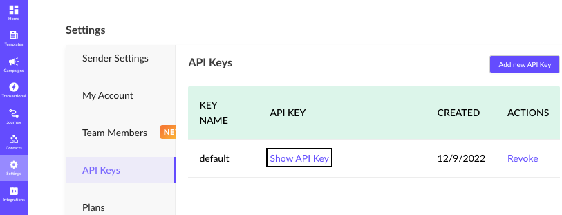

[Mailmodo](https://www.mailmodo.com/) is an interactive email marketing tool that provides several useful features such as, sending transactional campaigns, email automation and drip emails with customer journeys, WYSIWYG email editor and many other tool integrations.

<div class="infoBlock">
RudderStack also supports <a href ="/sources/event-streams/cloud-apps/mailmodo/">Mailmodo as a source</a> which can be referrred for more information.
</div>

## Getting started

Before configuring Mailmodo as a destination in RudderStack, verify if the source platform is supported by Mailmodo by referring to the table below:

| Connection Mode | Web | Mobile | Server |
| :--- | :--- | :--- | :--- |
| Device mode | - | - | - |
| Cloud mode | Supported  | Supported | Supported |

<div class="infoBlock">
To know more about the difference between cloud mode and device mode in RudderStack, refer to the <Link to="/destinations/rudderstack-connection-modes/">RudderStack Connection Modes</Link> guide.
</div>

Once you have confirmed that the source platform supports sending events to Mailmodo, follow these steps:

1. From your [RudderStack dashboard](https://app.rudderstack.com/), add a source. Then, from the list of destinations, select **Mailmodo**.
2. Assign a name to the destination and click **Continue**.

## Connection settings

To successfully configure Mailmodo as a destination, you will need to configure the following settings:



- **API Key**: Enter your Mailmodo API key.

<div class="infoBlock">
For more information on obtaining your Mailmodo API key, refer to the <Link to="#FAQ">FAQ</Link> section below.
</div>

- **List Name**: This field is **only applicable** for the `identify` call. Enter the name of the Mailmodo list where contacts should be added. If not provided, `rudderstack` is taken as the default list name. 

## Identify

You can use the <Link to="/event-spec/standard-events/identify/">`identify`</Link> call to [add contacts to your Mailmodo list](https://www.mailmodo.com/developers/6661e4fb7833e-bulk-add-contact-to-a-list/). If a contact already exists, the contact details are updated.

<div class="warningBlock">
No more than 100 contacts can be added in a single  <code class="inline-code">identify</code> call.
</div>

A sample `identify` call is shown below:

```javascript
{
  "userId": "1hKOmRA4el9Z",
  "anonymousId": "78c53c15-32a1-4b65-adac-bec2d7bb8",
  "context": {
    "traits": {
      "trait1": "new-val"
    },
    "ip": "14.5.67.21",
    "library": {
      "name": "http"
    }
  },
  "traits": {
    "email": "alex@example.com",
    "name": "Alex Keener",
    "firstName": "Alex",
    "lastName": "Keener",
    "age": 40,
    "phone": "+1-202-555-0146",
    "lastClick": "2020-02-02T00:23:09.544Z",
    "lastOpen": "2020-02-02T00:23:09.544Z"
  },
  "timestamp": "2020-02-02T00:23:09.544Z"
}
```

### Supported mappings

The following table lists the mappings between the RudderStack and Mailmodo properties:

| RudderStack property | Mailmodo property | Presence |
| :--------------| :---------| :--------------|
| `traits.email`/`context.traits.email` | `value.email` | Required |
| `traits.{accepted-param}`/`context.traits.{accepted-param}` | `values.data.{any-param}` | Optional |

<div class="warningBlock">
To know more about the <code class="inline-code">accepted-param</code> and their mappings, refer to the <a href="https://github.com/rudderlabs/rudder-transformer/blob/master/v0/destinations/mailmodo/data/identifyConfig.json">Github repository</a>.
</div>

## Track

You can use the <Link to="/event-spec/standard-events/track">`track`</Link> call to [add custom events for a contact](https://www.mailmodo.com/developers/93cba3fa7f1ea-add-event/).

A sample `track` call is shown below:

```javascript
{
  "userId": "1hKOmRA4el9Z",
  "anonymousId": "78c53c15-32a1-4b65-adac-bec2d7bb8",
  "event": "Product Purchased",
  "properties": {
    "name": "Shirt",
    "email": "alex@example.com",
    "revenue": 4.99
  },
  "context": {
    "ip": "14.5.67.21",
    "library": {
      "name": "http"
    }
  },
  "timestamp": "2020-02-02T00:23:09.544Z"
}
```

### Supported mappings

The following table lists the mappings between the RudderStack and Mailmodo properties:

| RudderStack property | Mailmodo property | Presence |
| :--------------| :---------| :--------------|
| `event` | `event_name` | Required |
| `traits.email`/`context.traits.email`/`properties.email` | `email` | Required |
| `timestamp` | `ts` | Optional (UNIX epoch in seconds)|
| `properties` | `event_properties` | Optional |


## FAQ

### Where can I find the Mailmodo API key?

To obtain your Mailmodo API key, follow these steps:

1. Log into your [Mailmodo dashboard](https://manage.mailmodo.com/auth/login).
2. Go to **Settings** > **API Keys** as shown:


