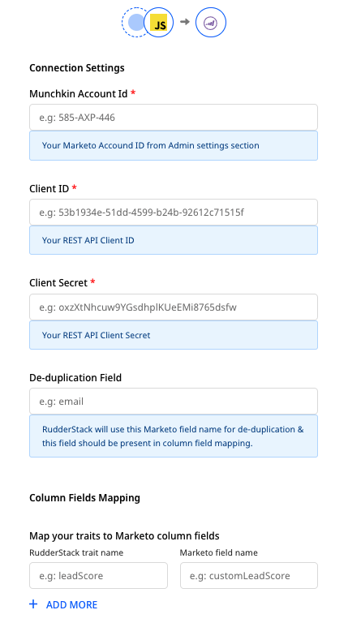

[**Marketo**](https://marketo.com) is a leading marketing automation platform. It lets you identify the right audiences and deliver enhanced user experiences through effective marketing campaigns and behavioral tracking.

RudderStack supports Marketo Lead Import as a destination to which you can send large amounts of lead records asynchronously via Marketo's [bulk API](https://developers.marketo.com/rest-api/bulk-import/bulk-lead-import/).

<div class="infoBlock">
Find the open source transformer code for this destination in the <a href="https://github.com/rudderlabs/rudder-transformer/tree/master/src/v0/destinations/marketo_bulk_upload">GitHub repository</a>.
</div>

## Getting started

<div class="successBlock">
This destination is ideal for your <Link to="/sources/reverse-etl/">Reverse ETL</Link> sources, as it only accepts <code class="inline-code">identify</code> events.
</div>

Before configuring Marketo Lead Import as a destination in RudderStack, verify if the source platform is supported by referring to the table below:

| **Connection Mode** | **Web** | **Mobile** | **Server** |
| :--- | :--- | :--- | :--- |
| **Device mode** | **-** | **-** | **-** |
| **Cloud mode** | **Supported** | **Supported** | **Supported** |

<div class="infoBlock">
To learn more about the difference between cloud mode and device mode in RudderStack, refer to the <Link to="/destinations/rudderstack-connection-modes/">RudderStack Connection Modes</Link> guide.
</div>

Once you have confirmed that the source platform supports sending events to Marketo Lead Import, follow these steps:

- From your [RudderStack dashboard](https://app.rudderstack.com/), add the source. Then, from the list of destinations, select **Marketo Lead Import**.
- Assign a name to your destination and then click **Next**.

## Connection settings

To successfully configure Marketo Lead Import as a destination, you will need to configure the following settings:



- **Munchkin Account ID**: Enter your Munchkin ID, which is a unique identifier for your Marketo instance. To obtain this ID, log into your Marketo instance and navigate to the **Admin** section. In the left menu, go to **Integration** > **Munchkin**. Your Munchkin Account ID will be listed in the **Tracking Code** section on the main screen.

<div class="infoBlock">

For more information on finding your Munchkin Account ID, refer to the <a href="https://nation.marketo.com/t5/knowledgebase/how-to-find-your-munchkin-id-for-a-marketo-instance/ta-p/248432">Marketo knowledge base</a>.
</div>

- **Client ID**: To get your **Client ID**, go to the the **Admin** section of your Marketo instance. In the left menu, go to **Integration** > **LaunchPoint**. Finally, select the API service and click **View Details** to get your client ID.

<div class="infoBlock">

For more information on finding your Client ID, refer to the <a href="https://developers.marketo.com/rest-api/authentication/">Marketo knowledge base</a>.
</div>

- **Client Secret**: You can find your Marketo client secret next to the **Client ID** obtained in the previous step.
- **De-duplication Field**: Marketo uses this field to de-duplicate user information. Make sure it is also present in the **Column Fields Mapping** setting below.

<div class="warningBlock">

This field should be present in all the events sent to Marketo Lead Import for proper de-duplication.
</div>

<div class="infoBlock">

While calling the <a href="https://developers.marketo.com/rest-api/bulk-import/bulk-lead-import/">Bulk Lead Import API</a>, RudderStack uses this field for lookup. Marketo then uses it to de-duplicate user information. Generally, <code class="inline-code">email</code> should be preferred for de-duplication.
</div>

- **Column Fields Mapping**: This option lets you map your incoming events' traits to the **Leads** table columns' API names. 

For example, to send the data from the event traits `firstName` and `email` to the Marketo columns with the API names `name` and `Email`, set the mapping as shown:

| **RudderStack traits** | **Marketo API name** |
| :--- | :--- |
| `firstName` | `name` |
| `email` | `Email` |

You can find your columns' API names by following the [**Marketo documentation**](https://developers.marketo.com/rest-api/bulk-import/bulk-custom-object-import/).

## Identify

<div class="infoBlock">
RudderStack supports only <code class="inline-code">identify</code> event type for this destination.
</div>

The <Link to="/event-spec/standard-events/identify">`identify`</Link> call lets you identify a visiting user and associate them to their actions. It also lets you record the traits about them like their name, email address, etc.

A sample `identify` call is as shown:

```javascript
rudderanalytics.identify("name123", {
  name: "Name Surname",
  firstName: "Name",
  lastName: "Surname",
  email: "name@surname.com",
  createdAt: "Thu Mar 24 2020 17:46:45 GMT+0000 (UTC)",
});
```

The corresponding mapping to the Marketo traits for the above event is as shown:

| **Marketo field name** | **Traits** |
| :--- | :--- |
| `name` | `firstName` |
| `Email` | `email` |
| `birthday` | `birthday` |
| `phone` | `phone_number` |
| `timestamp` | `createdAt` |

RudderStack then sends the following values to Marketo:

```
Name, name@surname.com, , , Thu Mar 24 2020 17:46:45 GMT+0000 (UTC)
```


