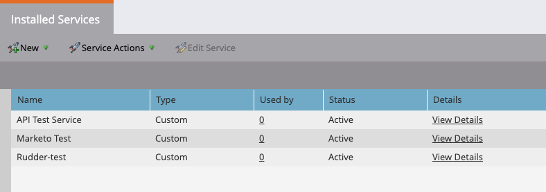
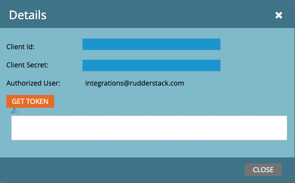

[Marketo Static Lists](https://experienceleague.adobe.com/docs/marketo/using/product-docs/core-marketo-concepts/smart-lists-and-static-lists/static-lists/understanding-static-lists.html?lang=en) is a <Link to="/destinations/streaming-destinations/marketo/">Marketo</Link> feature that lets you automatically group your Marketo records.

<div class="infoBlock">
Find the open source code for this destination in the <a href="">GitHub repository</a>.
</div>

## Getting started

RudderStack supports sending event data to Marketo Static Lists via the following <a href="https://rudderstack.com/docs/rudderstack-cloud/rudderstack-connection-modes/">connection modes</a>:

| **Connection Mode** | **Web**       | **Mobile**    | **Server**    |
| :------------------ | :------------ | :------------ | :------------ |
| **Device mode**     | -         | -         | -         |
| **Cloud mode**      | **Supported** | **Supported** | **Supported** |

Once you have confirmed that the source platform supports sending events to Marketo Static Lists, follow these steps:

1. From your [RudderStack dashboard](https://app.rudderstack.com/), add the source. Then, from the list of destinations, select **Marketo Static Lists**.
2. Assign a name to the destination and click **Continue**.

## Connection settings

To successfully configure Marketo Static Lists as a destination in RudderStack, you need to configure the following settings:

- **Munchkin Account ID**: Enter your Munchkin account ID. For more information on obtaining your Munchkin ID, refer to the <Link to="#faq">FAQ</Link> section below.
- **Client ID**: Enter your Marketo client ID.
- **Client Secret**: Enter the associated client secret for the above client ID.

<div class="infoBlock">
For more information on obtaining your Marketo client ID and secret, refer to the <Link to="#faq">FAQ</Link> section below.
</div>

- **Static List ID**: Enter your Marketo static list ID. RudderStack uses this ID to add or remove leads from the specific list. For more information on obtaining your static list ID, refer to the <Link to="#faq">FAQ</Link> section below.

<div class="infoBlock">
RudderStack prioritizes the <code class="inline-code">marketoStaticListId</code> provided in the event's <code class="inline-code">externalId</code> over the <strong>Static List ID</strong> dashboard setting. If <code class="inline-code">marketoStaticListId</code> is absent in <code class="inline-code">externalId</code>, RudderStack looks for the static list ID in this setting, as it is mandatory to send event data successfully to Marketo.
</div>

## `audienceList` structure

You can [add](https://developers.marketo.com/rest-api/assets/static-lists/#add_to_list) or [remove](https://developers.marketo.com/rest-api/assets/static-lists/#remove_from_list) users to a Marketo static list via the `audienceList` calls.

The following code snippet shows a sample `audienceList` call:

```json
{
  "userId": "1hKOm4GRlm",
  "anonymousId": "anon-id-new",
  "type": "audiencelist",
  "properties": {
    "listData": {
      "add": [{
          "id": 123
        },
        {
          "id": 234
        }
      ],
      "remove": [{
          "id": 456
        },
        {
          "id": 567
        }
      ]
    }
  },
  "context": {
    "ip": "14.5.67.21",
    "library": {
      "name": "http"
    },
    "externalId": [{
      "type": "marketoStaticListId",
      "id": 1234
    }]
  }
}
```

RudderStack transforms this data and sends it to Market Static Lists in the required format.

### Supported mappings

The following table details the mapping of the RudderStack `audienceList` properties and Marketo Static Lists properties:

| RudderStack property | Static Lists property | Notes |
| :----| :------|  :---|
| `properties.listData.add[x].id` <br /><span style="color: #4D4DFF;font-size:12px;">Required</span> | `id` | IDs to be added to the list. |
| `properties.listData.remove[x].id` <br /><span style="color: #4D4DFF;font-size:12px;">Required</span> | `id` | IDs to be removed from the list. |
| `context.externalId.marketoStaticListId`  | `listId` | If specified, takes precedence over the **Static List ID** dashboard setting. |

## FAQ

### Where can I find my Munchkin account ID?

To get your Munchkin account ID, follow these steps:

1. Log into your Marketo instance.
2. Go to **Admin** > **Integration** > **Munchkin**.

Your Munchkin ID is listed on the main screen in the **Tracking Code** section, as shown:


<div class="infoBlock">
For more information, refer to the <a href="https://nation.marketo.com/t5/knowledgebase/how-to-find-your-munchkin-id-for-a-marketo-instance/ta-p/248432">Marketo documentation</a>.
</div>

### How do I obtain the Marketo client ID and secret?

To set up the Marketo API service and obtain the client ID and secret associated with it, follow these steps:

1. Log into your Marketo instance and click the **Admin** tab.
2. Select **LaunchPoint**.


3. Here, you will able to see all the installed services used for connecting to Marketo.



4. To create a new service, click **New** > **New Service**.
5. Enter the **Display Name**. From the **Service** dropdown, select **Custom**.
6. Under **Settings**, enter the **Description** and select the **API Only User**, as shown. Finally, click **CREATE**.


<div class="warningBlock">
Make sure the <strong>API Only User</strong> associated with the API service has the necessary permissions to create or update contacts as well as the custom activities.
</div>

Once the setup is complete, you should have the client ID and client secret for the API service. Use this to configure the Marketo destination in RudderStack.


<br />

### Where can I find the Marketo static list ID?

To get your Marketo static list ID, follow these steps:

1. Log into your Marketo instance.
2. Go to the **Database** tab. 
3. Create a new static list. For more information, refer to the <a href="https://experienceleague.adobe.com/docs/marketo/using/product-docs/core-marketo-concepts/smart-lists-and-static-lists/static-lists/create-a-static-list.html?lang=en">Marketo documentation</a>.
4. Open the static list. You can find the list ID in the resulting URL, as shown:


<br />

For example, if the static list URL is `https://engage-ab.marketo.com/?munchkinId=123-AXP-456#/classic/ST1234A1`, then the static list ID is `1234`.