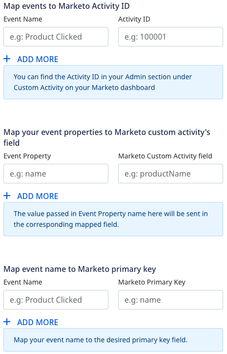

[Marketo](https://marketo.com) is a leading marketing automation platform that enables you to identify the right audiences through effective behavioral tracking and deliver automated, personalized marketing campaigns.

RudderStack supports Marketo as a destination where you can seamlessly send your event data.

<div class="infoBlock">
Find the open source transformer code for this destination in the <a href="https://github.com/rudderlabs/rudder-transformer/tree/master/src/v0/destinations/marketo">GitHub repository</a>.
</div>

## Getting started

<div class="warningBlock">
Before setting up the Marketo destination in RudderStack, you must create two fields in Marketo with the API names exactly as <code class="inline-code">userId</code> and <code class="inline-code">anonymousId</code>. RudderStack looks up the Marketo Lead objects using these properties. <strong>Without these two fields, all the events will fail</strong>.
</div>

Before configuring Marketo as a destination in RudderStack, verify if the source platform is supported by Marketo by referring to the table below:

| **Connection Mode** | **Web**       | **Mobile**    | **Server**    |
| :------------------ | :------------ | :------------ | :------------ |
| **Device mode**     | **-**         | **-**         | **-**         |
| **Cloud mode**      | **Supported** | **Supported** | **Supported** |

<div class="infoBlock">
To know more about the difference between cloud mode and device mode in RudderStack, refer to the <Link to="/destinations/rudderstack-connection-modes/">RudderStack Connection Modes</Link> guide.
</div>

Once you have confirmed that the source platform supports sending events to HubSpot, follow these steps:

1. From your [RudderStack dashboard](https://app.rudderstack.com/), add the source. Then, from the list of destinations, select **Marketo**.
2. Assign a name to the destination and click **Continue**.

## Connection settings

To successfully configure Marketo as a destination in RudderStack, you need to configure the following settings:

- **Munchkin Account ID**: Enter your Munchkin account ID.

<div class="infoBlock">
You can find the Munchkin Account ID by logging into your Marketo instance and going to <strong>Admin</strong> &gt; <strong>Integration</strong> &gt; <strong>Munchkin</strong>. Your Munchkin ID is listed on the main screen in the <strong>Tracking Code</strong> section. For more information, refer to the <a href="https://nation.marketo.com/t5/knowledgebase/how-to-find-your-munchkin-id-for-a-marketo-instance/ta-p/248432">Marketo documentation</a>.
</div>

- **Client ID**: Enter your Marketo client ID.
- **Client Secret**: Enter your Marketo client secret next.

<div class="infoBlock">
You can find the client ID and client secret by logging into your Marketo instance and going to <strong>Admin</strong> &gt; <strong>Integration</strong> &gt; <strong>LaunchPoint</strong>. Select the API service and click <strong>View Details</strong> to get the credentials. For more information, refer to the <Link to="#how-do-i-obtain-the-marketo-client-id-and-secret">FAQ</Link> section below.
</div>

### Custom Activity Settings

- **Track anonymous events**: Enable this setting to track events that don't contain a `userId`. 

<div class="warningBlock">
If this setting is disabled, events that don't contain the <code class="inline-code">userId</code> field will automatically fail.
</div>

- **Create lead if it does not exist**: If enabled, RudderStack will create a new Marketo lead if the user is not present.

The following settings are associated with the <Link to="#track">`track`</Link> events and require you to first <a href="https://experienceleague.adobe.com/docs/marketo/using/product-docs/administration/marketo-custom-activities/create-a-custom-activity.html">create a Custom Activity in Marketo</a> before sending an event. You also need to approve the activity in order to get the <strong>Custom Activity ID</strong>.



- **Map events to Marketo Activity ID**: Use this setting to map the event name in `track` call to Marketo's custom activity ID. For example, you can map a **Product Clicked** event to a custom activity with the ID **100001** and name **Product wishlisted**.
- **Map your event properties to Marketo custom activity's field**: Use this setting to map your `track` event properties to the Marketo fields listed in your custom activity. For example, you can map **Product Clicked** event's `product_name` property to the Marketo's `productName` field in the **Product wishlisted** custom activity.
- **Map event name to Marketo primary key**: Map the `track` event name to the Marketo primary key associated with the custom activity. For example, you can map the **Product Clicked** event to Marketo's `product_id` primary field in the **Product wishlisted** custom activity. The primary field for Marketo's custom activity is marked with an asterisk (*).

### Lead Mapping

- **Map your traits to Marketo custom fields**: RudderStack maps some of the user traits to the custom Marketo fields by default (listed in the <Link to="#supported-mappings">Supported mappings</Link> section). You can use this setting to override the default mappings or map any other traits to the custom Marketo fields. For custom Marketo fields, you can use the [list of standard Marketo fields](https://developers.marketo.com/rest-api/lead-database/fields/list-of-standard-fields/) (REST API Name column) or any other custom field names existing in your lead records.

## Identify

You can use the <Link to="/event-spec/standard-events/identify/">`identify`</Link> call to create or update a Lead object in Marketo.

A sample `identify` call is as shown:

```javascript
rudderanalytics.identify("1hKOmRA4GRlm", {
  name: "Alex Keener",
  first_name: "Alex",
  last_name: "Keener",
  email: "alex@example.com",
})
```

### Supported mappings

By default, RudderStack maps the following `traits` to the Marketo fields:

| RudderStack trait | Marketo field   |
| :------------------- | :----------------------- |
| `address.city` | `city`                         |
| `company.name`           | `company`           |
| `address.country` | `country`                    |
| `email`  | `email`                              |
| `firstName`| `firstName`                        |
| `company.industry` | `industry`                 |
| `lastName`  | `lastName`                         |
| `leadSource` | `leadSource`              |
| `company.employee_count` | `numberOfEmployees`   |
| `phone` | `phone`                               |
| `address.zip` | `postalCode`                     |
| `rating` | `rating`                              |
| `address.state` | `state`                       |
| `address.street`  | `address`                     |
| `title`   | `title`                               |
| `birthday` | `dateOfBirth`                       |
| `website`  | `website`                           |

<div class="infoBlock">
For the rest of the fields that you want to sync with Marketo, you can create a mapping of your traits and custom Marketo fields in the RudderStack dashboard, as specified in the <Link to="#lead-mapping-settings">Lead Mapping settings</Link> section.
</div>

## Track

You can use the <Link to="/event-spec/standard-events/track/">`track`</Link> events to register custom activities in Marketo. 

<div class="warningBlock">
Make sure to <a href="https://experienceleague.adobe.com/docs/marketo/using/product-docs/administration/marketo-custom-activities/create-a-custom-activity.html">create the custom activities in Marketo</a> before sending the events. Also, approve the activity in Marketo to get the <strong>Custom Activity ID</strong>.
</div>

A sample `track` call is as shown in the snippet below:

```javascript
rudderanalytics.track("Order Completed", {
  checkout_id: "C324532",
  order_id: "T1230",
  value: 15.98,
  revenue: 16.98,
  shipping: 3.0,
  coupon: "FY21",
  currency: "INR",
})
```
<div class="infoBlock">
Refer to the <Link to="/destinations/streaming-destinations/marketo/#custom-activity-settings">Custom Activity Settings</Link> section for more information on mapping the <code class="inline-code">track</code> events.
</div>

## FAQ

### Why are my requests failing with the message "Lookup failed"?

Make sure you have created two fields in Marketo with the names `userId` and `anonymousId`, so that RudderStack can look up the Marketo lead database for `leadId` with the `userId` that are passed along with the event.

### Why are my `track` events failing?

- Make sure you have created two fields in Marketo with the API names exactly as `userId` and `anonymousId`. RudderStack looks up the Marketo lead objects using these properties. Without these two fields, all the events will fail.
- If you're sending `track` events without `userId`, make sure you have enabled the `Track Anonymous events` setting in the RudderStack dashboard. If this setting is disabled, events that don't contain the `userId` field will fail.

### How do I obtain the Marketo client ID and secret?

To set up the Marketo API service and obtain the client ID and secret associated with it, follow these steps:

1. Log into your Marketo instance and click the **Admin** tab.
2. Select **LaunchPoint**.


3. Here, you will able to see all the installed services used for connecting to Marketo.


4. To create a new service, click **New** > **New Service**.
5. Enter the **Display Name**. From the **Service** dropdown, select **Custom**.
6. Under **Settings**, enter the **Description** and select the **API Only User**, as shown. Finally, click **CREATE**.


<div class="warningBlock">
Make sure the <strong>API Only User</strong> associated with the API service has the necessary permissions to create or update contacts as wellas the custom activities.
</div>

Once the setup is complete, you should have the client ID and client secret for the API service. Use this to configure the Marketo destination in RudderStack.


<br />

### How do I create a custom activity in Marketo?

For a step-by-step guide on creating a custom activity in Marketo, refer to this <a href="https://experienceleague.adobe.com/docs/marketo/using/product-docs/administration/marketo-custom-activities/create-a-custom-activity.html">Marketo documentation</a>.
