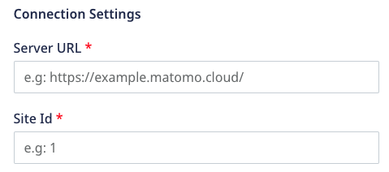
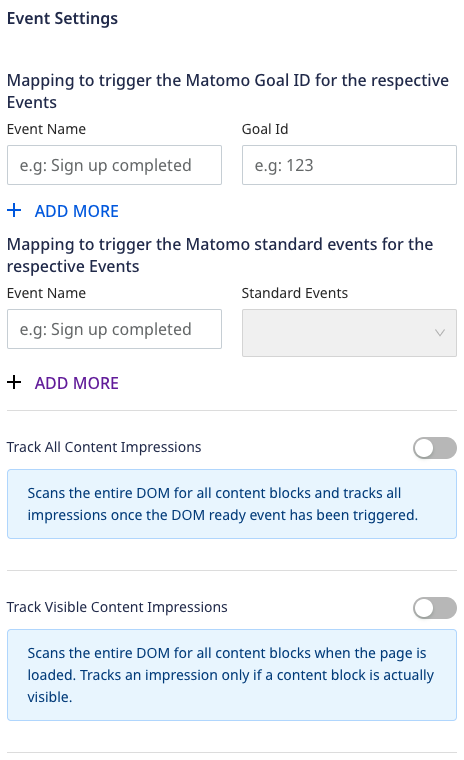
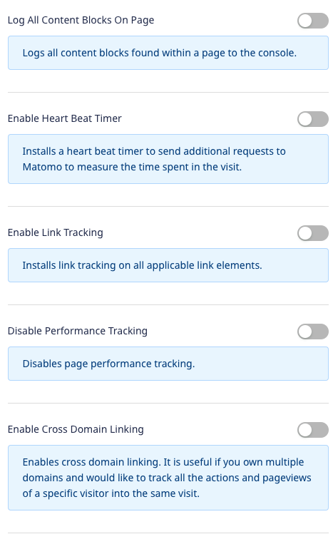
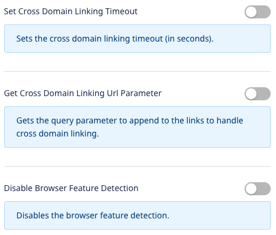
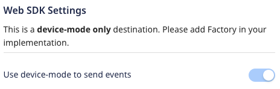
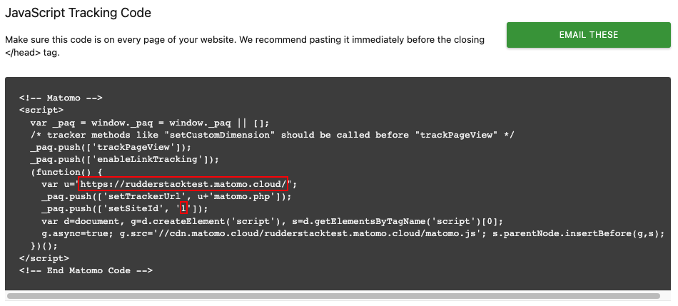

[Matomo](https://matomo.org/), formerly Piwik, is an open source web analytics platform. It can be used to derive valuable insights into your website's visitors and marketing campaigns so as to optimize your strategy and online experience for your visitors.

RudderStack supports Matomo as a destination to which you can seamlessly send your event data.

## Getting started

RudderStack supports sending event data to Matomo via the following <a href="https://rudderstack.com/docs/rudderstack-cloud/rudderstack-connection-modes/">connection modes</a>:

| Connection Mode | Web | Mobile | Server |
| :--- | :--- | :--- | :--- |
| Device mode | Supported | - | - |
| Cloud mode | -  | - | - |

<div class="infoBlock">
In the web device mode integration, that is, using <Link to="/sources/event-streams/sdks/rudderstack-javascript-sdk">JavaScript SDK</Link> as a source, the Matomo native SDK is loaded from <code class="inline-code">https://cdn.matomo.cloud/</code> domain. Based on your website's content security policy, you might need to <Link to="/sources/event-streams/sdks/rudderstack-javascript-sdk/load-js-sdk/#allowlist-destination-domain">allowlist this domain</Link> to load the Matomo SDK successfully.
</div>


Once you have confirmed that the source platform supports sending events to Matomo, follow these steps:

1. From your [RudderStack dashboard](https://app.rudderstack.com/), add a source. Then, from the list of destinations, select **Matomo**.
2. Assign a name to the destination and click on **Continue**.

## Connection settings

To successfully configure Matomo as a destination, you will need to configure the following settings:



- **Server URL**: Enter your server URL mentioned under the **JavaScript Tracking Code** section in Matomo dashboard.
- **Site Id**: Enter your site Id mentioned under the **JavaScript Tracking Code** section in Matomo dashboard.

<div class="infoBlock">
Refer to the <Link to="#faq">FAQ</Link> section below for more information on finding the Server URL and Site Id.
</div>

### Event settings





- **Mapping to trigger the Matomo Goal ID for the respective Events**: Enter the **Event Name** and the [**Goal Id**](https://developer.matomo.org/guides/tracking-javascript-guide#manually-trigger-goal-conversions) to be triggered when that event is called.

<div class="successBlock">
You can specify multiple <strong>Goal Id's</strong> for one <strong>Event Name</strong> and vice versa.
</div>

- **Mapping to trigger the Matomo standard events for the respective Events**: Enter the event name and pick the standard event from the dropdown to be triggered when that event is called.

<div class="successBlock">
You can specify multiple <strong>Standard Events</strong> for one <strong>Event Name</strong> and vice versa.
</div>

- **Track All Content Impressions**: Enable this setting to scan the entire DOM for all content blocks and track all impressions, once the DOM ready event has been triggered.
- **Track Visible Content Impressions**: Enable this setting to scan the entire DOM for all content blocks as soon as the page is loaded. It tracks an impression only if a content block is actually visible. If enabled, also enter the following:
    - **Check on Scroll**: Checks whether the previously hidden content blocks became visible meanwhile after a scroll and if yes, then tracks the impression. It is enabled by default. 
    - **Time interval in ms**: Enter the time to rescan the entire DOM for new content impressions. By default, the rescan is done every 750ms. To disable it, pass the value as 0.
- **Log All Content Blocks On Page**: Enable this setting to log all the content blocks found within a page to the console. This is useful while debugging/testing the content tracking.
- **Enable Heart Beat Timer**: Enable this setting to install a heart beat timer to send additional requests to Matomo to measure the time spent in the visit. These requests will be sent only when the user's tab is active and in focus and will not track additional actions or pageviews. If enabled, also enter the following:
    - **Active Time in seconds**: Enter the time interval after which a ping request should be sent. The default value is 15 seconds, meaning that if a page is viewed for at least 15 seconds, only then a ping request will be sent.
- **Enable Link Tracking**: Enable this setting to install link tracking on all the applicable link elements.
- **Disable Performance Tracking**: Enable this setting to disable the page performance tracking.
- **Enable Cross Domain Linking**: Enable this setting to enable cross domain linking. Refer to the [Matomo document](https://developer.matomo.org/api-reference/tracking-javascript#:~:text=enableCrossDomainLinking) for more information.
- **Set Cross Domain Linking Timeout**: Enable this setting to set the cross domain linking timeout (in seconds). If enabled, also enter the following:
    - **Timeout**: Enter the timeout interval. By default, the two visits across domains are linked together when the link is clicked and the page is loaded within a 180 seconds timeout window.
- **Get Cross Domain Linking Url Parameter**: Enable this setting to get the query parameter to append to links to handle cross domain linking. Refer to the [Matomo document](https://developer.matomo.org/api-reference/tracking-javascript#:~:text=getCrossDomainLinkingUrlParameter) for more information.
- **Disable Browser Feature Detection**: Enable this setting to disable the browser feature detection. Refer to the [Matomo document](https://developer.matomo.org/api-reference/tracking-javascript#:~:text=disableBrowserFeatureDetection) for more information.

### Web device mode settings



- **Use device mode to send events**: As this is a device mode-only destination, this setting is enabled by default and cannot be disabled.

## Identify

RudderStack sets the ID value in the cache to the `userId` or `anonymousId` present in the <Link to="/event-spec/standard-events/identify/">`identify`</Link> call. 

A sample `identify` call is shown below:

```javascript
rudderanalytics.identify("1hKOmRA4GRlm");
```

The following table lists the RudderStack and Matomo property to set the `userId` in the `identify` call:

| RudderStack property | Matomo property | Presence | Matomo Method |
| :--- | :--- | :--- | :--- |
| `userId`/`anonymousId` | `userId` | Required | `_paq.push(["setUserId","user_id"])` |

## Track

The <Link to="/event-spec/standard-events/track/">`track`</Link> method lets you capture user events along with the properties associated with them.

A sample `track` call is shown below:

```javascript
rudderanalytics.track("Order Completed",{
"category": "Orders",
"action": "Pass",
"value": 15
});
```

### Generic events

RudderStack sends a generic `track` call which is a not a <Link to="#standard-event">standard event</Link> or an <Link to="#ecommerce-events">ecommerce event</Link> as a Matomo [`trackEvent`](https://developer.matomo.org/guides/tracking-javascript-guide#manually-trigger-events) event.

The following table lists the property mappings between RudderStack and Matomo for `trackEvent`:

| RudderStack property | Matomo property | Presence |
|:----------------------|:--------------------|:----------------|
| `properties.category` | `category` | Required |
| `properties.action` | `action` | Required |
| `event` | `name` | Optional |
| `properties.value` | `value` | Optional |

### Standard events

<div class="warningBlock">
For RudderStack to send an event as a standard Matomo event, you need to specify the event mapping under the <strong>Mapping to trigger the Matomo standard events for the respective Events</strong> setting in the RudderStack dashboard. For more information, refer to the <Link to="#event-settings">Event settings</Link> section above.
</div>

RudderStack supports the following Matomo standard events:

- [Ping](https://developer.matomo.org/api-reference/tracking-javascript#:~:text=test%20content%20tracking.-,ping,-()%20%2D%20Send%20a)
- [Track Content Impressions](https://developer.matomo.org/api-reference/tracking-javascript#:~:text=trackContentImpression)
- [Track Content Impressions Within Node](https://developer.matomo.org/api-reference/tracking-javascript#:~:text=trackContentImpressionsWithinNode)
- [Track Content Interaction](https://developer.matomo.org/api-reference/tracking-javascript#:~:text=trackContentInteraction)
- [Track Content Interaction Node](https://developer.matomo.org/api-reference/tracking-javascript#:~:text=trackContentInteractionNode)
- [Track Link](https://developer.matomo.org/api-reference/tracking-javascript#:~:text=custom%20revenue%20customRevenue.-,trackLink,-(%20url%2C%20linkType%20))
- [Track Site Search](https://developer.matomo.org/api-reference/tracking-javascript#:~:text=optional%20numeric%20value.-,trackSiteSearch,-(keyword%2C%20%5Bcategory%5D%2C%20%5BresultsCount))

RudderStack first verifies if an event is mapped to a standard Matomo event. If so, it sends the event to Matomo with some specific properties, as listed in the following sections.

<div class="warningBlock">
These properties should be present in the events for RudderStack to successfully send them to Matomo.
</div>

#### Ping

Use this event to send a ping request.

<div class="infoBlock">
The ping requests do not track new actions. Matomo ignores these requests if they're sent after a standard visit length.
</div>

#### Track Content Impressions

Use this event to track a content impression using the specified values.

RudderStack maps the following event properties to the Matomo standard event properties:

| RudderStack property | Matomo property | Description |
|:---------------------|:-------------| :-----|
| `properties.contentName` | `contentName` | Represents a content block visible in the reports. One name can represent different content pieces. |
| `properties.contentPiece` | `contentPiece` | Actual displayed content, for example, path to a video, image, etc. |
| `properties.contentTarget` | `contentTarget` | URL of the landing page where the user was directed to after interacting with the block. |

#### Track Content Impressions Within Node

Use this event to scan a given DOM node and its associated children for content blocks and track impressions for them, if not done already.

RudderStack maps the following event properties to the Matomo standard event properties:

| RudderStack property | Matomo property |
|:---------------------|:-------------|
| `properties.domId`/ `properties.dom_id` | `domId` |

#### Track Content Interaction

Use this event to track a content interaction with the specified values.

RudderStack maps the following event properties to the Matomo standard event properties:

| RudderStack property | Matomo property |
|:---------------------|:-------------|
| `properties.contentInteraction`| `contentInteraction` |
| `properties.contentName` | `contentName` |
| `properties.contentPiece` | `contentPiece` |
| `properties.contentTarget` | `contentTarget` |

#### Track Content Interaction Node

Use this event to track the interaction with a given DOM node or a content block.

RudderStack maps the following event properties to the Matomo standard event properties:

| RudderStack property | Matomo property |
|:---------------------|:-------------|
| `properties.domId`/ `properties.dom_id` | `domId` |
| `properties.contentInteraction`| `contentInteraction` |

#### Track Link

Use this event to log a click from your code.

RudderStack maps the following event properties to the Matomo standard event properties:

| RudderStack property | Matomo property | Description |
|:---------------------|:-------------| :------------------| 
| `properties.url`/ `message.context.page.url` | `url` | The full URL to be tracked as a click. |
| `properties.linkType` | `linkType` | Defines the link type. Can either be `link` for an outlink or `download` for the download link type. |

#### Track Site Search

Use this event to track an internal site search for a given keyword with an optional category and specifying the optional search results count in the page.

RudderStack maps the following event properties to the Matomo standard event properties:

| RudderStack property | Matomo property |
|:---------------------|:-------------|
| `properties.keyword`/`properties.search`/`message.context.page.search` | `keyword` |
| `properties.category` | `category` |
| `properties.resultsCount` | `resultsCount` |

### Ecommerce events

RudderStack supports and maps the following <Link to="/event-spec/ecommerce-events-spec/">ecommerce events</Link> to the corresponding Matomo [ecommerce events](https://developer.matomo.org/api-reference/tracking-javascript#ecommerce:~:text=most%20recent%20referrer.-,Ecommerce,-Matomo%20provides%20ecommerce):

| RudderStack Event | Matomo Event |
|:--------------------------------|:--------------------------|
| `Product Viewed` | `setEcommerceView` |
| `Product Added` | `addEcommerceItem` |
| `Product Removed` | `removeEcommerceItem` |
| `Order Completed` | `trackEcommerceOrder` |
| `Cart Cleared` | `clearEcommerceCart` |
| `Update Cart` | `trackEcommerceCartUpdate` |

For the above-mentioned events, you can also send specific properties as mentioned in the following sections.

#### Product Viewed

RudderStack maps the `Product Viewed` event to <a href="https://developer.matomo.org/api-reference/tracking-javascript#ecommerce:~:text=click%20here.-,setEcommerceView,-(%20productSKU%2C%20productName%2C%20categoryName"><code class="inline-code">setEcommerceView</code></a>. The following event properties are mapped to the Matomo properties:

| RudderStack property | Matomo property | Presence |
|:---------------------|:-------------|:--------------|
| `properties.sku`/`properties.product_id` | `productSKU` | Required |
| `properties.name` | `productName` |Required |
| `properties.category` | `categoryName` |Required |
| `properties.price` (Multiplied by quantity) | `price` |Required |

<div class="infoBlock">
You can view the <code class="inline-code">Product Viewed</code> event in the Matomo dashboard only when it is followed by a <code class="inline-code">page</code> call.
</div>

#### Product Added

RudderStack maps the `Product Added` event name to <a href="https://developer.matomo.org/api-reference/tracking-javascript#ecommerce:~:text=category%20page%20view.-,addEcommerceItem,-(%20productSKU%2C%20%5BproductName%5D%2C%20%5BproductCategory"><code class="inline-code">addEcommerceItem</code></a>. The following event properties are mapped to the Matomo properties:

| RudderStack property | Matomo property | Presence |
|:---------------------|:-------------|:--------------|
| `properties.sku`/`properties.product_id` | `productSKU` | Required |
| `properties.name` | `productName` |Optional |
| `properties.category` | `categoryName` |Optional |
| `properties.price` (Multiplied by quantity) | `price` |Optional |
| `properties.quantity` | `quantity` |Optional |

<div class="infoBlock">
You can view the <code class="inline-code">Product Added</code> event in the Matomo dashboard only when it is followed by an <code class="inline-code">Update Cart</code> or <code class="inline-code">Order Completed</code> event.
</div>

#### Product Removed

RudderStack maps the `Product Removed` event name to <a href="https://developer.matomo.org/api-reference/tracking-javascript#ecommerce:~:text=in%20the%20order.-,removeEcommerceItem,-(%20productSKU%20)%20%2D%20Remove"><code class="inline-code">removeEcommerceItem</code></a>. The following event properties are mapped to the Matomo properties:

| RudderStack property | Matomo property | Presence |
|:---------------------|:-------------|:--------------|
| `properties.sku`/`properties.product_id` | `productSKU` | Required |

<div class="infoBlock">
You can view the <code class="inline-code">Product Removed</code> event in the Matomo dashboard only when it is followed by an <code class="inline-code">Update Cart</code> or <code class="inline-code">Order Completed</code> event.
</div>

#### Order Completed

RudderStack maps the `Order Completed` event name to <a href="https://developer.matomo.org/api-reference/tracking-javascript#ecommerce:~:text=from%20the%20cart.-,trackEcommerceOrder,-(%20orderId%2C%20grandTotal%2C%20%5BsubTotal"><code class="inline-code">trackEcommerceOrder</code></a>. The following event properties are mapped to the Matomo properties:

| RudderStack property | Matomo property | Presence |
|:---------------------|:-------------|:--------------|
| `properties.order_id`/`properties.orderId` | `orderId` | Required |
| `properties.total`/`properties.revenue` | `grandTotal` |Required |
| `properties.subtotal` | `subtotal` |Optional |
| `properties.tax` | `tax` |Optional |
| `properties.shipping` | `shipping` |Optional |
| `properties.discount` | `discount` |Optional |

<div class="infoBlock">
<code class="inline-code">grandTotal</code> is not a default property in the <code class="inline-code">Order Completed</code> event and needs to be provided by the user. If not provided, RudderStack calculates it manually by iterating through the products array, as shown below:

```text
grandTotal = products[0].price * products[0].quantity + …
grandTotal += tax + shipping;
```
Similarly, <code class="inline-code">subtotal</code> is calculated as the total value of all sales, excluding shipping and tax.

</div>

#### Update Cart

<div class="infoBlock">
Although <code class="inline-code">Update Cart</code> is not a standard <Link to="/event-spec/ecommerce-events-spec/">RudderStack Ecommerce Event</Link>, you can still send this event to update your cart and view the items that are currently present in it.
</div>

RudderStack also maps the `Update Cart` event name to <a href="https://developer.matomo.org/api-reference/tracking-javascript#ecommerce:~:text=trackEcommerceCartUpdate"><code class="inline-code">trackEcommerceCartUpdate</code></a>. The following event properties are mapped to the Matomo properties:

| RudderStack property | Matomo property | Presence |
|:---------------------|:-------------|:--------------|
| `properties.total/properties.revenue` | `grandTotal` | Required | 

## Page

The <Link to="/event-spec/standard-events/page/">`page`</Link> call lets you record your website's page views with any additional relevant information about the viewed page.

A sample `page` call is shown below:

```javascript
rudderanalytics.page("home","games");
```

<div class="infoBlock">
RudderStack does not consider any parameters inside the  <code class="inline-code">page</code> call and simply calls the  <code class="inline-code">trackPageView</code> event for each  <code class="inline-code">page</code> call.
</div>

## Custom dimensions

Custom dimensions can be used to track any information related to any action or visitors.

<div class="warningBlock">
You can send the custom dimensions to Matomo only through the <code class="inline-code">track</code> calls.
</div>

RudderStack provides `customDimension` field which can be used inside the `integrations` object, as shown below:

```javascript
{
  integrations: {
    Matomo: {
      customDimension: [{
          dimensionId: <dimension_ID>,
          dimensionValue: <dimension_value>
        },
        {
          dimensionId: 1,
          dimensionValue: ENTERPRISE
        }
      ]
    }
  }
}
```

<div class="infoBlock">
Refer to the <a href="https://matomo.org/faq/reporting-tools/data-limits-for-custom-dimensions/">Matomo help guide</a> to know about the data limitations for custom dimensions in Matomo.
</div>

<div class="infoBlock">
RudderStack does not support sending custom variables to Matomo. Matomo recommends using custom dimensions instead. For more information, refer to this <a href="https://plugins.matomo.org/CustomVariables#description:~:text=This%20feature%20used%20to%20be%20part%20of%20Matomo.%20However%2C%20we%20no%20longer%20plan%20to%20further%20develop%20custom%20variables%20and%20only%20fix%20important%20bugs%20or%20security%20issues%20and%20we%20might%20stop%20supporting%20Custom%20Variables%20in%20the%20future">Matomo page</a>.
</div>

## FAQ

### Where can I find the Server URL and Site Id?

To find the Matomo Server URL and Site Id:

1. Log into your [Matomo dashboard](https://matomo.org/login). 
2. Go to **Settings** > **Website** > **Tracking Code**.
3. Under **JavaScript Tracking Code** section, you will find the below: 



Here, the server URL: `https://rudderstacktest.matomo.cloud/` and site Id: `1`


