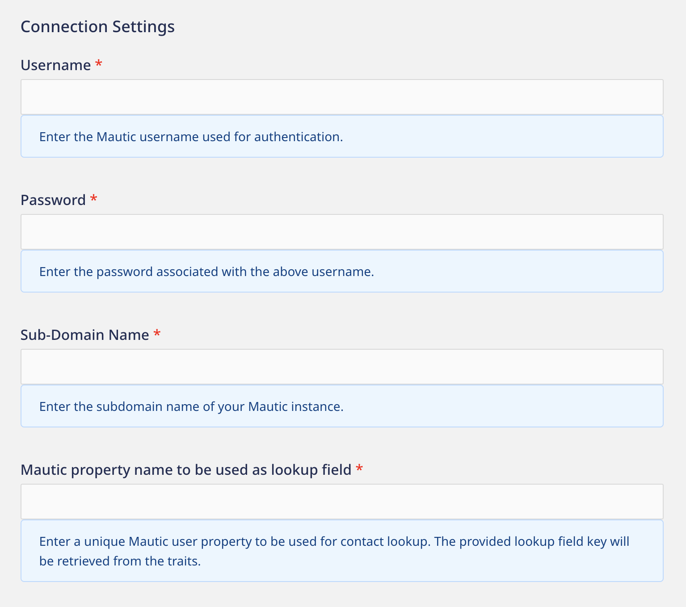

[Mautic](https://www.mautic.org/) is an open-source marketing automation platform. It enables you to segment your contacts based on business requirements, personalize your marketing strategy, and create personalized campaigns for better customer engagement.

RudderStack supports Mautic as a destination where you can seamlessly send your event data.

## Getting started

Before configuring Mautic as a destination in RudderStack, verify if the source platform is supported by Mautic by referring to the table below:

| Connection Mode | Web | Mobile | Server |
| :--- | :--- | :--- | :--- |
| Device mode | - | - | - |
| Cloud mode |Supported  | Supported | Supported |

<div class="infoBlock">
To learn more about the difference between cloud mode and device mode in RudderStack, refer to the <Link to="/destinations/rudderstack-connection-modes/">RudderStack Connection Modes</Link> guide.
</div>

Once you have confirmed that the source platform supports sending events to Mautic, follow these steps:

1. From your [RudderStack dashboard](https://app.rudderstack.com/), add a source. Then, from the list of destinations, select **Mautic**.
2. Assign a name to the destination and click **Continue**.

## Connection settings

To successfully configure Mautic as a destination, you will need to configure the following settings:



- **Username**: Enter the username associated with your Mautic account.
- **Password**: Enter the password for the above username.
- **Subdomain Name**: Enter the subdomain associated with your Mautic instance. For example, if the root URL for your Mautic instance is `customdomain.domain.com`, then your subdomain name will be `customdomain`.
- **Mautic property name to used as lookup field**: Enter a unique Mautic user property which RudderStack will use for contact lookup.

<div class="infoBlock">
RudderStack will retrieve this property from the user traits in the event.
</div>

## Identify

You can use the <Link to="/event-spec/standard-events/identify/">`identify`</Link> call to <a href="https://developer.mautic.org/?json#create-contact">create</a> or update a user in Mautic.

A sample `identify` call is shown below:

```javascript
rudderanalytics.identify("1hKOmRA4GRlm", {
  state: "Louisiana",
  firstName: "Alex",
  lastName: "Keener",
  title: "Mr",
  zipcode: "90009",
  prospectOrCustomer: "Customer",
  country: "USA",
  website: "www.alex.com",
  subscriptionStatus: "New",
  phone: "12025550146",
});
```

### Supported mappings

The following table lists the mappings between the **optional** RudderStack and Mautic properties:

| RudderStack property | Mautic property | Data type | 
|:---------------------|:-------------|:--------------|
| `context.traits.email` / `traits.email` / `properties.email`/`context.externalId.id` | `email` | String |
| `traits.title` / `context.traits.title` | `title` | String |
| `traits.firstName` / `traits.firstname` / `traits.first_name` / `context.traits.firstName` / `context.traits.firstname` / `context.traits.first_name` | `firstname` | Any |
| `traits.lastName` / `traits.lastname` / `traits.last_name` / `context.traits.lastName` / `context.traits.lastname` / `context.traits.last_name` | `lastname` | Any |
| `originalTimestamp` / `timestamp` | `last_active` | Timestamp in ISO 8601 format |
| `phone` | `phone` / `mobile` | Any |
| `traits.address.city` | `city` | String |
| `traits.address.addressLine1`/ `context.traits.address.addressLine1` | `address1` | String |
| `traits.address.addressLine2`/ `context.traits.address.addressLine2` | `address2` | String |
| `traits.address`/ `context.traits.address` | `address1` + `address2` | String |
| `traits.company.employeeCount` | `company_size` | Integer |
| `traits.role` / `context.traits.role` | `role` | String |
| `traits.website` / `context.traits.website` / `properties.website` | `website` | String |
| `context.ip` | `IP` | String |
| `context.timezone` | `timezone` | String |
| `traits.subscriptionStatus` / `context.traits.subscriptionStatus` | `subscription_status` | String |
| `traits.prospectOrCustomer` / `context.traits.prospectOrCustomer` | `prospect_or_customer` | String |
| `traits.hasPurchased` / `context.traits.hasPurchased` | `haspurchased` | String |
| `traits.state`/ `context.traits.state` | `state` | String |
| `traits.zipcode` / `context.traits.zipcode` / `traits.zip` / `context.traits.zip` | `zipcode` | String |
| `traits.country` / `context.traits.country` | `country` | String (Starting with a capital letter) |

### Getting contact details

The easiest way to retrieve contact details of an existing user in Mautic is by specifying the unique user trait in the **Mautic property name to used as lookup field** dashboard setting. RudderStack will look for this property in the event's `traits` or `context.traits` and use the value for contact lookup.

If the events do not contain the property specified in the above setting, then:
- RudderStack uses the `email` property in the event.
- If `email` is not present, RudderStack then <a href="https://developer.mautic.org/?json#create-contact">creates a new contact</a> in Mautic.

Optionally, you can also pass the contact ID in your event's `externalId`, as shown:

```javascript
{
  "context": {
    "externalId": [{
      "type": "mauticContactId",
      "id": "1hKOmRA4GRlm"
    }]
  }
}
```

<div class="infoBlock">
RudderStack checks if <code class="inline-code">externalId.type</code> is set to <code class="inline-code">mauticContactId</code> before using the <code class="inline-code">id</code> field for contact lookup.
</div>

<div class="warningBlock">
The contact ID passed in your event's <code class="inline-code">externalId</code> takes precedence over the user property specified in the <strong>Mautic property name to used as lookup field</strong> dashboard setting.
</div>

## Group

You can use the <Link to="/event-spec/standard-events/group/">`group`</Link> call to link or delink a Mautic contact with a segment, campaign, or a company.

A sample `group` call is shown below:

```javascript
rudderanalytics.group("group01", {
  "name": "Alex Keener",
  "type": "Segments",
  "operation": "add"
});
```

RudderStack uses the `type` trait present in the `group` call to link or delink a Mautic user to a segment, campaign, or company. You can add or remove a user to a group using the `operation` trait. If this field is not explicitly set, RudderStack sets it to `add` by default.

The following table lists the supported `group` traits:

| RudderStack property | Presence | Notes | 
|:---------------------|:-------------|:--------------|
| `traits.type` | Required | You can set it to `Segments`, `Campaigns`, or `Companies`. |
| `traits.operation` | Optional | If not set, RudderStack sets it to `add` by default. | 

Similar to the <Link to="#getting-contact-details">`identify`</Link> call above, RudderStack retrieves the contact ID from the `group` call in the following order of precedence:

1. If `externalId` is present, RudderStack checks if the `type` is set to `mauticContactId`. If yes, it uses the `id` field for the contact lookup.
2. If you have specified a unique user property in the **Mautic property name to used as lookup field** dashboard setting, RudderStack will look for this property in the event's `traits` or `context.traits` and use it for the contact lookup.
3. If the events do not contain the property specified in the above setting, then:
    - RudderStack uses the `email` property in the event.
    - If `email` is not present, RudderStack then gives an error.

### Supported mappings

The following table lists the mappings between the RudderStack and Mautic properties:

- [Assigning a single contact to a segment](https://developer.mautic.org/?json#add-contact-to-a-segment)

| RudderStack property | Mautic property | Data type | Presence
|:---------------------|:-------------|:--------------|:--------------|
| `groupId`/`traits.groupId` | `SegmentId` |  | |
| `message.context.externalId.id` | `CONTACT_ID` | | |

- [Assigning a contact to a campaign](https://developer.mautic.org/?json#add-contact-to-a-campaign)

| RudderStack property | Mautic property | Data type | Presence
|:---------------------|:-------------|:--------------|:--------------|
| `groupId`/`traits.groupId` | `CampaignId` |  | |
| `message.context.externalId.id` | `CONTACT_ID` | | |

- [Assigning a contact to a company](https://developer.mautic.org/?json#add-contact-to-a-company)

| RudderStack property | Mautic property | Data type | Presence
|:---------------------|:-------------|:--------------|:--------------|
| `groupId`/`traits.groupId` | `company_id` |  | |
| `message.context.externalId.id` | `CONTACT_ID` | | |