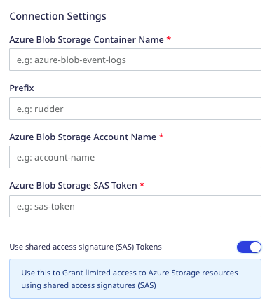

[Azure Blob Storage](https://azure.microsoft.com/en-in/services/storage/blobs/) is Microsoft's  cloud-based object storage solution. It provides scalable and secure storage for high-performance workloads, cloud native apps, machine learning, and more.

RudderStack supports sending your event data from a variety of sources to your Azure Blob Storage container.

Find the open source transformer code for this destination in the <a href="https://github.com/rudderlabs/rudder-transformer/tree/master/v0/destinations/azure_blob">GitHub repository</a>.

## Setting up Azure Blob Storage

Follow these steps to set up Azure Blog Storage before adding it as a destination in RudderStack:

1. Login to your [Azure portal](https://portal.azure.com/).
2. Click **Create a resource** and click **Create** under **Storage account**.
3. <a href="https://docs.microsoft.com/en-us/azure/storage/common/storage-account-create?tabs=azure-portal">Create a storage account</a> of type <a href="https://docs.microsoft.com/en-us/azure/storage/common/storage-account-overview#types-of-storage-accounts">Standard general-purpose v2</a>.
4. Next, choose your storage account and click **Containers** under **Data storage** .
5. Create a new container. This is where RudderStack will store all your event data.
6. You also need to provide an access key to authorize RudderStack to write to your container. Under **Security + networking**, click **Access keys**. You can find your access keys here.

Note the storage account name, container as well as access key. This information is required to set up Azure Blob Storage as a destination in RudderStack.

7. If you wish to grant limited access to your Azure Storage resources, you can use the Shared Access Signatures (SAS) instead of your access key. To generate a SAS token, go to **Security + networking** > **Shared Access Signature**.

### SAS token permissions

You can use the shared access signatures (SAS) to delegate specific permissions to your storage account resources. This gives you granular control over how users can access your data.

For more information on shared access signatures (SAS) and how to use them, refer to this <a href="https://docs.microsoft.com/en-us/azure/storage/common/storage-sas-overview">Azure documentation</a>.

For your Blob Storage destination, RudderStack requires the <strong>Write</strong> permission to write to your container. Make sure it is checked in the **Allowed permissions** setting. An example is shown below:

If you're using Blob Storage as an intermediate object storage for your data warehouse destinations, you need to assign the following permissions for your SAS token:

| Warehouse destination | Minimum required permissions |
| :----- | :----- |
| Azure Data Lake | Read, Write |
| Azure Synapse | Read, Write |
| Clickhouse | Read, Write |
| Databricks Delta Lake | Read, Write |
| Microsoft SQL Server | Read, Write |
| PostgreSQL | Read, Write |
| Snowflake | Read, Write |

## Configuring Azure Blob Storage in RudderStack

To enable dumping data to Microsoft Azure Blob Storage, you will first need to add it as a destination in RudderStack. Once the destination is configured and enabled, events from RudderStack will start flowing to your Azure Blob Storage container.

Follow these steps to add Blob Storage as a destination in RudderStack:

1. From your [RudderStack dashboard](https://app.rudderstack.com/), add a source. Then, from the list of destinations, select **Azure Blob Storage**.
2. Assign a name to the destination and click **Continue**.

### Connection settings

To successfully configure Azure Blob Storage as a destination, you will need to configure the following settings:

- **Azure Blob Storage Container Name**: Enter the name of your Blob Storage container used to store the data.
- **Prefix**: If specified, RudderStack will create a folder in the bucket with this prefix and push all the data within that folder. For example, `https://<account_name>.blob.core.windows.net/<container_name>/<prefix>/`
- **Azure Blob Storage Account Name**: Enter your Azure Blob Storage account name that you copied in the <Link to="#setting-up-azure-blob-storage">Setting up Azure Blob Storage</Link> section above.
- **Azure Blob Storage Account Key**: This option is only applicable if **Use shared access signature (SAS) Tokens** is **disabled**. In that case, enter the access key associated with your Blob Storage account.
- **Use shared access signature (SAS) Tokens**: Enable this setting to use a shared access signature (SAS) token to grant limited access to your Azure storage resources.

- **Azure Blob Storage SAS Token**: If **Use shared access signature (SAS) Tokens** is enabled, enter your Blob Storage SAS token generated in the **Step 7** of the <Link to="#setting-up-azure-blob-storage">Setting up Azure Blob Storage</Link> section above.

Microsoft Azure Blob Storage is successfully added as a destination in RudderStack. Once you send an event from your source, RudderStack will send it to your specified Blob Storage container.