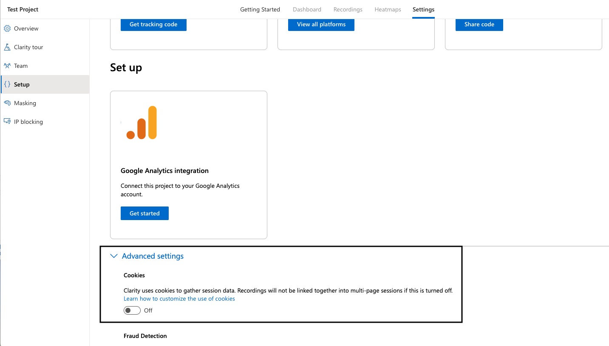
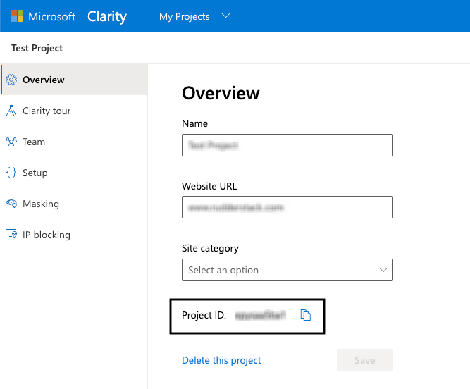

[Microsoft Clarity](https://clarity.microsoft.com/) is a heatmaps and session recording tool. It helps you better understand how users are interacting with your website through session replays and heatmaps.


## Getting started

RudderStack supports sending event data to Microsoft Clarity via the following <a href="https://rudderstack.com/docs/rudderstack-cloud/rudderstack-connection-modes/">connection modes</a>:

| Connection Mode | Web | Mobile | Server |
| :--- | :--- | :--- | :--- |
| Device mode | Supported | - | - |
| Cloud mode | -  | - | - |

Once you have confirmed that the source platform supports sending events to Microsoft Clarity, follow these steps:

1. From your [RudderStack dashboard](https://app.rudderstack.com/), add a source. Then, from the list of destinations, select **Microsoft Clarity**.
2. Assign a name to the destination and click **Continue**.

## Connection settings

To successfully configure Microsoft Clarity as a destination, you will need to configure the following settings:

- **Project ID**: Enter your Microsoft Clarity project ID. For more information on obtaining your Clarity project ID, refer to the <Link to="#faq">FAQ</Link> section below.
- **Microsoft Clarity Cookie Consent**: Enable this setting to allow RudderStack to call the Microsoft Clarity API to track the users using a cookie.
- **Client-side Events Filtering**: This setting lets you specify which events should be blocked or allowed to flow through to Microsoft Clarity. For more information on this setting, refer to the <Link to="/sources/sdks/event-filtering/">Client-side Events Filtering</Link> guide.
- **Use device mode to send events**: As this is a <Link to="https://www.rudderstack.com/docs/destinations/rudderstack-connection-modes/#device-mode">web device mode</Link>-only destination, this setting is enabled by default and cannot be disabled.
- **OneTrust Cookie Categories**: This setting lets you associate <Link to="/sources/sdks/rudderstack-javascript-sdk/consent-managers/onetrust/">OneTrust</Link> cookie consent groups to Microsoft Clarity.

## Identify

You can use the <Link to="/event-spec/standard-events/identify/">`identify`</Link> events to create a new user in Microsoft Clarity.

A sample `identify` call is shown below:

```javascript
rudderanalytics.identify("1hKOmRA4GRlm", {
  name: "Alex Keener",
  email: "alex@example.com"
});
```

By default, Clarity uses cookies to track your users and gather the session data. You can configure your Clarity project to require <a href="https://learn.microsoft.com/en-us/clarity/cookie-consent">cookie consent</a>, that is, Clarity **will not** place a cookie until a user provides consent.



<br />

In this case, to track the user sessions via the cookie, make sure you enable the **Microsoft Clarity Cookie Consent** setting in the RudderStack dashboard. This setting indicates that RudderStack can call the Clarity API to track the users via a cookie once a user provides consent.

<div class="infoBlock">
If the <strong>Cookies</strong> setting is enabled in the Clarity project settings, then you need not enable the <strong>Microsoft Clarity Cookie Consent</strong> dashboard setting.
</div>

### Supported mappings

RudderStack maps the following `identify` attributes to the corresponding Microsoft Clarity properties:

| RudderStack property | Microsoft Clarity property | 
| :-----| :------| 
| `userId` <br/> <span style="color: #4D4DFF;font-size:12px;">Required</span> | `customuserid` |
| `context.sessionId` | `customsessionid` |
| `context.traits.customPageId` | `custompageid` |

## FAQ

### Where can I find the Microsoft Clarity project ID?

To get your Microsoft Clarity project ID, follow these steps:

1. Log into your <a href="https://clarity.microsoft.com/projects">Microsoft Clarity dashboard</a>.
2. Select your Microsoft Clarity project and go to **Settings** > **Overview** to get your project ID, as shown:

