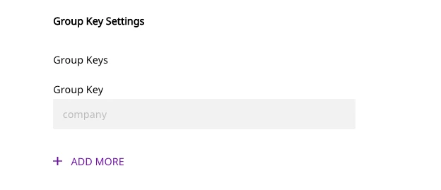
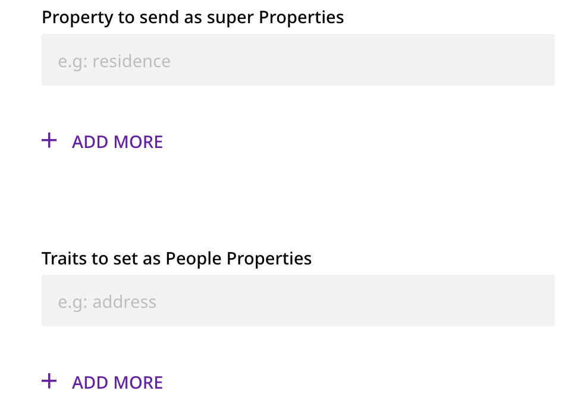

[Mixpanel](https://mixpanel.com/) is a powerful, self-serve product analytics solution for your web and mobile apps. By analyzing the actions your users perform, you can unlock valuable customer insights to drive retention, engagement, and conversion.

RudderStack supports Mixpanel as a destination where you can seamlessly send your event data.

<div class="infoBlock">
Find the open source transformer code for this destination in the <a href="https://github.com/rudderlabs/rudder-transformer/tree/master/src/v0/destinations/mp">GitHub repository</a>.
</div>

<YouTube
  videoId={'NQu6tB9d_Q4'}
/>

## Getting started

RudderStack supports sending event data to Mixpanel via the following <a href="https://rudderstack.com/docs/rudderstack-cloud/rudderstack-connection-modes/">connection modes</a>:

| **Connection Mode** | **Web**       | **Mobile**    | **Server**    |
| :------------------ | :------------ | :------------ | :------------ |
| **Device mode**     | **Supported** | -             | -             |
| **Cloud mode**      | **Supported** | **Supported** | **Supported** |

<div class="infoBlock">
In the web device mode integration, that is, using <Link to="/sources/event-streams/sdks/rudderstack-javascript-sdk">JavaScript SDK</Link> as a source, the Mixpanel native SDK is loaded from <code class="inline-code">https://cdn.mxpnl.com/</code> domain. Based on your website's content security policy, you might need to <Link to="/sources/event-streams/sdks/rudderstack-javascript-sdk/load-js-sdk/#allowlist-destination-domain">allowlist this domain</Link> to load the Mixpanel SDK successfully.
</div>


Once you have confirmed that the source platform supports sending events to Mixpanel, follow these steps:

1. From your [RudderStack dashboard](https://app.rudderstack.com/), add a source. Then, from the list of destinations, select **Mixpanel**.
2. Assign a name to the destination and click **Continue**.

### Connection settings

To successfully configure Mixpanel as a destination, you will need to configure the following settings:

- **API Token**: Enter your Mixpanel API Token. 
- **API Secret**: Enter your Mixpanel API secret. For more information on obtaining the Mixpanel **API Token** and **API Secret** (also called **Project Secret**), refer to this <a href="https://help.mixpanel.com/hc/en-us/articles/115004502806-Find-Project-Token-">Mixpanel Help Center</a> page.

<div class="dangerBlock">
Mixpanel will deprecate the <strong>Project Secret</strong> authentication method soon. It is highly recommended to use <strong>Service Accounts</strong> for authenticating your Mixpanel project. For more information, refer to this <a href="https://developer.mixpanel.com/reference/project-secret">Mixpanel API reference</a> guide.
</div>

- **Service Account Username**: Enter your Mixpanel service account username.
- **Service  Account Secret**: Enter the secret associated with your service account.

<div class="infoBlock">
For more information on setting up your Mixpanel service account and getting the username and secret, refer to this <a href="https://help.mixpanel.com/hc/en-us/articles/115004490503-Project-Settings#viewing-project-details">Mixpanel Help Center</a> page.
</div>

- **Project ID**: Enter your Mixpanel project ID.

<div class="infoBlock">
For more information on getting your Mixpanel project ID, refer to this <a href="https://help.mixpanel.com/hc/en-us/articles/115004490503-Project-Settings#viewing-project-details">Mixpanel Help Center</a> page.
</div>

- **Data Residency**: Select the relevant option among `US` and `EU`. RudderStack will send your event data to the Mixpanel server in that region.

The following settings are applicable if you are using this destination via the web device mode:

- **Use Mixpanel People**: This option sends all your `identify` calls to Mixpanel People. For more information, refer to the [**Mixpanel People**](#mixpanel-people) section below.
- **Automatically set all Traits as Super Properties and People properties**: Refer to the [**Explicitly setting People Properties and Super Properties**](#explicitly-setting-people-properties-and-super-properties) section below.
- **Events to increment in People**: Refer to the [**Incrementing events in Mixpanel People**](#incrementing-events-in-mixpanel-people) section below for more information on this field.
- **Properties to increment in People**: Refer to the [**Incrementing properties in Mixpanel People**](#incrementing-properties-in-mixpanel-people) section below for more information on this field.
- **Page Tracking Options**: For device mode, RudderStack offers three options for the `page` calls. Refer to the [**Page web device mode settings**](#page-web-device-mode-settings) section below for more information on these options.
- **Source Name**: If specified, RudderStack sends this source name to Mixpanel for every event/`page`/`screen` call.
- **Cross Subdomain Cookie**: If enabled, this option lets the Mixpanel cookie to persist between different pages of your application.
- **Persistence Type**: This option lets you choose the persistence type for your Mixpanel cookies.
- **Secure Cookie**: Enabling this option will mark the Mixpanel cookie as secure, i.e., it will only transmit over HTTPS.
- **Group Key Settings**: RudderStack sends the `group` calls to Mixpanel only if one or more group keys are specified here. These group keys act as the group identifiers in Mixpanel. For more information, refer to the <Link to="#group-key">Group Key</Link> section below.
- **Client-side Events Filtering**: Refer to the <Link to="/sources/event-streams/sdks/event-filtering/">Client-side Event Filtering</Link> guide for more information on this feature.

The following event mapping setting is applicable only if you are sending events to Mixpanel via the cloud mode:

- **Use New Mapping**: This option is disabled by default and sends the first name and last name as:

    `$firstName : "John"` <br />
    `$lastName : "Keener"`
 
  If this option is enabled, RudderStack maps these fields to Mixpanel in the following way :
 
   `$first_name : "John"` <br />
   `$last_name : "Keener"`
   
<div class="infoBlock">
 
 Rudderstack lets you pass empty and <code class="inline-code">null</code> values for the properties sent to Mixpanel.
</div>

## Identify

To identify a user in Mixpanel, you need to call RudderStack's `identify` method. 

Mixpanel needs an identifier to uniquely identify a user. If you pass `userId` and `anonymousId` along with the Mixpanel API Secret (in the dashboard settings), then RudderStack first makes an `identify` call to Mixpanel using the `userId` and the `traits`. RudderStack then passes the `userId` and `anonymousId` via Mixpanel's [**Merge Identities**](https://developer.mixpanel.com/reference/identity-merge) feature, so that the two identifiers are glued to a single user profile.

A sample `identify` call is as shown:

```javascript
rudderanalytics.identify("12345", {
  firstname: "Alex",
  city: "New Orleans",
  country: "USA",
  phone: "8005550100",
  email: "alex@example.com"
})
```

When sending events via the cloud mode, you can prevent the `$last_seen` attribute getting updated with incorrect times by setting `active` to `false` in the `context` object, as shown in the following snippet:

```javascript
rudderanalytics.identify("12345", {
  firstname: "Alex",
  city: "New Orleans",
  country: "USA"
}, {
  context: {
    active: false
  }
})
```

<div class="infoBlock">
 
 Setting <code class="inline-code">active</code> to <code class="inline-code">false</code> sets Mixpanel's <code class="inline-code">$ignore_time</code> attribute to <code class="inline-code">true</code>. This way, you can bypass the “Last Seen” date property.
</div>

### Reserved Mixpanel properties

Mixpanel has some reserved properties:

- `$first_name`
- `$last_name`
- `$name`
- `$username`
- `$created`
- `$email`
- `$phone`
- `$avatar`
- `$city`
- `$country_code`
- `$region`
- `$unsubscribed`

<div class="warningBlock">
You should not create custom properties that begin with a <code class="inline-code">$</code> sign.
</div>

### Mixpanel People

Rudderstack does not send data to Mixpanel People by default, as it usually requires you to upgrade your Mixpanel account. If you want to use this feature, you can enable the **Use Mixpanel People** option in the Rudderstack dashboard.

You can identify the user traits without the `userId` if you wish to add the people properties in Mixpanel before knowing the `userId`. To do so, refer to the following snippet:

```javascript
rudderanalytics.identify({
  email: 'alex@example.com',
  name: 'Alex Keener'
})
```

<div class="infoBlock">
Currently, RudderStack supports this feature only for the web device mode.
</div>

### Deleting a user

You can delete a user in Mixpanel using the <Link to="/api/data-regulation-api/#adding-a-suppression-with-delete-regulation">Suppression with Delete regulation</Link> of the RudderStack <Link to="/api/data-regulation-api/">Data Regulation API</Link>.

<div class="infoBlock">
To delete a user, you must specify their <code class="inline-code">userId</code> in the event. Additionally, you can specify a custom identifier (optional) in the event.
</div>

A sample regulation request body for deleting a user in Mixpanel is shown below:

```json
{
  "regulationType": "suppress_with_delete",
  "destinationIds": [
    "2FIKkByqn37FhzczP23eZmURciA"
  ],
  "users": [{
    "userId": "1hKOmRA4GRlm",
    "<customKey>": "<customValue>"
  }]
}
```

## Page

RudderStack passes all the page properties that you provide via the `page` call to Mixpanel, along with the other default properties. RudderStack sets the event name as **Page** for a `page` call and **Screen** for a `screen` call. 

A sample `page` call is shown below:

```javascript
rudderanalytics.page();
```

### Page web device mode settings

Rudderstack will send 1 event to Mixpanel per `page` call.

For device mode, RudderStack offers the following three options for `page` calls:

- **Track All Pages with a Consolidated Event Name**: This setting is enabled by default. RudderStack sends all the `page` and `screen` calls with the name `Loaded a Page` with the corresponding properties of the call. This lets you leverage Mixpanel's reporting capabilities for page/screen analytics in the best possible way.

- **Track Categorized Pages to Mixpanel**: RudderStack tracks the categorized pages to Mixpanel. If you enable this setting in the dashboard, RudderStack sends a `Viewed [<category>] Page` event to Mixpanel. If the page name is also present in the event, then RudderStack sends a `Viewed [<category> <page_name>] Page` event.

- **Track Named Pages to Mixpanel**: RudderStack also tracks the named pages to Mixpanel. If you enable this setting in the dashboard, RudderStack will send a `Viewed [page_name] Page` event. Note that this option has the least precedence and comes to effect only if the above two options are disabled in the RudderStack dashboard.

<div class="infoBlock">
RudderStack gives the highest precedence to the <strong>Track All Pages with a Consolidated Event Name</strong> option even if <strong>Track Categorized Pages to Mixpanel</strong> and 
<strong>Track Named Pages to Mixpanel</strong> are enabled in the dashboard.
</div>

<div class="warningBlock">
RudderStack expects atleast one of the three options listed above to be enabled for sending the <code class="inline-code">page</code> events to Mixpanel using device mode.
</div>

## Track

To track user events, use the `track` method with the event name and the associated properties.

A sample `track` call is as shown:

```javascript
rudderanalytics.track("track event", {
    test_prop1: 50,
    test_prop2: "prop_value"
});
```

### Tracking revenue

Mixpanel lets you track revenue events. If you send `revenue` as a property in your `track` event, RudderStack tracks it as a revenue event.

Revenue tracking is done with a `distinct_id` \(`userId` that you provide in your `identify` call; if `userId` is not present then it will be associated with an `anonymousId`.\)

A sample revenue `track` call is as shown:

```javascript
rudderanalytics.track("Purchase", {
  revenue: 100,
  currency: "USD"
});
```

### Tracking charge

If **Use Mixpanel People** setting is enabled in your RudderStack dashboard and you include `revenue` as an event property, RudderStack will track a charge for the current user.

## Alias

The `alias` call lets you associate multiple identities of a known user. 

A sample `alias` call is as shown:

```javascript
analytics.alias('userId', `previousId`);
```

## Group

The <Link to="/event-spec/standard-events/group">`group`</Link> call lets you link an identified user with a group such as a company, organization, or an account, and record any traits associated with that group, for example, company name, number of employees, etc. For more information on how the <code class="inline-code">group</code> call works in Mixpanel, refer to Mixpanel's [Group Analytics](https://help.mixpanel.com/hc/en-us/articles/360025333632-Group-Analytics) documentation.

RudderStack lets you record the custom traits associated with a user group and send this information to Mixpanel.

A sample `group` call is shown below:

```javascript
rudderanalytics.group(
  "sample_group_id", {
    name: "Tech group",
    industry: "Technology",
    employees: 100,
  }
);
```

### Group Key

You can create group keys in the [Mixpanel project settings](https://help.mixpanel.com/hc/en-us/articles/360025333632-Group-Analytics#implementation), which act as the group identifiers in Mixpanel. To successfully send a `group` call to Mixpanel, you must specify **at least** one group key in the **Group Key** RudderStack dashboard setting, as shown:



<div class="warningBlock">
  Note the following points:
  <ul>
    <li>If you map the <code class="inline-code">groupId</code> as a group key, RudderStack looks up its value in the following priority order:</li>
 <ul>
      <li>In <code class="inline-code">message.groupId</code></li>
      <li>In <code class="inline-code">message.traits.groupId</code></li>
      </ul>
    <li>If you map any other field as a group key, RudderStack looks up its value in <code class="inline-code">message.traits.groupKey</code>.</li>
     </ul>
</div>

## Sending historic events

Mixpanel supports importing historical event data. However, note that the event timestamp should be within the **last 5 years**. Mixpanel rejects any data older than this duration. To send historic events, provide the timestamp in the `timestamp` field of the message. RudderStack will then send the event with the same timestamp to Mixpanel.

## Mapping RudderStack properties to Mixpanel properties

RudderStack maps the following properties to the Mixpanel properties before sending them over Mixpanel's HTTP API.

<div class="infoBlock">
RudderStack maps these fields only in the <code class="inline-code">identify</code> requests.
</div>

| RudderStack property         | Mixpanel property      | 
| :--------------------------- | :--------------------- |
| `traits.createdAt`           | `$created`             |         
| `traits.email`               | `$email`               |             
| `traits.firstName`           | `$firstName`           |         
| `traits.lastName`            | `$lastName`            |          
| `traits.name`                | `$name`                |            
| `traits.username`            | `$username`            |          
| `traits.phone`               | `$phone`               |             
| `traits.avatar`              | `$avatar`              |            
| `context.ip`                 | `ip` or `$ip`          |               
| `context.campaign.name`      | `campaign_id`          |    
| `context.page.url`           | `$current_url`         |         
| `context.os.name`            | `$os`                  |          
| `context.page.referrer`      | `$referrer`            |    
| `context.network.carrier`    | `$carrier`             |  
| `address.city`               | `$city`                |             
| `address.country`            | `$country_code`        |          
| `address.region`             | `$region`              |           
| `context.location.latitude`  | `$latitude`            | 
| `context.location.longitude` | `$longitude`           | 
| `context.page.manufacturer`  | `$manufacturer`        | 
| `context.device.model`       | `$model`               |      
| `context.screen.width`       | `$screen_width`        |      
| `context.screen.height`      | `$screen_height`       |    
| `context.network.wifi`       | `$wifi`                |      
| `context.location.geoSource` | `$geoSource`           | 
| `context.traits.unsubscribed`| `$unsubscribed`        | 
| `traits.unsubscribed`        | `$unsubscribed`        | 
| `properties.unsubscribed`    | `$unsubscribed`        |  
| `context.location.timezone`  | `$timezone`            |  

## Explicitly setting People Properties and Super Properties

You can set all of your traits as both **Super Properties** and **People Properties** \(If you have **Use Mixpanel People** option enabled\) by enabling the **Automatically set all Traits as Super Properties and People Properties** option in the Rudderstack dashboard.

You can also choose to filter your reports by both People Properties and Super Properties. This gives you better control over what traits you can set as a Super Property or People Property. To do this, disable the **Automatically set all Traits as Super Properties and People Properties** option in the dashboard and add the traits that you want to send to Mixpanel as Super Properties or People Properties in the **Properties to send as Super Properties** and **Traits to set as People Properties** fields respectively, as shown below:



<div class="infoBlock">
RudderStack will send all the Mixpanel <a href="#mixpanel-special-traits">special traits</a> as People Properties. Hence, you can only add the properties that are not in this list.
</div>

<div class="warningBlock">
This feature is available in web device mode only.
</div>

## Mixpanel special traits

The following table lists all the properties that RudderStack sends to Mixpanel as special traits:

| RudderStack Properties     | Mixpanel Properties  |
| :------------------------- | :------------------- |
| `created`                  | `$created`           |
| `email`                    | `$email`             | 
| `firstName`                | `$first_name`        |
| `lastName`                 | `$last_name`         |
| `lastSeen`                 | `$last_seen`         |
| `name`                     | `$name`              |
| `username`                 | `$username`          |
| `phone`                    | `$phone`             |
| `city`/`address.city`      | `$city`              |
| `region`/`address.state`   | `$region`            |
| `country`/`address.country`| `$country_code`      |

## Incrementing events in Mixpanel People
To increment event counts in Mixpanel People, you can add the events in the **Events to increment in People** field.

<div class="warningBlock">
This feature is available in web device mode only.
</div>

For each event name added, RudderStack automatically calls Mixpanel and sets a user trait as `Last + <event_name>`. For example, if you add `Logged In` to the list of increment events, RudderStack will increment a user trait called `Logged In` and set a trait called `Last Logged In` with the current date and time.

<div class="warningBlock">
Increment works for known users only. If you make a <code class="inline-code">track</code> call, you must identify your user first.
</div>

## Incrementing properties in Mixpanel People

To increment properties in Mixpanel People, you can add them in the **Properties to Increment in People** field. RudderStack will call Mixpanel’s increment when you attach a number to the specified property. For example, `'items purchased': 5`.

<div class="warningBlock">
This feature is available in web device mode only.
</div>

## Cross subdomain cookies

- **Cross Subdomain Cookie**: This option will let you persist the Mixpanel cookie between different pages of your application.
- **Persistence Type**: This option lets you choose the persistence type for your Mixpanel cookies.
- **Secure Cookie**: Enabling this option will mark the Mixpanel cookie as secure, i.e., it will only transmit over HTTPs.

## FAQ

### Can I pass `null` and empty values for the properties?

Yes, RudderStack supports passing empty or `null` values for the properties sent to Mixpanel.

### Why am I getting the 'Request Header Fields Too Large' error?

Mixpanel imposes certain limitations on its API requests such as:
- Any `GET` request URL above 19K characters (around 19 KB+) is blocked.
- The header size more than 15KB is not allowed.
- The body of the request more than 20MB is not allowed.
- Each event can have up to 255 event properties.

If your requests are larger than the above-mentioned limits, you will get a 'Request Header Fields Too Large' error. 

<div class="infoBlock">
Refer to the <Link to="https://community.mixpanel.com/sending-data-to-mixpanel-11/why-am-i-getting-413-errors-when-using-the-http-api-4659">Mixpanel Community FAQ</Link> for more information.
</div>
