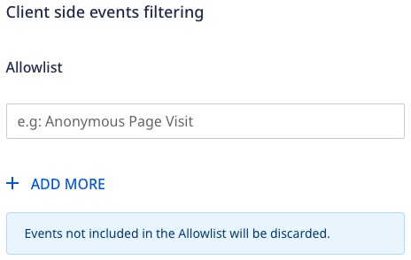
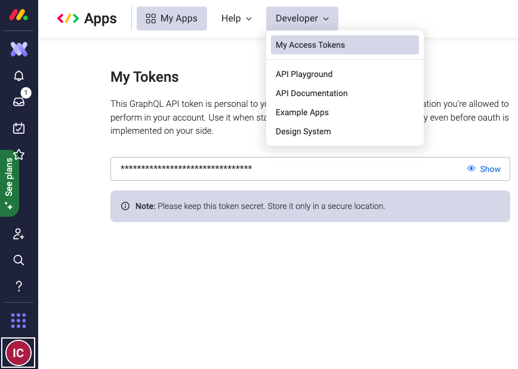
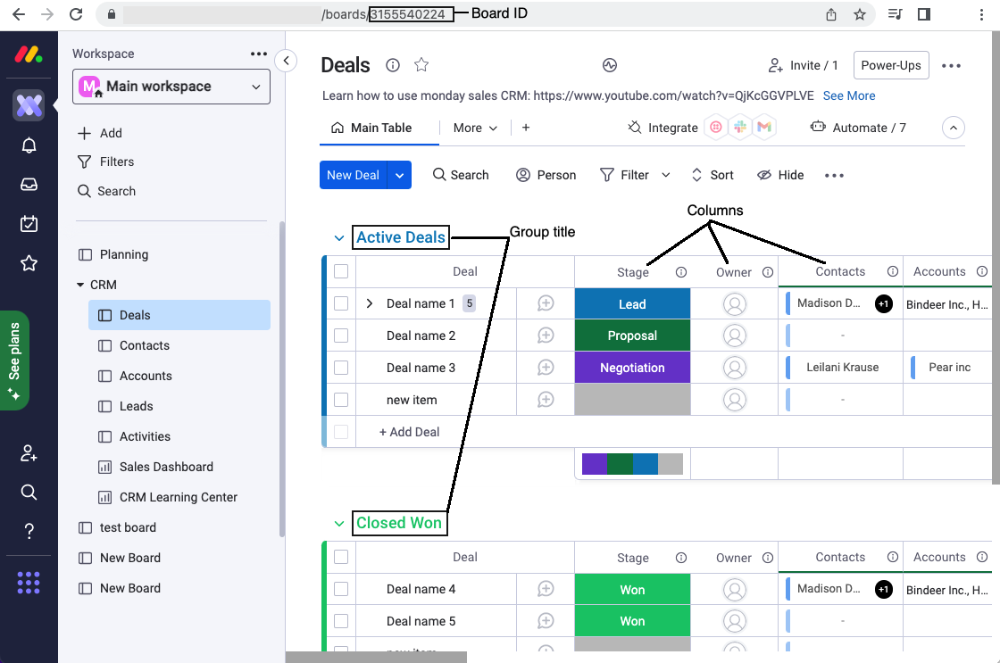

[monday.com](https://monday.com/) is a popular workflow management tool. It lets you create efficient cross-team workflows and automations for better collaboration and maximum productivity.

RudderStack supports monday.com as a destination to which you can seamlessly send your event data.

<div class="infoBlock">
Find the open source transformer code for this destination in the <a href="https://github.com/rudderlabs/rudder-transformer/tree/master/src/v0/destinations/monday">GitHub repository</a>.
</div>

## Getting started

Before configuring monday.com as a destination in RudderStack, verify if the source platform is supported by Monday by referring to the table below:

| **Connection Mode** | **Web** | **Mobile** | **Server** |
| :--- | :--- | :--- | :--- |
| **Device mode** | - | - | - |
| **Cloud mode** | **Supported**  | **Supported** | **Supported** |

<div class="infoBlock">
To learn more about the difference between cloud mode and device mode in RudderStack, refer to the <Link to="/destinations/rudderstack-connection-modes/">RudderStack Connection Modes</Link> guide.
</div>

Once you have confirmed that the source platform supports sending events to monday.com, follow these steps:

1. From your [RudderStack dashboard](https://app.rudderstack.com/), add a source. Then, from the list of destinations, select **Monday**.
2. Assign a name to the destination and click **Continue**.

### Connection settings

To successfully configure monday.com as a destination, you will need to configure the following settings:


- **API Token**: Enter the API token from your [monday.com](https://auth.monday.com/auth/login_monday) dashboard.
- **Board ID**: Enter your monday.com board ID.
- **Group Title**: Enter the group title of your board if you want to add an item to a specific group.

<div class="infoBlock">
For more information on getting these details, refer to the <a href="#faq">FAQ</a> section below.
</div>

- **Columns to property mapping**: Enter the column names from your monday.com board and the corresponding RudderStack event properties to be mapped.

<div class="warningBlock">
<ul>
<li>The column names provided in the mapping should be existing in your monday.com board.</li> 
<li>RudderStack will only update the column names provided in this mapping.</li>
</ul>
</div>

### Client-side events filtering

This setting lets you specify the event names which should be allowed to flow through to monday.com. 



<div class="warningBlock">
RudderStack will discard the events <strong>not included</strong> in the allowlist.
</div>

## Track

You can use the <Link to="/event-spec/standard-events/track">`track`</Link> call to create an item in your board. To do so, you need to specify the **Board ID** and **Columns to property mapping** in the dashboard settings.

You can also override the board ID mentioned in the RudderStack dashboard by passing it in the `externalId` in the track call. A sample `track` call for the same is shown below:

```javascript
rudderanalytics.track("create an item", {
  "status": "Done",
  "latitude": "50.32",
  "longitude": "46.32",
  "address": "New York, USA",
  "mobile_number": "+1-202-555-0146",
  "countryShortName": "US"
}, {
  "externalId": [{
    "type": "boardId",
    "id": "3536273222"
  }],
});
```

<div class="warningBlock">
The event passed in the <code class="inline-code">track</code> call should be added in the <strong>Allowlist</strong> connection setting, otherwise it will be discarded.
</div>

### Supported column types

The following column types can be updated while creating a new item on the board. You can map the properties for these columns in the RudderStack dashboard:

| Column types | Notes |
| :-----| :-----| 
| Status | Pass the exact (existing) value. |
| Numbers | Float or integer format. |
| Text | -|
| Checkbox| If you map a checkbox column, the checkbox value will be set to true by default. [Reference](https://developer.monday.com/api-reference/docs/checkbox#updating-the-checkbox-column).|
| Country | Requires both the country name and code.  |
| Email | Pass the email address and optional text to link the email address.|
| Item name | -|
| Link | Pass the URL along with the text for the link.|
| Location | Pass the address along with latitude and longitude details.|
| Long Text | String can be up to 2000 characters. |
| Phone | Pass the phone number along with country short name (a two-letter code, for example, `US`). |
| Rating | Should be an existing (≤ maximum) rating value. |
| World Clock | The timezone should be passed in the `continent/city` format, for example, `Europe/London`. |


### Property mapping

RudderStack maps the following event properties to the corresponding monday.com properties:

| RudderStack property | Monday property | Presence | Notes |
| :-----| :------| :-------| :-------|
| `properties.name` | `item_name` | Required | By default, RudderStack maps the attributes passed here to the first column value. |
| `properties.countryCode` | `countryCode` | Required, if `country` column needs to be updated. |  Must be passed in the ISO-2 country code format (a two-letter code), for example, `US`. [Reference](https://developer.monday.com/api-reference/docs/country#updating-the-country-column). |
| `properties.countryShortName` | `countryShortName`  | Required, if `phone` column needs to be updated. | Must be passed in the ISO-2 country code format (a two-letter code), for example, `US`. [Reference](https://developer.monday.com/api-reference/docs/country#updating-the-country-column). |
| `properties.latitude` | `lat`  | Required, if `location` column needs to be updated. | - |
| `properties.longitude` | `lng`  | Required, if `location` column needs to be updated. |- |
| `properties.emailText` | `text`  | Optional | Can be used to add a hyperlink to the email address text on the board.|
| `properties.linkText` | `text`  | Optional | Can be used to add a hyperlink to the text on the board.|


## FAQ

### Where can I find the monday.com API token?

To get the monday.com API token, follow these steps:

1. Log into the [monday.com dashboard](https://auth.monday.com/auth/login_monday).
2. Click on your profile in the left navigation bar.
3. Select **Developer** > **My Access Tokens**, as shown:



### Where can I find the Board ID, Group Title and column names in monday.com dashboard?

To get your monday.com Board ID, Group Title, and column names, follow these steps:

**Board ID**

1. Log into the [monday.com dashboard](https://auth.monday.com/auth/login_monday).
2. Go to **Work management** in the left navigation bar and select your board. The board ID is displayed in the address bar, as seen in the below image.

**Group title**

Group title is the name of your the groups in the board. In the below image, **Active deals** and **Closed Won** are the group titles .

**Column names**

The column titles in your board are the column names. In the below image, **Stage**, **Owner**, **Contacts**, and **Accounts** are the column names.

