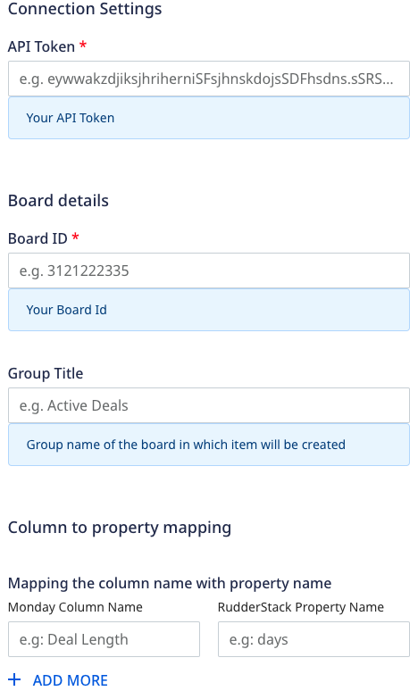

[Monday](https://monday.com/) is an in-app subscription platform that lets you analyze and grow your cross-platform app subscriptions.

RudderStack supports Monday as a destination to which you can seamlessly send your event data.

<div class="infoBlock">
Find the open source transformer code for this destination in the <a href="https://github.com/rudderlabs/rudder-transformer/tree/master/v0/destinations/revenue_cat">GitHub repository</a>.
</div>

## Getting started

Before configuring Monday as a destination in RudderStack, verify if the source platform is supported by Monday by referring to the table below:

| **Connection Mode** | **Web** | **Mobile** | **Server** |
| :--- | :--- | :--- | :--- |
| **Device mode** | - | - | - |
| **Cloud mode** | **Supported**  | **Supported** | **Supported** |

<div class="infoBlock">
To know more about the difference between cloud mode and device mode in RudderStack, refer to the <Link to="/destinations/rudderstack-connection-modes/">RudderStack Connection Modes</Link> guide.
</div>

Once you have confirmed that the source platform supports sending events to Monday, follow these steps:

1. From your [RudderStack dashboard](https://app.rudderstack.com/), add a source. Then, from the list of destinations, select **Monday**.
2. Assign a name to the destination and click **Continue**.

### Connection settings

To successfully configure Monday as a destination, you will need to configure the following settings:



- **Public API Key**: Enter your Monday public API key.

<div class="infoBlock">
For more information on getting your Monday public API key, refer to the <a href="#faq">FAQ</a> section below.
</div>

- **X-Platform**: Select your app platform from the dropdown.


## Track

The <Link to="/event-spec/standard-events/track">`track`</Link> method lets you capture user events along with the properties associated with them.

A sample `track` call is shown below:

```javascript
rudderanalytics.track("event", {
  status: "done",
  value: 10000,
  close_probability: "90%",
  location: "New York, USA"
});
```

### Property mapping

RudderStack maps the following event properties to the corresponding Monday properties:

| RudderStack property | Monday property | Presence |
| :-----| :------| :-------|
| `properties.name` | `item_name` | Required |
| `properties.countryCode` | `countryCode` | Required if Country column is getting updated |
| `properties.emailText` | `text`  | Optional |
| `properties.latitude` | `latitude`  | Required if location column is being updated |
| `properties.longitude` | `longitude`  | Required if location column is being updated |
| `properties.countryShortName` | `countryShortName`  | Required if phone column is being updated |
| `properties.linkText` | `text`  | Optional |

## FAQ

### Where can I find the Board Id, Group Title and column and property names in Monday dashboard?

Follow these steps:

**Board Id**

1. Log into your [Monday dashboard](https://auth.monday.com/auth/login_monday).
2. Go to **Work management** in the left navigation bar and select your board. The board Id is displayed in the address bar, as shown:


**Group title**

Select your board. There can be multiple groups in a board, for example, Active deals is the group title in below image:


**Column and property names**

In your board, column names are:

Property namea are: