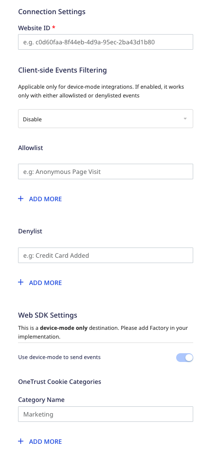
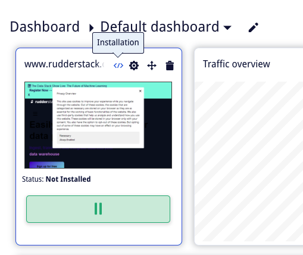
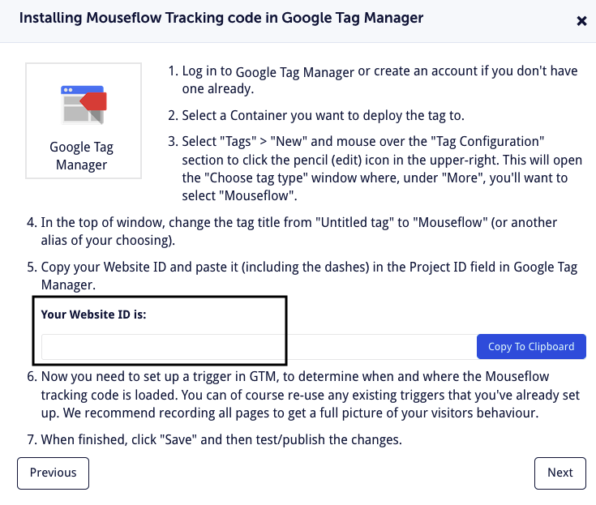
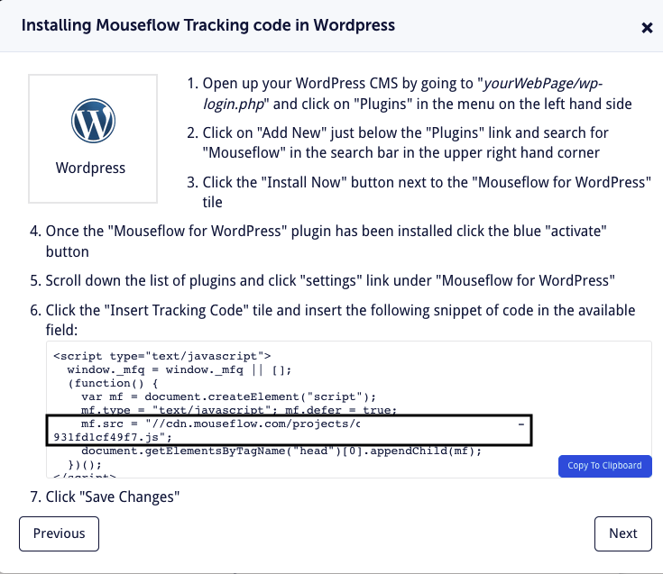
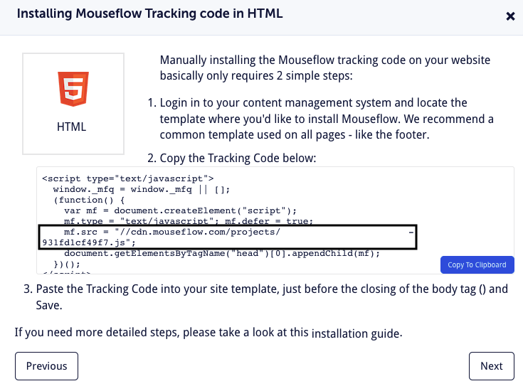

[Mouseflow](https://mouseflow.com/) is a behavior analytics platform that gives you deeper insights into your users' product journey.

RudderStack supports Mouseflow as a destination where you can send your event data seamlessly.

## Getting started

Before configuring Mouseflow as a destination in RudderStack, verify if the source platform is supported by Mouseflow by referring to the table below:

| **Connection Mode** | **Web**       | **Mobile**    | **Server**    |
| :------------------ | :------------ | :------------ | :------------ |
| **Device mode**     |  **Supported**             | -             | -             |
| **Cloud mode**      |- | - | - |

<div class="infoBlock">
To know more about the difference between cloud mode and device mode in RudderStack, refer to the <Link to="/destinations/rudderstack-connection-modes/">RudderStack Connection Modes</Link> guide.
</div>

Once you have confirmed that the source platform supports sending events to Mouseflow, follow these steps:

1. From your [RudderStack dashboard](https://app.rudderstack.com/), add the source. Then, from the list of destinations, select **Mouseflow**.
2. Assign a name to the destination and click **Continue**.

## Connection settings

To successfully configure Mouseflow as a destination, you need to configure the following settings:



- **Website ID**: Enter your Mouseflow website ID.

<div class="infoBlock">
For more information on obtaining your Mouseflow website ID, refer to the <Link to="">FAQ</Link> section below.
</div>

- **Client-side Events Filtering**: This setting lets you specify which events should be blocked or allowed to flow through to Mouseflow.

<div class="infoBlock">
For more information on this setting, refer to the <Link to="https://www.rudderstack.com/docs/sources/sdks/event-filtering/">Client-side Events Filtering</Link> guide.
</div>

- **Use device mode to send events**: Enable this setting to send events from the JavaScript SDK to Mouseflow via the <Link to="/destinations/rudderstack-connection-modes/#device-mode">device mode</Link>.
- **OneTrust Cookie Categories**: This setting lets you map <Link to="/sources/sdks/rudderstack-javascript-sdk/consent-managers/onetrust/">OneTrust cookie</Link>/consent groups to RudderStack's consent purposes.

## Identify

The <Link to="/event-spec/standard-events/identify/">`identify`</Link> call lets you identify a visiting user and associate them to their actions. It also lets you record the traits about them like their name, email address, etc. and send this information to Mouseflow.

RudderStack leverages the [`_mfq.push()`](https://js-api-docs.mouseflow.com/#the-_mfq-object) method to send the relevant user details to Mouseflow.

A sample `identify` call is shown below:

```javascript
rudderanalytics.identify("1hKOmRA4GRlm", {
  "email": "alex@example.com",
  "city": "New Orleans",
  "favouriteColor": "Red"
})
```

### Property mapping

RudderStack maps the following user traits to the corresponding Mouseflow properties:

| RudderStack property          | Mouseflow property | Presence |
| :-------------------- | :---------------------- | :-------------|
| `userId` / `traits.email` | `_userName` |  Required |
| `traits` | `serVariable` | Optional |

## Track

You can use the RudderStack <Link to="/event-spec/standard-events/track/">`track`</Link> call to [set tags or custom variables](https://js-api-docs.mouseflow.com/#adding-custom-data) in Mouseflow.

A sample `track` call is as shown:

```javascript
rudderanalytics.track("Product Clicked",{
	"price": 100,
	"quantity": 10,
})
```

### Setting a custom tag

RudderStack lets you set a custom tag to a user recording in Mouseflow. It automatically sets the `track` event name as the custom tag. 

In the above example, RudderStack sets `Product Clicked` as the custom tag by passing it to Mouseflow in the following way:

```javascript
_mfq.push(["tag", "Product Clicked"]);
```

<div class="warningBlock">
A tag must always be of the String data type.
</div>

### Setting a custom variable

RudderStack also lets you pass the event properties as custom variables to Mouseflow, as a key-value pair.

In the sample snippet above, RudderStack sets `price` and `quantity` as the custom variables in the following manner:

```javascript
_mfq.push(["setVariable", "price", "100"]);
_mfq.push(["setVariable", "quantity", "10"]);
```

<div class="warningBlock">
The value associated with the event property will be passed to Mouseflow as a string.
</div>

## Page

The <Link to="/event-spec/standard-events/page/">`page`</Link> call lets you record your website's page views with any additional relevant information about the viewed page as its title, category, URL, etc.

RudderStack sends the page-related information like the event name and category to Mouseflow by passing it in the [`_virtualPath`](https://js-api-docs.mouseflow.com/#virtual-paths-and-pageviews) parameter, as shown:

```javascript
_mfq.push(["newPageView", _virtualPath]);
```

Here, the `_virtualPath` parameter contains the `page` event name and category in the following format:

```
Viewed <category> <event name> Page
```

Consider the following sample `page` call:

```javascript
rudderanalytics.page("Home")
```

As described above, RudderStack transforms this event into the `Viewed Home Page` event before sending it to Mouseflow.

## FAQ

### Where can I find the website ID in Mouseflow?

To get the website ID in Mouseflow, follow these steps:

1. Log into your Mouseflow dashboard.
2. Click on the **Installation** icon present in your website's card, as shown:



3. Choose your installation method from **Google Tag Manager**, **Wordpress**, and **HTML**.

- If you choose **Google Tag Manager** as your installation method, you can find the website ID as seen below:



- If you choose **Wordpress**, you can find the website ID in the following line of the code snippet:

```javascript
mf.src = "//cdn.mouseflow.com/projects/<website_id>.js"
```



- If you choose **HTML**, you can find the website ID in the in the following line of the tracking code:

```javascript
mf.src = "//cdn.mouseflow.com/projects/<website_id>.js"
```

